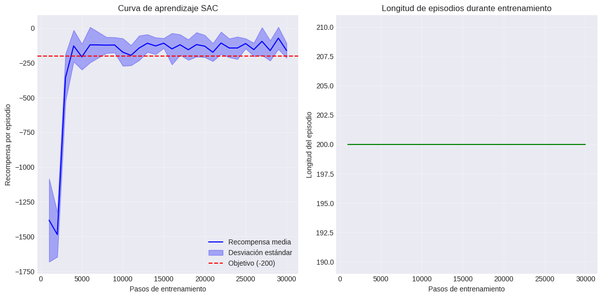
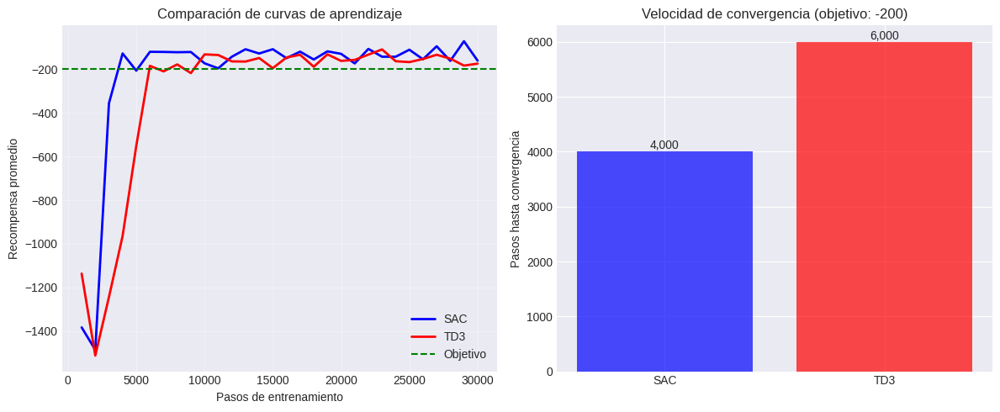

# Resolución del Environment Pendulum con Soft Actor-Critic (SAC)

**Autor:** Miguel Fernández Cruchaga

**Fecha:** 15/06/2025

## 1. Introducción y Análisis del Problema

### 1.1 Descripción del Environment

El Pendulum es un problema clásico de control donde el objetivo es mantener un péndulo en posición vertical aplicando un par motor continuo. Algunas características son:

**Estados continuos**: El péndulo puede estar en cualquier ángulo y velocidad angular.

**Acciones continuas**: El torque aplicado es un valor continuo.

**Recompensa sparse**: Solo se obtiene buena recompensa cerca de la posición vertical.

**No hay estado terminal**: Los episodios siempre duran 200 pasos.

### 1.2 Instalación de dependencias


```python
 !pip install stable-baselines3[extra] gymnasium tensorboard -q
```

       ━━━━━━━━━━━━━━━━━━━━━━━━━━━━━━━━━━━━━━━━ 363.4/363.4 MB 2.3 MB/s eta 0:00:00
       ━━━━━━━━━━━━━━━━━━━━━━━━━━━━━━━━━━━━━━━━ 13.8/13.8 MB 46.3 MB/s eta 0:00:00
       ━━━━━━━━━━━━━━━━━━━━━━━━━━━━━━━━━━━━━━━━ 24.6/24.6 MB 39.5 MB/s eta 0:00:00
       ━━━━━━━━━━━━━━━━━━━━━━━━━━━━━━━━━━━━━━━━ 883.7/883.7 kB 23.7 MB/s eta 0:00:00
       ━━━━━━━━━━━━━━━━━━━━━━━━━━━━━━━━━━━━━━━━ 664.8/664.8 MB 2.7 MB/s eta 0:00:00
       ━━━━━━━━━━━━━━━━━━━━━━━━━━━━━━━━━━━━━━━━ 211.5/211.5 MB 6.6 MB/s eta 0:00:00
       ━━━━━━━━━━━━━━━━━━━━━━━━━━━━━━━━━━━━━━━━ 56.3/56.3 MB 12.1 MB/s eta 0:00:00
       ━━━━━━━━━━━━━━━━━━━━━━━━━━━━━━━━━━━━━━━━ 127.9/127.9 MB 7.5 MB/s eta 0:00:00
       ━━━━━━━━━━━━━━━━━━━━━━━━━━━━━━━━━━━━━━━━ 207.5/207.5 MB 6.2 MB/s eta 0:00:00
       ━━━━━━━━━━━━━━━━━━━━━━━━━━━━━━━━━━━━━━━━ 21.1/21.1 MB 81.4 MB/s eta 0:00:00
       ━━━━━━━━━━━━━━━━━━━━━━━━━━━━━━━━━━━━━━━━ 184.5/184.5 kB 12.7 MB/s eta 0:00:00
    [?25h


```python
import gymnasium as gym
import numpy as np
import matplotlib.pyplot as plt
import seaborn as sns
from stable_baselines3 import SAC, TD3, DDPG
from stable_baselines3.common.evaluation import evaluate_policy
from stable_baselines3.common.callbacks import EvalCallback, CheckpointCallback
from stable_baselines3.common.monitor import Monitor
from stable_baselines3.common.noise import NormalActionNoise, OrnsteinUhlenbeckActionNoise
import pandas as pd
from IPython.display import Video
import warnings
warnings.filterwarnings('ignore')
import time
import json
import pickle
import os

# Configuración de visualización
plt.style.use('seaborn-v0_8-darkgrid')
sns.set_palette("husl")
```

### 1.3 Configuración Google Drive


```python
# Montar Google Drive
from google.colab import drive
drive.mount('/content/drive')
```

    Mounted at /content/drive
    


```python
# Carpeta para el proyecto
import os
project_folder = '/content/drive/MyDrive/RL_Pendulum'

# Subcarpetas
folders = ['models', 'logs', 'checkpoints', 'tensorboard', 'videos']
```


```python
os.makedirs(project_folder, exist_ok=True)

for folder in folders:
    os.makedirs(os.path.join(project_folder, folder), exist_ok=True)
```

## 2. Exploración del Environment


```python
env = gym.make('Pendulum-v1', render_mode='rgb_array')

print("=== Características del Environment ===")
print(f"Espacio de observación: {env.observation_space}")
print(f"Forma del espacio de observación: {env.observation_space.shape}")
print(f"Límites del espacio de observación:")
print(f"  - Mínimo: {env.observation_space.low}")
print(f"  - Máximo: {env.observation_space.high}")
print(f"\nEspacio de acción: {env.action_space}")
print(f"Forma del espacio de acción: {env.action_space.shape}")
print(f"Límites del espacio de acción:")
print(f"  - Mínimo: {env.action_space.low}")
print(f"  - Máximo: {env.action_space.high}")
```

    === Características del Environment ===
    Espacio de observación: Box([-1. -1. -8.], [1. 1. 8.], (3,), float32)
    Forma del espacio de observación: (3,)
    Límites del espacio de observación:
      - Mínimo: [-1. -1. -8.]
      - Máximo: [1. 1. 8.]
    
    Espacio de acción: Box(-2.0, 2.0, (1,), float32)
    Forma del espacio de acción: (1,)
    Límites del espacio de acción:
      - Mínimo: [-2.]
      - Máximo: [2.]
    

### 2.1 Análisis del espacio de estados

Características del Environment Pendulum-v1

**Tipos de estados**

El environment Pendulum utiliza un espacio de estados continuo de tres dimensiones. El estado está representado por un vector que contiene:
- **cos(θ)**: Coseno del ángulo del péndulo
- **sin(θ)**: Seno del ángulo del péndulo  
- **θ̇**: Velocidad angular (limitada a [-8, 8] rad/s)

El coseno y seno están limitados naturalmente al rango [-1, 1], mientras que la velocidad angular está acotada entre -8 y 8 radianes por segundo.

**Tipos de acciones**

El espacio de acciones es continuo y unidimensional, consistiendo en un único valor de par motor que puede aplicarse al péndulo. Este par motor está limitado al rango [-2, 2] Newton-metro.

**Tipos de recompensas**

La función de recompensa en Pendulum es densa y continua, calculándose en cada paso como la suma negativa de tres componentes: el cuadrado del ángulo (penalización principal por desviarse de la vertical), 0.1 veces el cuadrado de la velocidad angular (penalización por movimientos rápidos), y 0.001 veces el cuadrado del par motor aplicado (penalización por uso de energía). Esta función produce recompensas que van aproximadamente desde -16.2 hasta 0, donde 0 representa el caso ideal teórico de un péndulo perfectamente vertical, inmóvil y sin aplicar par motor. La característica clave es que todas las recompensas son negativas, funcionando como penalizaciones que el agente debe minimizar.

**Recompensa promedio esperada**

La recompensa promedio por episodio que se espera conseguir depende del nivel de competencia del agente.
- Una política completamente aleatoria típicamente obtiene entre -1600 y -1200, representando un péndulo que gira sin control.
- Para este trabajo el objetivo será alcanzar una recompensa promedio superior a -200, lo cual indica que el péndulo se mantiene razonablemente cerca de la posición vertical con pequeñas oscilaciones controladas.

### 2.2 Comportamiento con política aleatoria


```python
def test_random_policy(env, n_episodes=5):
    """Prueba el environment con acciones aleatorias"""

    episode_rewards = []

    for episode in range(n_episodes):
        obs, _ = env.reset()
        episode_reward = 0
        done = False
        step = 0

        while not done and step < 200:
            # Acción aleatoria
            action = env.action_space.sample()

            obs, reward, terminated, truncated, info = env.step(action)
            done = terminated or truncated
            episode_reward += reward
            step += 1

        episode_rewards.append(episode_reward)
        print(f"Episodio {episode + 1}: Recompensa = {episode_reward:.2f}")

    print(f"\nRecompensa promedio (política aleatoria): {np.mean(episode_rewards):.2f} ± {np.std(episode_rewards):.2f}")
    return episode_rewards

random_rewards = test_random_policy(env)
```

    Episodio 1: Recompensa = -1641.10
    Episodio 2: Recompensa = -1704.23
    Episodio 3: Recompensa = -967.75
    Episodio 4: Recompensa = -972.27
    Episodio 5: Recompensa = -1035.71
    
    Recompensa promedio (política aleatoria): -1264.21 ± 334.96
    

## 3. Implementación del Algoritmo SAC

### 3.1 Justificación de la elección del algoritmo

He elegido SAC como algoritmo principal para resolver el environment Pendulum por varias razones:

1. A diferencia de algoritmos como DQN que necesitarían discretizar el espacio de acciones (perdiendo precisión), SAC está diseñado para espacios de acciones continuas.

2. La principal ventaja de SAC sobre otros algoritmos de control continuo como DDPG o TD3 es su mecanismo de exploración basado en entropía máxima. Mientras que DDPG requiere añadir ruido manualmente a las acciones (como ruido Gaussiano o Ornstein-Uhlenbeck) y ajustar sus parámetros, SAC incorpora la exploración de forma automática mediante el término de entropía en su función objetivo. Esto lo hace más robusto y menos sensible a hiperparámetros.

3. SAC es un algoritmo off-policy, lo que significa que puede reutilizar experiencias pasadas en comparación con algoritmos como PPO (on-policy) y de esta manera converger en el entrenamiento de forma más rápida.

4. SAC es un algoritmo muy estable ya que utiliza dos funciones Q (críticos) para reducir la sobreestimación de valores, similar a TD3, y añade un regularizador de entropía que suaviza la política y evita que se quede en mínimos locales.

### 3.2 Configuración del algoritmo


```python
# Crear environment para entrenamiento
train_env = gym.make('Pendulum-v1')
train_env = Monitor(train_env)

# Crear environment para evaluación
eval_env = gym.make('Pendulum-v1')
eval_env = Monitor(eval_env)

# Configuración de SAC
sac_config = {
    "policy": "MlpPolicy",
    "learning_rate": 3e-4,
    "buffer_size": 1000000,
    "learning_starts": 1000,
    "batch_size": 256,
    "tau": 0.005,
    "gamma": 0.99,
    "train_freq": 1,
    "gradient_steps": 1,
    "ent_coef": "auto",  # Coeficiente de entropía automático
    "target_update_interval": 1,
    "target_entropy": "auto",
    "use_sde": False,  # No usar exploración estocástica adicional
    "verbose": 1,
    "tensorboard_log": f"{project_folder}/tensorboard/"
}

print("Configuración para el modelo SAC:")
for key, value in sac_config.items():
    print(f"  {key}: {value}")
```

    Configuración para el modelo SAC:
      policy: MlpPolicy
      learning_rate: 0.0003
      buffer_size: 1000000
      learning_starts: 1000
      batch_size: 256
      tau: 0.005
      gamma: 0.99
      train_freq: 1
      gradient_steps: 1
      ent_coef: auto
      target_update_interval: 1
      target_entropy: auto
      use_sde: False
      verbose: 1
      tensorboard_log: /content/drive/MyDrive/RL_Pendulum/tensorboard/
    

## 4. Entrenamiento


```python
%load_ext tensorboard
%tensorboard --logdir {project_folder}/tensorboard/ --reload_interval 30 --port 6006
```


    <IPython.core.display.Javascript object>


### 4.1 Definición de configuraciones de hiperparámetros a probar:

He decidido realizar el entrenamiento con diferentes configuraciones de hiperparámetros para comparar y seleccionar la mejor.

La configuración baseline sería con `learning_rate` 3e-4, valor típico en la función de optimización Adam y `batch_size` de 256, elegido porque el algoritmo de SAC actualiza redes críticas y actor simultáneamente y batches grandes proporcionan estimaciones más estables.

Definida la configuración baseline, decidido hacer tres entrenamiento más con valores de `learning_rate` más pequeños y más grandes y con un valor de `batch_size` aún mayor.


```python
configs_to_test = [
    {"name": "SAC_baseline", "params": {}},
    {"name": "SAC_lr_high", "params": {"learning_rate": 1e-3}},
    {"name": "SAC_lr_low", "params": {"learning_rate": 1e-4}},
    {"name": "SAC_large_batch", "params": {"batch_size": 512}}
]

print("Configuraciones definidas:")
for config in configs_to_test:
    print(f"- {config['name']}: {config['params']}")
```

    Configuraciones definidas:
    - SAC_baseline: {}
    - SAC_lr_high: {'learning_rate': 0.001}
    - SAC_lr_low: {'learning_rate': 0.0001}
    - SAC_large_batch: {'batch_size': 512}
    

### 4.2 Fase de entrenamiento


```python
def train_multiple_configurations(configs_to_test, total_timesteps=30000):
    """
    Fase 1: Entrena múltiples configuraciones de SAC.
    Guarda cada modelo entrenado en Drive.
    """
    print("=== FASE 1: Entrenamiento de Configuraciones ===")
    print(f"Timesteps por configuración: {total_timesteps:,}")

    training_info = {}

    for i, config in enumerate(configs_to_test):
        print(f"\n[{i+1}/{len(configs_to_test)}] Entrenando: {config['name']}")

        # Preparar configuración
        test_config = sac_config.copy()
        test_config.update(config['params'])

        # Crear directorios específicos
        model_dir = f"{project_folder}/models/{config['name']}"
        os.makedirs(model_dir, exist_ok=True)

        # Crear modelo
        model = SAC(**test_config, env=train_env)

        # Callbacks
        eval_callback = EvalCallback(
            eval_env,
            best_model_save_path=f"{model_dir}/best/",
            log_path=f"{model_dir}/logs/",
            eval_freq=1000,
            deterministic=True,
            n_eval_episodes=10,
            verbose=0
        )

        checkpoint_callback = CheckpointCallback(
            save_freq=10000,
            save_path=f"{model_dir}/checkpoints/",
            name_prefix=config['name']
        )

        # Entrenar
        start_time = time.time()
        model.learn(
            total_timesteps=total_timesteps,
            callback=[eval_callback, checkpoint_callback],
            progress_bar=True,
            tb_log_name=config['name']
        )
        training_time = time.time() - start_time

        # Guardar modelo final y configuración
        model_path = f"{model_dir}/final_model.zip"
        model.save(model_path)

        config_path = f"{model_dir}/config.json"
        with open(config_path, 'w') as f:
            json.dump({
                'name': config['name'],
                'params': config['params'],
                'full_config': test_config,
                'training_time': training_time,
                'total_timesteps': total_timesteps
            }, f, indent=4)

        training_info[config['name']] = {
            'model_path': model_path,
            'config_path': config_path,
            'training_time': training_time
        }

        print(f"✓ Completado en {training_time:.1f} segundos")
        print(f"  Guardado en: {model_dir}")

    # Guardar información de entrenamiento
    with open(f"{project_folder}/training_info.json", 'w') as f:
        json.dump(training_info, f, indent=4)

    print(f"\n✓ Fase de entrenamiento completada")
    print(f"  Modelos guardados en: {project_folder}/models/")

    return training_info

# Ejecutar entrenamiento
training_info = train_multiple_configurations(configs_to_test, total_timesteps=30000)
```

    === FASE 1: Entrenamiento de Configuraciones ===
    Timesteps por configuración: 30,000
    
    [1/4] Entrenando: SAC_baseline
    Using cuda device
    Wrapping the env in a DummyVecEnv.
    Logging to /content/drive/MyDrive/RL_Pendulum/tensorboard/SAC_baseline_1
    


    Output()


    ----------------------------------
    | rollout/           |           |
    |    ep_len_mean     | 200       |
    |    ep_rew_mean     | -1.21e+03 |
    | time/              |           |
    |    episodes        | 4         |
    |    fps             | 2314      |
    |    time_elapsed    | 0         |
    |    total_timesteps | 800       |
    ----------------------------------
    ----------------------------------
    | eval/              |           |
    |    mean_ep_length  | 200       |
    |    mean_reward     | -1.38e+03 |
    | time/              |           |
    |    total_timesteps | 1000      |
    ----------------------------------
    ----------------------------------
    | rollout/           |           |
    |    ep_len_mean     | 200       |
    |    ep_rew_mean     | -1.21e+03 |
    | time/              |           |
    |    episodes        | 8         |
    |    fps             | 122       |
    |    time_elapsed    | 13        |
    |    total_timesteps | 1600      |
    | train/             |           |
    |    actor_loss      | 17.3      |
    |    critic_loss     | 0.368     |
    |    ent_coef        | 0.837     |
    |    ent_coef_loss   | -0.278    |
    |    learning_rate   | 0.0003    |
    |    n_updates       | 599       |
    ----------------------------------
    ----------------------------------
    | eval/              |           |
    |    mean_ep_length  | 200       |
    |    mean_reward     | -1.72e+03 |
    | time/              |           |
    |    total_timesteps | 2000      |
    | train/             |           |
    |    actor_loss      | 29.3      |
    |    critic_loss     | 0.22      |
    |    ent_coef        | 0.746     |
    |    ent_coef_loss   | -0.432    |
    |    learning_rate   | 0.0003    |
    |    n_updates       | 999       |
    ----------------------------------
    ----------------------------------
    | rollout/           |           |
    |    ep_len_mean     | 200       |
    |    ep_rew_mean     | -1.32e+03 |
    | time/              |           |
    |    episodes        | 12        |
    |    fps             | 91        |
    |    time_elapsed    | 26        |
    |    total_timesteps | 2400      |
    | train/             |           |
    |    actor_loss      | 40.8      |
    |    critic_loss     | 0.231     |
    |    ent_coef        | 0.669     |
    |    ent_coef_loss   | -0.589    |
    |    learning_rate   | 0.0003    |
    |    n_updates       | 1399      |
    ----------------------------------
    ---------------------------------
    | eval/              |          |
    |    mean_ep_length  | 200      |
    |    mean_reward     | -943     |
    | time/              |          |
    |    total_timesteps | 3000     |
    | train/             |          |
    |    actor_loss      | 55.3     |
    |    critic_loss     | 0.244    |
    |    ent_coef        | 0.574    |
    |    ent_coef_loss   | -0.626   |
    |    learning_rate   | 0.0003   |
    |    n_updates       | 1999     |
    ---------------------------------
    ----------------------------------
    | rollout/           |           |
    |    ep_len_mean     | 200       |
    |    ep_rew_mean     | -1.26e+03 |
    | time/              |           |
    |    episodes        | 16        |
    |    fps             | 80        |
    |    time_elapsed    | 39        |
    |    total_timesteps | 3200      |
    | train/             |           |
    |    actor_loss      | 59.7      |
    |    critic_loss     | 0.228     |
    |    ent_coef        | 0.548     |
    |    ent_coef_loss   | -0.537    |
    |    learning_rate   | 0.0003    |
    |    n_updates       | 2199      |
    ----------------------------------
    ---------------------------------
    | eval/              |          |
    |    mean_ep_length  | 200      |
    |    mean_reward     | -326     |
    | time/              |          |
    |    total_timesteps | 4000     |
    | train/             |          |
    |    actor_loss      | 72.8     |
    |    critic_loss     | 0.288    |
    |    ent_coef        | 0.463    |
    |    ent_coef_loss   | -0.511   |
    |    learning_rate   | 0.0003   |
    |    n_updates       | 2999     |
    ---------------------------------
    ----------------------------------
    | rollout/           |           |
    |    ep_len_mean     | 200       |
    |    ep_rew_mean     | -1.14e+03 |
    | time/              |           |
    |    episodes        | 20        |
    |    fps             | 74        |
    |    time_elapsed    | 53        |
    |    total_timesteps | 4000      |
    ----------------------------------
    ---------------------------------
    | rollout/           |          |
    |    ep_len_mean     | 200      |
    |    ep_rew_mean     | -985     |
    | time/              |          |
    |    episodes        | 24       |
    |    fps             | 73       |
    |    time_elapsed    | 65       |
    |    total_timesteps | 4800     |
    | train/             |          |
    |    actor_loss      | 78       |
    |    critic_loss     | 0.668    |
    |    ent_coef        | 0.4      |
    |    ent_coef_loss   | -0.428   |
    |    learning_rate   | 0.0003   |
    |    n_updates       | 3799     |
    ---------------------------------
    ---------------------------------
    | eval/              |          |
    |    mean_ep_length  | 200      |
    |    mean_reward     | -209     |
    | time/              |          |
    |    total_timesteps | 5000     |
    | train/             |          |
    |    actor_loss      | 73.6     |
    |    critic_loss     | 1.01     |
    |    ent_coef        | 0.384    |
    |    ent_coef_loss   | -0.423   |
    |    learning_rate   | 0.0003   |
    |    n_updates       | 3999     |
    ---------------------------------
    ---------------------------------
    | rollout/           |          |
    |    ep_len_mean     | 200      |
    |    ep_rew_mean     | -875     |
    | time/              |          |
    |    episodes        | 28       |
    |    fps             | 71       |
    |    time_elapsed    | 78       |
    |    total_timesteps | 5600     |
    | train/             |          |
    |    actor_loss      | 78.2     |
    |    critic_loss     | 1.4      |
    |    ent_coef        | 0.341    |
    |    ent_coef_loss   | -0.328   |
    |    learning_rate   | 0.0003   |
    |    n_updates       | 4599     |
    ---------------------------------
    ---------------------------------
    | eval/              |          |
    |    mean_ep_length  | 200      |
    |    mean_reward     | -154     |
    | time/              |          |
    |    total_timesteps | 6000     |
    | train/             |          |
    |    actor_loss      | 74       |
    |    critic_loss     | 1.6      |
    |    ent_coef        | 0.312    |
    |    ent_coef_loss   | -0.531   |
    |    learning_rate   | 0.0003   |
    |    n_updates       | 4999     |
    ---------------------------------
    ---------------------------------
    | rollout/           |          |
    |    ep_len_mean     | 200      |
    |    ep_rew_mean     | -785     |
    | time/              |          |
    |    episodes        | 32       |
    |    fps             | 69       |
    |    time_elapsed    | 91       |
    |    total_timesteps | 6400     |
    | train/             |          |
    |    actor_loss      | 81.8     |
    |    critic_loss     | 1.63     |
    |    ent_coef        | 0.285    |
    |    ent_coef_loss   | -0.532   |
    |    learning_rate   | 0.0003   |
    |    n_updates       | 5399     |
    ---------------------------------
    ---------------------------------
    | eval/              |          |
    |    mean_ep_length  | 200      |
    |    mean_reward     | -146     |
    | time/              |          |
    |    total_timesteps | 7000     |
    | train/             |          |
    |    actor_loss      | 80.5     |
    |    critic_loss     | 1.5      |
    |    ent_coef        | 0.251    |
    |    ent_coef_loss   | -0.423   |
    |    learning_rate   | 0.0003   |
    |    n_updates       | 5999     |
    ---------------------------------
    ---------------------------------
    | rollout/           |          |
    |    ep_len_mean     | 200      |
    |    ep_rew_mean     | -722     |
    | time/              |          |
    |    episodes        | 36       |
    |    fps             | 68       |
    |    time_elapsed    | 104      |
    |    total_timesteps | 7200     |
    | train/             |          |
    |    actor_loss      | 75.2     |
    |    critic_loss     | 2.73     |
    |    ent_coef        | 0.241    |
    |    ent_coef_loss   | -0.445   |
    |    learning_rate   | 0.0003   |
    |    n_updates       | 6199     |
    ---------------------------------
    ---------------------------------
    | eval/              |          |
    |    mean_ep_length  | 200      |
    |    mean_reward     | -153     |
    | time/              |          |
    |    total_timesteps | 8000     |
    | train/             |          |
    |    actor_loss      | 64.6     |
    |    critic_loss     | 1.49     |
    |    ent_coef        | 0.208    |
    |    ent_coef_loss   | -0.593   |
    |    learning_rate   | 0.0003   |
    |    n_updates       | 6999     |
    ---------------------------------
    ---------------------------------
    | rollout/           |          |
    |    ep_len_mean     | 200      |
    |    ep_rew_mean     | -673     |
    | time/              |          |
    |    episodes        | 40       |
    |    fps             | 67       |
    |    time_elapsed    | 118      |
    |    total_timesteps | 8000     |
    ---------------------------------
    ---------------------------------
    | rollout/           |          |
    |    ep_len_mean     | 200      |
    |    ep_rew_mean     | -620     |
    | time/              |          |
    |    episodes        | 44       |
    |    fps             | 68       |
    |    time_elapsed    | 128      |
    |    total_timesteps | 8800     |
    | train/             |          |
    |    actor_loss      | 66.8     |
    |    critic_loss     | 3.72     |
    |    ent_coef        | 0.184    |
    |    ent_coef_loss   | 0.0728   |
    |    learning_rate   | 0.0003   |
    |    n_updates       | 7799     |
    ---------------------------------
    ---------------------------------
    | eval/              |          |
    |    mean_ep_length  | 200      |
    |    mean_reward     | -166     |
    | time/              |          |
    |    total_timesteps | 9000     |
    | train/             |          |
    |    actor_loss      | 74.8     |
    |    critic_loss     | 1.49     |
    |    ent_coef        | 0.179    |
    |    ent_coef_loss   | -0.0531  |
    |    learning_rate   | 0.0003   |
    |    n_updates       | 7999     |
    ---------------------------------
    ---------------------------------
    | rollout/           |          |
    |    ep_len_mean     | 200      |
    |    ep_rew_mean     | -584     |
    | time/              |          |
    |    episodes        | 48       |
    |    fps             | 67       |
    |    time_elapsed    | 141      |
    |    total_timesteps | 9600     |
    | train/             |          |
    |    actor_loss      | 58.6     |
    |    critic_loss     | 1.33     |
    |    ent_coef        | 0.162    |
    |    ent_coef_loss   | -0.448   |
    |    learning_rate   | 0.0003   |
    |    n_updates       | 8599     |
    ---------------------------------
    ---------------------------------
    | eval/              |          |
    |    mean_ep_length  | 200      |
    |    mean_reward     | -205     |
    | time/              |          |
    |    total_timesteps | 10000    |
    | train/             |          |
    |    actor_loss      | 58       |
    |    critic_loss     | 1.58     |
    |    ent_coef        | 0.151    |
    |    ent_coef_loss   | -0.606   |
    |    learning_rate   | 0.0003   |
    |    n_updates       | 8999     |
    ---------------------------------
    ---------------------------------
    | rollout/           |          |
    |    ep_len_mean     | 200      |
    |    ep_rew_mean     | -548     |
    | time/              |          |
    |    episodes        | 52       |
    |    fps             | 67       |
    |    time_elapsed    | 154      |
    |    total_timesteps | 10400    |
    | train/             |          |
    |    actor_loss      | 62.3     |
    |    critic_loss     | 2.18     |
    |    ent_coef        | 0.14     |
    |    ent_coef_loss   | -0.304   |
    |    learning_rate   | 0.0003   |
    |    n_updates       | 9399     |
    ---------------------------------
    ---------------------------------
    | eval/              |          |
    |    mean_ep_length  | 200      |
    |    mean_reward     | -140     |
    | time/              |          |
    |    total_timesteps | 11000    |
    | train/             |          |
    |    actor_loss      | 56.9     |
    |    critic_loss     | 1.65     |
    |    ent_coef        | 0.126    |
    |    ent_coef_loss   | -0.19    |
    |    learning_rate   | 0.0003   |
    |    n_updates       | 9999     |
    ---------------------------------
    ---------------------------------
    | rollout/           |          |
    |    ep_len_mean     | 200      |
    |    ep_rew_mean     | -517     |
    | time/              |          |
    |    episodes        | 56       |
    |    fps             | 66       |
    |    time_elapsed    | 167      |
    |    total_timesteps | 11200    |
    | train/             |          |
    |    actor_loss      | 59.3     |
    |    critic_loss     | 1.68     |
    |    ent_coef        | 0.122    |
    |    ent_coef_loss   | 0.245    |
    |    learning_rate   | 0.0003   |
    |    n_updates       | 10199    |
    ---------------------------------
    ---------------------------------
    | eval/              |          |
    |    mean_ep_length  | 200      |
    |    mean_reward     | -163     |
    | time/              |          |
    |    total_timesteps | 12000    |
    | train/             |          |
    |    actor_loss      | 54.9     |
    |    critic_loss     | 1.28     |
    |    ent_coef        | 0.108    |
    |    ent_coef_loss   | 0.0548   |
    |    learning_rate   | 0.0003   |
    |    n_updates       | 10999    |
    ---------------------------------
    ---------------------------------
    | rollout/           |          |
    |    ep_len_mean     | 200      |
    |    ep_rew_mean     | -494     |
    | time/              |          |
    |    episodes        | 60       |
    |    fps             | 66       |
    |    time_elapsed    | 180      |
    |    total_timesteps | 12000    |
    ---------------------------------
    ---------------------------------
    | rollout/           |          |
    |    ep_len_mean     | 200      |
    |    ep_rew_mean     | -472     |
    | time/              |          |
    |    episodes        | 64       |
    |    fps             | 66       |
    |    time_elapsed    | 192      |
    |    total_timesteps | 12800    |
    | train/             |          |
    |    actor_loss      | 47       |
    |    critic_loss     | 1.65     |
    |    ent_coef        | 0.0964   |
    |    ent_coef_loss   | -0.355   |
    |    learning_rate   | 0.0003   |
    |    n_updates       | 11799    |
    ---------------------------------
    ---------------------------------
    | eval/              |          |
    |    mean_ep_length  | 200      |
    |    mean_reward     | -155     |
    | time/              |          |
    |    total_timesteps | 13000    |
    | train/             |          |
    |    actor_loss      | 51.4     |
    |    critic_loss     | 1.82     |
    |    ent_coef        | 0.0928   |
    |    ent_coef_loss   | -0.245   |
    |    learning_rate   | 0.0003   |
    |    n_updates       | 11999    |
    ---------------------------------
    ---------------------------------
    | rollout/           |          |
    |    ep_len_mean     | 200      |
    |    ep_rew_mean     | -458     |
    | time/              |          |
    |    episodes        | 68       |
    |    fps             | 66       |
    |    time_elapsed    | 205      |
    |    total_timesteps | 13600    |
    | train/             |          |
    |    actor_loss      | 50.7     |
    |    critic_loss     | 2.14     |
    |    ent_coef        | 0.0853   |
    |    ent_coef_loss   | -0.133   |
    |    learning_rate   | 0.0003   |
    |    n_updates       | 12599    |
    ---------------------------------
    ---------------------------------
    | eval/              |          |
    |    mean_ep_length  | 200      |
    |    mean_reward     | -153     |
    | time/              |          |
    |    total_timesteps | 14000    |
    | train/             |          |
    |    actor_loss      | 51.3     |
    |    critic_loss     | 1.11     |
    |    ent_coef        | 0.0799   |
    |    ent_coef_loss   | -0.115   |
    |    learning_rate   | 0.0003   |
    |    n_updates       | 12999    |
    ---------------------------------
    ---------------------------------
    | rollout/           |          |
    |    ep_len_mean     | 200      |
    |    ep_rew_mean     | -441     |
    | time/              |          |
    |    episodes        | 72       |
    |    fps             | 65       |
    |    time_elapsed    | 218      |
    |    total_timesteps | 14400    |
    | train/             |          |
    |    actor_loss      | 46.4     |
    |    critic_loss     | 1.31     |
    |    ent_coef        | 0.075    |
    |    ent_coef_loss   | -0.411   |
    |    learning_rate   | 0.0003   |
    |    n_updates       | 13399    |
    ---------------------------------
    ---------------------------------
    | rollout/           |          |
    |    ep_len_mean     | 200      |
    |    ep_rew_mean     | -426     |
    | time/              |          |
    |    episodes        | 76       |
    |    fps             | 65       |
    |    time_elapsed    | 231      |
    |    total_timesteps | 15200    |
    | train/             |          |
    |    actor_loss      | 44       |
    |    critic_loss     | 1.14     |
    |    ent_coef        | 0.0651   |
    |    ent_coef_loss   | -0.366   |
    |    learning_rate   | 0.0003   |
    |    n_updates       | 14199    |
    ---------------------------------
    ---------------------------------
    | eval/              |          |
    |    mean_ep_length  | 200      |
    |    mean_reward     | -169     |
    | time/              |          |
    |    total_timesteps | 16000    |
    | train/             |          |
    |    actor_loss      | 43.1     |
    |    critic_loss     | 1.21     |
    |    ent_coef        | 0.0583   |
    |    ent_coef_loss   | -0.424   |
    |    learning_rate   | 0.0003   |
    |    n_updates       | 14999    |
    ---------------------------------
    ---------------------------------
    | rollout/           |          |
    |    ep_len_mean     | 200      |
    |    ep_rew_mean     | -409     |
    | time/              |          |
    |    episodes        | 80       |
    |    fps             | 65       |
    |    time_elapsed    | 244      |
    |    total_timesteps | 16000    |
    ---------------------------------
    ---------------------------------
    | rollout/           |          |
    |    ep_len_mean     | 200      |
    |    ep_rew_mean     | -398     |
    | time/              |          |
    |    episodes        | 84       |
    |    fps             | 65       |
    |    time_elapsed    | 256      |
    |    total_timesteps | 16800    |
    | train/             |          |
    |    actor_loss      | 39.3     |
    |    critic_loss     | 1.49     |
    |    ent_coef        | 0.0521   |
    |    ent_coef_loss   | -0.318   |
    |    learning_rate   | 0.0003   |
    |    n_updates       | 15799    |
    ---------------------------------
    ---------------------------------
    | eval/              |          |
    |    mean_ep_length  | 200      |
    |    mean_reward     | -165     |
    | time/              |          |
    |    total_timesteps | 17000    |
    | train/             |          |
    |    actor_loss      | 39.1     |
    |    critic_loss     | 1.27     |
    |    ent_coef        | 0.0509   |
    |    ent_coef_loss   | -0.0788  |
    |    learning_rate   | 0.0003   |
    |    n_updates       | 15999    |
    ---------------------------------
    ---------------------------------
    | rollout/           |          |
    |    ep_len_mean     | 200      |
    |    ep_rew_mean     | -388     |
    | time/              |          |
    |    episodes        | 88       |
    |    fps             | 65       |
    |    time_elapsed    | 269      |
    |    total_timesteps | 17600    |
    | train/             |          |
    |    actor_loss      | 36.5     |
    |    critic_loss     | 1.06     |
    |    ent_coef        | 0.0472   |
    |    ent_coef_loss   | -0.0731  |
    |    learning_rate   | 0.0003   |
    |    n_updates       | 16599    |
    ---------------------------------
    ---------------------------------
    | eval/              |          |
    |    mean_ep_length  | 200      |
    |    mean_reward     | -140     |
    | time/              |          |
    |    total_timesteps | 18000    |
    | train/             |          |
    |    actor_loss      | 41.5     |
    |    critic_loss     | 1.57     |
    |    ent_coef        | 0.045    |
    |    ent_coef_loss   | 0.152    |
    |    learning_rate   | 0.0003   |
    |    n_updates       | 16999    |
    ---------------------------------
    ---------------------------------
    | rollout/           |          |
    |    ep_len_mean     | 200      |
    |    ep_rew_mean     | -380     |
    | time/              |          |
    |    episodes        | 92       |
    |    fps             | 65       |
    |    time_elapsed    | 282      |
    |    total_timesteps | 18400    |
    | train/             |          |
    |    actor_loss      | 37       |
    |    critic_loss     | 0.951    |
    |    ent_coef        | 0.0432   |
    |    ent_coef_loss   | -0.6     |
    |    learning_rate   | 0.0003   |
    |    n_updates       | 17399    |
    ---------------------------------
    ---------------------------------
    | eval/              |          |
    |    mean_ep_length  | 200      |
    |    mean_reward     | -147     |
    | time/              |          |
    |    total_timesteps | 19000    |
    | train/             |          |
    |    actor_loss      | 35.9     |
    |    critic_loss     | 1.16     |
    |    ent_coef        | 0.0414   |
    |    ent_coef_loss   | 0.528    |
    |    learning_rate   | 0.0003   |
    |    n_updates       | 17999    |
    ---------------------------------
    ---------------------------------
    | rollout/           |          |
    |    ep_len_mean     | 200      |
    |    ep_rew_mean     | -369     |
    | time/              |          |
    |    episodes        | 96       |
    |    fps             | 64       |
    |    time_elapsed    | 296      |
    |    total_timesteps | 19200    |
    | train/             |          |
    |    actor_loss      | 39.9     |
    |    critic_loss     | 1.49     |
    |    ent_coef        | 0.0409   |
    |    ent_coef_loss   | -0.176   |
    |    learning_rate   | 0.0003   |
    |    n_updates       | 18199    |
    ---------------------------------
    ---------------------------------
    | eval/              |          |
    |    mean_ep_length  | 200      |
    |    mean_reward     | -94.9    |
    | time/              |          |
    |    total_timesteps | 20000    |
    | train/             |          |
    |    actor_loss      | 32.5     |
    |    critic_loss     | 0.604    |
    |    ent_coef        | 0.0406   |
    |    ent_coef_loss   | 0.515    |
    |    learning_rate   | 0.0003   |
    |    n_updates       | 18999    |
    ---------------------------------
    ---------------------------------
    | rollout/           |          |
    |    ep_len_mean     | 200      |
    |    ep_rew_mean     | -361     |
    | time/              |          |
    |    episodes        | 100      |
    |    fps             | 64       |
    |    time_elapsed    | 310      |
    |    total_timesteps | 20000    |
    ---------------------------------
    ---------------------------------
    | rollout/           |          |
    |    ep_len_mean     | 200      |
    |    ep_rew_mean     | -317     |
    | time/              |          |
    |    episodes        | 104      |
    |    fps             | 64       |
    |    time_elapsed    | 321      |
    |    total_timesteps | 20800    |
    | train/             |          |
    |    actor_loss      | 32.4     |
    |    critic_loss     | 1.02     |
    |    ent_coef        | 0.0413   |
    |    ent_coef_loss   | 0.239    |
    |    learning_rate   | 0.0003   |
    |    n_updates       | 19799    |
    ---------------------------------
    ---------------------------------
    | eval/              |          |
    |    mean_ep_length  | 200      |
    |    mean_reward     | -188     |
    | time/              |          |
    |    total_timesteps | 21000    |
    | train/             |          |
    |    actor_loss      | 32.6     |
    |    critic_loss     | 0.755    |
    |    ent_coef        | 0.0411   |
    |    ent_coef_loss   | -0.514   |
    |    learning_rate   | 0.0003   |
    |    n_updates       | 19999    |
    ---------------------------------
    ---------------------------------
    | rollout/           |          |
    |    ep_len_mean     | 200      |
    |    ep_rew_mean     | -274     |
    | time/              |          |
    |    episodes        | 108      |
    |    fps             | 64       |
    |    time_elapsed    | 334      |
    |    total_timesteps | 21600    |
    | train/             |          |
    |    actor_loss      | 31.1     |
    |    critic_loss     | 1.02     |
    |    ent_coef        | 0.0408   |
    |    ent_coef_loss   | -0.537   |
    |    learning_rate   | 0.0003   |
    |    n_updates       | 20599    |
    ---------------------------------
    ---------------------------------
    | eval/              |          |
    |    mean_ep_length  | 200      |
    |    mean_reward     | -180     |
    | time/              |          |
    |    total_timesteps | 22000    |
    | train/             |          |
    |    actor_loss      | 35.2     |
    |    critic_loss     | 0.772    |
    |    ent_coef        | 0.0399   |
    |    ent_coef_loss   | -0.129   |
    |    learning_rate   | 0.0003   |
    |    n_updates       | 20999    |
    ---------------------------------
    ---------------------------------
    | rollout/           |          |
    |    ep_len_mean     | 200      |
    |    ep_rew_mean     | -216     |
    | time/              |          |
    |    episodes        | 112      |
    |    fps             | 64       |
    |    time_elapsed    | 348      |
    |    total_timesteps | 22400    |
    | train/             |          |
    |    actor_loss      | 43.5     |
    |    critic_loss     | 1.07     |
    |    ent_coef        | 0.0386   |
    |    ent_coef_loss   | 0.332    |
    |    learning_rate   | 0.0003   |
    |    n_updates       | 21399    |
    ---------------------------------
    ---------------------------------
    | eval/              |          |
    |    mean_ep_length  | 200      |
    |    mean_reward     | -155     |
    | time/              |          |
    |    total_timesteps | 23000    |
    | train/             |          |
    |    actor_loss      | 34.4     |
    |    critic_loss     | 1.13     |
    |    ent_coef        | 0.0377   |
    |    ent_coef_loss   | 0.0147   |
    |    learning_rate   | 0.0003   |
    |    n_updates       | 21999    |
    ---------------------------------
    ---------------------------------
    | rollout/           |          |
    |    ep_len_mean     | 200      |
    |    ep_rew_mean     | -178     |
    | time/              |          |
    |    episodes        | 116      |
    |    fps             | 64       |
    |    time_elapsed    | 361      |
    |    total_timesteps | 23200    |
    | train/             |          |
    |    actor_loss      | 28.7     |
    |    critic_loss     | 2.88     |
    |    ent_coef        | 0.0373   |
    |    ent_coef_loss   | -0.449   |
    |    learning_rate   | 0.0003   |
    |    n_updates       | 22199    |
    ---------------------------------
    ---------------------------------
    | eval/              |          |
    |    mean_ep_length  | 200      |
    |    mean_reward     | -172     |
    | time/              |          |
    |    total_timesteps | 24000    |
    | train/             |          |
    |    actor_loss      | 28.6     |
    |    critic_loss     | 0.519    |
    |    ent_coef        | 0.0351   |
    |    ent_coef_loss   | -0.639   |
    |    learning_rate   | 0.0003   |
    |    n_updates       | 22999    |
    ---------------------------------
    ---------------------------------
    | rollout/           |          |
    |    ep_len_mean     | 200      |
    |    ep_rew_mean     | -158     |
    | time/              |          |
    |    episodes        | 120      |
    |    fps             | 64       |
    |    time_elapsed    | 374      |
    |    total_timesteps | 24000    |
    ---------------------------------
    ---------------------------------
    | rollout/           |          |
    |    ep_len_mean     | 200      |
    |    ep_rew_mean     | -158     |
    | time/              |          |
    |    episodes        | 124      |
    |    fps             | 64       |
    |    time_elapsed    | 385      |
    |    total_timesteps | 24800    |
    | train/             |          |
    |    actor_loss      | 24.7     |
    |    critic_loss     | 0.796    |
    |    ent_coef        | 0.0326   |
    |    ent_coef_loss   | -0.48    |
    |    learning_rate   | 0.0003   |
    |    n_updates       | 23799    |
    ---------------------------------
    ---------------------------------
    | eval/              |          |
    |    mean_ep_length  | 200      |
    |    mean_reward     | -158     |
    | time/              |          |
    |    total_timesteps | 25000    |
    | train/             |          |
    |    actor_loss      | 34.7     |
    |    critic_loss     | 1.27     |
    |    ent_coef        | 0.0317   |
    |    ent_coef_loss   | -0.0497  |
    |    learning_rate   | 0.0003   |
    |    n_updates       | 23999    |
    ---------------------------------
    ---------------------------------
    | rollout/           |          |
    |    ep_len_mean     | 200      |
    |    ep_rew_mean     | -157     |
    | time/              |          |
    |    episodes        | 128      |
    |    fps             | 64       |
    |    time_elapsed    | 398      |
    |    total_timesteps | 25600    |
    | train/             |          |
    |    actor_loss      | 22.4     |
    |    critic_loss     | 0.437    |
    |    ent_coef        | 0.0295   |
    |    ent_coef_loss   | -0.939   |
    |    learning_rate   | 0.0003   |
    |    n_updates       | 24599    |
    ---------------------------------
    ---------------------------------
    | eval/              |          |
    |    mean_ep_length  | 200      |
    |    mean_reward     | -147     |
    | time/              |          |
    |    total_timesteps | 26000    |
    | train/             |          |
    |    actor_loss      | 35.7     |
    |    critic_loss     | 1.02     |
    |    ent_coef        | 0.0287   |
    |    ent_coef_loss   | 0.752    |
    |    learning_rate   | 0.0003   |
    |    n_updates       | 24999    |
    ---------------------------------
    ---------------------------------
    | rollout/           |          |
    |    ep_len_mean     | 200      |
    |    ep_rew_mean     | -157     |
    | time/              |          |
    |    episodes        | 132      |
    |    fps             | 64       |
    |    time_elapsed    | 411      |
    |    total_timesteps | 26400    |
    | train/             |          |
    |    actor_loss      | 20.5     |
    |    critic_loss     | 0.528    |
    |    ent_coef        | 0.0279   |
    |    ent_coef_loss   | -1.17    |
    |    learning_rate   | 0.0003   |
    |    n_updates       | 25399    |
    ---------------------------------
    ---------------------------------
    | eval/              |          |
    |    mean_ep_length  | 200      |
    |    mean_reward     | -171     |
    | time/              |          |
    |    total_timesteps | 27000    |
    | train/             |          |
    |    actor_loss      | 31.9     |
    |    critic_loss     | 0.534    |
    |    ent_coef        | 0.0256   |
    |    ent_coef_loss   | 0.622    |
    |    learning_rate   | 0.0003   |
    |    n_updates       | 25999    |
    ---------------------------------
    ---------------------------------
    | rollout/           |          |
    |    ep_len_mean     | 200      |
    |    ep_rew_mean     | -156     |
    | time/              |          |
    |    episodes        | 136      |
    |    fps             | 63       |
    |    time_elapsed    | 425      |
    |    total_timesteps | 27200    |
    | train/             |          |
    |    actor_loss      | 30       |
    |    critic_loss     | 0.82     |
    |    ent_coef        | 0.0253   |
    |    ent_coef_loss   | 0.275    |
    |    learning_rate   | 0.0003   |
    |    n_updates       | 26199    |
    ---------------------------------
    ---------------------------------
    | eval/              |          |
    |    mean_ep_length  | 200      |
    |    mean_reward     | -123     |
    | time/              |          |
    |    total_timesteps | 28000    |
    | train/             |          |
    |    actor_loss      | 26.3     |
    |    critic_loss     | 0.466    |
    |    ent_coef        | 0.0246   |
    |    ent_coef_loss   | -0.149   |
    |    learning_rate   | 0.0003   |
    |    n_updates       | 26999    |
    ---------------------------------
    ---------------------------------
    | rollout/           |          |
    |    ep_len_mean     | 200      |
    |    ep_rew_mean     | -155     |
    | time/              |          |
    |    episodes        | 144      |
    |    fps             | 64       |
    |    time_elapsed    | 449      |
    |    total_timesteps | 28800    |
    | train/             |          |
    |    actor_loss      | 27.7     |
    |    critic_loss     | 0.691    |
    |    ent_coef        | 0.0235   |
    |    ent_coef_loss   | 0.348    |
    |    learning_rate   | 0.0003   |
    |    n_updates       | 27799    |
    ---------------------------------
    ---------------------------------
    | eval/              |          |
    |    mean_ep_length  | 200      |
    |    mean_reward     | -148     |
    | time/              |          |
    |    total_timesteps | 29000    |
    | train/             |          |
    |    actor_loss      | 27.4     |
    |    critic_loss     | 0.64     |
    |    ent_coef        | 0.0232   |
    |    ent_coef_loss   | 0.0612   |
    |    learning_rate   | 0.0003   |
    |    n_updates       | 27999    |
    ---------------------------------
    ---------------------------------
    | rollout/           |          |
    |    ep_len_mean     | 200      |
    |    ep_rew_mean     | -151     |
    | time/              |          |
    |    episodes        | 148      |
    |    fps             | 63       |
    |    time_elapsed    | 462      |
    |    total_timesteps | 29600    |
    | train/             |          |
    |    actor_loss      | 26.2     |
    |    critic_loss     | 0.7      |
    |    ent_coef        | 0.0236   |
    |    ent_coef_loss   | 0.808    |
    |    learning_rate   | 0.0003   |
    |    n_updates       | 28599    |
    ---------------------------------
    ---------------------------------
    | eval/              |          |
    |    mean_ep_length  | 200      |
    |    mean_reward     | -110     |
    | time/              |          |
    |    total_timesteps | 30000    |
    | train/             |          |
    |    actor_loss      | 34.4     |
    |    critic_loss     | 0.769    |
    |    ent_coef        | 0.0229   |
    |    ent_coef_loss   | 0.267    |
    |    learning_rate   | 0.0003   |
    |    n_updates       | 28999    |
    ---------------------------------
    


<pre style="white-space:pre;overflow-x:auto;line-height:normal;font-family:Menlo,'DejaVu Sans Mono',consolas,'Courier New',monospace"></pre>


    ✓ Completado en 470.8 segundos
      Guardado en: /content/drive/MyDrive/RL_Pendulum/models/SAC_baseline
    
    [2/4] Entrenando: SAC_lr_high
    Using cuda device
    Wrapping the env in a DummyVecEnv.
    Logging to /content/drive/MyDrive/RL_Pendulum/tensorboard/SAC_lr_high_1
    


    Output()


    ---------------------------------
    | rollout/           |          |
    |    ep_len_mean     | 200      |
    |    ep_rew_mean     | -1.3e+03 |
    | time/              |          |
    |    episodes        | 4        |
    |    fps             | 1573     |
    |    time_elapsed    | 0        |
    |    total_timesteps | 800      |
    ---------------------------------
    ----------------------------------
    | eval/              |           |
    |    mean_ep_length  | 200       |
    |    mean_reward     | -1.38e+03 |
    | time/              |           |
    |    total_timesteps | 1000      |
    ----------------------------------
    ----------------------------------
    | rollout/           |           |
    |    ep_len_mean     | 200       |
    |    ep_rew_mean     | -1.32e+03 |
    | time/              |           |
    |    episodes        | 8         |
    |    fps             | 127       |
    |    time_elapsed    | 12        |
    |    total_timesteps | 1600      |
    | train/             |           |
    |    actor_loss      | 21.1      |
    |    critic_loss     | 0.0783    |
    |    ent_coef        | 0.553     |
    |    ent_coef_loss   | -0.954    |
    |    learning_rate   | 0.001     |
    |    n_updates       | 599       |
    ----------------------------------
    ----------------------------------
    | eval/              |           |
    |    mean_ep_length  | 200       |
    |    mean_reward     | -1.49e+03 |
    | time/              |           |
    |    total_timesteps | 2000      |
    | train/             |           |
    |    actor_loss      | 31.9      |
    |    critic_loss     | 0.108     |
    |    ent_coef        | 0.386     |
    |    ent_coef_loss   | -1.1      |
    |    learning_rate   | 0.001     |
    |    n_updates       | 999       |
    ----------------------------------
    ----------------------------------
    | rollout/           |           |
    |    ep_len_mean     | 200       |
    |    ep_rew_mean     | -1.34e+03 |
    | time/              |           |
    |    episodes        | 12        |
    |    fps             | 88        |
    |    time_elapsed    | 27        |
    |    total_timesteps | 2400      |
    | train/             |           |
    |    actor_loss      | 42.9      |
    |    critic_loss     | 0.076     |
    |    ent_coef        | 0.287     |
    |    ent_coef_loss   | -0.792    |
    |    learning_rate   | 0.001     |
    |    n_updates       | 1399      |
    ----------------------------------
    ---------------------------------
    | eval/              |          |
    |    mean_ep_length  | 200      |
    |    mean_reward     | -356     |
    | time/              |          |
    |    total_timesteps | 3000     |
    | train/             |          |
    |    actor_loss      | 58.9     |
    |    critic_loss     | 0.109    |
    |    ent_coef        | 0.223    |
    |    ent_coef_loss   | -0.392   |
    |    learning_rate   | 0.001    |
    |    n_updates       | 1999     |
    ---------------------------------
    ----------------------------------
    | rollout/           |           |
    |    ep_len_mean     | 200       |
    |    ep_rew_mean     | -1.23e+03 |
    | time/              |           |
    |    episodes        | 16        |
    |    fps             | 79        |
    |    time_elapsed    | 40        |
    |    total_timesteps | 3200      |
    | train/             |           |
    |    actor_loss      | 60.9      |
    |    critic_loss     | 0.103     |
    |    ent_coef        | 0.216     |
    |    ent_coef_loss   | 0.0729    |
    |    learning_rate   | 0.001     |
    |    n_updates       | 2199      |
    ----------------------------------
    ---------------------------------
    | eval/              |          |
    |    mean_ep_length  | 200      |
    |    mean_reward     | -128     |
    | time/              |          |
    |    total_timesteps | 4000     |
    | train/             |          |
    |    actor_loss      | 62.5     |
    |    critic_loss     | 0.228    |
    |    ent_coef        | 0.218    |
    |    ent_coef_loss   | -0.0746  |
    |    learning_rate   | 0.001    |
    |    n_updates       | 2999     |
    ---------------------------------
    ----------------------------------
    | rollout/           |           |
    |    ep_len_mean     | 200       |
    |    ep_rew_mean     | -1.07e+03 |
    | time/              |           |
    |    episodes        | 20        |
    |    fps             | 74        |
    |    time_elapsed    | 53        |
    |    total_timesteps | 4000      |
    ----------------------------------
    ---------------------------------
    | rollout/           |          |
    |    ep_len_mean     | 200      |
    |    ep_rew_mean     | -916     |
    | time/              |          |
    |    episodes        | 24       |
    |    fps             | 74       |
    |    time_elapsed    | 64       |
    |    total_timesteps | 4800     |
    | train/             |          |
    |    actor_loss      | 64.9     |
    |    critic_loss     | 0.355    |
    |    ent_coef        | 0.199    |
    |    ent_coef_loss   | -0.147   |
    |    learning_rate   | 0.001    |
    |    n_updates       | 3799     |
    ---------------------------------
    ---------------------------------
    | eval/              |          |
    |    mean_ep_length  | 200      |
    |    mean_reward     | -207     |
    | time/              |          |
    |    total_timesteps | 5000     |
    | train/             |          |
    |    actor_loss      | 63.6     |
    |    critic_loss     | 0.411    |
    |    ent_coef        | 0.19     |
    |    ent_coef_loss   | 0.123    |
    |    learning_rate   | 0.001    |
    |    n_updates       | 3999     |
    ---------------------------------
    ---------------------------------
    | rollout/           |          |
    |    ep_len_mean     | 200      |
    |    ep_rew_mean     | -839     |
    | time/              |          |
    |    episodes        | 28       |
    |    fps             | 69       |
    |    time_elapsed    | 80       |
    |    total_timesteps | 5600     |
    | train/             |          |
    |    actor_loss      | 69       |
    |    critic_loss     | 0.756    |
    |    ent_coef        | 0.155    |
    |    ent_coef_loss   | 0.0205   |
    |    learning_rate   | 0.001    |
    |    n_updates       | 4599     |
    ---------------------------------
    ---------------------------------
    | eval/              |          |
    |    mean_ep_length  | 200      |
    |    mean_reward     | -121     |
    | time/              |          |
    |    total_timesteps | 6000     |
    | train/             |          |
    |    actor_loss      | 72.5     |
    |    critic_loss     | 1.39     |
    |    ent_coef        | 0.132    |
    |    ent_coef_loss   | 0.107    |
    |    learning_rate   | 0.001    |
    |    n_updates       | 4999     |
    ---------------------------------
    ---------------------------------
    | rollout/           |          |
    |    ep_len_mean     | 200      |
    |    ep_rew_mean     | -746     |
    | time/              |          |
    |    episodes        | 32       |
    |    fps             | 65       |
    |    time_elapsed    | 98       |
    |    total_timesteps | 6400     |
    | train/             |          |
    |    actor_loss      | 69.3     |
    |    critic_loss     | 1.26     |
    |    ent_coef        | 0.113    |
    |    ent_coef_loss   | -0.0908  |
    |    learning_rate   | 0.001    |
    |    n_updates       | 5399     |
    ---------------------------------
    ---------------------------------
    | eval/              |          |
    |    mean_ep_length  | 200      |
    |    mean_reward     | -121     |
    | time/              |          |
    |    total_timesteps | 7000     |
    | train/             |          |
    |    actor_loss      | 66.3     |
    |    critic_loss     | 1.74     |
    |    ent_coef        | 0.103    |
    |    ent_coef_loss   | -0.0537  |
    |    learning_rate   | 0.001    |
    |    n_updates       | 5999     |
    ---------------------------------
    ---------------------------------
    | rollout/           |          |
    |    ep_len_mean     | 200      |
    |    ep_rew_mean     | -676     |
    | time/              |          |
    |    episodes        | 36       |
    |    fps             | 63       |
    |    time_elapsed    | 113      |
    |    total_timesteps | 7200     |
    | train/             |          |
    |    actor_loss      | 61.3     |
    |    critic_loss     | 3.66     |
    |    ent_coef        | 0.103    |
    |    ent_coef_loss   | -0.12    |
    |    learning_rate   | 0.001    |
    |    n_updates       | 6199     |
    ---------------------------------
    ---------------------------------
    | eval/              |          |
    |    mean_ep_length  | 200      |
    |    mean_reward     | -123     |
    | time/              |          |
    |    total_timesteps | 8000     |
    | train/             |          |
    |    actor_loss      | 61.1     |
    |    critic_loss     | 1.59     |
    |    ent_coef        | 0.0977   |
    |    ent_coef_loss   | -0.258   |
    |    learning_rate   | 0.001    |
    |    n_updates       | 6999     |
    ---------------------------------
    ---------------------------------
    | rollout/           |          |
    |    ep_len_mean     | 200      |
    |    ep_rew_mean     | -630     |
    | time/              |          |
    |    episodes        | 40       |
    |    fps             | 62       |
    |    time_elapsed    | 127      |
    |    total_timesteps | 8000     |
    ---------------------------------
    ---------------------------------
    | rollout/           |          |
    |    ep_len_mean     | 200      |
    |    ep_rew_mean     | -587     |
    | time/              |          |
    |    episodes        | 44       |
    |    fps             | 63       |
    |    time_elapsed    | 138      |
    |    total_timesteps | 8800     |
    | train/             |          |
    |    actor_loss      | 57.8     |
    |    critic_loss     | 3.43     |
    |    ent_coef        | 0.0882   |
    |    ent_coef_loss   | 0.27     |
    |    learning_rate   | 0.001    |
    |    n_updates       | 7799     |
    ---------------------------------
    ---------------------------------
    | eval/              |          |
    |    mean_ep_length  | 200      |
    |    mean_reward     | -122     |
    | time/              |          |
    |    total_timesteps | 9000     |
    | train/             |          |
    |    actor_loss      | 59.7     |
    |    critic_loss     | 1.62     |
    |    ent_coef        | 0.0843   |
    |    ent_coef_loss   | -0.382   |
    |    learning_rate   | 0.001    |
    |    n_updates       | 7999     |
    ---------------------------------
    ---------------------------------
    | rollout/           |          |
    |    ep_len_mean     | 200      |
    |    ep_rew_mean     | -543     |
    | time/              |          |
    |    episodes        | 48       |
    |    fps             | 62       |
    |    time_elapsed    | 152      |
    |    total_timesteps | 9600     |
    | train/             |          |
    |    actor_loss      | 63.6     |
    |    critic_loss     | 2.16     |
    |    ent_coef        | 0.0828   |
    |    ent_coef_loss   | 0.602    |
    |    learning_rate   | 0.001    |
    |    n_updates       | 8599     |
    ---------------------------------
    ---------------------------------
    | eval/              |          |
    |    mean_ep_length  | 200      |
    |    mean_reward     | -173     |
    | time/              |          |
    |    total_timesteps | 10000    |
    | train/             |          |
    |    actor_loss      | 49.6     |
    |    critic_loss     | 1.23     |
    |    ent_coef        | 0.0783   |
    |    ent_coef_loss   | -0.741   |
    |    learning_rate   | 0.001    |
    |    n_updates       | 8999     |
    ---------------------------------
    ---------------------------------
    | rollout/           |          |
    |    ep_len_mean     | 200      |
    |    ep_rew_mean     | -513     |
    | time/              |          |
    |    episodes        | 52       |
    |    fps             | 62       |
    |    time_elapsed    | 165      |
    |    total_timesteps | 10400    |
    | train/             |          |
    |    actor_loss      | 50.7     |
    |    critic_loss     | 2.85     |
    |    ent_coef        | 0.0712   |
    |    ent_coef_loss   | -0.477   |
    |    learning_rate   | 0.001    |
    |    n_updates       | 9399     |
    ---------------------------------
    ---------------------------------
    | eval/              |          |
    |    mean_ep_length  | 200      |
    |    mean_reward     | -196     |
    | time/              |          |
    |    total_timesteps | 11000    |
    | train/             |          |
    |    actor_loss      | 58.7     |
    |    critic_loss     | 1.53     |
    |    ent_coef        | 0.072    |
    |    ent_coef_loss   | 0.28     |
    |    learning_rate   | 0.001    |
    |    n_updates       | 9999     |
    ---------------------------------
    ---------------------------------
    | rollout/           |          |
    |    ep_len_mean     | 200      |
    |    ep_rew_mean     | -489     |
    | time/              |          |
    |    episodes        | 56       |
    |    fps             | 62       |
    |    time_elapsed    | 179      |
    |    total_timesteps | 11200    |
    | train/             |          |
    |    actor_loss      | 45.5     |
    |    critic_loss     | 1.49     |
    |    ent_coef        | 0.0683   |
    |    ent_coef_loss   | 0.1      |
    |    learning_rate   | 0.001    |
    |    n_updates       | 10199    |
    ---------------------------------
    ---------------------------------
    | eval/              |          |
    |    mean_ep_length  | 200      |
    |    mean_reward     | -143     |
    | time/              |          |
    |    total_timesteps | 12000    |
    | train/             |          |
    |    actor_loss      | 55.1     |
    |    critic_loss     | 1.38     |
    |    ent_coef        | 0.0571   |
    |    ent_coef_loss   | 0.286    |
    |    learning_rate   | 0.001    |
    |    n_updates       | 10999    |
    ---------------------------------
    ---------------------------------
    | rollout/           |          |
    |    ep_len_mean     | 200      |
    |    ep_rew_mean     | -466     |
    | time/              |          |
    |    episodes        | 60       |
    |    fps             | 62       |
    |    time_elapsed    | 192      |
    |    total_timesteps | 12000    |
    ---------------------------------
    ---------------------------------
    | rollout/           |          |
    |    ep_len_mean     | 200      |
    |    ep_rew_mean     | -446     |
    | time/              |          |
    |    episodes        | 64       |
    |    fps             | 63       |
    |    time_elapsed    | 203      |
    |    total_timesteps | 12800    |
    | train/             |          |
    |    actor_loss      | 42.5     |
    |    critic_loss     | 1.08     |
    |    ent_coef        | 0.0446   |
    |    ent_coef_loss   | 0.364    |
    |    learning_rate   | 0.001    |
    |    n_updates       | 11799    |
    ---------------------------------
    ---------------------------------
    | eval/              |          |
    |    mean_ep_length  | 200      |
    |    mean_reward     | -109     |
    | time/              |          |
    |    total_timesteps | 13000    |
    | train/             |          |
    |    actor_loss      | 44       |
    |    critic_loss     | 1.29     |
    |    ent_coef        | 0.0432   |
    |    ent_coef_loss   | -0.251   |
    |    learning_rate   | 0.001    |
    |    n_updates       | 11999    |
    ---------------------------------
    ---------------------------------
    | rollout/           |          |
    |    ep_len_mean     | 200      |
    |    ep_rew_mean     | -433     |
    | time/              |          |
    |    episodes        | 68       |
    |    fps             | 62       |
    |    time_elapsed    | 216      |
    |    total_timesteps | 13600    |
    | train/             |          |
    |    actor_loss      | 52.2     |
    |    critic_loss     | 1.4      |
    |    ent_coef        | 0.04     |
    |    ent_coef_loss   | 0.107    |
    |    learning_rate   | 0.001    |
    |    n_updates       | 12599    |
    ---------------------------------
    ---------------------------------
    | eval/              |          |
    |    mean_ep_length  | 200      |
    |    mean_reward     | -129     |
    | time/              |          |
    |    total_timesteps | 14000    |
    | train/             |          |
    |    actor_loss      | 43.7     |
    |    critic_loss     | 1.45     |
    |    ent_coef        | 0.039    |
    |    ent_coef_loss   | 0.29     |
    |    learning_rate   | 0.001    |
    |    n_updates       | 12999    |
    ---------------------------------
    ---------------------------------
    | rollout/           |          |
    |    ep_len_mean     | 200      |
    |    ep_rew_mean     | -420     |
    | time/              |          |
    |    episodes        | 72       |
    |    fps             | 62       |
    |    time_elapsed    | 231      |
    |    total_timesteps | 14400    |
    | train/             |          |
    |    actor_loss      | 47.3     |
    |    critic_loss     | 1.45     |
    |    ent_coef        | 0.0358   |
    |    ent_coef_loss   | 0.346    |
    |    learning_rate   | 0.001    |
    |    n_updates       | 13399    |
    ---------------------------------
    ---------------------------------
    | eval/              |          |
    |    mean_ep_length  | 200      |
    |    mean_reward     | -109     |
    | time/              |          |
    |    total_timesteps | 15000    |
    | train/             |          |
    |    actor_loss      | 38.5     |
    |    critic_loss     | 1.36     |
    |    ent_coef        | 0.0318   |
    |    ent_coef_loss   | -0.447   |
    |    learning_rate   | 0.001    |
    |    n_updates       | 13999    |
    ---------------------------------
    ---------------------------------
    | rollout/           |          |
    |    ep_len_mean     | 200      |
    |    ep_rew_mean     | -405     |
    | time/              |          |
    |    episodes        | 76       |
    |    fps             | 61       |
    |    time_elapsed    | 247      |
    |    total_timesteps | 15200    |
    | train/             |          |
    |    actor_loss      | 34.1     |
    |    critic_loss     | 0.688    |
    |    ent_coef        | 0.0313   |
    |    ent_coef_loss   | -1.37    |
    |    learning_rate   | 0.001    |
    |    n_updates       | 14199    |
    ---------------------------------
    ---------------------------------
    | eval/              |          |
    |    mean_ep_length  | 200      |
    |    mean_reward     | -150     |
    | time/              |          |
    |    total_timesteps | 16000    |
    | train/             |          |
    |    actor_loss      | 36.7     |
    |    critic_loss     | 0.982    |
    |    ent_coef        | 0.0292   |
    |    ent_coef_loss   | 0.42     |
    |    learning_rate   | 0.001    |
    |    n_updates       | 14999    |
    ---------------------------------
    ---------------------------------
    | rollout/           |          |
    |    ep_len_mean     | 200      |
    |    ep_rew_mean     | -392     |
    | time/              |          |
    |    episodes        | 80       |
    |    fps             | 61       |
    |    time_elapsed    | 259      |
    |    total_timesteps | 16000    |
    ---------------------------------
    ---------------------------------
    | rollout/           |          |
    |    ep_len_mean     | 200      |
    |    ep_rew_mean     | -379     |
    | time/              |          |
    |    episodes        | 84       |
    |    fps             | 61       |
    |    time_elapsed    | 271      |
    |    total_timesteps | 16800    |
    | train/             |          |
    |    actor_loss      | 38.4     |
    |    critic_loss     | 0.767    |
    |    ent_coef        | 0.0254   |
    |    ent_coef_loss   | 0.204    |
    |    learning_rate   | 0.001    |
    |    n_updates       | 15799    |
    ---------------------------------
    ---------------------------------
    | eval/              |          |
    |    mean_ep_length  | 200      |
    |    mean_reward     | -120     |
    | time/              |          |
    |    total_timesteps | 17000    |
    | train/             |          |
    |    actor_loss      | 32.7     |
    |    critic_loss     | 0.988    |
    |    ent_coef        | 0.0246   |
    |    ent_coef_loss   | 0.626    |
    |    learning_rate   | 0.001    |
    |    n_updates       | 15999    |
    ---------------------------------
    ---------------------------------
    | rollout/           |          |
    |    ep_len_mean     | 200      |
    |    ep_rew_mean     | -369     |
    | time/              |          |
    |    episodes        | 88       |
    |    fps             | 61       |
    |    time_elapsed    | 284      |
    |    total_timesteps | 17600    |
    | train/             |          |
    |    actor_loss      | 28.8     |
    |    critic_loss     | 0.825    |
    |    ent_coef        | 0.0221   |
    |    ent_coef_loss   | -1.63    |
    |    learning_rate   | 0.001    |
    |    n_updates       | 16599    |
    ---------------------------------
    ---------------------------------
    | eval/              |          |
    |    mean_ep_length  | 200      |
    |    mean_reward     | -156     |
    | time/              |          |
    |    total_timesteps | 18000    |
    | train/             |          |
    |    actor_loss      | 33.4     |
    |    critic_loss     | 0.971    |
    |    ent_coef        | 0.0244   |
    |    ent_coef_loss   | -0.459   |
    |    learning_rate   | 0.001    |
    |    n_updates       | 16999    |
    ---------------------------------
    ---------------------------------
    | rollout/           |          |
    |    ep_len_mean     | 200      |
    |    ep_rew_mean     | -360     |
    | time/              |          |
    |    episodes        | 92       |
    |    fps             | 61       |
    |    time_elapsed    | 297      |
    |    total_timesteps | 18400    |
    | train/             |          |
    |    actor_loss      | 39.1     |
    |    critic_loss     | 0.864    |
    |    ent_coef        | 0.0234   |
    |    ent_coef_loss   | 0.705    |
    |    learning_rate   | 0.001    |
    |    n_updates       | 17399    |
    ---------------------------------
    ---------------------------------
    | eval/              |          |
    |    mean_ep_length  | 200      |
    |    mean_reward     | -119     |
    | time/              |          |
    |    total_timesteps | 19000    |
    | train/             |          |
    |    actor_loss      | 37.6     |
    |    critic_loss     | 0.768    |
    |    ent_coef        | 0.0215   |
    |    ent_coef_loss   | 1.16     |
    |    learning_rate   | 0.001    |
    |    n_updates       | 17999    |
    ---------------------------------
    ---------------------------------
    | rollout/           |          |
    |    ep_len_mean     | 200      |
    |    ep_rew_mean     | -351     |
    | time/              |          |
    |    episodes        | 96       |
    |    fps             | 61       |
    |    time_elapsed    | 310      |
    |    total_timesteps | 19200    |
    | train/             |          |
    |    actor_loss      | 36.5     |
    |    critic_loss     | 1.13     |
    |    ent_coef        | 0.0216   |
    |    ent_coef_loss   | -0.184   |
    |    learning_rate   | 0.001    |
    |    n_updates       | 18199    |
    ---------------------------------
    ---------------------------------
    | eval/              |          |
    |    mean_ep_length  | 200      |
    |    mean_reward     | -130     |
    | time/              |          |
    |    total_timesteps | 20000    |
    | train/             |          |
    |    actor_loss      | 32.9     |
    |    critic_loss     | 1.32     |
    |    ent_coef        | 0.0234   |
    |    ent_coef_loss   | 0.091    |
    |    learning_rate   | 0.001    |
    |    n_updates       | 18999    |
    ---------------------------------
    ---------------------------------
    | rollout/           |          |
    |    ep_len_mean     | 200      |
    |    ep_rew_mean     | -341     |
    | time/              |          |
    |    episodes        | 100      |
    |    fps             | 61       |
    |    time_elapsed    | 323      |
    |    total_timesteps | 20000    |
    ---------------------------------
    ---------------------------------
    | rollout/           |          |
    |    ep_len_mean     | 200      |
    |    ep_rew_mean     | -295     |
    | time/              |          |
    |    episodes        | 104      |
    |    fps             | 62       |
    |    time_elapsed    | 334      |
    |    total_timesteps | 20800    |
    | train/             |          |
    |    actor_loss      | 33.8     |
    |    critic_loss     | 1.31     |
    |    ent_coef        | 0.0206   |
    |    ent_coef_loss   | 0.0259   |
    |    learning_rate   | 0.001    |
    |    n_updates       | 19799    |
    ---------------------------------
    ---------------------------------
    | eval/              |          |
    |    mean_ep_length  | 200      |
    |    mean_reward     | -174     |
    | time/              |          |
    |    total_timesteps | 21000    |
    | train/             |          |
    |    actor_loss      | 34.3     |
    |    critic_loss     | 0.792    |
    |    ent_coef        | 0.0202   |
    |    ent_coef_loss   | 0.243    |
    |    learning_rate   | 0.001    |
    |    n_updates       | 19999    |
    ---------------------------------
    ---------------------------------
    | rollout/           |          |
    |    ep_len_mean     | 200      |
    |    ep_rew_mean     | -246     |
    | time/              |          |
    |    episodes        | 108      |
    |    fps             | 62       |
    |    time_elapsed    | 347      |
    |    total_timesteps | 21600    |
    | train/             |          |
    |    actor_loss      | 37.1     |
    |    critic_loss     | 0.739    |
    |    ent_coef        | 0.0166   |
    |    ent_coef_loss   | 0.342    |
    |    learning_rate   | 0.001    |
    |    n_updates       | 20599    |
    ---------------------------------
    ---------------------------------
    | eval/              |          |
    |    mean_ep_length  | 200      |
    |    mean_reward     | -108     |
    | time/              |          |
    |    total_timesteps | 22000    |
    | train/             |          |
    |    actor_loss      | 31       |
    |    critic_loss     | 1.58     |
    |    ent_coef        | 0.015    |
    |    ent_coef_loss   | 0.262    |
    |    learning_rate   | 0.001    |
    |    n_updates       | 20999    |
    ---------------------------------
    ---------------------------------
    | rollout/           |          |
    |    ep_len_mean     | 200      |
    |    ep_rew_mean     | -195     |
    | time/              |          |
    |    episodes        | 112      |
    |    fps             | 62       |
    |    time_elapsed    | 360      |
    |    total_timesteps | 22400    |
    | train/             |          |
    |    actor_loss      | 31.3     |
    |    critic_loss     | 0.844    |
    |    ent_coef        | 0.0135   |
    |    ent_coef_loss   | -0.212   |
    |    learning_rate   | 0.001    |
    |    n_updates       | 21399    |
    ---------------------------------
    ---------------------------------
    | eval/              |          |
    |    mean_ep_length  | 200      |
    |    mean_reward     | -143     |
    | time/              |          |
    |    total_timesteps | 23000    |
    | train/             |          |
    |    actor_loss      | 31.9     |
    |    critic_loss     | 1.02     |
    |    ent_coef        | 0.0141   |
    |    ent_coef_loss   | 0.618    |
    |    learning_rate   | 0.001    |
    |    n_updates       | 21999    |
    ---------------------------------
    ---------------------------------
    | rollout/           |          |
    |    ep_len_mean     | 200      |
    |    ep_rew_mean     | -164     |
    | time/              |          |
    |    episodes        | 116      |
    |    fps             | 62       |
    |    time_elapsed    | 374      |
    |    total_timesteps | 23200    |
    | train/             |          |
    |    actor_loss      | 32.7     |
    |    critic_loss     | 0.808    |
    |    ent_coef        | 0.0134   |
    |    ent_coef_loss   | -0.321   |
    |    learning_rate   | 0.001    |
    |    n_updates       | 22199    |
    ---------------------------------
    ---------------------------------
    | eval/              |          |
    |    mean_ep_length  | 200      |
    |    mean_reward     | -143     |
    | time/              |          |
    |    total_timesteps | 24000    |
    | train/             |          |
    |    actor_loss      | 27.7     |
    |    critic_loss     | 0.697    |
    |    ent_coef        | 0.0109   |
    |    ent_coef_loss   | -0.117   |
    |    learning_rate   | 0.001    |
    |    n_updates       | 22999    |
    ---------------------------------
    ---------------------------------
    | rollout/           |          |
    |    ep_len_mean     | 200      |
    |    ep_rew_mean     | -154     |
    | time/              |          |
    |    episodes        | 120      |
    |    fps             | 61       |
    |    time_elapsed    | 387      |
    |    total_timesteps | 24000    |
    ---------------------------------
    ---------------------------------
    | rollout/           |          |
    |    ep_len_mean     | 200      |
    |    ep_rew_mean     | -151     |
    | time/              |          |
    |    episodes        | 124      |
    |    fps             | 62       |
    |    time_elapsed    | 398      |
    |    total_timesteps | 24800    |
    | train/             |          |
    |    actor_loss      | 35.3     |
    |    critic_loss     | 1.11     |
    |    ent_coef        | 0.0104   |
    |    ent_coef_loss   | 1.5      |
    |    learning_rate   | 0.001    |
    |    n_updates       | 23799    |
    ---------------------------------
    ---------------------------------
    | eval/              |          |
    |    mean_ep_length  | 200      |
    |    mean_reward     | -111     |
    | time/              |          |
    |    total_timesteps | 25000    |
    | train/             |          |
    |    actor_loss      | 23.4     |
    |    critic_loss     | 0.703    |
    |    ent_coef        | 0.0102   |
    |    ent_coef_loss   | 0.997    |
    |    learning_rate   | 0.001    |
    |    n_updates       | 23999    |
    ---------------------------------
    ---------------------------------
    | rollout/           |          |
    |    ep_len_mean     | 200      |
    |    ep_rew_mean     | -142     |
    | time/              |          |
    |    episodes        | 128      |
    |    fps             | 62       |
    |    time_elapsed    | 411      |
    |    total_timesteps | 25600    |
    | train/             |          |
    |    actor_loss      | 23.4     |
    |    critic_loss     | 0.9      |
    |    ent_coef        | 0.0214   |
    |    ent_coef_loss   | -0.927   |
    |    learning_rate   | 0.001    |
    |    n_updates       | 24599    |
    ---------------------------------
    ---------------------------------
    | eval/              |          |
    |    mean_ep_length  | 200      |
    |    mean_reward     | -155     |
    | time/              |          |
    |    total_timesteps | 26000    |
    | train/             |          |
    |    actor_loss      | 25.2     |
    |    critic_loss     | 0.776    |
    |    ent_coef        | 0.0266   |
    |    ent_coef_loss   | -0.124   |
    |    learning_rate   | 0.001    |
    |    n_updates       | 24999    |
    ---------------------------------
    ---------------------------------
    | rollout/           |          |
    |    ep_len_mean     | 200      |
    |    ep_rew_mean     | -142     |
    | time/              |          |
    |    episodes        | 132      |
    |    fps             | 62       |
    |    time_elapsed    | 424      |
    |    total_timesteps | 26400    |
    | train/             |          |
    |    actor_loss      | 30       |
    |    critic_loss     | 0.397    |
    |    ent_coef        | 0.0273   |
    |    ent_coef_loss   | 0.365    |
    |    learning_rate   | 0.001    |
    |    n_updates       | 25399    |
    ---------------------------------
    ---------------------------------
    | eval/              |          |
    |    mean_ep_length  | 200      |
    |    mean_reward     | -95.4    |
    | time/              |          |
    |    total_timesteps | 27000    |
    | train/             |          |
    |    actor_loss      | 27.4     |
    |    critic_loss     | 0.536    |
    |    ent_coef        | 0.0314   |
    |    ent_coef_loss   | -0.612   |
    |    learning_rate   | 0.001    |
    |    n_updates       | 25999    |
    ---------------------------------
    ---------------------------------
    | rollout/           |          |
    |    ep_len_mean     | 200      |
    |    ep_rew_mean     | -142     |
    | time/              |          |
    |    episodes        | 136      |
    |    fps             | 62       |
    |    time_elapsed    | 437      |
    |    total_timesteps | 27200    |
    | train/             |          |
    |    actor_loss      | 39       |
    |    critic_loss     | 0.919    |
    |    ent_coef        | 0.0326   |
    |    ent_coef_loss   | 0.516    |
    |    learning_rate   | 0.001    |
    |    n_updates       | 26199    |
    ---------------------------------
    ---------------------------------
    | eval/              |          |
    |    mean_ep_length  | 200      |
    |    mean_reward     | -162     |
    | time/              |          |
    |    total_timesteps | 28000    |
    | train/             |          |
    |    actor_loss      | 27.5     |
    |    critic_loss     | 1.17     |
    |    ent_coef        | 0.0355   |
    |    ent_coef_loss   | 0.617    |
    |    learning_rate   | 0.001    |
    |    n_updates       | 26999    |
    ---------------------------------
    ---------------------------------
    | rollout/           |          |
    |    ep_len_mean     | 200      |
    |    ep_rew_mean     | -138     |
    | time/              |          |
    |    episodes        | 140      |
    |    fps             | 62       |
    |    time_elapsed    | 450      |
    |    total_timesteps | 28000    |
    ---------------------------------
    ---------------------------------
    | rollout/           |          |
    |    ep_len_mean     | 200      |
    |    ep_rew_mean     | -139     |
    | time/              |          |
    |    episodes        | 144      |
    |    fps             | 62       |
    |    time_elapsed    | 460      |
    |    total_timesteps | 28800    |
    | train/             |          |
    |    actor_loss      | 22.4     |
    |    critic_loss     | 0.786    |
    |    ent_coef        | 0.0343   |
    |    ent_coef_loss   | -0.509   |
    |    learning_rate   | 0.001    |
    |    n_updates       | 27799    |
    ---------------------------------
    ---------------------------------
    | eval/              |          |
    |    mean_ep_length  | 200      |
    |    mean_reward     | -72.4    |
    | time/              |          |
    |    total_timesteps | 29000    |
    | train/             |          |
    |    actor_loss      | 29.2     |
    |    critic_loss     | 0.814    |
    |    ent_coef        | 0.0331   |
    |    ent_coef_loss   | -0.352   |
    |    learning_rate   | 0.001    |
    |    n_updates       | 27999    |
    ---------------------------------
    ---------------------------------
    | rollout/           |          |
    |    ep_len_mean     | 200      |
    |    ep_rew_mean     | -141     |
    | time/              |          |
    |    episodes        | 148      |
    |    fps             | 62       |
    |    time_elapsed    | 473      |
    |    total_timesteps | 29600    |
    | train/             |          |
    |    actor_loss      | 30.3     |
    |    critic_loss     | 0.462    |
    |    ent_coef        | 0.0335   |
    |    ent_coef_loss   | -0.774   |
    |    learning_rate   | 0.001    |
    |    n_updates       | 28599    |
    ---------------------------------
    ---------------------------------
    | eval/              |          |
    |    mean_ep_length  | 200      |
    |    mean_reward     | -161     |
    | time/              |          |
    |    total_timesteps | 30000    |
    | train/             |          |
    |    actor_loss      | 19.4     |
    |    critic_loss     | 0.619    |
    |    ent_coef        | 0.0292   |
    |    ent_coef_loss   | 0.646    |
    |    learning_rate   | 0.001    |
    |    n_updates       | 28999    |
    ---------------------------------
    


<pre style="white-space:pre;overflow-x:auto;line-height:normal;font-family:Menlo,'DejaVu Sans Mono',consolas,'Courier New',monospace"></pre>


    ✓ Completado en 481.8 segundos
      Guardado en: /content/drive/MyDrive/RL_Pendulum/models/SAC_lr_high
    
    [3/4] Entrenando: SAC_lr_low
    Using cuda device
    Wrapping the env in a DummyVecEnv.
    Logging to /content/drive/MyDrive/RL_Pendulum/tensorboard/SAC_lr_low_1
    


    Output()


    ----------------------------------
    | rollout/           |           |
    |    ep_len_mean     | 200       |
    |    ep_rew_mean     | -1.17e+03 |
    | time/              |           |
    |    episodes        | 4         |
    |    fps             | 2128      |
    |    time_elapsed    | 0         |
    |    total_timesteps | 800       |
    ----------------------------------
    ----------------------------------
    | eval/              |           |
    |    mean_ep_length  | 200       |
    |    mean_reward     | -1.58e+03 |
    | time/              |           |
    |    total_timesteps | 1000      |
    ----------------------------------
    ----------------------------------
    | rollout/           |           |
    |    ep_len_mean     | 200       |
    |    ep_rew_mean     | -1.26e+03 |
    | time/              |           |
    |    episodes        | 8         |
    |    fps             | 145       |
    |    time_elapsed    | 10        |
    |    total_timesteps | 1600      |
    | train/             |           |
    |    actor_loss      | 16.2      |
    |    critic_loss     | 1.32      |
    |    ent_coef        | 0.942     |
    |    ent_coef_loss   | -0.0979   |
    |    learning_rate   | 0.0001    |
    |    n_updates       | 599       |
    ----------------------------------
    ----------------------------------
    | eval/              |           |
    |    mean_ep_length  | 200       |
    |    mean_reward     | -1.71e+03 |
    | time/              |           |
    |    total_timesteps | 2000      |
    | train/             |           |
    |    actor_loss      | 27.6      |
    |    critic_loss     | 0.667     |
    |    ent_coef        | 0.907     |
    |    ent_coef_loss   | -0.15     |
    |    learning_rate   | 0.0001    |
    |    n_updates       | 999       |
    ----------------------------------
    ----------------------------------
    | rollout/           |           |
    |    ep_len_mean     | 200       |
    |    ep_rew_mean     | -1.34e+03 |
    | time/              |           |
    |    episodes        | 12        |
    |    fps             | 99        |
    |    time_elapsed    | 24        |
    |    total_timesteps | 2400      |
    | train/             |           |
    |    actor_loss      | 38.1      |
    |    critic_loss     | 0.721     |
    |    ent_coef        | 0.873     |
    |    ent_coef_loss   | -0.209    |
    |    learning_rate   | 0.0001    |
    |    n_updates       | 1399      |
    ----------------------------------
    ----------------------------------
    | eval/              |           |
    |    mean_ep_length  | 200       |
    |    mean_reward     | -1.29e+03 |
    | time/              |           |
    |    total_timesteps | 3000      |
    | train/             |           |
    |    actor_loss      | 53.3      |
    |    critic_loss     | 0.888     |
    |    ent_coef        | 0.825     |
    |    ent_coef_loss   | -0.264    |
    |    learning_rate   | 0.0001    |
    |    n_updates       | 1999      |
    ----------------------------------
    ----------------------------------
    | rollout/           |           |
    |    ep_len_mean     | 200       |
    |    ep_rew_mean     | -1.36e+03 |
    | time/              |           |
    |    episodes        | 16        |
    |    fps             | 85        |
    |    time_elapsed    | 37        |
    |    total_timesteps | 3200      |
    | train/             |           |
    |    actor_loss      | 60.4      |
    |    critic_loss     | 1.03      |
    |    ent_coef        | 0.81      |
    |    ent_coef_loss   | -0.291    |
    |    learning_rate   | 0.0001    |
    |    n_updates       | 2199      |
    ----------------------------------
    ---------------------------------
    | eval/              |          |
    |    mean_ep_length  | 200      |
    |    mean_reward     | -976     |
    | time/              |          |
    |    total_timesteps | 4000     |
    | train/             |          |
    |    actor_loss      | 79.8     |
    |    critic_loss     | 1.51     |
    |    ent_coef        | 0.754    |
    |    ent_coef_loss   | -0.316   |
    |    learning_rate   | 0.0001   |
    |    n_updates       | 2999     |
    ---------------------------------
    ---------------------------------
    | rollout/           |          |
    |    ep_len_mean     | 200      |
    |    ep_rew_mean     | -1.3e+03 |
    | time/              |          |
    |    episodes        | 20       |
    |    fps             | 78       |
    |    time_elapsed    | 50       |
    |    total_timesteps | 4000     |
    ---------------------------------
    ----------------------------------
    | rollout/           |           |
    |    ep_len_mean     | 200       |
    |    ep_rew_mean     | -1.28e+03 |
    | time/              |           |
    |    episodes        | 24        |
    |    fps             | 78        |
    |    time_elapsed    | 60        |
    |    total_timesteps | 4800      |
    | train/             |           |
    |    actor_loss      | 94.1      |
    |    critic_loss     | 2         |
    |    ent_coef        | 0.704     |
    |    ent_coef_loss   | -0.361    |
    |    learning_rate   | 0.0001    |
    |    n_updates       | 3799      |
    ----------------------------------
    ---------------------------------
    | eval/              |          |
    |    mean_ep_length  | 200      |
    |    mean_reward     | -539     |
    | time/              |          |
    |    total_timesteps | 5000     |
    | train/             |          |
    |    actor_loss      | 93.5     |
    |    critic_loss     | 3.34     |
    |    ent_coef        | 0.692    |
    |    ent_coef_loss   | -0.411   |
    |    learning_rate   | 0.0001   |
    |    n_updates       | 3999     |
    ---------------------------------
    ----------------------------------
    | rollout/           |           |
    |    ep_len_mean     | 200       |
    |    ep_rew_mean     | -1.17e+03 |
    | time/              |           |
    |    episodes        | 28        |
    |    fps             | 74        |
    |    time_elapsed    | 74        |
    |    total_timesteps | 5600      |
    | train/             |           |
    |    actor_loss      | 104       |
    |    critic_loss     | 2.26      |
    |    ent_coef        | 0.656     |
    |    ent_coef_loss   | -0.392    |
    |    learning_rate   | 0.0001    |
    |    n_updates       | 4599      |
    ----------------------------------
    ---------------------------------
    | eval/              |          |
    |    mean_ep_length  | 200      |
    |    mean_reward     | -674     |
    | time/              |          |
    |    total_timesteps | 6000     |
    | train/             |          |
    |    actor_loss      | 105      |
    |    critic_loss     | 2.38     |
    |    ent_coef        | 0.633    |
    |    ent_coef_loss   | -0.434   |
    |    learning_rate   | 0.0001   |
    |    n_updates       | 4999     |
    ---------------------------------
    ----------------------------------
    | rollout/           |           |
    |    ep_len_mean     | 200       |
    |    ep_rew_mean     | -1.08e+03 |
    | time/              |           |
    |    episodes        | 32        |
    |    fps             | 72        |
    |    time_elapsed    | 87        |
    |    total_timesteps | 6400      |
    | train/             |           |
    |    actor_loss      | 115       |
    |    critic_loss     | 2.84      |
    |    ent_coef        | 0.611     |
    |    ent_coef_loss   | -0.467    |
    |    learning_rate   | 0.0001    |
    |    n_updates       | 5399      |
    ----------------------------------
    ---------------------------------
    | eval/              |          |
    |    mean_ep_length  | 200      |
    |    mean_reward     | -912     |
    | time/              |          |
    |    total_timesteps | 7000     |
    | train/             |          |
    |    actor_loss      | 117      |
    |    critic_loss     | 3.63     |
    |    ent_coef        | 0.58     |
    |    ent_coef_loss   | -0.43    |
    |    learning_rate   | 0.0001   |
    |    n_updates       | 5999     |
    ---------------------------------
    ----------------------------------
    | rollout/           |           |
    |    ep_len_mean     | 200       |
    |    ep_rew_mean     | -1.06e+03 |
    | time/              |           |
    |    episodes        | 36        |
    |    fps             | 71        |
    |    time_elapsed    | 100       |
    |    total_timesteps | 7200      |
    | train/             |           |
    |    actor_loss      | 125       |
    |    critic_loss     | 3.07      |
    |    ent_coef        | 0.57      |
    |    ent_coef_loss   | -0.41     |
    |    learning_rate   | 0.0001    |
    |    n_updates       | 6199      |
    ----------------------------------
    ---------------------------------
    | eval/              |          |
    |    mean_ep_length  | 200      |
    |    mean_reward     | -185     |
    | time/              |          |
    |    total_timesteps | 8000     |
    | train/             |          |
    |    actor_loss      | 136      |
    |    critic_loss     | 3.51     |
    |    ent_coef        | 0.534    |
    |    ent_coef_loss   | -0.408   |
    |    learning_rate   | 0.0001   |
    |    n_updates       | 6999     |
    ---------------------------------
    ---------------------------------
    | rollout/           |          |
    |    ep_len_mean     | 200      |
    |    ep_rew_mean     | -976     |
    | time/              |          |
    |    episodes        | 40       |
    |    fps             | 70       |
    |    time_elapsed    | 113      |
    |    total_timesteps | 8000     |
    ---------------------------------
    ---------------------------------
    | rollout/           |          |
    |    ep_len_mean     | 200      |
    |    ep_rew_mean     | -896     |
    | time/              |          |
    |    episodes        | 44       |
    |    fps             | 70       |
    |    time_elapsed    | 124      |
    |    total_timesteps | 8800     |
    | train/             |          |
    |    actor_loss      | 128      |
    |    critic_loss     | 3.98     |
    |    ent_coef        | 0.503    |
    |    ent_coef_loss   | -0.306   |
    |    learning_rate   | 0.0001   |
    |    n_updates       | 7799     |
    ---------------------------------
    ---------------------------------
    | eval/              |          |
    |    mean_ep_length  | 200      |
    |    mean_reward     | -151     |
    | time/              |          |
    |    total_timesteps | 9000     |
    | train/             |          |
    |    actor_loss      | 130      |
    |    critic_loss     | 4.69     |
    |    ent_coef        | 0.496    |
    |    ent_coef_loss   | -0.24    |
    |    learning_rate   | 0.0001   |
    |    n_updates       | 7999     |
    ---------------------------------
    ---------------------------------
    | rollout/           |          |
    |    ep_len_mean     | 200      |
    |    ep_rew_mean     | -836     |
    | time/              |          |
    |    episodes        | 48       |
    |    fps             | 69       |
    |    time_elapsed    | 138      |
    |    total_timesteps | 9600     |
    | train/             |          |
    |    actor_loss      | 131      |
    |    critic_loss     | 4.38     |
    |    ent_coef        | 0.474    |
    |    ent_coef_loss   | -0.237   |
    |    learning_rate   | 0.0001   |
    |    n_updates       | 8599     |
    ---------------------------------
    ---------------------------------
    | eval/              |          |
    |    mean_ep_length  | 200      |
    |    mean_reward     | -111     |
    | time/              |          |
    |    total_timesteps | 10000    |
    | train/             |          |
    |    actor_loss      | 124      |
    |    critic_loss     | 4.41     |
    |    ent_coef        | 0.46     |
    |    ent_coef_loss   | -0.366   |
    |    learning_rate   | 0.0001   |
    |    n_updates       | 8999     |
    ---------------------------------
    ---------------------------------
    | rollout/           |          |
    |    ep_len_mean     | 200      |
    |    ep_rew_mean     | -785     |
    | time/              |          |
    |    episodes        | 52       |
    |    fps             | 68       |
    |    time_elapsed    | 151      |
    |    total_timesteps | 10400    |
    | train/             |          |
    |    actor_loss      | 121      |
    |    critic_loss     | 5.98     |
    |    ent_coef        | 0.445    |
    |    ent_coef_loss   | -0.334   |
    |    learning_rate   | 0.0001   |
    |    n_updates       | 9399     |
    ---------------------------------
    ---------------------------------
    | eval/              |          |
    |    mean_ep_length  | 200      |
    |    mean_reward     | -122     |
    | time/              |          |
    |    total_timesteps | 11000    |
    | train/             |          |
    |    actor_loss      | 120      |
    |    critic_loss     | 5.69     |
    |    ent_coef        | 0.422    |
    |    ent_coef_loss   | -0.31    |
    |    learning_rate   | 0.0001   |
    |    n_updates       | 9999     |
    ---------------------------------
    ---------------------------------
    | rollout/           |          |
    |    ep_len_mean     | 200      |
    |    ep_rew_mean     | -740     |
    | time/              |          |
    |    episodes        | 56       |
    |    fps             | 68       |
    |    time_elapsed    | 164      |
    |    total_timesteps | 11200    |
    | train/             |          |
    |    actor_loss      | 127      |
    |    critic_loss     | 7.9      |
    |    ent_coef        | 0.415    |
    |    ent_coef_loss   | -0.267   |
    |    learning_rate   | 0.0001   |
    |    n_updates       | 10199    |
    ---------------------------------
    ---------------------------------
    | eval/              |          |
    |    mean_ep_length  | 200      |
    |    mean_reward     | -131     |
    | time/              |          |
    |    total_timesteps | 12000    |
    | train/             |          |
    |    actor_loss      | 121      |
    |    critic_loss     | 5.43     |
    |    ent_coef        | 0.385    |
    |    ent_coef_loss   | -0.39    |
    |    learning_rate   | 0.0001   |
    |    n_updates       | 10999    |
    ---------------------------------
    ---------------------------------
    | rollout/           |          |
    |    ep_len_mean     | 200      |
    |    ep_rew_mean     | -705     |
    | time/              |          |
    |    episodes        | 60       |
    |    fps             | 67       |
    |    time_elapsed    | 177      |
    |    total_timesteps | 12000    |
    ---------------------------------
    ---------------------------------
    | rollout/           |          |
    |    ep_len_mean     | 200      |
    |    ep_rew_mean     | -670     |
    | time/              |          |
    |    episodes        | 64       |
    |    fps             | 67       |
    |    time_elapsed    | 188      |
    |    total_timesteps | 12800    |
    | train/             |          |
    |    actor_loss      | 122      |
    |    critic_loss     | 6.87     |
    |    ent_coef        | 0.358    |
    |    ent_coef_loss   | -0.367   |
    |    learning_rate   | 0.0001   |
    |    n_updates       | 11799    |
    ---------------------------------
    ---------------------------------
    | eval/              |          |
    |    mean_ep_length  | 200      |
    |    mean_reward     | -189     |
    | time/              |          |
    |    total_timesteps | 13000    |
    | train/             |          |
    |    actor_loss      | 107      |
    |    critic_loss     | 7.66     |
    |    ent_coef        | 0.352    |
    |    ent_coef_loss   | -0.383   |
    |    learning_rate   | 0.0001   |
    |    n_updates       | 11999    |
    ---------------------------------
    ---------------------------------
    | rollout/           |          |
    |    ep_len_mean     | 200      |
    |    ep_rew_mean     | -642     |
    | time/              |          |
    |    episodes        | 68       |
    |    fps             | 67       |
    |    time_elapsed    | 201      |
    |    total_timesteps | 13600    |
    | train/             |          |
    |    actor_loss      | 93.8     |
    |    critic_loss     | 5.05     |
    |    ent_coef        | 0.333    |
    |    ent_coef_loss   | -0.449   |
    |    learning_rate   | 0.0001   |
    |    n_updates       | 12599    |
    ---------------------------------
    ---------------------------------
    | eval/              |          |
    |    mean_ep_length  | 200      |
    |    mean_reward     | -179     |
    | time/              |          |
    |    total_timesteps | 14000    |
    | train/             |          |
    |    actor_loss      | 107      |
    |    critic_loss     | 6.15     |
    |    ent_coef        | 0.321    |
    |    ent_coef_loss   | -0.414   |
    |    learning_rate   | 0.0001   |
    |    n_updates       | 12999    |
    ---------------------------------
    ---------------------------------
    | rollout/           |          |
    |    ep_len_mean     | 200      |
    |    ep_rew_mean     | -611     |
    | time/              |          |
    |    episodes        | 72       |
    |    fps             | 67       |
    |    time_elapsed    | 214      |
    |    total_timesteps | 14400    |
    | train/             |          |
    |    actor_loss      | 105      |
    |    critic_loss     | 4.46     |
    |    ent_coef        | 0.31     |
    |    ent_coef_loss   | -0.3     |
    |    learning_rate   | 0.0001   |
    |    n_updates       | 13399    |
    ---------------------------------
    ---------------------------------
    | eval/              |          |
    |    mean_ep_length  | 200      |
    |    mean_reward     | -213     |
    | time/              |          |
    |    total_timesteps | 15000    |
    | train/             |          |
    |    actor_loss      | 98.5     |
    |    critic_loss     | 5.08     |
    |    ent_coef        | 0.294    |
    |    ent_coef_loss   | -0.322   |
    |    learning_rate   | 0.0001   |
    |    n_updates       | 13999    |
    ---------------------------------
    ---------------------------------
    | rollout/           |          |
    |    ep_len_mean     | 200      |
    |    ep_rew_mean     | -587     |
    | time/              |          |
    |    episodes        | 76       |
    |    fps             | 66       |
    |    time_elapsed    | 228      |
    |    total_timesteps | 15200    |
    | train/             |          |
    |    actor_loss      | 90.5     |
    |    critic_loss     | 6.16     |
    |    ent_coef        | 0.289    |
    |    ent_coef_loss   | -0.173   |
    |    learning_rate   | 0.0001   |
    |    n_updates       | 14199    |
    ---------------------------------
    ---------------------------------
    | eval/              |          |
    |    mean_ep_length  | 200      |
    |    mean_reward     | -143     |
    | time/              |          |
    |    total_timesteps | 16000    |
    | train/             |          |
    |    actor_loss      | 84.3     |
    |    critic_loss     | 4.7      |
    |    ent_coef        | 0.269    |
    |    ent_coef_loss   | -0.463   |
    |    learning_rate   | 0.0001   |
    |    n_updates       | 14999    |
    ---------------------------------
    ---------------------------------
    | rollout/           |          |
    |    ep_len_mean     | 200      |
    |    ep_rew_mean     | -564     |
    | time/              |          |
    |    episodes        | 80       |
    |    fps             | 66       |
    |    time_elapsed    | 241      |
    |    total_timesteps | 16000    |
    ---------------------------------
    ---------------------------------
    | rollout/           |          |
    |    ep_len_mean     | 200      |
    |    ep_rew_mean     | -543     |
    | time/              |          |
    |    episodes        | 84       |
    |    fps             | 66       |
    |    time_elapsed    | 251      |
    |    total_timesteps | 16800    |
    | train/             |          |
    |    actor_loss      | 71.6     |
    |    critic_loss     | 3.7      |
    |    ent_coef        | 0.251    |
    |    ent_coef_loss   | -0.804   |
    |    learning_rate   | 0.0001   |
    |    n_updates       | 15799    |
    ---------------------------------
    ---------------------------------
    | eval/              |          |
    |    mean_ep_length  | 200      |
    |    mean_reward     | -152     |
    | time/              |          |
    |    total_timesteps | 17000    |
    | train/             |          |
    |    actor_loss      | 78.1     |
    |    critic_loss     | 5.49     |
    |    ent_coef        | 0.246    |
    |    ent_coef_loss   | -0.301   |
    |    learning_rate   | 0.0001   |
    |    n_updates       | 15999    |
    ---------------------------------
    ---------------------------------
    | rollout/           |          |
    |    ep_len_mean     | 200      |
    |    ep_rew_mean     | -522     |
    | time/              |          |
    |    episodes        | 88       |
    |    fps             | 66       |
    |    time_elapsed    | 264      |
    |    total_timesteps | 17600    |
    | train/             |          |
    |    actor_loss      | 71.6     |
    |    critic_loss     | 4.67     |
    |    ent_coef        | 0.233    |
    |    ent_coef_loss   | -0.319   |
    |    learning_rate   | 0.0001   |
    |    n_updates       | 16599    |
    ---------------------------------
    ---------------------------------
    | eval/              |          |
    |    mean_ep_length  | 200      |
    |    mean_reward     | -177     |
    | time/              |          |
    |    total_timesteps | 18000    |
    | train/             |          |
    |    actor_loss      | 73       |
    |    critic_loss     | 3.65     |
    |    ent_coef        | 0.225    |
    |    ent_coef_loss   | -0.544   |
    |    learning_rate   | 0.0001   |
    |    n_updates       | 16999    |
    ---------------------------------
    ---------------------------------
    | rollout/           |          |
    |    ep_len_mean     | 200      |
    |    ep_rew_mean     | -506     |
    | time/              |          |
    |    episodes        | 92       |
    |    fps             | 66       |
    |    time_elapsed    | 277      |
    |    total_timesteps | 18400    |
    | train/             |          |
    |    actor_loss      | 75.3     |
    |    critic_loss     | 2.69     |
    |    ent_coef        | 0.217    |
    |    ent_coef_loss   | -0.587   |
    |    learning_rate   | 0.0001   |
    |    n_updates       | 17399    |
    ---------------------------------
    ---------------------------------
    | eval/              |          |
    |    mean_ep_length  | 200      |
    |    mean_reward     | -199     |
    | time/              |          |
    |    total_timesteps | 19000    |
    | train/             |          |
    |    actor_loss      | 68.3     |
    |    critic_loss     | 4.91     |
    |    ent_coef        | 0.205    |
    |    ent_coef_loss   | -0.693   |
    |    learning_rate   | 0.0001   |
    |    n_updates       | 17999    |
    ---------------------------------
    ---------------------------------
    | rollout/           |          |
    |    ep_len_mean     | 200      |
    |    ep_rew_mean     | -493     |
    | time/              |          |
    |    episodes        | 96       |
    |    fps             | 66       |
    |    time_elapsed    | 290      |
    |    total_timesteps | 19200    |
    | train/             |          |
    |    actor_loss      | 69.4     |
    |    critic_loss     | 4.54     |
    |    ent_coef        | 0.201    |
    |    ent_coef_loss   | -0.459   |
    |    learning_rate   | 0.0001   |
    |    n_updates       | 18199    |
    ---------------------------------
    ---------------------------------
    | eval/              |          |
    |    mean_ep_length  | 200      |
    |    mean_reward     | -116     |
    | time/              |          |
    |    total_timesteps | 20000    |
    | train/             |          |
    |    actor_loss      | 61.8     |
    |    critic_loss     | 2.52     |
    |    ent_coef        | 0.187    |
    |    ent_coef_loss   | -0.893   |
    |    learning_rate   | 0.0001   |
    |    n_updates       | 18999    |
    ---------------------------------
    ---------------------------------
    | rollout/           |          |
    |    ep_len_mean     | 200      |
    |    ep_rew_mean     | -478     |
    | time/              |          |
    |    episodes        | 100      |
    |    fps             | 65       |
    |    time_elapsed    | 303      |
    |    total_timesteps | 20000    |
    ---------------------------------
    ---------------------------------
    | rollout/           |          |
    |    ep_len_mean     | 200      |
    |    ep_rew_mean     | -436     |
    | time/              |          |
    |    episodes        | 104      |
    |    fps             | 66       |
    |    time_elapsed    | 314      |
    |    total_timesteps | 20800    |
    | train/             |          |
    |    actor_loss      | 60.5     |
    |    critic_loss     | 2.98     |
    |    ent_coef        | 0.173    |
    |    ent_coef_loss   | -0.755   |
    |    learning_rate   | 0.0001   |
    |    n_updates       | 19799    |
    ---------------------------------
    ---------------------------------
    | eval/              |          |
    |    mean_ep_length  | 200      |
    |    mean_reward     | -141     |
    | time/              |          |
    |    total_timesteps | 21000    |
    | train/             |          |
    |    actor_loss      | 67.3     |
    |    critic_loss     | 3.41     |
    |    ent_coef        | 0.169    |
    |    ent_coef_loss   | -0.512   |
    |    learning_rate   | 0.0001   |
    |    n_updates       | 19999    |
    ---------------------------------
    ---------------------------------
    | rollout/           |          |
    |    ep_len_mean     | 200      |
    |    ep_rew_mean     | -390     |
    | time/              |          |
    |    episodes        | 108      |
    |    fps             | 66       |
    |    time_elapsed    | 327      |
    |    total_timesteps | 21600    |
    | train/             |          |
    |    actor_loss      | 61.7     |
    |    critic_loss     | 2.79     |
    |    ent_coef        | 0.16     |
    |    ent_coef_loss   | -0.0188  |
    |    learning_rate   | 0.0001   |
    |    n_updates       | 20599    |
    ---------------------------------
    ---------------------------------
    | eval/              |          |
    |    mean_ep_length  | 200      |
    |    mean_reward     | -151     |
    | time/              |          |
    |    total_timesteps | 22000    |
    | train/             |          |
    |    actor_loss      | 62.8     |
    |    critic_loss     | 1.92     |
    |    ent_coef        | 0.154    |
    |    ent_coef_loss   | -0.501   |
    |    learning_rate   | 0.0001   |
    |    n_updates       | 20999    |
    ---------------------------------
    ---------------------------------
    | rollout/           |          |
    |    ep_len_mean     | 200      |
    |    ep_rew_mean     | -334     |
    | time/              |          |
    |    episodes        | 112      |
    |    fps             | 65       |
    |    time_elapsed    | 340      |
    |    total_timesteps | 22400    |
    | train/             |          |
    |    actor_loss      | 57.3     |
    |    critic_loss     | 2.08     |
    |    ent_coef        | 0.148    |
    |    ent_coef_loss   | -0.453   |
    |    learning_rate   | 0.0001   |
    |    n_updates       | 21399    |
    ---------------------------------
    ---------------------------------
    | eval/              |          |
    |    mean_ep_length  | 200      |
    |    mean_reward     | -128     |
    | time/              |          |
    |    total_timesteps | 23000    |
    | train/             |          |
    |    actor_loss      | 52.3     |
    |    critic_loss     | 2.26     |
    |    ent_coef        | 0.139    |
    |    ent_coef_loss   | -0.741   |
    |    learning_rate   | 0.0001   |
    |    n_updates       | 21999    |
    ---------------------------------
    ---------------------------------
    | rollout/           |          |
    |    ep_len_mean     | 200      |
    |    ep_rew_mean     | -285     |
    | time/              |          |
    |    episodes        | 116      |
    |    fps             | 65       |
    |    time_elapsed    | 353      |
    |    total_timesteps | 23200    |
    | train/             |          |
    |    actor_loss      | 49.5     |
    |    critic_loss     | 2.6      |
    |    ent_coef        | 0.137    |
    |    ent_coef_loss   | -0.351   |
    |    learning_rate   | 0.0001   |
    |    n_updates       | 22199    |
    ---------------------------------
    ---------------------------------
    | eval/              |          |
    |    mean_ep_length  | 200      |
    |    mean_reward     | -119     |
    | time/              |          |
    |    total_timesteps | 24000    |
    | train/             |          |
    |    actor_loss      | 47.7     |
    |    critic_loss     | 1.61     |
    |    ent_coef        | 0.126    |
    |    ent_coef_loss   | -0.772   |
    |    learning_rate   | 0.0001   |
    |    n_updates       | 22999    |
    ---------------------------------
    ---------------------------------
    | rollout/           |          |
    |    ep_len_mean     | 200      |
    |    ep_rew_mean     | -247     |
    | time/              |          |
    |    episodes        | 120      |
    |    fps             | 65       |
    |    time_elapsed    | 365      |
    |    total_timesteps | 24000    |
    ---------------------------------
    ---------------------------------
    | rollout/           |          |
    |    ep_len_mean     | 200      |
    |    ep_rew_mean     | -204     |
    | time/              |          |
    |    episodes        | 124      |
    |    fps             | 65       |
    |    time_elapsed    | 376      |
    |    total_timesteps | 24800    |
    | train/             |          |
    |    actor_loss      | 45.9     |
    |    critic_loss     | 1.75     |
    |    ent_coef        | 0.117    |
    |    ent_coef_loss   | -0.967   |
    |    learning_rate   | 0.0001   |
    |    n_updates       | 23799    |
    ---------------------------------
    ---------------------------------
    | eval/              |          |
    |    mean_ep_length  | 200      |
    |    mean_reward     | -176     |
    | time/              |          |
    |    total_timesteps | 25000    |
    | train/             |          |
    |    actor_loss      | 52       |
    |    critic_loss     | 1.58     |
    |    ent_coef        | 0.115    |
    |    ent_coef_loss   | -0.514   |
    |    learning_rate   | 0.0001   |
    |    n_updates       | 23999    |
    ---------------------------------
    ---------------------------------
    | rollout/           |          |
    |    ep_len_mean     | 200      |
    |    ep_rew_mean     | -188     |
    | time/              |          |
    |    episodes        | 128      |
    |    fps             | 65       |
    |    time_elapsed    | 389      |
    |    total_timesteps | 25600    |
    | train/             |          |
    |    actor_loss      | 50       |
    |    critic_loss     | 1.65     |
    |    ent_coef        | 0.108    |
    |    ent_coef_loss   | -0.951   |
    |    learning_rate   | 0.0001   |
    |    n_updates       | 24599    |
    ---------------------------------
    ---------------------------------
    | eval/              |          |
    |    mean_ep_length  | 200      |
    |    mean_reward     | -140     |
    | time/              |          |
    |    total_timesteps | 26000    |
    | train/             |          |
    |    actor_loss      | 47.9     |
    |    critic_loss     | 1.98     |
    |    ent_coef        | 0.104    |
    |    ent_coef_loss   | -0.882   |
    |    learning_rate   | 0.0001   |
    |    n_updates       | 24999    |
    ---------------------------------
    ---------------------------------
    | rollout/           |          |
    |    ep_len_mean     | 200      |
    |    ep_rew_mean     | -176     |
    | time/              |          |
    |    episodes        | 132      |
    |    fps             | 65       |
    |    time_elapsed    | 402      |
    |    total_timesteps | 26400    |
    | train/             |          |
    |    actor_loss      | 46.2     |
    |    critic_loss     | 1.44     |
    |    ent_coef        | 0.0998   |
    |    ent_coef_loss   | -0.807   |
    |    learning_rate   | 0.0001   |
    |    n_updates       | 25399    |
    ---------------------------------
    ---------------------------------
    | eval/              |          |
    |    mean_ep_length  | 200      |
    |    mean_reward     | -142     |
    | time/              |          |
    |    total_timesteps | 27000    |
    | train/             |          |
    |    actor_loss      | 45.7     |
    |    critic_loss     | 1.58     |
    |    ent_coef        | 0.0945   |
    |    ent_coef_loss   | -1.21    |
    |    learning_rate   | 0.0001   |
    |    n_updates       | 25999    |
    ---------------------------------
    ---------------------------------
    | rollout/           |          |
    |    ep_len_mean     | 200      |
    |    ep_rew_mean     | -147     |
    | time/              |          |
    |    episodes        | 136      |
    |    fps             | 65       |
    |    time_elapsed    | 415      |
    |    total_timesteps | 27200    |
    | train/             |          |
    |    actor_loss      | 44       |
    |    critic_loss     | 1.79     |
    |    ent_coef        | 0.0928   |
    |    ent_coef_loss   | -0.897   |
    |    learning_rate   | 0.0001   |
    |    n_updates       | 26199    |
    ---------------------------------
    ---------------------------------
    | eval/              |          |
    |    mean_ep_length  | 200      |
    |    mean_reward     | -120     |
    | time/              |          |
    |    total_timesteps | 28000    |
    | train/             |          |
    |    actor_loss      | 50.4     |
    |    critic_loss     | 1.74     |
    |    ent_coef        | 0.0857   |
    |    ent_coef_loss   | -0.668   |
    |    learning_rate   | 0.0001   |
    |    n_updates       | 26999    |
    ---------------------------------
    ---------------------------------
    | rollout/           |          |
    |    ep_len_mean     | 200      |
    |    ep_rew_mean     | -143     |
    | time/              |          |
    |    episodes        | 140      |
    |    fps             | 65       |
    |    time_elapsed    | 428      |
    |    total_timesteps | 28000    |
    ---------------------------------
    ---------------------------------
    | rollout/           |          |
    |    ep_len_mean     | 200      |
    |    ep_rew_mean     | -145     |
    | time/              |          |
    |    episodes        | 144      |
    |    fps             | 65       |
    |    time_elapsed    | 438      |
    |    total_timesteps | 28800    |
    | train/             |          |
    |    actor_loss      | 40.6     |
    |    critic_loss     | 1.86     |
    |    ent_coef        | 0.0796   |
    |    ent_coef_loss   | -0.763   |
    |    learning_rate   | 0.0001   |
    |    n_updates       | 27799    |
    ---------------------------------
    ---------------------------------
    | eval/              |          |
    |    mean_ep_length  | 200      |
    |    mean_reward     | -157     |
    | time/              |          |
    |    total_timesteps | 29000    |
    | train/             |          |
    |    actor_loss      | 38.8     |
    |    critic_loss     | 1.18     |
    |    ent_coef        | 0.0782   |
    |    ent_coef_loss   | -1.13    |
    |    learning_rate   | 0.0001   |
    |    n_updates       | 27999    |
    ---------------------------------
    ---------------------------------
    | rollout/           |          |
    |    ep_len_mean     | 200      |
    |    ep_rew_mean     | -146     |
    | time/              |          |
    |    episodes        | 148      |
    |    fps             | 65       |
    |    time_elapsed    | 451      |
    |    total_timesteps | 29600    |
    | train/             |          |
    |    actor_loss      | 42.7     |
    |    critic_loss     | 1.3      |
    |    ent_coef        | 0.0741   |
    |    ent_coef_loss   | -0.736   |
    |    learning_rate   | 0.0001   |
    |    n_updates       | 28599    |
    ---------------------------------
    ---------------------------------
    | eval/              |          |
    |    mean_ep_length  | 200      |
    |    mean_reward     | -153     |
    | time/              |          |
    |    total_timesteps | 30000    |
    | train/             |          |
    |    actor_loss      | 39.3     |
    |    critic_loss     | 1.35     |
    |    ent_coef        | 0.0717   |
    |    ent_coef_loss   | -0.878   |
    |    learning_rate   | 0.0001   |
    |    n_updates       | 28999    |
    ---------------------------------
    


<pre style="white-space:pre;overflow-x:auto;line-height:normal;font-family:Menlo,'DejaVu Sans Mono',consolas,'Courier New',monospace"></pre>


    ✓ Completado en 459.5 segundos
      Guardado en: /content/drive/MyDrive/RL_Pendulum/models/SAC_lr_low
    
    [4/4] Entrenando: SAC_large_batch
    Using cuda device
    Wrapping the env in a DummyVecEnv.
    Logging to /content/drive/MyDrive/RL_Pendulum/tensorboard/SAC_large_batch_1
    


    Output()


    ----------------------------------
    | rollout/           |           |
    |    ep_len_mean     | 200       |
    |    ep_rew_mean     | -1.23e+03 |
    | time/              |           |
    |    episodes        | 4         |
    |    fps             | 2228      |
    |    time_elapsed    | 0         |
    |    total_timesteps | 800       |
    ----------------------------------
    ----------------------------------
    | eval/              |           |
    |    mean_ep_length  | 200       |
    |    mean_reward     | -1.39e+03 |
    | time/              |           |
    |    total_timesteps | 1000      |
    ----------------------------------
    ----------------------------------
    | rollout/           |           |
    |    ep_len_mean     | 200       |
    |    ep_rew_mean     | -1.31e+03 |
    | time/              |           |
    |    episodes        | 8         |
    |    fps             | 147       |
    |    time_elapsed    | 10        |
    |    total_timesteps | 1600      |
    | train/             |           |
    |    actor_loss      | 19        |
    |    critic_loss     | 0.284     |
    |    ent_coef        | 0.837     |
    |    ent_coef_loss   | -0.283    |
    |    learning_rate   | 0.0003    |
    |    n_updates       | 599       |
    ----------------------------------
    ---------------------------------
    | eval/              |          |
    |    mean_ep_length  | 200      |
    |    mean_reward     | -1.7e+03 |
    | time/              |          |
    |    total_timesteps | 2000     |
    | train/             |          |
    |    actor_loss      | 29.4     |
    |    critic_loss     | 0.206    |
    |    ent_coef        | 0.746    |
    |    ent_coef_loss   | -0.443   |
    |    learning_rate   | 0.0003   |
    |    n_updates       | 999      |
    ---------------------------------
    ----------------------------------
    | rollout/           |           |
    |    ep_len_mean     | 200       |
    |    ep_rew_mean     | -1.32e+03 |
    | time/              |           |
    |    episodes        | 12        |
    |    fps             | 101       |
    |    time_elapsed    | 23        |
    |    total_timesteps | 2400      |
    | train/             |           |
    |    actor_loss      | 40        |
    |    critic_loss     | 0.224     |
    |    ent_coef        | 0.668     |
    |    ent_coef_loss   | -0.548    |
    |    learning_rate   | 0.0003    |
    |    n_updates       | 1399      |
    ----------------------------------
    ----------------------------------
    | eval/              |           |
    |    mean_ep_length  | 200       |
    |    mean_reward     | -1.03e+03 |
    | time/              |           |
    |    total_timesteps | 3000      |
    | train/             |           |
    |    actor_loss      | 55.7      |
    |    critic_loss     | 0.229     |
    |    ent_coef        | 0.575     |
    |    ent_coef_loss   | -0.615    |
    |    learning_rate   | 0.0003    |
    |    n_updates       | 1999      |
    ----------------------------------
    ----------------------------------
    | rollout/           |           |
    |    ep_len_mean     | 200       |
    |    ep_rew_mean     | -1.27e+03 |
    | time/              |           |
    |    episodes        | 16        |
    |    fps             | 88        |
    |    time_elapsed    | 36        |
    |    total_timesteps | 3200      |
    | train/             |           |
    |    actor_loss      | 60.8      |
    |    critic_loss     | 0.244     |
    |    ent_coef        | 0.549     |
    |    ent_coef_loss   | -0.589    |
    |    learning_rate   | 0.0003    |
    |    n_updates       | 2199      |
    ----------------------------------
    ---------------------------------
    | eval/              |          |
    |    mean_ep_length  | 200      |
    |    mean_reward     | -225     |
    | time/              |          |
    |    total_timesteps | 4000     |
    | train/             |          |
    |    actor_loss      | 74.9     |
    |    critic_loss     | 0.342    |
    |    ent_coef        | 0.469    |
    |    ent_coef_loss   | -0.453   |
    |    learning_rate   | 0.0003   |
    |    n_updates       | 2999     |
    ---------------------------------
    ----------------------------------
    | rollout/           |           |
    |    ep_len_mean     | 200       |
    |    ep_rew_mean     | -1.18e+03 |
    | time/              |           |
    |    episodes        | 20        |
    |    fps             | 81        |
    |    time_elapsed    | 48        |
    |    total_timesteps | 4000      |
    ----------------------------------
    ---------------------------------
    | rollout/           |          |
    |    ep_len_mean     | 200      |
    |    ep_rew_mean     | -995     |
    | time/              |          |
    |    episodes        | 24       |
    |    fps             | 80       |
    |    time_elapsed    | 59       |
    |    total_timesteps | 4800     |
    | train/             |          |
    |    actor_loss      | 74.3     |
    |    critic_loss     | 0.505    |
    |    ent_coef        | 0.41     |
    |    ent_coef_loss   | -0.387   |
    |    learning_rate   | 0.0003   |
    |    n_updates       | 3799     |
    ---------------------------------
    ---------------------------------
    | eval/              |          |
    |    mean_ep_length  | 200      |
    |    mean_reward     | -199     |
    | time/              |          |
    |    total_timesteps | 5000     |
    | train/             |          |
    |    actor_loss      | 76.1     |
    |    critic_loss     | 0.482    |
    |    ent_coef        | 0.395    |
    |    ent_coef_loss   | -0.4     |
    |    learning_rate   | 0.0003   |
    |    n_updates       | 3999     |
    ---------------------------------
    ---------------------------------
    | rollout/           |          |
    |    ep_len_mean     | 200      |
    |    ep_rew_mean     | -871     |
    | time/              |          |
    |    episodes        | 28       |
    |    fps             | 77       |
    |    time_elapsed    | 72       |
    |    total_timesteps | 5600     |
    | train/             |          |
    |    actor_loss      | 78.7     |
    |    critic_loss     | 1.06     |
    |    ent_coef        | 0.351    |
    |    ent_coef_loss   | -0.415   |
    |    learning_rate   | 0.0003   |
    |    n_updates       | 4599     |
    ---------------------------------
    ---------------------------------
    | eval/              |          |
    |    mean_ep_length  | 200      |
    |    mean_reward     | -119     |
    | time/              |          |
    |    total_timesteps | 6000     |
    | train/             |          |
    |    actor_loss      | 78.8     |
    |    critic_loss     | 0.774    |
    |    ent_coef        | 0.322    |
    |    ent_coef_loss   | -0.61    |
    |    learning_rate   | 0.0003   |
    |    n_updates       | 4999     |
    ---------------------------------
    ---------------------------------
    | rollout/           |          |
    |    ep_len_mean     | 200      |
    |    ep_rew_mean     | -794     |
    | time/              |          |
    |    episodes        | 32       |
    |    fps             | 74       |
    |    time_elapsed    | 85       |
    |    total_timesteps | 6400     |
    | train/             |          |
    |    actor_loss      | 80.8     |
    |    critic_loss     | 1.06     |
    |    ent_coef        | 0.294    |
    |    ent_coef_loss   | -0.457   |
    |    learning_rate   | 0.0003   |
    |    n_updates       | 5399     |
    ---------------------------------
    ---------------------------------
    | eval/              |          |
    |    mean_ep_length  | 200      |
    |    mean_reward     | -133     |
    | time/              |          |
    |    total_timesteps | 7000     |
    | train/             |          |
    |    actor_loss      | 75.7     |
    |    critic_loss     | 1.52     |
    |    ent_coef        | 0.258    |
    |    ent_coef_loss   | -0.545   |
    |    learning_rate   | 0.0003   |
    |    n_updates       | 5999     |
    ---------------------------------
    ---------------------------------
    | rollout/           |          |
    |    ep_len_mean     | 200      |
    |    ep_rew_mean     | -729     |
    | time/              |          |
    |    episodes        | 36       |
    |    fps             | 73       |
    |    time_elapsed    | 98       |
    |    total_timesteps | 7200     |
    | train/             |          |
    |    actor_loss      | 76.9     |
    |    critic_loss     | 1.75     |
    |    ent_coef        | 0.247    |
    |    ent_coef_loss   | -0.435   |
    |    learning_rate   | 0.0003   |
    |    n_updates       | 6199     |
    ---------------------------------
    ---------------------------------
    | eval/              |          |
    |    mean_ep_length  | 200      |
    |    mean_reward     | -146     |
    | time/              |          |
    |    total_timesteps | 8000     |
    | train/             |          |
    |    actor_loss      | 75.2     |
    |    critic_loss     | 1.46     |
    |    ent_coef        | 0.21     |
    |    ent_coef_loss   | -0.163   |
    |    learning_rate   | 0.0003   |
    |    n_updates       | 6999     |
    ---------------------------------
    ---------------------------------
    | rollout/           |          |
    |    ep_len_mean     | 200      |
    |    ep_rew_mean     | -673     |
    | time/              |          |
    |    episodes        | 40       |
    |    fps             | 71       |
    |    time_elapsed    | 111      |
    |    total_timesteps | 8000     |
    ---------------------------------
    ---------------------------------
    | rollout/           |          |
    |    ep_len_mean     | 200      |
    |    ep_rew_mean     | -620     |
    | time/              |          |
    |    episodes        | 44       |
    |    fps             | 72       |
    |    time_elapsed    | 122      |
    |    total_timesteps | 8800     |
    | train/             |          |
    |    actor_loss      | 61       |
    |    critic_loss     | 1.68     |
    |    ent_coef        | 0.181    |
    |    ent_coef_loss   | -0.438   |
    |    learning_rate   | 0.0003   |
    |    n_updates       | 7799     |
    ---------------------------------
    ---------------------------------
    | eval/              |          |
    |    mean_ep_length  | 200      |
    |    mean_reward     | -124     |
    | time/              |          |
    |    total_timesteps | 9000     |
    | train/             |          |
    |    actor_loss      | 71.5     |
    |    critic_loss     | 1.67     |
    |    ent_coef        | 0.174    |
    |    ent_coef_loss   | -0.12    |
    |    learning_rate   | 0.0003   |
    |    n_updates       | 7999     |
    ---------------------------------
    ---------------------------------
    | rollout/           |          |
    |    ep_len_mean     | 200      |
    |    ep_rew_mean     | -585     |
    | time/              |          |
    |    episodes        | 48       |
    |    fps             | 71       |
    |    time_elapsed    | 135      |
    |    total_timesteps | 9600     |
    | train/             |          |
    |    actor_loss      | 61.4     |
    |    critic_loss     | 1.68     |
    |    ent_coef        | 0.155    |
    |    ent_coef_loss   | -0.285   |
    |    learning_rate   | 0.0003   |
    |    n_updates       | 8599     |
    ---------------------------------
    ---------------------------------
    | eval/              |          |
    |    mean_ep_length  | 200      |
    |    mean_reward     | -156     |
    | time/              |          |
    |    total_timesteps | 10000    |
    | train/             |          |
    |    actor_loss      | 64.8     |
    |    critic_loss     | 1.56     |
    |    ent_coef        | 0.144    |
    |    ent_coef_loss   | -0.477   |
    |    learning_rate   | 0.0003   |
    |    n_updates       | 8999     |
    ---------------------------------
    ---------------------------------
    | rollout/           |          |
    |    ep_len_mean     | 200      |
    |    ep_rew_mean     | -547     |
    | time/              |          |
    |    episodes        | 52       |
    |    fps             | 70       |
    |    time_elapsed    | 148      |
    |    total_timesteps | 10400    |
    | train/             |          |
    |    actor_loss      | 60.7     |
    |    critic_loss     | 1.51     |
    |    ent_coef        | 0.133    |
    |    ent_coef_loss   | -0.432   |
    |    learning_rate   | 0.0003   |
    |    n_updates       | 9399     |
    ---------------------------------
    ---------------------------------
    | eval/              |          |
    |    mean_ep_length  | 200      |
    |    mean_reward     | -181     |
    | time/              |          |
    |    total_timesteps | 11000    |
    | train/             |          |
    |    actor_loss      | 53.1     |
    |    critic_loss     | 1.79     |
    |    ent_coef        | 0.12     |
    |    ent_coef_loss   | -0.384   |
    |    learning_rate   | 0.0003   |
    |    n_updates       | 9999     |
    ---------------------------------
    ---------------------------------
    | rollout/           |          |
    |    ep_len_mean     | 200      |
    |    ep_rew_mean     | -519     |
    | time/              |          |
    |    episodes        | 56       |
    |    fps             | 69       |
    |    time_elapsed    | 160      |
    |    total_timesteps | 11200    |
    | train/             |          |
    |    actor_loss      | 58.6     |
    |    critic_loss     | 1.8      |
    |    ent_coef        | 0.116    |
    |    ent_coef_loss   | -0.132   |
    |    learning_rate   | 0.0003   |
    |    n_updates       | 10199    |
    ---------------------------------
    ---------------------------------
    | eval/              |          |
    |    mean_ep_length  | 200      |
    |    mean_reward     | -131     |
    | time/              |          |
    |    total_timesteps | 12000    |
    | train/             |          |
    |    actor_loss      | 52.9     |
    |    critic_loss     | 1.54     |
    |    ent_coef        | 0.1      |
    |    ent_coef_loss   | -0.0737  |
    |    learning_rate   | 0.0003   |
    |    n_updates       | 10999    |
    ---------------------------------
    ---------------------------------
    | rollout/           |          |
    |    ep_len_mean     | 200      |
    |    ep_rew_mean     | -494     |
    | time/              |          |
    |    episodes        | 60       |
    |    fps             | 69       |
    |    time_elapsed    | 173      |
    |    total_timesteps | 12000    |
    ---------------------------------
    ---------------------------------
    | rollout/           |          |
    |    ep_len_mean     | 200      |
    |    ep_rew_mean     | -477     |
    | time/              |          |
    |    episodes        | 64       |
    |    fps             | 69       |
    |    time_elapsed    | 184      |
    |    total_timesteps | 12800    |
    | train/             |          |
    |    actor_loss      | 48.7     |
    |    critic_loss     | 1.68     |
    |    ent_coef        | 0.0881   |
    |    ent_coef_loss   | -0.382   |
    |    learning_rate   | 0.0003   |
    |    n_updates       | 11799    |
    ---------------------------------
    ---------------------------------
    | eval/              |          |
    |    mean_ep_length  | 200      |
    |    mean_reward     | -107     |
    | time/              |          |
    |    total_timesteps | 13000    |
    | train/             |          |
    |    actor_loss      | 48.9     |
    |    critic_loss     | 1.17     |
    |    ent_coef        | 0.0853   |
    |    ent_coef_loss   | -0.239   |
    |    learning_rate   | 0.0003   |
    |    n_updates       | 11999    |
    ---------------------------------
    ---------------------------------
    | rollout/           |          |
    |    ep_len_mean     | 200      |
    |    ep_rew_mean     | -458     |
    | time/              |          |
    |    episodes        | 68       |
    |    fps             | 69       |
    |    time_elapsed    | 196      |
    |    total_timesteps | 13600    |
    | train/             |          |
    |    actor_loss      | 52.3     |
    |    critic_loss     | 1.33     |
    |    ent_coef        | 0.0741   |
    |    ent_coef_loss   | 0.251    |
    |    learning_rate   | 0.0003   |
    |    n_updates       | 12599    |
    ---------------------------------
    ---------------------------------
    | eval/              |          |
    |    mean_ep_length  | 200      |
    |    mean_reward     | -155     |
    | time/              |          |
    |    total_timesteps | 14000    |
    | train/             |          |
    |    actor_loss      | 52.6     |
    |    critic_loss     | 1.22     |
    |    ent_coef        | 0.0661   |
    |    ent_coef_loss   | -0.258   |
    |    learning_rate   | 0.0003   |
    |    n_updates       | 12999    |
    ---------------------------------
    ---------------------------------
    | rollout/           |          |
    |    ep_len_mean     | 200      |
    |    ep_rew_mean     | -439     |
    | time/              |          |
    |    episodes        | 72       |
    |    fps             | 68       |
    |    time_elapsed    | 209      |
    |    total_timesteps | 14400    |
    | train/             |          |
    |    actor_loss      | 46.7     |
    |    critic_loss     | 1.24     |
    |    ent_coef        | 0.0586   |
    |    ent_coef_loss   | -0.758   |
    |    learning_rate   | 0.0003   |
    |    n_updates       | 13399    |
    ---------------------------------
    ---------------------------------
    | eval/              |          |
    |    mean_ep_length  | 200      |
    |    mean_reward     | -194     |
    | time/              |          |
    |    total_timesteps | 15000    |
    | train/             |          |
    |    actor_loss      | 46.7     |
    |    critic_loss     | 0.861    |
    |    ent_coef        | 0.0536   |
    |    ent_coef_loss   | 0.426    |
    |    learning_rate   | 0.0003   |
    |    n_updates       | 13999    |
    ---------------------------------
    ---------------------------------
    | rollout/           |          |
    |    ep_len_mean     | 200      |
    |    ep_rew_mean     | -421     |
    | time/              |          |
    |    episodes        | 76       |
    |    fps             | 68       |
    |    time_elapsed    | 222      |
    |    total_timesteps | 15200    |
    | train/             |          |
    |    actor_loss      | 42.9     |
    |    critic_loss     | 1.11     |
    |    ent_coef        | 0.054    |
    |    ent_coef_loss   | -0.0325  |
    |    learning_rate   | 0.0003   |
    |    n_updates       | 14199    |
    ---------------------------------
    ---------------------------------
    | eval/              |          |
    |    mean_ep_length  | 200      |
    |    mean_reward     | -168     |
    | time/              |          |
    |    total_timesteps | 16000    |
    | train/             |          |
    |    actor_loss      | 45       |
    |    critic_loss     | 1        |
    |    ent_coef        | 0.0542   |
    |    ent_coef_loss   | 0.532    |
    |    learning_rate   | 0.0003   |
    |    n_updates       | 14999    |
    ---------------------------------
    ---------------------------------
    | rollout/           |          |
    |    ep_len_mean     | 200      |
    |    ep_rew_mean     | -412     |
    | time/              |          |
    |    episodes        | 80       |
    |    fps             | 67       |
    |    time_elapsed    | 235      |
    |    total_timesteps | 16000    |
    ---------------------------------
    ---------------------------------
    | rollout/           |          |
    |    ep_len_mean     | 200      |
    |    ep_rew_mean     | -400     |
    | time/              |          |
    |    episodes        | 84       |
    |    fps             | 68       |
    |    time_elapsed    | 246      |
    |    total_timesteps | 16800    |
    | train/             |          |
    |    actor_loss      | 40       |
    |    critic_loss     | 0.89     |
    |    ent_coef        | 0.0487   |
    |    ent_coef_loss   | -0.279   |
    |    learning_rate   | 0.0003   |
    |    n_updates       | 15799    |
    ---------------------------------
    ---------------------------------
    | eval/              |          |
    |    mean_ep_length  | 200      |
    |    mean_reward     | -149     |
    | time/              |          |
    |    total_timesteps | 17000    |
    | train/             |          |
    |    actor_loss      | 37.9     |
    |    critic_loss     | 0.854    |
    |    ent_coef        | 0.0474   |
    |    ent_coef_loss   | -0.194   |
    |    learning_rate   | 0.0003   |
    |    n_updates       | 15999    |
    ---------------------------------
    ---------------------------------
    | rollout/           |          |
    |    ep_len_mean     | 200      |
    |    ep_rew_mean     | -390     |
    | time/              |          |
    |    episodes        | 88       |
    |    fps             | 67       |
    |    time_elapsed    | 259      |
    |    total_timesteps | 17600    |
    | train/             |          |
    |    actor_loss      | 43.7     |
    |    critic_loss     | 0.768    |
    |    ent_coef        | 0.0437   |
    |    ent_coef_loss   | 0.323    |
    |    learning_rate   | 0.0003   |
    |    n_updates       | 16599    |
    ---------------------------------
    ---------------------------------
    | eval/              |          |
    |    mean_ep_length  | 200      |
    |    mean_reward     | -169     |
    | time/              |          |
    |    total_timesteps | 18000    |
    | train/             |          |
    |    actor_loss      | 40.9     |
    |    critic_loss     | 0.944    |
    |    ent_coef        | 0.042    |
    |    ent_coef_loss   | 0.271    |
    |    learning_rate   | 0.0003   |
    |    n_updates       | 16999    |
    ---------------------------------
    ---------------------------------
    | rollout/           |          |
    |    ep_len_mean     | 200      |
    |    ep_rew_mean     | -381     |
    | time/              |          |
    |    episodes        | 92       |
    |    fps             | 67       |
    |    time_elapsed    | 271      |
    |    total_timesteps | 18400    |
    | train/             |          |
    |    actor_loss      | 35.4     |
    |    critic_loss     | 0.766    |
    |    ent_coef        | 0.041    |
    |    ent_coef_loss   | -0.312   |
    |    learning_rate   | 0.0003   |
    |    n_updates       | 17399    |
    ---------------------------------
    ---------------------------------
    | eval/              |          |
    |    mean_ep_length  | 200      |
    |    mean_reward     | -140     |
    | time/              |          |
    |    total_timesteps | 19000    |
    | train/             |          |
    |    actor_loss      | 34       |
    |    critic_loss     | 0.655    |
    |    ent_coef        | 0.0398   |
    |    ent_coef_loss   | 0.193    |
    |    learning_rate   | 0.0003   |
    |    n_updates       | 17999    |
    ---------------------------------
    ---------------------------------
    | rollout/           |          |
    |    ep_len_mean     | 200      |
    |    ep_rew_mean     | -370     |
    | time/              |          |
    |    episodes        | 96       |
    |    fps             | 67       |
    |    time_elapsed    | 284      |
    |    total_timesteps | 19200    |
    | train/             |          |
    |    actor_loss      | 39.2     |
    |    critic_loss     | 0.596    |
    |    ent_coef        | 0.0389   |
    |    ent_coef_loss   | 0.452    |
    |    learning_rate   | 0.0003   |
    |    n_updates       | 18199    |
    ---------------------------------
    ---------------------------------
    | eval/              |          |
    |    mean_ep_length  | 200      |
    |    mean_reward     | -150     |
    | time/              |          |
    |    total_timesteps | 20000    |
    | train/             |          |
    |    actor_loss      | 37.5     |
    |    critic_loss     | 0.834    |
    |    ent_coef        | 0.0415   |
    |    ent_coef_loss   | 0.0518   |
    |    learning_rate   | 0.0003   |
    |    n_updates       | 18999    |
    ---------------------------------
    ---------------------------------
    | rollout/           |          |
    |    ep_len_mean     | 200      |
    |    ep_rew_mean     | -362     |
    | time/              |          |
    |    episodes        | 100      |
    |    fps             | 67       |
    |    time_elapsed    | 297      |
    |    total_timesteps | 20000    |
    ---------------------------------
    ---------------------------------
    | rollout/           |          |
    |    ep_len_mean     | 200      |
    |    ep_rew_mean     | -318     |
    | time/              |          |
    |    episodes        | 104      |
    |    fps             | 67       |
    |    time_elapsed    | 308      |
    |    total_timesteps | 20800    |
    | train/             |          |
    |    actor_loss      | 35.3     |
    |    critic_loss     | 0.615    |
    |    ent_coef        | 0.0471   |
    |    ent_coef_loss   | 0.671    |
    |    learning_rate   | 0.0003   |
    |    n_updates       | 19799    |
    ---------------------------------
    ---------------------------------
    | eval/              |          |
    |    mean_ep_length  | 200      |
    |    mean_reward     | -176     |
    | time/              |          |
    |    total_timesteps | 21000    |
    | train/             |          |
    |    actor_loss      | 33.5     |
    |    critic_loss     | 0.661    |
    |    ent_coef        | 0.05     |
    |    ent_coef_loss   | 0.387    |
    |    learning_rate   | 0.0003   |
    |    n_updates       | 19999    |
    ---------------------------------
    ---------------------------------
    | rollout/           |          |
    |    ep_len_mean     | 200      |
    |    ep_rew_mean     | -269     |
    | time/              |          |
    |    episodes        | 108      |
    |    fps             | 67       |
    |    time_elapsed    | 321      |
    |    total_timesteps | 21600    |
    | train/             |          |
    |    actor_loss      | 30.8     |
    |    critic_loss     | 0.8      |
    |    ent_coef        | 0.0588   |
    |    ent_coef_loss   | 0.319    |
    |    learning_rate   | 0.0003   |
    |    n_updates       | 20599    |
    ---------------------------------
    ---------------------------------
    | eval/              |          |
    |    mean_ep_length  | 200      |
    |    mean_reward     | -151     |
    | time/              |          |
    |    total_timesteps | 22000    |
    | train/             |          |
    |    actor_loss      | 35.5     |
    |    critic_loss     | 0.696    |
    |    ent_coef        | 0.0642   |
    |    ent_coef_loss   | 0.437    |
    |    learning_rate   | 0.0003   |
    |    n_updates       | 20999    |
    ---------------------------------
    ---------------------------------
    | rollout/           |          |
    |    ep_len_mean     | 200      |
    |    ep_rew_mean     | -221     |
    | time/              |          |
    |    episodes        | 112      |
    |    fps             | 66       |
    |    time_elapsed    | 334      |
    |    total_timesteps | 22400    |
    | train/             |          |
    |    actor_loss      | 31.1     |
    |    critic_loss     | 0.61     |
    |    ent_coef        | 0.0701   |
    |    ent_coef_loss   | -0.0737  |
    |    learning_rate   | 0.0003   |
    |    n_updates       | 21399    |
    ---------------------------------
    ---------------------------------
    | eval/              |          |
    |    mean_ep_length  | 200      |
    |    mean_reward     | -139     |
    | time/              |          |
    |    total_timesteps | 23000    |
    | train/             |          |
    |    actor_loss      | 30.9     |
    |    critic_loss     | 0.95     |
    |    ent_coef        | 0.0715   |
    |    ent_coef_loss   | -0.00812 |
    |    learning_rate   | 0.0003   |
    |    n_updates       | 21999    |
    ---------------------------------
    ---------------------------------
    | rollout/           |          |
    |    ep_len_mean     | 200      |
    |    ep_rew_mean     | -179     |
    | time/              |          |
    |    episodes        | 116      |
    |    fps             | 66       |
    |    time_elapsed    | 347      |
    |    total_timesteps | 23200    |
    | train/             |          |
    |    actor_loss      | 30       |
    |    critic_loss     | 0.514    |
    |    ent_coef        | 0.071    |
    |    ent_coef_loss   | -0.247   |
    |    learning_rate   | 0.0003   |
    |    n_updates       | 22199    |
    ---------------------------------
    ---------------------------------
    | eval/              |          |
    |    mean_ep_length  | 200      |
    |    mean_reward     | -119     |
    | time/              |          |
    |    total_timesteps | 24000    |
    | train/             |          |
    |    actor_loss      | 33.8     |
    |    critic_loss     | 0.501    |
    |    ent_coef        | 0.0589   |
    |    ent_coef_loss   | -0.608   |
    |    learning_rate   | 0.0003   |
    |    n_updates       | 22999    |
    ---------------------------------
    ---------------------------------
    | rollout/           |          |
    |    ep_len_mean     | 200      |
    |    ep_rew_mean     | -155     |
    | time/              |          |
    |    episodes        | 120      |
    |    fps             | 66       |
    |    time_elapsed    | 360      |
    |    total_timesteps | 24000    |
    ---------------------------------
    ---------------------------------
    | rollout/           |          |
    |    ep_len_mean     | 200      |
    |    ep_rew_mean     | -152     |
    | time/              |          |
    |    episodes        | 124      |
    |    fps             | 66       |
    |    time_elapsed    | 370      |
    |    total_timesteps | 24800    |
    | train/             |          |
    |    actor_loss      | 33.4     |
    |    critic_loss     | 0.569    |
    |    ent_coef        | 0.051    |
    |    ent_coef_loss   | -0.0651  |
    |    learning_rate   | 0.0003   |
    |    n_updates       | 23799    |
    ---------------------------------
    ---------------------------------
    | eval/              |          |
    |    mean_ep_length  | 200      |
    |    mean_reward     | -179     |
    | time/              |          |
    |    total_timesteps | 25000    |
    | train/             |          |
    |    actor_loss      | 36.6     |
    |    critic_loss     | 0.647    |
    |    ent_coef        | 0.0497   |
    |    ent_coef_loss   | -0.0189  |
    |    learning_rate   | 0.0003   |
    |    n_updates       | 23999    |
    ---------------------------------
    ---------------------------------
    | rollout/           |          |
    |    ep_len_mean     | 200      |
    |    ep_rew_mean     | -158     |
    | time/              |          |
    |    episodes        | 128      |
    |    fps             | 66       |
    |    time_elapsed    | 383      |
    |    total_timesteps | 25600    |
    | train/             |          |
    |    actor_loss      | 29.8     |
    |    critic_loss     | 0.563    |
    |    ent_coef        | 0.0461   |
    |    ent_coef_loss   | 0.208    |
    |    learning_rate   | 0.0003   |
    |    n_updates       | 24599    |
    ---------------------------------
    ---------------------------------
    | eval/              |          |
    |    mean_ep_length  | 200      |
    |    mean_reward     | -120     |
    | time/              |          |
    |    total_timesteps | 26000    |
    | train/             |          |
    |    actor_loss      | 30.7     |
    |    critic_loss     | 0.574    |
    |    ent_coef        | 0.0449   |
    |    ent_coef_loss   | -0.0811  |
    |    learning_rate   | 0.0003   |
    |    n_updates       | 24999    |
    ---------------------------------
    ---------------------------------
    | rollout/           |          |
    |    ep_len_mean     | 200      |
    |    ep_rew_mean     | -154     |
    | time/              |          |
    |    episodes        | 132      |
    |    fps             | 66       |
    |    time_elapsed    | 396      |
    |    total_timesteps | 26400    |
    | train/             |          |
    |    actor_loss      | 32.9     |
    |    critic_loss     | 0.623    |
    |    ent_coef        | 0.0451   |
    |    ent_coef_loss   | -0.168   |
    |    learning_rate   | 0.0003   |
    |    n_updates       | 25399    |
    ---------------------------------
    ---------------------------------
    | eval/              |          |
    |    mean_ep_length  | 200      |
    |    mean_reward     | -133     |
    | time/              |          |
    |    total_timesteps | 27000    |
    | train/             |          |
    |    actor_loss      | 33.5     |
    |    critic_loss     | 0.649    |
    |    ent_coef        | 0.0442   |
    |    ent_coef_loss   | 0.405    |
    |    learning_rate   | 0.0003   |
    |    n_updates       | 25999    |
    ---------------------------------
    ---------------------------------
    | rollout/           |          |
    |    ep_len_mean     | 200      |
    |    ep_rew_mean     | -152     |
    | time/              |          |
    |    episodes        | 136      |
    |    fps             | 66       |
    |    time_elapsed    | 409      |
    |    total_timesteps | 27200    |
    | train/             |          |
    |    actor_loss      | 27.3     |
    |    critic_loss     | 0.788    |
    |    ent_coef        | 0.0443   |
    |    ent_coef_loss   | 0.0743   |
    |    learning_rate   | 0.0003   |
    |    n_updates       | 26199    |
    ---------------------------------
    ---------------------------------
    | eval/              |          |
    |    mean_ep_length  | 200      |
    |    mean_reward     | -195     |
    | time/              |          |
    |    total_timesteps | 28000    |
    | train/             |          |
    |    actor_loss      | 24.3     |
    |    critic_loss     | 0.347    |
    |    ent_coef        | 0.0435   |
    |    ent_coef_loss   | 0.0664   |
    |    learning_rate   | 0.0003   |
    |    n_updates       | 26999    |
    ---------------------------------
    ---------------------------------
    | rollout/           |          |
    |    ep_len_mean     | 200      |
    |    ep_rew_mean     | -152     |
    | time/              |          |
    |    episodes        | 140      |
    |    fps             | 66       |
    |    time_elapsed    | 422      |
    |    total_timesteps | 28000    |
    ---------------------------------
    ---------------------------------
    | rollout/           |          |
    |    ep_len_mean     | 200      |
    |    ep_rew_mean     | -158     |
    | time/              |          |
    |    episodes        | 144      |
    |    fps             | 66       |
    |    time_elapsed    | 433      |
    |    total_timesteps | 28800    |
    | train/             |          |
    |    actor_loss      | 35       |
    |    critic_loss     | 0.508    |
    |    ent_coef        | 0.0437   |
    |    ent_coef_loss   | -0.121   |
    |    learning_rate   | 0.0003   |
    |    n_updates       | 27799    |
    ---------------------------------
    ---------------------------------
    | eval/              |          |
    |    mean_ep_length  | 200      |
    |    mean_reward     | -163     |
    | time/              |          |
    |    total_timesteps | 29000    |
    | train/             |          |
    |    actor_loss      | 26.7     |
    |    critic_loss     | 0.432    |
    |    ent_coef        | 0.0435   |
    |    ent_coef_loss   | 0.248    |
    |    learning_rate   | 0.0003   |
    |    n_updates       | 27999    |
    ---------------------------------
    ---------------------------------
    | rollout/           |          |
    |    ep_len_mean     | 200      |
    |    ep_rew_mean     | -156     |
    | time/              |          |
    |    episodes        | 148      |
    |    fps             | 66       |
    |    time_elapsed    | 446      |
    |    total_timesteps | 29600    |
    | train/             |          |
    |    actor_loss      | 28.6     |
    |    critic_loss     | 0.66     |
    |    ent_coef        | 0.0413   |
    |    ent_coef_loss   | 0.0863   |
    |    learning_rate   | 0.0003   |
    |    n_updates       | 28599    |
    ---------------------------------
    ---------------------------------
    | eval/              |          |
    |    mean_ep_length  | 200      |
    |    mean_reward     | -155     |
    | time/              |          |
    |    total_timesteps | 30000    |
    | train/             |          |
    |    actor_loss      | 28.9     |
    |    critic_loss     | 0.578    |
    |    ent_coef        | 0.0408   |
    |    ent_coef_loss   | -0.388   |
    |    learning_rate   | 0.0003   |
    |    n_updates       | 28999    |
    ---------------------------------
    


<pre style="white-space:pre;overflow-x:auto;line-height:normal;font-family:Menlo,'DejaVu Sans Mono',consolas,'Courier New',monospace"></pre>


    ✓ Completado en 453.5 segundos
      Guardado en: /content/drive/MyDrive/RL_Pendulum/models/SAC_large_batch
    
    ✓ Fase de entrenamiento completada
      Modelos guardados en: /content/drive/MyDrive/RL_Pendulum/models/
    

![results_tensorboard.png](data:image/png;base64,iVBORw0KGgoAAAANSUhEUgAABMoAAAJ8CAIAAACA0to8AAAAAXNSR0IArs4c6QAAAARnQU1BAACxjwv8YQUAAAAJcEhZcwAADsMAAA7DAcdvqGQAAAASdEVYdFNvZnR3YXJlAEdyZWVuc2hvdF5VCAUAAOyxSURBVHhe7P37V1Nn+v+Pz0/fP2DW55fXL6+1XIvpejvTvu2ydlqcl8U6VqsvaT2NFcaOg07VjqdhiqO1VsfaTmu1b7UnaUdaa7WtpR4G6hmEahQUEQE5SQMKyNkg0UgwIfkuuPB2c+8kJDs7O/uC52Pt5ZL73gkBklz7keu6r/sXXgAAAAAAAAAAIGx+IQ8AAAAAAAAAAACh84srAAAAAAAAAACAJoqLi8vKyioqq6quVf+iGQAAAAAAAAAA0ERTU9ONGzcqKiqsNbW/uA0AAAAAAAAAAIRBc3NzXV3dL+4BAAAAAAAAAABh4HA4GhoafuECAAAAAAAAAADCo6mp6Rc9AAAAAAAAAABAeLS0tGBjEgAAAAAAAAAA4dLW1ga9BAAAAAAAAAAQLtBLAAAAAAAAAAA6AL0EAAAAAAAAAKAD0EsAAAAAAAAAADoAvQQAAAAAAAAAoAPQSwAAAAAAAAAAOgC9BAAAAAAAAACgA9BLAAAAAAAAAAA6AL0EAAAAAAAADGvWrVuXFJANGzbItwG+gF4CAAAAAAAAosONGzcOHDjwhSYOHjxYX18v36MmoJd6Ab0EAAAAAAAARIfvvvtOtsZQSE9Pl+8xDMgkA48MPS5fvry2j+LiYnkudKCXAAAAAAAAgOhAliiPPqCrq8vhcMijDwh8Ww2oZVI9EgnU30U9Ejn+/ve/07f7xz/+Ic+FjqF6mZOT8/nnnzudTnliWHL16lX8NgAAAAAAwHAmgCL29PRk9tHT0yPP9RHgttpQS516JBKov4t6JHKkpKTQt1u1apU8FzqG6mVqampiYqLyEwi73f6nP/2psLBwwHnDg6ysLOm3AQAAAAAAwLAigCKeOXOGZs+dOyfP9RHgttpQS516JBKov4t6JHJcvnz59ddfX79+Pb/iWLVe5ubmLlq0qKura8B5wwPoJQAAAAAAGOaEo4jh3NYnaqlTj+gI3bkgyCmTE7JeXr9+/bPPPtu3b19LS4vX662trT137pzL5aLZ6urqixcvut1uj8dTVla2bds2caZaLz0ez6pVqw4fPuz1ejs6Os6ePdvW1rZ///5t27Zdv37d4/GUlpZu2bLl0KFDd+7c8fcAiDt37hw6dGjLli15eXlut5sKtc+ePdvU1JSdnb1t2zYx7pOioqKqqqrTp09//fXX4sF/+OGH4ls3NTWJH5PuuaOjw+v1ut3uvLy86upq8X/pAavvubS0dNu2bdnZ2ZmZmdBLAAAAAAAwnAlHEcO5rZrbt28nJSWtXLlSObhixYqkpKTbt28rB/UigEMGmDI5oenlsWPHnnrqqddee+2VV155+umnr1y5UlVVNWnSpKqqKvKrpUuXbt++3eVyrVu3bvz48du2bVu2bNnTTz999epVtV7W1dW99NJLdXV1Xq+3tLT06aefjo+PX716dVJS0qhRoxYtWpSYmLh69eq4uDiR4VQ/AK/XW1JSMnbs2GXLlm3bti0uLm7dunVut7ulpeW555575plnFi9evGzZsv/7f//v3r175Z/nASkpKU8++WRcXNzbb7999+7dzz77bNy4catXr547d+7kyZMbGhqqq6unTJlCGllQUPDYY49lZGTQr2/y5MkWi8VutyclJU2dOvXTTz/94x//OGXKlKamJp/3/H//7/9dtmzZK6+8MnbsWOglAAAAAAAYzghF7OnpsVgs8rQvLBYLrcbUVy8zMjKSkpJ27NihHNy2bVtSUtLRo0eVg0OMqHWOraurmzBhQm5uLiUeN2/evGrVqq6uroULF+7Zs4d2rXn++edLS0vb2to++OCDGzduCOfcsmWLWi/37NmzYcMGj8dDejlhwgTS1K6uLtJ0Usri4uK4uLiysjKfD8Dj8Rw5cuSbb76h+ykoKJg4ceKNGzdILzMzM+l7bdmyZenSpf4SmCkpKatWraLkZGFhYVxcHD0Sl8u1ZMmS1NRUh8ORmJhIidbU1NQJEybQty4oKJg+fXpbW5vVav3ggw9sNht98jFjxgw6WXnPysdPPz70EgAAAAAADGdIER0OR2ZmZpCu+MUXX2RmZjocDr300maz7d+/nwTk2rVryqmKigoaP3DgQGdnp3JqyBC1zrE5OTlPPfXUt99+e7SPzZs3kx0dPnyYVDAjI2PBggXkhG63u7q6ms5MSEhISUmR9LKrq2vRokXCtUpLS+Pj40W9a0ofYiouLq60tNTfA6AWQWfOnDl69GhqampsbGxpaWlLS0t8fHxpaSndiXrZp5KUlJTU1FT6f1pa2qRJkw4dOkTfJTk5mR7Jli1bVq1adefOnYULF3777bezZs1qampKS0sjzyQXLSkpOXr06KFDhyZNmkR3qLznnJyc8ePHi58Ray8BAAAAAMAwxwx62V+BGgTyLYcEUescm5WVNWbMmFWrVlHydO3atbSvRl1d3QsvvHD16tWVK1dSGrOrq+u1116bOnXq119/7U8vCwsL//SnP9ntdrrzYPTS3wMoKCiIjY1du3ZtZmZm+HqZmpoaFxf3+uuvi++yf/9+yosmJiZeuHAhKSmppaVlyZIlubm5S5cupSylzWabO3fuH//4x/379/vTy6ysrLi4OOglAAAAAAAAhFDEKBbHyhLpH/mWQ4KodY61WCxxcXFU8qqEOvS89dZb06dPp9WJpaWlzz//vDhTuKLS8TZu3Ci8K0i99PcAUlJSqPhWebJmvdy3b9+MGTPU63dtNttLL720atUq+l779u3761//Onv2bPqRs7KyxK2oklatl6Jwl76EXgIAAAAAgGFOOIoYzm0DcP/+/aSkpFdeeUWe0JsA7hpgyuSEoJc2m23mzJlr1qzp6uryeDxHjx794osvaDVjbm7ub37zm+XLl9OXpaWlv/vd786fP+/xeAoLC3/3u99JetnW1paQkEDrG4lg9NLnA3C5XKtWrVq6dGlXV5fD4di4cePjjz8ejl5ev379mWee2blzp7uPL7744scffxQW/cgjj9DHKlVVVWPGjBH3eerUqWeeeebnn392u93Hjh177LHH1Hppt9tnzZq1devWrq6uO3fuLF++PMBDAgAAAAAAYMgTjiKGc9sAQC/DIQS99Hq9NTU1M2fOHDly5K9//evJkydTP1i6lylTplAzVVqF+NFHH8XExIwYMWLatGnz5s2jtjrC8TIyMv72t78pG+0Eo5f+HkB1dfXkyZNHjBgxcuTIFStWxMbGFhQUaNZLr9ebn58/ceLEX/eRkJBAPWC9Xu/hw4enTJlC/Xuo/5C4lcPhWLVqVUwfCQkJ8fHxlOSU7vnq1asTJ04cMWLEo48+Sq1x/T0kAAAAAAAAhjwBFPHcuXM0e+7cOXmujwC3DQfD9FKgdkj1SOSIWudYgcPhCKZvktPp9Hfapk2bjh8/Lo8GjfoBeDyejo4Osf2mP0pLSx9//PERCijVKZ/XR2dnZ6ju5+hDHh2I2+222WyDPlQAAAAAAACGPAEUsaenJ7MPWmmpJsBtw2G46WXUOscCAAAAAAAAgI4EVsTAyZvAt9XMcNPLqHWOBQAAAAAAAAAd2b9/P1miNr7//nv5HsPGeL2MLlHrHAsAAAAAAAAAOnLjxo0DBw7I1hgchw4dqq+vl+8xbIabXuoL9BIAAAAAAAAAHpKenn7kyBF5FAQB9BIAAAAAAAAAgA5ALwEAAAAAAAAA6AD0EgAAAAAAAACADkAvAQAAAAAAAADoAPQSAAAAAAAAAIAOQC8BAAAAAAAAAOgA9BIAAAAAAAAAgA5ALwEAAAAAAAAA6AD0EgAAAAAAAACADkAvAQAAAAAAAADoAPQSAAAAAAAAAIAOQC8BAAAAAAAAAOgA9BIAAAAAAAAAgA5ALwEAAAAAAAAA6ICp9dLTB/2/p6dH/F/w/fffnzx5Mhdw4MiRI+np6fIoMCuZmZnyEDArR48ezc7OlkeBKTnZhzwKTEl2dvbRo0flUWBWwgxbOTk58lDE0PF7DXpXg54QPDre1fbt2+Pi4qZMmSJPAPNx8uRJyb8GxdR66eqD/n///n232y2d8P333zc2NkqDwJyUlZV9//338igwK5cuXZKHgFmpqqqy2+3yKDAljX3Io8CU2O32qqoqeRSYFYQtRqSnp0+ZMiUhIUGeAOZDQ8wytV663e579+5RGtPhcEAvWXP16lXoJSMQpxkBvWTEzT7kUWBKoJe8QNhiBPSSERpUy9R66fV6796929HRYbPZHA6HPAe9ZAX0kheI04yAXjICeskI6CUvELYYgbDFCA2qZXa9lFZgSnz//feI01xAcSwvEKcZgTjNCBTHMgJ6yQuELUZUVlZ2dHT09PTIE8B8aFAtBnoZAOglI6CXvECcZgT0khHQS0ZAL3mBsMUIFMcyQoNqQS+BQaA4lheI04yAXjICxbGMgF7yAmGLEdBLRmiIWdBLYBDQS14gTjMCeskI6CUjoJe8QNhiBOllYmKiPAHMh4aYBb0EBgG95AXiNCOgl4yAXjICeskLhC1GIGwxQkPMYq+XWMTCBay95AXiNCMQpxmBtZeMgF7yAmGLERUVFe3t7WJze2BmNMQs6CUwCGQveYE4zQjoJSOQvWQE9JIXCFuMwNpLRmhQLeglMAjoJS8QpxkBvWQE9JIR0EteIGwxAnrJCA2qBb0EBgG95AXiNCOgl4yAXjICeskLhC1G/PDDD//7v//78ssvyxPAfGhQLfZ6iTjNBay95AXiNCOgl4zA2ktGQC95gbDFCIQtRmhQLeglMAhkL3mBOM0IxGlGIHvJCOglLxC2GFFRUdHa2trd3S1PAPOhIWZBL4FBQC95gTjNCOglI6CXjIBe8gJhixFYe8kIDTELegkMAnrJC8RpRkAvGQG9ZAT0khcIW4yAXjJCQ8yCXgKDgF7yAnGaEdBLRkAvGQG95AXCViSwuXqsTv13pzxw4EB8fPz8+fPlCWA+NMQs6CUwCLT24QXiNCOgl4xAax9GQC95gbClO5cdrmx7Nx02V488HQYIW4zQoFrs9RJxmgvIXvICcZoRiNOMQPaSEdBLXiBs6YjV+VAshWTqmMYsLy9vamq6d++ePAHMhwbVgl4Cg4Be8gJxmhHQS0ZALxkBveQFwpZeCLcUPqkeCROsvWSEBtWCXgKDgF7yAnGaEdBLRkAvGQG95AXCli74M0mbq0ckM8MvlIVeMkKDarHXS8RpLmDtJS8QpxkBvWQE1l4yAnrJC4StMLG5egLXwSpPCNMwDxw48OKLLyYlJckTwHxoUC3oJTAIZC95gTjNCOglI5C95EJD862CEmtx2bWG5lvyHDAlXMKW1emiI0xD0xeRtBw0ORlYQYMEYYsRGmIW9BIYBPSSF1ziNECc5gX00vyQWCoPGCYLzB+2lP1yhMvJJ0UDfwWx/lC6qDwXHBUVFY2NjQ6HQ54A5kNDzIJeAoOAXvLC/HEaCKCXjIBemhmlWDY036qpayouu0ZfVlpR0mx2zBy2lGIpspfKEfkGBhKqWxJhLsXE2ktGaIhZ0EtgENBLXpg5TgOJYaqX923euzW9x+3L/cd9m4arHMOg3cmrm1uvtJn6cQ5DGppvSWJpv9O7XwKtvbTfuVdpbaQpGjchVqfrsqP3sLl6hu2zy5xhS8pYKhVOuZRRm6SFiVDEUN1SoLlQ9rv90Es2aFAt6CUwCOglL8wZp4GEq77TVd/ZWXij+0JD94UGV0Vb/9E33tPppEO+GV+ET7ad9nfYbhXW3G2/7Ohf2mT8FRtBMkkX/cqLS3EMcxMwCWqxVM4qW/sIwzRboay63nK4PbvotXbZ4fqp2RYVSfOH9PL3J2DRksxBC1zfq2p4r6ohPr+SjveqGs6228+2yx9lhpT8FK+479IPTZ8+feHChfIZwHxoUC3oJTAI6CUvIqWX923yCAgdskdSyuCPh/LZ55885FOkKFUa6W07XWOr7j3utvea5L1bSu203SosvN2qvNqO9AW3KHgL4JNWp+tKmy3PdldtAvLdgQgjLbD0KY13mmzNV2pcFW30ShE38Xmy8ZBWiSt7+jxFevqJZ758Y/5I9aXql1sUf2oNta+hnh8mPp3wbLudlPKXRwoCH5JwDtoWSPocp78WYBgW3fBEg2qx10t0eOcC9JIX+uslGYIQAKpmvFtju3eLDnF1rvtBUhGtQ3ow8q8lFNRWSSOiOFYYI40LmVSrps/DFMnPgD7Zm5m0VZM3+v593rcFkEzp6jMc4QwmOal8BoobirWXPk1A24OJBNJrR542DUKxlPkfOvz9CMGIZe/LzdcL51ZBXV3h9fIrtQ3VTfINjCWwjfh8dhnzBBvwFqR4I3LX3nBfK3ZfK+6py/Pevtz7n/aQf4ciUenztXbp0iXpBw/3R5bK7+nL+7YAn5PSIwnwpyGLE4dyXFsaU/2GP+ibtrKiVaQo1Q5JU+Khikym+sxfHikYZykfZylfXFr3Yf0t8ch9WiUVn5eXl9fX19+5c0d+cMB8aFAt6CUwCOglL3TWSz+2oJYHOkgh6FBeRvA9+vNstuoOu7XmbnuAqxM1dPUge2B9pzghyLWXYcqnOv+pj4Iql1D6ekrQ7038Jn1bpRqVZ1LFbAAbDFBPO6hMKq9x1TcXF5TvVTW8canijUsVyutLnybg804ijXRlrP79ROVR+USZuAvpyG2102Gpa7PUtanlkz7HEc/55is1vS8ZX68U8UII6/kfOoPaixJ6doX/BJPfPQZ7D7lffO2hTKpe1w+PviXT8jdT4fOZqX4rEGFLn9dUMGFLaZ73bbZ7t0TMoscm8oEBxExKBma23A4smcr3cPVvXvn8VD8zba6eD+tvLS6tW1xa5/Nh0KOVbqUmGOEcn1U0PqsoraAyraBSuaSZQGsfRmhQLfZ6qSFjC6IC9DJyqMNP+Oiml4qr/Bpbdf/Fd18Y7q1mVH4wrI7cDw6ldtbcbadDpIYGPUQ2w7Cj8HYrSZHtVqH6xxE/VOBLK7VVUrpSPi9ovRwU+QrS/7VjgCMoBfXvk97bl+lXJ5W2+tO2QRgomeIXLhLL9PeSLlvFN/U35VMmxfVWMFeT6oM++xcZgMWldV83dmS23FavdNIX+im+buz4sP6WOOgBLC6tW1PRQOkIOqLumT6tUnpuSIUDlx0u8kn1H9Hn0X7jNj2Ts45c/PyrHzKPZRWVVoo77391+HpR0HNefqrrSkhiKeEv7+fzTym9Cah/WOkISiaV2T9J3ny9E9KfT/rriLcC6eVGr7jxpx56mlA1et5KN5e+l4zysYl0JX0Q5j9gWaw/Waw/vXfF8t4VS/yZfPVrXBz0CAd9ixDvBpktt8/U9L2d+vpbUEadkup03CqoU57gqmgLUPUqtFb+JYTI2Xb79+U3SCnV30VdTwu9ZIQG1YJeAoOAXkYC8Rmtv6sEzeijl4ogXXO3ffBHqI7iqhA+4Bj4yXH/ERUCpuD6H6q4tFKfQ1dXDx68T6sMcM2ql14OiuyfISqo+1qx/IPTcbeGkrrSpSRdX8oPQgP011H/whX4FE7lf75u7Pi6sWNNxYDL2cBXhz4vrSh7KbplBH8P4k7E1bOybo1+CmVSVHnlrXzAoX5T9SE0WHmxqHwYumN1usgTlOq7uLSOHkOYP04wx3/vyojPr0w4mKP8MRuqm+hSXrqa73/N6p3YVLul8g+t/OMqD+k5QMYlfpniUwNrm2PQhJj4zGhAmav65SxeYndrunPOOs+WOvPrO3fki6N93gHxb+8JJzKVr0rhwOo/d5h/a+UnOPRC9vG8lcTSP/Sb31xWFn8mP4BMxp/JJ+F874rFYv2p/8d80OlaeW+DJgPpmHayeNrJ4ndyKn48//ORq/Wi4rTS2libUdp7WZ9dbb9zr6G6ae1P5e/kVEw7Way+k3VFVl2UklBXwOZdaxB/PnqRqh/D7z7/ZubMma+88op8d8B8aFAt6CUwCOhlJBBuqbzm0AUd9PJBnKakpTwbEqFqpwHmGXCJ4ACZ9Md9W4fdKqc3b1/uqcu7X3yt/3ouuMtTw/QyGHwqqCSWPXV5tPLKZ4IiVKvsac1xXd3gurqhpzVHecjnPUhmUpKh96gv8alhdJFHl6HqqyJ/h0/xkx+A/30v1WZIdxjSY9B8BHYSMa6+oc9Duh8fF/EKfPpwqN/R+IMenqj9O3qjpf9p7+vTljATm1anS+laBvxayGHoGPDEeGBK2T8cpcP+3nfiaJuT1jYnrX3egZu/+tDf0TppufJQTtHN31h+cPKO7Mk7stWPSjrUr7i085fUr6Dgf10kiv1COPBzE+UzU33Dh/fQ93jePbfvTEVGT8PBnoaDnutfeq5/2VP9/+hwF8yng770XP+SYoR4w1Q+bXIsNTmWmndyej+NGmcpp1/LG8sPiuPwlN2Hp+xW/5LFQSccnrJb3OTu7qK7u4ua91wuv1JbaW2stDba79zTtt2O2ipFBWxRaWVOUcU/vzr0z68OJa3Zkrxu64Tpi3776obfvrrh12+l/veujP/elfH705fNE7ZAYHzGrMBAL4FBQC91h3asopbig/ZtC5Ww9FKZtAzfLQOg1s4ImWdIyclQsLl6qq22+8XXeury5FSAeISDEQm9pKsE+lfbxUcvkoH3fdnT6WwtbaHrp9bSlkvNvW1Ugy1aU8ikK3d8d/ovgjlyDjyhPN45/Aod0zJSlYf6YlG6cJS8K4AyBcCfXgZAFCkoi1fXVPjIRipH4vMrqbRVHOLmXzd2hOrwSpTX3GsqGpRJIfXvTa/joeGo/gRnm24MeAe4W3OzprCysowOqXPP7m8zdn+bQde76oNmRTUsbUxic/VQ8TClYgL8mOIRnm23B6hmDFw6LgmS+rtI31FyeOkQv6t3C3tFRemN4pDu05/GBDYZ5UHq2LFkCh13N8fc3RyjfmHSQbN3N8d0LJkiOadQo7f2Xnxr78VBX3GBw5b0axEfIalzj/SGIN4o3jn8ivQeov4pwjoyYrtP/r37p/Tun9I7Vp+io/WFb+hQ/3oDHCH9meiomb6PDsond+7Id+bXi0P+Jaqscv9/cv6146t/7fjq413f+3tZiSN53dbkdVvpVXb4xxO1tbW3b9+WvwEwH6HGLOglMI6ysjLopb7QFae4Ig9/f2QlgeN0IBRJS71cNwAkPz4UKHzzjIxPCtSfVVdbbT833iy83SqnNH0VcyrRVy99fiZNxVch2KZaLPvK3sTnIJea7wrJ9NmCgngok1c3yNdkDw5hjDpe/9Gd/HT2NZEUlR+ZVhr7kEeDQ90Vk15iSo0R5cqtpS3VVlu11Xap+S4d1jZH+O8MPpEemJDYNRUNK85epeVY/lZkiVm1CX9a3Wipa8u71kBpFnoG0vHwpa1+bQ48dqd9uDvtw+TV69QXuxOmL/ryk39/+cm/C9ItPhc2K/e9lH5MeoRT0rPj8yv/e1eG+ucSR3x+5bSTxe8W9maiciw1PtNT/ooYlce0k8Uhfa4hNYC5X3zt7u4ix3fnHd+d71h96vY//3P7n/+hhGHbnDS1dQQ+quf+oBRIckj160h90CvrcE5yzoEnWrOfUZ9AhyScSudsn3eAREjtP6GGrVt1B5UZxfDfN+gQwqw+pN+Yz1+aT9MWHli85RwdddvyxG9A+VFCwsGcj3MLikori0orT3ye9d2nJ7/79OTZRXvoyHr8XTrUf9NBj/Z5B4SLivv5aOw69bH0ueSlzyV/nrzz8+Sdm1d8+t2nJ/NyaivP3FD+8rH2khEaVAt6CQwC2Ut9UaYulShXi0lTIRFqnO5Fp6Sl0EVxKUmHuMRUm4/6ECdLV6UNzbc6bY102FvLQzBPIZzhobZKGqFZ5fUreaasmr5SmjrqpbTFPP3a1b/eQLYpFQz3/cakCliROqNiQqVkDpqcFDIp8o2+M1oPDnJU5SF81ZU7Xhz3T41Sfy/p6D85POHUkL2UUPZoqbbapMxYkIe/9kv9ni/S9UGm9x9gc/VITXSorU7etQbxnDl6o0X5AqcOrtJNLHVtPp5ylWU3awrtN89Lr037zfM3awpFxjKwT9LsFct30p08fH0pPmPqtlX26qVqma66QU5OUcXHu76f+37a3PfTRPmfMEPKB4qs4D8/PavMDQY4jvz9yJG/H+lYfYpqGum4d7C8/zj5872TPytzTf3rG985I9JfakkY9Oj3tzc3X1/77vW173YsmXLz3wtv/nvh3c0xAYRQebRmP9Oa/Uz15XV0XLp+6tL1U9JvTLwPPHxVPngxqu+QDn/OKYSzcs0h5SLPh8ebm+99+Rc6An8L5fcSHigV9ErWF/5Bon7/1Cif70K3jjxVd3pFef435fnfNDT37vlx2eH64sLVLy5c3b73P5SKHzRtGOAgFaSD5FCoozYLDfL4z3NvQS+5oCFmQS+BQUAv9UVKXSpRXsr7PCEYQtbLB1Jhu1UYIH0qSWNIxujzUDqkejako/dOHhTU0dXqzZrCXgsNJlk3GIGtUkK6fu31zHu3fDjwg4ZAuuilJJbSrPABf7/nSmtjkGKpvNv+y8r813vLw1TXVXQE8EnlXSlR5rT9HdKHFzcbano/bnjw4GllVOe1bzsurr515Cl/16NK4ZQfhB/C10uB6HFKKUr6DV9qvttuu9duu6fuAOyzUJMO6tQyeLMWZUn5A8QvU/ncyLvWoG7WqixnUC+7vexwHSosp6yLOM7kXTl7NvejnZ+TFqqPf+346sN3//rhu3/98qPX/rZ4WtqbT/g8CvcnuK+sfHg8SFjRQVf2AQ66lfJDis4d+XXb8kQqqXjLOWVuR30xbYZD2JEyh3bvy7/c3RwTpHT5fPIrVz4/fHaGB92b+8pK8SdQPwA6JOccNDfo87ZCI3t/Sy98Uz33B3/H1U2nK984RsfNd3Nvvpsrq6yvQ/kRgO/SU0XLt57q/9dxbvGtI0+pH3B3+i8KPv6vtDef+NviaX9bPE3tiqSayeu2Jq3ZQocYCXCo78fn3V7YlU2Hj080Bh4k/O3zDogSX/WHHccm/+sPf/jD4sWLlX93YE40xCz2eqm5yggYDPRSR/ylLgVKP/FneoEJQS8Hbj3iz2nJXvzJiSQq6pSjSJQFKXsBXEKzkUoPbNAHQ9f3P5XcVBa/iRI45Ro5n5k35e5nDy/N6bc9UDUdjRb3rYKQskxKAoulT8RvtdLaSB4uHkx/HsnaWHyrX3iUaYrgK12FTI7PKlpXZF1XZP2+/Ib6j6j+M4V5VFaWKfNj9pvn6ROHghIrJRDqTq+4deQpfxd/dM0d4FJbF71UflThqu8UbW99vvTU9LQ3eZorPc2VAWSS2i+RcPo97fZlyhyKX5FIUdITSdnhg5p80KG+fvV50DW0JI0FH/8XHepfflQOqe7RZ45LXG1TMeHZRXvU9YTqQxQ0Kq/Xey/ZVck0pS4KswrGrwIc9CSn1BkdvdmzqwcHfd/TmYHedf/iV67810OVYfpBlD11nCcy3deKcw+cLUi3iCNt6760rfv+teOr7Xv/o3y6Kv9P6wzFsf8/Ofv/k3M0O/9odn5RaWWYv5miy/nicxNKv4vnv78nfMHH/5X1zdwDxz9tb8ymO1E2YpC/QRAoK0rouFVQ1/9BlerjKn+fW90vvkaH+NxK+WZC7yeORkv4n4oCY9CgWtBLYBBYe6kjAVKXSsLp9xOsXioSVoW3W9UqSxeaD6/dB0pjSMYYaXwaaZAOozTPMzVt71U1BLOYKvhDuRUE6ejmsrLNZWUPm6BSy/sHF/3qAlqfKDNOQglCQJWupF8C1Tpeun6KSuMCFNSpZZJ8koQ8x1JTfqVW/dse9FB+guDv6K3S7LsoFIfyqpHSZcmr14mrvY92fq68oKTjx+/e+/G79wo+/q/AtqnM7YSz9lItlvK0TwY2plI3sZQyeAEu3NVpvf7kXt89FO6dUrg/oXB/gsiuqI8A6qjZG0VRpTKZ5u/o7aHSdygHe1pz7mV+3fnm5s43N6vlTfgbfYvAyTT1IT28wv0Jl0+nfvnRa+oUq/KXoPm3EeAQ90l/JvpLpb35xJcfvUbH7m8zxEvgL397W31IckUvnDN5V5QJZ/nppwtKyazLc9feuN3Y0ftmm3eFXoO5X8ygHy33ixn0Q1FOW/mzJK9e569kOhKHOklILW1E+yjRZSpw/rD3XejBrZSFxOq/Lz3ZqDK5NfuZAU+8IF4a8pH/unixBDjun1nSW3vSd6jfGQK8Um6efMZqtdpsg8cpEHU0xCzoJTAIZC/1YtDUpRLNacyg9FLRxUd9/5JYhqwu5kNpnsJSCkqsaQWVK85epRYmajP85ZECmv2+/IZSpH12d5Q6f6rvKvChbKwv9t4QNbQDfhhNScuHDBRLz/UvxUVJYJn055P0K0orqKTHo9wZ/FZBHfXQV38wobyuVV66Ka/bgi8AC/9Qphr8icHdE7F3T8TKV35BX/wpL+xoxMeaUjpCFyETHupfjvh55efkYAxY6Ntn5lTa53MjDarxs52uUrb26YdeTX1FBMLVha6Lq+oAL4QwD7WCSo7q0+ejeAQQLfWUwa9Zn49KGKD6CPAOE/4D/svf3lZ+94dVKn5au6ltM3LPOt2P7O2PY+0lFzSoFnu9DL/KCBgD9FIvgkxdKtGQxhxELwd28ZEez9ATS4nA2wbE51dSMaeQJZ+5tZBytkoX/bqxQ7mt/DhL+e9PX1Y/DPlR9Wnn5rKy96oajt5oEY8ttL9OXx5MeSWtvmgQh9IkJZmk38+6ov6UqVIaz+RdIWnc/W3Gl5//QOVqaVv36XUBpzykS0O1oEpXk199vYdSmgOOgI8qGOE0+PDXx1LdMUV9qNN6PoszpfpMn7WaUubTfWVlrzo2HNTgjcEgsr4dq091vnMmgFIqV8RJnWN946eHLfXlKrzd+nPND9Tb5tL1U+0l64X8i8431ZfXua5uoBWhyj0S6ei3i7s1RZd7yy+F5IT6ikhetzVwNlL95Fcf0jnSK4juU/2tI3fQa/BvK97pfwArNzx8ISsW6F6xfFeYeYoqYIPcTDgc6CPIo9n5ykoHsYEH7eHx8a7vldUQft+K79sePqn8SKaAbLO9MVu5SNjvx09+DvXK5IfHg6XL0k3U30t5yI/yAegcywgNqgW9BAYBvdSFkFKXSkJNYwbSS/9Jy6EqloF9ctrJ4ndyKt6rajhT0ybfUrFMUd0XJ/gtraXrg/aS9aICSu0P0hZt4lBu4ybE791z++jo3Qe877so9zyQ+qyqv5fyO6ob8Pz3royEgzl0vPLJNz4vTNWXjCEdgeVQeQz4hYaDok5PfdlHf9BKayPVDaqvL6mWT32IFW505H4xQxwFu2bSQV/21qAqDuFp51975vxrzwjB+2nGAnI/De0flSv91If6/HCOtjlpdLfKDijy7zwMKEXZsfqU+luLjf7k2zwgKL1UIhKbA1WTbLPGVl14u5W2k6GP/Apvt9bYqn2eH3yJu8Dn8zxARy7lKlm9kOo7aF9E9SFESz0ljqPZ+VK1woDvpPiIk8plezqdFLZc9Z2e5kox675WTB2SB9zcKMQbgs8/QbCBUlktMphkakTaSkrrkzB4Dh069Ic//OHVV1+VJ4D50KBa0EtgENBLXdCQulQSfBrTt16qkpbCLaWdEgePl6ZnUJ+kxYEBGsD6g642xO+KGmbIny731QSqRc4Mh9Ik53624b93Zfz6rVQ6fvvqht++ukEtgcEf/nSxqLSSkg+B98k0Dp8i4evKT33BHfhQLhCtK7wuWmW4rxUrew45T2Ta3/vO/t53IW1aKBTRZ1tL6ZEHj7olZq/UvXOGdshQ7xQf/IYZykcb/OMctOo1mDvRopdKFDW00lW7jw2H6AhvK12Bzw+z6BC2Jt8mkqhfAuKxiYXQfjUyMAMls6PkqvtasfL3Geqbc6QRtil+ZPmMACifSGFvkdWLn8R7//MwwujS8BwYgwbVgl4Cg4Beho/m1KWSINOYPvRy4NYjwnKHklhSllKtlEqf7N8zUFOFlXJ7N7W2BTjUK/RE6ZHN1VNSe6PA7hRtWkUlHh3WhqzrPx+hlqd1p1eoJVYs0pOW6t0/NUqkJXfsnPaXfy4K1SGVhXNqXfSZbAnMgMY2ekim2OxR3RpRbA45yHdReyYZhR9JCLJzrKu+U9opZFCfjIQ36kL/r1fVXpJ+w/0bOZ78mWpWg0+Q+lRln7cNSSmVhKWXCux37vXufHPzfP8HBMo1dZou5aUOZAF8MhIpyvAJzSEHxacgDUmktxoNP6Zo9KX+jWm4tzC4evVqdXV1e3u7PAHMRzAxSwJ6CQwCehk+YaYulQjD9CerA/RStfUIeemQEUuySkkplT4p2oFo+yw8cGWpsEdlbWR5/je3a47Kd+QH8TEwbVBB1XfCNsWR22qnqjz1U6iotPKrr/co2yqqHVK5l9o/vzrk0xWD0UV1msvnId9MQTCSqbwr2n2+/zhYLqXU/KXXWl/4hkZoihQo0ANTp6p8eWYgvVRc+QUjk5qtKYr0y7yvzQzEH5Q+u+npdIq/oFDHIOWzfd4B+quF0F/XF3rpJSH072aDjxSlT2PUtgdPVFKUUabv1Wev/8lgR4oOSslUvcP4xqdSRrL2dVCw9pIRfmOWf6KmlzU1NYmJiU8++eTs2bMrKip6rxhcrl27do0bN27ixImZmZkej0c9It0J9JIR0Msw0SV1qYTuUJmHVPJQL30VxKr3GpFuzgKfVkk1scpki45WqUw8ymf3IdXNivWZ8nkD8Vll1NB8K+9aA+1u79M2t+/9z/a9//G5+rFfGi/n05UH7akobkibWErfLjABihWZHlLqbIAV+/TMB817Zb18UJ82VH0yMA9TxwFss+8TBPWHCJJ80n+c+fVa9m7xg756qfxILlRjlA7l/jraK0uHHD6KboYwg0pmVGtfBwV6yQgNqhUdvezq6lqyZMmxY8e8Xm9mZmZSUpLD4cjLy5s/f77dbq+vr09ISLBareoR6X6wMQkjoJdhomPqUom/NGZ/nB7YxSfb3m2paxOXOCasuQqGAFYpzumvjdR0bUoOqbZK+byAhOSZkl76666UU1RB24WrfZISkv/86hDlP8VNyCSVYimmgoGu+NWaFMyh9quQDko/qu9WqqWUDnUSVUPqTPyMbXPSyBidJzLp8N6+3N5UbW8qdp4ttX9wfLjJ5KAobdOncAawTUK4pbYXr4TueiltNjuoMZptc2CTM7z0klBLpvkSlT45dOjQSy+9tHTpUnkCmA8NqhU1vczLy+vq6qILo6SkpNu3b6f2QSekpKRkZWWpRwbcC/SSFWVlZdBLzeieulTis99PY/U5EZnILbmLpT+rVDZKFdClrb9LWJ/oYpVqgvFMoZdUWaf8M4k9DNRKSSnKQ4XlPnObUoVtSGLp0ypJluRT9UNUVMoTekPf5d7B8ru7i+7uLpKqatWiGORBVbid75y5d/Jn+VsOY4K3TfW2luETCb0kYIyRYDjqJaH2STMlKn3is+gGmBMNqhUdvRR4PJ6dO3eSQ6plUj0y4MZ9ellbW2sHHCgpKcnIyJBHQXBQ45aGzjvyhE40dN4psDupS357xzVJLJVuWVPXVFPXJN/exJyoa36rtEayyrdKa07UNcunKqCLVHnUF47Lrzsuv660ShqRzwuP5pb25pb2smv1Ss8su1bf3NJut9vLy8ubm5tr6pponDr+r3h9s1opP//qh8+/+uHchcvyN+h7DtDTQHQJov9U2B3yqX5o23KmbcsZyZratpyxne69jBiS3GmyOa82S87jvNp8+8dy2+kq2+mqti1nWhK+p0P6zbQkfN+2pXcVqLihw9omfwMwkDtNNoe1zXm1Wf1rF7/8O002+WZaaW5uLi8vl0eBWbl06ZI8NJzotlW6bxV02yq7bZXynPm40kdNTY08AcxHbW2t5F+DYqheWiyWuD4sFguNHDt2bOHChfQBhlom1SMP76uP77//vqSkpApw4PLlyxaLRR4FQVBSe6NX8No65Qk9aL9R0H6jwNFokT71rLt5RXLL4rJr8o1NzLdXyledL5asctX54m+vlMunqrhR9nP3hYbOwhvyhILmn5Y1/7RMaZU0Ip8XIpnHsgIfh37MPvRjtrRB3Pf/ySKlVPvk4r+/9cHHX37w8ZfydxqMktpAP76SmvVHatYfkdypZv2Rn3/Ik08dutwo+7mz8EZn4Q2l6nQW3rhR9vONsp+VZ5b0IW5CZzZfqVGeA4KEfr30m2++UqP7r7G8vLyoqEgeBWbl0qVL8hAwK19//fXvf//7F198UZ4A5qOkpETyr0ExVC8lLBbLkiVLWltb6Uu1TKpHHt64D7T2YQSKYzWj86pLf2szHizP6LBbRUkkiSWjOlhaQhlkBaw/ejqdVHcnT2itgKUK1d3fZqj1LxKH6OYqPw5doWJXpVLScsFhtVZQjVSlSYdyg5PGPnRsPwMiR+SKY0EkGL7FsQxBax9GaFCtqOnllStXXnrppYaGh700LBZLcnKyy+Wy2WwLFiyoqqpSjwy4C+glK9DaRxv6rLr010HOz8ZrxbfuWuraLHVtXMRSF6sU0KW/8qJfg1UGWPQY4FBuFBn88cHHX37+1Q8GKGUAq5TPA7RuULVi8O4VhXZCLM0N9JIX0EtGHD58OCEhYcWKFfIEMB8aVCs6eulwOF5++eXRo0dTrSyVy7pcrvXr148dOzY2NnbLli1ut1s9It0P9JIR0EttaE9dkjT6VEqa8tNErr+RzBUeF1U6WqVA9PUJ1SopbahWyuR1W2lKvoFOGNAjQb2tSKRb9Qwl1Ds9UiMi+TxgMqCXvIBeMsKAsAX0QoNqRUcvA3D//n2Xa0CiRj0igF4yAnqpgdBSl4NVvQbTQY7cstLaaP44/V5VQ3x+JSllfH5l+FYpcBVldJ/8e5BWGS2lVBK5OA2r1JeeTmdrzc3WGoQtHkAveWH+sAUEJSUl1JROngDmQ4NqmU4vQwJ6yQisvdRAUKlL5bZXQacofSLc0vxxWpm0VO5XGSZSutKfVfpbSElKaUCFqkQk9FIqgoVV6gWtvZRHgSmBXvLC5GELKMHaS0ZoUC3oJTAIZC9DJajUpbSlcuhKKVC6pZnjdOTEckC6Mv915WyA3jzRUkol+uolrDKi3OxDHgWmBHrJC9OGLaAGeskIDTGLvV7iY2AuQC9DJdjUJYlleEhuac44bZhYUqvPAEppTGvW4NFLLyWxlKeBHkAvGQG95IUJwxbwx3/+85/ExMSVK1fKE8B8aFAt6CUwCOhlSASVuqT+PVQHGwZqtzRbnFYus6QmsfIZoeOvDtZV35m2dV/a1n0mV0ol4eulM79euCU6wUYU6CUjoJe8MFXYAoEJP2wBw9CgWuz1EnGaC9DLkAgqden19lfGaqqGJfr7xJZY7XfuKcfNE6d1T1qqxbKnNYempFylYb15wiTMOI2kpZFALxkBveSFecIWGJTi4uLS0lIN3gKMR0PMgl4Cg4BeBk+wqcuw9dKfW5okTkdCLKV+sGJKLZYDbmluNOslxNJ4oJeMgF7ywgxhCwQJ1l4yQkPMgl4Cg4BeBk+wqcvw9LKh+ZY/t4x6nI6iWKZt3dd9QYfvaCQa9FJZDdu5I9+ZXy+fASID9JIR0EteRDdsgZCAXjJCQ8yCXgKDgF4GSQipy95XcF/P2NAJ7JZRjNO0tFKvZZbqOtgAYkkZS9r1fsC9mJ5Q9RJJyygCvWQE9JIX0QpbQAMZGRkvv/xycnKyPAHMh4aYBb0EBgG9DJIQUpda28YO6pbRitM6Ji17TTJ3vM90pT+xpF3vqW2s8mTzE7xeQiyjDvSSEdBLXkQlbAFtBB+2QNTRELOgl8AgysrKoJeDElrqUpNeBuOWxsdpfcXSXx1sALEkhrBedu7Ib593AGIZdRr7kEeBKYFe8sLgsAXCobiPhoawwj0wBg2qBb0EBoHsZTCEkLrUtCtJkG5pZJyOkFi6cscHEEt/LWFd9Z29elnfKU+Ym0H1EklL84DsJSOgl7wwLGyB8MHaS0ZoiFns9RIfA3MBejkooaUuRV+foPUyeLc0Jk6fbbcLt4zPr9Tslj2tOQEWWAYploSroq37QkNPp1OeMDcB9BJiaTagl4yAXvLCgLAF9AJ6yQgNqgW9BAYBvRyU0FKXIbaNDcktDYjTeiUtJbGUZoMXS2Io6SXE0pxALxkBveRFpMMW0JHMzMz58+enpKTIE8B8aFAt9nqJOM0FrL0MTMipy1D0MlS3jGic1ksslW4ZvlgSHNvG+tRLuKVpwdpLRkAveRG5sAV0Rx22gGnRoFrQS2AQyF4GJuTUZdC7kgi3bGi+Jc/5JxJxWkex7HXLB41hNZfCSjDt6yPFaYilyUH2khHQS15EImyBCFFcXHz58uW6ujp5ApgPDTELegkMAnoZAC2py+Daxmpzy0jEaV2WWRI9rTmif09Pa44Y1yyWBHe9hFiyAHrJCOglL3QPWyByYO0lIzTELOglMAjoZQC0pC6D0EvNbql7nBZuGaZY+iuIlcRywA2ChmnbWNLLti1nSCzb5x2AW5oZ6CUjoJe80DdsgYgCvWSEhpgFvQQGAb30h5bUpdiVxL9ehuOW+sbpiLqlLmJJMO3r48yvR9KSEdBLRkAveaFj2AKRJjMz889//vOqVavkCWA+NMQs6CUwCOilP7SkLgfblSRMt9QxThvjlmGKJcFRL4Vbtm05I88BUwK9ZAT0khd6hS1gAGjtwwgNMQt6CQwCeukTjanLgG1jw3dLveK0nm6pauSjr1tybBsr3LJm/RHEaS5ALxkBveSFLmELGENxcXFhYeH169flCWA+NMQs9nqJDu9cgF76RGPq0r9e6uKWusTps+12XdzSZyMf3d2S+vow0kvhlp078vExMCOgl4yAXvIi/LAFDANrLxmhQbWgl8AgoJdqtKcu/exKopdbhh+n9XJLdUGs1+tNXreV3LKotHLA2WHAq22s0i1RZcQL6CUjoJe8CDNsASOBXjJCg2qx10vEaS6UlZVBLyW0py59tY3V0S3DjNORc8ui0spIuOXDtrFM9FI0iaUvoZeMaOxDHgWmBHrJi3DCFjCYH3/8ceHChWvWrJEngPnQoFrQS2AQyF5KhJW6VOml/c49Hd0ynDgdUbcksUxet1U+O2wY9fVpn3dA6ZbQS14ge8kI6CUvNIctYDwIW4zQELOgl8AgoJcS2lOXql1JdHdLzXFaN7eMfCMfCS56qXZLxGleQC8ZAb3khbawBaLClStXLl68WFPju/s9MBUaYhb0EhgE9FJJWKnLgbuSRMIttcVpXdzSmEY+aqivj8n10qdbQi95Ab1kBPSSFxrCFogWWHvJCA0xC3oJDAJrL5WElboc2Da20tqou1tqiNO6uOXDgtjc8WLQALdksSuJP7eEXvICay8ZAb3kRahhC0QR6CUjNKgW9BIYBLKXgnBTlwq9pNRlpVX/q9WQ4rTObqloEmuMW5q/bWznjnxq5+PMr5fnoJesQPaSEdBLXoQUtkB0OXLkyCuvvLJ27Vp5ApgPDTELegkMAnopCDd1qdiVhLrFRlcvubul+fUysFtCL3kBvWQE9JIXwYctEHUQthihIWZBL4FBQC8JHVKXiraxVBlrv3NPPidsgozT+rilqpFPhDa39Ef/riT1nfKECRjULRGneQG9ZAT0khdBhi1gBoqKivLy8qqrq+UJYD40xCz2eolFLFzA2ktCh9SlafQyfLcUjXy6038hGvlEdAMSn5i2bWwwbgm95AXWXjICesmLYMIWMAlYe8kIDTGLvV5qUGoQFZC91Cd1OVAvqWesfIIeDBqnw3fLwI18DHNL0+plkG4JveQFspeMgF7yYtCwBcwD9JIRGmIW9BIYBPRSn9Sl2PTybk3k+voMGqf1dMtoLLaUMGHbWOGWnTvy5TkV0EtGQC8ZAb3kReCwBUzFjz/++Morr7zxxhvyBDAfGmIW9BIYBPRSn9SlIW1jA8fpIeaWJuzrE5JbQi95Ab1kBPSSFwHCFjAbCFuM0BCzoJfAIKCX+qQuFXoZoR0vCX9xWge39NXIJ1puaUK9DNUtEad5Ab1kBPSSF/7CFjAhRUVF58+fv3btmjwBzIeGmAW9BAaB1j7Z9u5se7c8qoEHu5JErq+Pvzgdplv6bOQTXbc0W9tYDW4JveQFWvswAnrJC59hC5gTrL1khAbVgl4Cg0D2Uh+9NKSvj884LdwyPl/jTiFUE6ts5GPwBiQ+MU9fH2d+vQa3hF7yAtlLRkAveaEOW8C0QC8ZoSFmQS+BQUAv9dVLWnhpmF5Gwi2LSivJLZPXbY2WW5pHLzW7JfSSF9BLRkAveQG9ZMSRI0eWLFmyfv16eQKYDw0xC3oJDGKY66VufX0G6mWE+vpIcTp8txRlsVHc3NIfZmgbG45bQi95Ab1kBPSSF9BLRiBsMUJDzGKvl1jEwoVhvvZSN718sCtJQ/OtyPX1Ucbp8N1StPMRvXyiu9hSIup6GaZbIk7zAmsvGQG95AX0khGXL1+2WCyVldqvK4BhaIhZ0EtgEMhe6qOXA9vGRqivj4jT+rjlwLJYU7ll1NvGhu+W0EteIHvJCOglL6CXjMDaS0ZoUK0o62V7e/u8efMsFkvvNajLtWvXrnHjxk2cODEzM9Pj8ahHpJujOJYRw1wvrc7eXUmsTk56qYtbSmWxpnJLM+hl+7wDN3/1Yfu8A/JEKEAvGQG9ZAT0khfQS0ZALxmhIWZFUy89Hs+2bdt+9atfZWVleb3evLy8+fPn2+32+vr6hIQEq9WqHpHuAXrJiGGul7ptevlgV5KI9vWhOB2fXxmmW0plsWZzS9HXJ1q7kujiltBLXkAvGQG95AX0khFHjhz561//+s9//lOeAOZDQ8yKpl5evHhx5cqVS5cuJb1M7YOmUlJSsrKy1CMDbg+9ZMUwX3upj15SX5+205Hu6+P1esefCjdvKZXFil4+5nHL6LaN1cstoZe8wNpLRkAveQG9ZATCFiM0qFbU9NJuty9btuzatWvCG9UyqR4ZcBfQS1ZAL3XTy8i3jdUlbymVxZrQLaOolzq6JeI0L6CXjIBe8gJ6yYjCwsLc3NyysjJ5ApgPDaplqF5aLJa4Ps6ePbtz585du3YpvVEtk+qRAXfXp5eXAOAAbXopj4ZI1dX83tRl/U8FV6oKSqyXCq/IZ+jBytzevOX4UwXyRIjYMp/oTv+FLfOJS5cu/WXlhgnTF/1l5Qb5pGhDbWPl0QhT++JuaucjTwAAAADDgK+++urZZ5+dNm2aPAFMieRfg2KoXgqsVuvEiROTk5PXrl377LPPzp8/PycnRy2T6pEB94LOsawY5msvSS/l0VB5sCtJ5Pr6vFfVQO180s6H/G6iRKQulWWxRaVhpUN1Jyp9fTp35JNbOvPr5TmtIHvJCKy9ZASyl7zQcBEMogVa+zBCg2pFRy9dLldbW1tLH8uWLTtw4IDD4bBYLMnJyS6Xy2azLViwoKqqSj0i3Q+KYxkxnPWSdiXRQS8ftI2NUF8f0Sr2varehJ48HQrmL4uNil5Gwi2hl7yAXjICesmLMMMWMJKjR48uW7Zs06ZN8gQwHxpiVnT0UolIS7pcrvXr148dOzY2NnbLli1ut1s9It0WeskI6KVem1522npTl5FYeCncMsw43d8ttq+jT/K6rROmL0pet1U+yQS46juNbBsrtrjU1y2hl7yAXjICesmLcMIWMBiELUZoiFnR10uJ+/fvu1wDrsLVIwLoJSOglzroZSTbxkrtfDTHaWVHH9OWxRIG9/Whdj6dO/LlibBBnGYE9JIR0EteaA5bwHgKCwuzs7NLS0vlCWA+NMQs0+llSEAvGTGc9dLq7G0bG65ePtiVpKH5VkGJtaH5lnxCGIgll2JEc5xWbnRp2rJYwki9pLJYvVrFSkAvGQG9ZAT0kheawxYwHqy9ZISGmAW9BAYBvbQ69dDL25d17+sj3PJs+0NF0RanlRtdmrkslqC2sfJoBIhcWSwBvWQE9JIR0EteaAtbICpALxmhIWZBL4FBDGe91HfTS+rro5deKtv5KMc1xGlGZbEG9/WJXFksAb1kBPSSEdBLXmgIWyBaHDt2bPny5W+//bY8AcyHhpgFvQQGAb0MVy8f7Eqib9tYWnIpuaW2OM2oLNZIvYxoWSwBvWQE9JIR0EteaAhbIFogbDFCQ8yCXgKDgF6Gq5cRaBsrtfNREmqc5lUW+7BtbIT1MtJlsQTiNCOgl4yAXvIi1LAFosilS5dOnTpVXFwsTwDzoSFmsddLDXt9gqgwnPVSx00vbzb0Zi910UufSy4FIcVpXmWxhDF9fSJdFktALxkBvWQE9JIXIYUtEF2w9pIRGlQLegkMAnopj4ZKX9tYvfr6iCWXPt0y1DjNqyyWMEAvDSiLJaCXjIBeMgJ6yYuQwhaILtBLRmhQLfZ6iTjNhWGrl7TpZbh6+WBXEl300l87HyXBx2kqi+1O730nYVEWS0S6bawxZbEE9JIR0EtGQC95EXzYAlHn+PHjK1eu/Ne//iVPAPOhIWZBL4FBDHO91GfTywdtY+XZEAmw5FIQZJzmWBZLRFovjSmLJaCXjIBeMgJ6yYsgwxYwAwhbjNAQs6CXwCCgl/JESPTppf3m+fAXXtKSy8BuGXyc7i+L7evow6Us1oC2sVQWe/NXH8oTkQFxmhHQS0ZAL3kRZNgCZuDSpUsnT54sKiqSJ4D50BCzoJfAIIatXlqdvW1jrc7w9LJvVxJ7a3mYehm4nY+SYOK0SF3yKouNtF4aWRZLQC8ZAb1kBPSSF8GELWASsPaSERpiFvQSGAT0Up4Iib62sZWVZQUl1obmW/JscAzazkdJMHGa3NJ1dQOvstiHu5LUd8oTekBlsQZ09BFALxkBvWQE9JIXwYQtYBKgl4zQELOgl8Aghq1e6rjpJeml5r4+g7bzUTJonGZaFktErm2sSF3KE5EEeskI6CUjoJe8GDRsAfNw4sSJv//975s3b5YngPnQELOgl8AgoJfyREj0tY0Np69PMO18lASO08qOPrzKYonI6aXBZbEE9JIR0EtGQC95EThsAVOBsMUIDTGLvV5q2IwFRAXopTwREuHpZZDtfJQEjtNio0t2ZbFEhNrGGl8WSyBOMwJ6yQjoJS8Chy1gKgoKCo4dO1ZYWChPAPOhQbWgl8Aghq1e6rXppea2scG381ESIE7TRpdMy2Ij19fH+I4+AuglI6CXjIBe8iJA2AJmA2svGaFBtdjrJeI0F6CX2lHoZah9fUQ7nyCXXAr8xWnuZbGR00tyS2M2upSAXjICeskI6CUv/IUtYEKgl4zQELOgl8Aghqde6rPpZd+uJDdrCjX09aEll6G6ZYA4zb0sNkJtY2mjS+PLYgnoJSOgl4yAXvLCX9gCJuTEiROvvfba+++/L08A86EhZkEvgUFAL7WjtW1sqO18lPiM09zLYgnd+/pEsSyWgF4yAnrJCOglL3yGLWBOELYYoSFmQS+BQUAvtaPQS3nKP2LJpTwRHOo4PQTKYgnd9ZI6+kSlLJZAnGYE9JIR0EteqMMWMC0FBQVHjhwpKNB4iQKMREPMgl4Cgxieeml19raNtTrD08sHbWOD7+ujrZ2PEnWcFhtd8i2LJfRtGxvdslgCeskI6CUjoJe8UIctYFqw9pIRGmIW9BIYBPRSOyHqpeZ2PkqkOE1lsd3pvW8XfMtiRV8fvfQy6mWxBPSSEdBLRkAveQG9ZAT0khEaYhb0EhjE8NRLHTa9VLSNDXLhpeZ2PkqkOD00ymJ1bxsb9bJYAnrJCOglI6CXvIBeMuLkyZP/+Mc/PvjgA3kCmA8NMYu9XmrYjAVEBeilRkLUy3Da+ShRxukhUxb7sG2sHnpphrJYAnrJCOglI6CXvIBeMgJhixEaVAt6CQwCeqkRxa4k8pSK8JdcCkScVnb0YV0WS+jV18ckZbEE4jQjoJeMgF7yAnrJiIsXL2ZkZFy4cEGeAOZDg2qx10vEaS4MT73Mtndn27vl0ZB40DZ20IWXYsll+G6pjNPklq6rG7iXxRJ66aVJymIJ6CUjoJeMgF7yAnrJCKy9ZISGmAW9BAYBvdRIcHqpSzsfJRSnxUaXQ6AslqC+PmHqpXnKYgnoJSOgl4yAXvICeskI6CUjNMQs6CUwiGGol/psevmgbWxD8y15SoFeSy4Fly5dGmJlsUT4bWNNVRZLQC8ZAb1kBPSSF9BLRpw8eXLNmjXbtm2TJ4D50BCzoJfAIKCXGnmglwH6+tCSSx3dkuJ0f0efoVIWq1fbWCqLNU/qEnrJC+glI6CXvIBeMgJhixEaYhb0EhgE9FILQbSN1bGdj5K6U4uGWFmsLnopUpfyRFRBnGYE9JIR0EteQC8ZceHChUOHDp0/f16eAOZDQ8yCXgKDGIZ6aXX2to21OvXRS3mqj7PtdiqL1dctXT8fH3plsQ93JanvlCeCxmxlsQT0khHQS0ZAL3kBvWQE1l4yQkPMgl4Cg4BeauHBriT++vpQRx99y2LFRpfdJ//+txXvDI2yWCLMtrEmLIsloJeMgF4yAnrJC+glI6CXjNAQs9jrpYbNWEBUGIZ6qcOml4O1jY1E6lJ09Cn4esuQKYslwtFLE3b0EUAvGQG9ZAT0khfQS0acPHny9ddf3759uzwBzIcG1YJeAoOAXmrhgV76XHgpNiORJ8KDUpe2zCfILdO27gunmtRUhNM2ltzSJBtdSkAvGQG9ZAT0khfQS0YgbDFCg2qx10vEaS5AL7UQsG1shCpjKXX5t8XTJkxf9LcV7+iyUaQZCKevj9k2upRAnGYE9JIR0EteQC8ZceHChYMHD547d06eAOZDQ8yCXgKDGIZ6mW3vzrZ3y6Mh8UAv5fE+IlcZW/Dxf4myWGqHoznpZx4066WZy2IJ6CUjoJeMgF7yAnrJCKy9ZISGmAW9BAYBvQyZB21j/S28jFxlLKUuRbfY/oaroYuZqdDcNpY6+pizLJaAXjICeskI6CUvoJeMgF4yQkPMgl4Cgxhueqnjppc+9TISlbFS6lI5RU1xNLiZedDW18fkZbEE9JIR0EtGQC95Ab1kxKlTp954442PPvpIngDmQ0PMgl4Cg4BehsyDXUkamm/JU5GpjKXUZdqbvU19/rJyg3KKKktZG6YGvTR/WSwBvWQE9JIR0EteQC8ZgbDFCA0xC3oJDAJ6GTIB28bqXhkr9iOh1OX+A/2VsQ9PYG6YGlaQmr8slkCcZgT0khHQS15ALxmRn5+fnp5+9uxZeQKYDw0xC3oJDGK46aXV2ds21uqMiF5GojKWUpdUGZu8bqvPOC3a/HA0zFD1kkVZLAG9ZAT0khHQS174DFvAnGDtJSM0xKxo6mVjY+P69esTExPb29t7r1xdrl27do0bN27ixImZmZkej0c9It0D9r1kBPQyZPy3jY1EZaxyP5Ki0kp/cVoYZkhVplEn1LaxXMpiCeglI6CXjIBe8sJf2AImBHrJCA2qFTW9bGpqmjVr1rFjx1yu/uvvvLy8+fPn2+32+vr6hIQEq9WqHpHuBHrJiOGml3pteumzr0+EKmNF6jJwnObYSDZUveRSFktALxkBvWQE9JIXAcIWMBunTp168803P/nkE3kCmA8NqhU1vUxNTd2zZ4/D4XA6+3MgqX3Q/1NSUrKystQjD2/fB4pjGQG9DA3/bWMjVxkrUpeDxun+RrJB21rUCbXzLaPUJfSSF9BLRkAveRE4bAFTgbDFCA0xKzp66fF4Vq1aNWnSpGeeeebpp5/es2ePx+NRy6R6ZMC9QC9ZAb0MjQd6qV54qXtlrM/9SAaN07wWYYbUNpbRqksCcZoR0EtGQC95MWjYAuYhPz9///79ubm58gQwHxpilqF6abFY4vrIzs6eP39+Zmam1+u9fv16QkJCU1OTWibVIwPurk8vS0pKqgAHLl++bLFY5NGhS7a9O9veLY8GTfuNAtqVpLzimjRFlbHfXimXxjXTefS3InW5+O9v0eClS5fk8wZyo+xnMszmKzXynPnoLLzRfaHhRtnP8oQv6mZ+ffNXH/78Q548YVaKiorKy3V7PoCIUtKHPApMSXl5eVFRkTwKzMqgYQuYh6+//vr3v//9iy++KE8A81FSUiL516AYqpcCp9O5cuXK4uJir9frcDiWLFlSWlqqlkn1yIB76dPL2tpaO+BASUlJRkaGPDp0Ib2UR4PGfatXL3vbxg7kRF3zL48UTD0nj2vmzvUjyv1Izl24TOOXLl2ST1XhsPamBLsvNDisbfKcyaDHKY/6wna66uavPmxJ+F6eMDHl5eXNzc3yKDAltX3Io8CUNDc3l5eXy6PArAQTtoBJ+O677yZPnjxnzhx5ApiP2tpayb8GJTp66fV6t2/fvnPnTo/HI7KXFoslOTnZ5XLZbLYFCxZUVVWpR6Q7QXEsI4ZVcaxem17ebKiRhnWvjFXuR/K3Fe+I8tEgq4xYNJINqa8PNfXhsuqSQHEsI1AcywgUx/IiyLAFzEBWVtb69es//fRTeQKYDw0xK2p6abfbX3nlld/1cfz4cdqYZP369WPHjo2Njd2yZYvb7VaPSHcCvWQE9DI0/LSNpcpYHfVSuR9J4fGH3WiDj9PCMOUJ0xC8Xor9SOQJcwO9ZAT0khHQS14EH7ZA1EHYYoSGmBU1vSTu3bsnSeP9+/fFViX+RgTQS0ZAL0OjTy8bmm8px3TvGeu6ukGZulQKWEhx2uSNZPt3UgmiCxGlLhk19SEQpxkBvWQE9JIXIYUtEF3y8vK+/fbbnJwceQKYDw0xK8p6GSbY95IRw0ovrc7etrFWp1a99NM2NkKVsZS6TNu6T1ngGmqcDnXnDyMJvm0sr/1IBNBLRkAvGQG95EWoYQtEkfT09ClTpiQkJMgTwHxoUC3oJTAI6GUIPNBLaVjfylhpPxKpujXUOE0FqOY0zCD1kipj2aUuoZe8gF4yAnrJi1DDFogi0EtGaFAt6CUwiGGll+Fuenm3plcvW8uVY/pXxvalLr/86DV1Zay2OC0WYZrNMINcGsqxqQ8BvWQE9JIR0EteaAhbIFpkZ2dv3Ljxs88+kyeA+dCgWuz1EnGaC9DLEPDVNlbfylhKXYr9SArSLeHrpTkbyQbZ14dpUx8CeskI6CUjoJe80Ba2QFRA2GKEhpgFvQQGAb0MgT697LQN+LhI38pYaT8StRBqjtNmM8wg9ZJpUx8CcZoR0EtGQC95oTlsAePJy8vbt29fdna2PAHMh4aYBb0EBjGs9DLb3p1t75ZHg6evbayyr4/ulbHK/UgK0i3q2tFw4nR/p9bBjM4YgnwwTJv6ENBLRkAvGQG95EU4YQsYDNZeMkJDzIJeAoOAXoaASi+pMlYvvVTuR0JNfdT2FWacNk8j2WD6+vBt6kNALxkBvWQE9JIXYYYtYCTQS0ZoiFnQS2AQw0cvw9300lfbWH0XXir3I6HKWLUHhh+nTdLmJxi95NvUh4BeMgJ6yQjoJS/CD1vAME6fPr1p06Z///vf8gQwHxpiFvQSGAT0Mlj69LJ3+eUD9K2MpaY+rtzxoqmPT/sKP06bZKuSQdvGck9dQi95Ab1kBPSSF+GHLWAYCFuM0BCzoJfAIKCXwaLalUTnytiB+5H4sy9d4rQZtirx9wMKKHXZuSNfnuAD4jQjoJeMgF7yQpewBYzh/Pnze/bsOXnypDwBzIeGmMVeLzVsxgKiwvDRS6uzt22s1alVL/vaxvbmMB+gY2Ws2I8ked3WCdMXXT5X7HPhpY5xOrqNZAdtG8t6PxIB9JIR0EtGQC95oVfYAgaAtZeM0KBa0EtgENDLYBmol/pWxlLqsnB/woTpi5LXbQ2wLlHHOC0MU56IPIPqZeeOfO6VsdBLXkAvGQG95IWOYQtEGuglIzSoFnu9RJzmwvDRy3A3vexrGyv0UsfKWJG6pKY+RaWVxujlw0ay/jUvQvTvSuK/NJf1fiQC6CUjoJeMgF7yQt+wBSJKTk7Ov/71ry+++EKeAOZDQ8yCXgKDgF4GQ+9mJKSXD9CxMlbaj0S03pHP60P3OB2VRZgB/HloNPUhoJeMgF4yAnrJC93DFogcCFuM0BCzoJfAIKCXQTGwbSxVxv7ySIF8miaUqcvkdVsDF47qHqfFtzPSMAPrJff9SASI04yAXjICeskL3cMWiBzU2ufEiRPyBDAfGmIW9BIYxPDRy2x7d7a9Wx4Njk5bo1Ivda+MFfuRBK6MjVCcHrRUVXcCpGeHRlMfAnrJCOglI6CXvIhE2AIRAmsvGaEhZkEvgUFAL4Ohdz+SttO9e5P0oWdlbF9Tn8unUyl1KdTLSL00uEQ2cHqWUpdDoDIWeskL6CUjoJe8iFDYApEAeskIDTELegkMYpjoZZibXtpvnhd9fXSsjBWpS9qPpKi0MrB6RS5OG5nADPwzDo2mPgT0khHQS0ZAL3kRobAFIkFOTs6777775ZdfyhPAfGiIWdBLYBDQy2BQ66UulbHSfiSDqldE47RhCcwAKjtkmvoQ0EtGQC8ZAb3kReTCFtAdhC1GaIhZ7PVSw2YsICpALwflYdvYPr3UqzJW7EdCqcvd32YM2vMmonE6gPXpS4Cfccg09SEQpxkBvWQE9JIXkQtbQHfOnTv3xRdfHD16VJ4A5kODakEvgUEME720OnvbxlqdWvSyofmW2JVEx8pYSl2K/UhoMEDPGyKicXrQ764L/vRyKDX1IaCXjIBeMgJ6yYuIhi2gL1h7yQgNqgW9BAYxTPSSdiXRppc3G2pE21gdK2Ol/UiCqYyNdJw2JoHpT2Ipddm5I1+eYAv0khHQS0ZAL3kR0bAF9AV6yQgNqsVeLxGnuTCs9FLbppdKvdS3Mla5H8lDu4ueXgZwP70ghfb5LYZSUx8CeskI6CUjoJe8iHTYAjqSk5OzefPmr776Sp4A5kNDzIJeAoOAXg7KzZpC2pVE98pY5X4kAapGlUQ6Tkc6gekvQ9u5I38oNfUhoJeMgF4yAnrJi0iHLaAjCFuM0BCzoJfAIIaJXtKmlxr00n7nnmgbq1dlrHo/Ehr3l9ZTYkCcDuZhaMZfhnaINfUhEKcZAb1kBPSSFwaELaAXFotl165dP/74ozwBzIeGmAW9BAYxrPRSHg0CpV7qVRmrTF2Kpj7+0noSBsTpiCYwfWZoh9h+JALoJSOgl4yAXvLCgLAF9AJrLxmhIWZBL4FBQC8DU2ltpLaxZ5tu6FIZ63M/EuFdg0qdMXE6cglMn3o5JFOX0EteQC8ZAb3khTFhC+gC9JIRGmIW9BIYxHDQy3A2vXyolzpVxkr7kYjKWJ/epcaYOB25BCaJq/LHHHr7kQigl4yAXjICeskLY8IW0IXc3NwtW7bs3btXngDmQ0PMYq+XGrrlgqgAvQxMZWUZtY3VqzKWUpdffvSasqlP8AlDY+I06WUwjydU1HdLqcuhVxkLveQF9JIR0EteGBO2gC4gbDFCg2pBL4FBQC8DYL9zT+iljpWx6qY+QS68NDJORyKB6fPHHHr7kQgQpxkBvWQE9JIXhoUtED4Wi+Xzzz/PyOhftgPMjAbVgl4CgxgOeml19u5KYnVq0UvalcRSX6JjZay0H0nwlbFGxulIJDDVejlUm/oQ0EtGQC8ZAb3khWFhC4QP1l4yQoNqsddLxGkuDAe9pE0vNehlQ/MtahsbfyY//MpYf6lLc+plJBKY6jscqk19COglI6CXjIBe8sLIsAXCBHrJCA0xC3oJDGL46KWGTS8rrY2kl7pUxvrcj0Tk9ILMExoZp3VPYEoWPYSb+hDQS0ZALxkBveSFkWELhElubu7WrVv37dsnTwDzoSFmQS+BQUAvA0B6abH+FH5lrLQfibIyVl0yGgCD47Q63xgOkl4O4aY+BPSSEdBLRkAveWFw2ALhgLDFCA0xC3oJDGI46CVteqlBLwtKrHpVxlLq0pU7XtqPRC1dgTE4TuubwJTuagg39SEQpxkBvWQE9JIXBoctEA5nz5797LPPDh8+LE8A86EhZkEvgUEMH72URwdDtI3VpTKWUpfqpj4m10vhhOEnMKUk7dBu6kNALxkBvWQE9JIXxoctoBmsvWSEhpgFvQQGAb30B+mlLpWxrqsb/DX1CakyNipxWq8EpvSTDu2mPgT0khHQS0ZAL3lhfNgCmoFeMkJDzGKvlxq65YKoMOT1UvOml5XWxps1hTpWxvpMXZpfL/VKYCqXcQ6H1CX0khfQS0ZAL3kRlbAFtPHTTz9t27btu+++kyeA+dCgWtBLYBDQS39QXx+qjA1HLwPsRxJqZWy04rQuCUzlT0qpy84d+fJJQwvoJSOgl4yAXvIiKmELaANhixEaVAt6CQwCeumPghLrsYoLOlTG+tmPhCBtM7le6pLAFHo55PcjESBOMwJ6yQjoJS+iFbaABs6ePfvpp58ePHhQngDmQ4NqQS+BQQx5vbQ6e3clsTpD00v7nXsFJdbxWUW6pC597keioTI2inE6/B1KRP6zc0f+cKiMhV7yAnrJCOglL6IVtoAGsPaSERpUi71eIk5zYcjrpbZNL0kvw6+M7d+P5OoG9X4kvPQy/ASm0Mvh0NSHgF4yAnrJCOglL6IYtkCoQC8ZoSFmRU0vW1tbV6xYERsbm5iYWFNT03t97HLt2rVr3LhxEydOzMzM9Hg86hHpTqCXjIBe+qSh+VZaQWWYlbEidemzqY+GhZfRjdPhJDCFSA+Tpj4E9JIR0EtGQC95EcWwBULlp59+2rFjx9C+LBwyaIhZUdPLjRs37ty50+PxZGZmLlmyxOl05uXlzZ8/326319fXJyQkWK1W9Yh0J9BLRkAvfVJpbaTKWEt9iTwXNAH2IyE09MuJbpzWnMAUejl8UpfQS15ALxkBveRFdMMWCAmELUZoiFlR08uUlJTjx497vd7S0tIlS5Y4HI7UPsRsVlaWemTAXUAvWTHk9VLbppeiMjYcvQycutRQGRv1OK05gUl52nsHy4dJUx8CcZoR0EtGQC95Ed2wBULizJkzH374YXp6ujwBzIeGmBU1vSwpKXnppZd27969aNEi8ky1TKpHBtxFn15WVlZStAYm58qVK6dOnZJHhxCkl/LoYPRXxp7JtzcVy3PB0VrxQ3f6L+6eiP3rqncmTF/00ef7pBNs5b2ZwLtXGqTxwFy6dEkeMhZKYMqjg3H3Su+tWl/4plcv//CNPD1EKSkpqa2tlUeBKamsrKyqqmp8AA36+1I9EuoJ9KV6JPwTxMgQPqG2trakpEQ5qz6fRqQv1SPSl+oR6cvAIzjB55cUtnzeSvpSPSJ9qR6Rvgw8ghN8fqkc2bdv33PPPTdr1iz1+eoR1if4O5/RCRo+ZTNULy0WS1wfFovl+PHjf/zjH3/44YdXX301LS3N4/GoZVI9MuDuoJesgF6qqb1eT5Wx712xtDdVy9PBcfdEbHf6L376zxZq6pOVe04+gYyrRhoehKjrJVmxrTw0w6QfllKXN49ckaeHKNBLRlT2IY/2xfJB/x0U9U38/Tso6puo/w0S9Q3V/waJ+obqf4NEfUP1nZBeDriZL9Q3V99VkKhvrvtdhYT65ma+q2DClrhoVt881EcS4K5CQnk/4dxVgDvR8a5CQnk/0l2RXs6cOVO+jR/83VWoSPej+a50uRNCr7uS7kfbnfi8H7PrpcDhcLz66qvFxcVer7epqSkhIaGlpUUtk+qRAfeC4lhWDO3iWG2bXjY03+qvjLX+5L1vk6eDQDT12f1ths/KWG0LL01SZaThkffmaXcXDZ+mPgSKYxlB8VseBaYExbG8MEPYAkGC4lhGaIhZUdPLRYsWnT9/3uv11tbWzp07t62tzWKxJCcnu1wum822YMGCqqoq9Yh0P9BLRkAv1XxffoMqY71tp+W54CC9dOWO97kfieaFlyaJ06GuwKQflipjh0lTHwJ6yQjoJSOgl7wwQ9gCQYKwxQgNMSs6eun1ei9evDh+/Pi4uLjf/e53hw4doo1J1q9fP3bs2NjY2C1btrjdbvWIdCfQS0YMbb20Onvbxoaql/H5/Qsvvbcvy3PBQdtd+mvqI1rdBG9oApPE6ZASmD2dTkpdDp+mPgTiNCOgl4yAXvLCJGELBAM2JmGEhpgVNb0kHA6HtJvl/fv3Xa4B1+jqEQH0khHDQS+tTt9PVH/0b0li/SlMvfzb4mk+U5fadrwkTBKnQ0pguuo7KXXZuSNfnhvSQC8ZAb1kBPSSFyYJWyAY0tPTp0yZkpCQIE8A86EhZkVZL8MEesmIoa2XGja9PNtuf1gZq0kvxcJLqoyVp/sIKfunxDxxOvgfwVXRRqnLYVUZC73kBfSSEdBLXpgnbIFBgV4yQkPMgl4Cg4BeSjysjG077b1bI08HAellwcf/5a8yVvPCywjFaWd+feeO/PZ5B0LSv+ATmJ3vnBluTX0I6CUjoJeMgF7yIhJhC0SIs2fPfvrppwcPHpQngPnQELOgl8AgoJcSpJe9lbFtp7W1jaXK2LQ3n9C9MjYScbpzR37/fiEPjiA9kyQ5mATmMGzqQ0AvGQG9ZAT0khe6hy0QORC2GKEhZkEvgUEMbb2kTS/lUf9QZez4rCL7zfNh6uXfFk/zmbo0lV4Kt6TsZfu8A2rPDKCFwSQwnfn1wzN1iTjNC+glI6CXvNA3bIGI8tNPP23btu27776TJ4D50BCzoJfAIKCXSih1OT6rqNctte5KIhZe+kxdBp/084mOcVrIpFIgySfVnukzpUl6Gfhnobu6d7BcnhgGQC8ZAb1kBPSSFzqGLRBpsPaSERpiFvQSGMQQ1kva9FKDXn5fXBxmXx9aeBlAL7UtvNQxTvt0Swm1Z6pLZwMnMCl1efNXH2r+eVkDvWQE9JIR0Ete6BW2gAFALxmhIWZBL4FBDHm9DH7TS6qM/eWRgsrKMs166bq6QeilPNdHOJWxesXpYNxSCXmmOqXpzK+/d7A8QAKTbtL6wjeaf17WQC8ZAb1kBPSSF7qELWAMZ8+e/eyzzw4fPixPAPOhIWZBL4FBQC8FojL2Zk2hdr0cbOElyZhm3Qo/Tofqlkp8ls62vvBN6wvf3Dv5s3y210sn3N1dpPnnZQ30khHQS0ZAL3kRftgChoGwxQgNMQt6CQxiCOul1dnbNjZUvUwrqOzv66NpVxJaePm3xdMiURkbfpwmM9Sl0Y7aM6XSWaqMbX3hG3+5zSEP4jQjoJeMgF7yIsywBYwkNzd369at+/btkyeA+dAQs6CXwCCGvF5anUHppaiMLSixam4bG+mFl2HGaR3dUokzv54SmJJn0re7u7sIegnMD/SSEdBLXoQTtoDBYO0lIzTELOglMIghrJchbXoptiQpKLH2lsWGp5f+KmPDXHgZTpyOkFsS1ODn7u4idUozTJ1mDfSSEdBLRkAveaE5bAHjgV4yQkPMgl4Cg4BeEqIyttLaqHlXkkgvvNQcpyPqlgT9aKKFrDO/vnNHfvjZWtZALxkBvWQE9JIX2sIWiAoWi+Xzzz/PyMiQJ4D50BCzoJfAIKCXUmVsWG1jH+hlhCpjtcVpA9zS3x6YgbctGfJALxkBvWQE9JIXGsIWiBYIW4zQELOgl8AghrBeBr/ppbIyttPWl70MXS+pMrY7/Rd+tyQh1zJQL8W2k5F2S0JKYOpSDMwaxGlGQC8ZAb3kRUhhC0SX3NzcLVu27N27V54A5kNDzIJeAoOAXiorY8PXy4guvAwpThvslj5zlbr8yHyBXjICeskI6CUvgg9bIOpg7SUjNMQs6CUwiKGql8FveqmsjO3t63O3RtuuJFQZm/bmE/70Ul07qoEg47TxbklICUxdfmS+QC8ZAb1kBPSSF0GGLWAGoJeM0BCzoJfAIKCXysrY3r4+WtvGGrDwMsg4HS23lBKYev3IfIFeMgJ6yQjoJS+CCVvAJFgsll27dv3444/yBDAfGmIW9BIYBPSSKmOP3mgJUy8HWXjZVyYavmsNGqeFW3buyJfnDEEkMKGX0EtGQC8ZAb3kxaBhC5gHhC1GaIhZ0EtgEENVL63O3raxVufgekmVsQ3NtwpKrA3Nt7TtSmLMwstB43TU3VKZwFQvxRxuIE4zAnrJCOglLwKHLWAqcnJyNm/e/NVXX8kTwHxoiFnQS2AQw1wvqTI2Pr93u8tw+vq4rm4gvdz9re/dovRahRggTpvBLQn6YcPf5JM70EtGQC8ZAb3kRYCwBcwG1l4yQkPMgl4Cgxiqehnkppe66aUhCy8DxGnzuKVyD0zoJfSSC9BLRkAveeEvbAETAr1khIaYBb0EBjHM9ZIWXr5X1dDfNva+TZte0sLLvy2eJk/00b/wUo8yUZ9x2lRuSQi9lCeGE9BLRkAvGQG95IXPsAXMyblz57744oujR4/KE8B8aIhZ0EtgENDLAX19NO1KYtjCS59xunNHvtncUpnAlCeGE9BLRkAvGQG95IU6bAHTgrDFCA0xC3oJDGKo6mW2vTvb3i2PqqC+PvY798JpGyv0MkBlrF6iJcVpc7olQc1j5dHhBOI0I6CXjIBe8gJ6yYicnJx33333yy+/lCeA+dAQs6CXwCCGs15KCy/td+5p00vDFl5KcdrMbgmgl7yAXjICeskL6CUjsPaSERpiFvQSGMSQ1MsgN730oZeadiUhvfzyo9fkiT50rIxVxmm4pfmBXjICeskI6CUvoJeMgF4yQkPMgl4CgxjOekkLL8+22wf09QlRL6kytjv9FwYsvBRxGm7JAuglI6CXjIBe8gJ6yYjz58/v2bPnxIkT8gQwHxpiFvQSGAT08mFfH01tY41ceElxGm7JBeglI6CXjIBe8gJ6yQiELUZoiFnQS2AQQ1Ivrc7etrFW5yB6Kff10aSXVBmb9uYTAfRSr4WXXq+3cs0huCUXEKcZAb1kBPSSF9BLRuTk5PzrX//64osv5AlgPjTELOglMIhhq5di4WVD862CEmtD8y1tu5IYufDS6/XWvrgbbskF6CUjoJeMgF7yAnrJCKy9ZISGmAW9BAYxJPUymE0vffT10dQ2NvDCS6qM1Usv2+cdgFsyAnrJCOglI6CXvIBeMgJ6yQgNMQt6CQxi2Oql6OsTjl4Gs/BSr8pYZ349lcXKE8CsQC8ZAb1kBPSSF9BLRlBrn5MnT8oTwHxoiFnQS2AQ0Mv+trG9L7uQ28a6rm4gvZQn+tBXL6mjT+2Lu+UJYFagl4yAXjICeskL6CUjELYYoSFmQS+BQQxJvcy2d2fbu+XRgfju6xOqXhq48JIqY0v2ZMsTwKwgTjMCeskI6CUvoJeMOH369KZNm/7973/LE8B8aIhZ0EtgEMNTL8XCS1kvQ2wbSwsvL59OlSf60HHhJVXGts87gDjNCOglI6CXjIBe8gJhixFYe8kIDTELegkMYujpZTCbXr5X1SC3jQ1dL41ceEmpS+glL6CXjIBeMgJ6yQuELUZALxmhIWZBL4FBDE+99NHXJ/RdSYReyhN9uOo7ddRLaurjzK9HnGYE9JIR0EtGQC95gbDFiPPnz+/duzcrK0ueAOZDQ8yCXgKDgF5qbhtr2MJLURmLOM0L6CUjoJeMgF7yAmGLEQhbjNAQs6CXwCCGnl5anb1tY63OQHpJfX28Xi+1jQ1HL3tac+SJPmjhpTyqCaqMdebXI07zAnGaEdBLRkAveYGwxYjs7OyNGzd+9tln8gQwHxpiFvQSGMQw1EvR10foZe9o6G1jqa9PpBdeSttdIk4zAnrJCOglI6CXvEDYYgTWXjJCQ8yCXgKDGHp6Oeiml6Kvj9w2NhS9HGThZWQqYxGneQG9ZAT0khHQS14gbDECeskIDTHLIL10u92VlZWrVq2yWCw00traumLFitjY2MTExJqa3jYnLpdr165d48aNmzhxYmZmpsfjUY9Idwu9ZMQw1Eux8FLWy1DaxlJlbOF+32/BEaqMRZzmBfSSEdBLRkAveYGwxYi8vLxvv/02J8f3qh9gKjTELCP00uFwLFmyJCUlZfbs2aJJ1DvvvLNz506Px5OZmbl8+XKn05mXlzd//ny73V5fX5+QkGC1WtUj0j1DLxkxnPUynF1JAiy81L0yVqQuEad5Ab1kBPSSEdBLXiBsMQJhixEaYpYReunxeNxut9frTUlJIb0k4SwtLfV6vS0tLYmJiS0tLal90E3oTPXIgPuFXrJi6Olltr07294tjyoQfX3C2ZUkwMJLHStjxXaXYgRxmhGI04yAXjICeskLhC1GZGVlrV+//tNPP5UngPnQELOM0EtBJPSytrbWDjhQUlKSkZEhj3KG9FIefcCJuuZfHimYeq7MbreXXasvKLE2t7S7bxV42047bjfIZ/vhzvUj3em/cGaPkyfs9jtNNqqMlSc0QU19bKd7LYW4dOnSgDOAiSkvL29ubpZHgSmp7UMeBaakubm5vLxcHgVmBWGLEd99993kyZPnzJkjTwDzUVtbK/nXoERQL/fu3RsXFzdt2rTKyv7ESyT0sqSkpApw4PLlyxaLRR5lS0ntjWx7t6WtU554wKrzxb88UrDqfHFVVRW1ja2qqnI0Wrxtp+trgn3SNv+0rDv9F51HfytPVFXdKPu5+0JDZ+ENeSJ0fv4h7+avPqyb+bVy8NKlS8ovgZkpKioqLy+XR4EpKelDHgWmpLy8vKioSB4FZgVhixFff/3173//+xdffFGeAOajpKRE8q9BiaBeqomEXmrI2IKoMMSKY22unmx792WH311JxMLLcHYlCbDwUvfKWNHUh0CVESNQHMsIFMcyAsWxvEDYYkR+fv7+/ftzc3PlCWA+NMSs6Oil1+vdtGnToUOHvF7vxYsXly5d2tXVZbFYkpOTXS6XzWZbsGBBVVWVekS6Q+glI4abXtLCywFtY0PXS1p4qdZL3Zv6iO0uBYjTjIBeMgJ6yQjoJS8QthiBsMUIDTEranrZ0NAwY8aMZ555Zty4cWfPnqWNSdavXz927NjY2NgtW7a43W71iHSH0EtGDDG9tDp728Zanb718my7XfT10bwrCe146codL088SF3qqJfKpj4E4jQjEKcZAb1kBPSSFwhbjDh16tSbb775ySefyBPAfGiIWYbqpRqHwyHtZnn//n2Xa8Alu3pEAL1kxDDUy/j83lXHmncl+fKj1/zpJTX1iVxlLOI0L6CXjIBeMgJ6yQuELUakp6dPmTIlIcH3nt7AVGiIWVHWyzCBXjJiiOll4E0v36tq+OWRgveqGsLZlcTfwksDKmMRp3kBvWQE9JIR0EteIGwxAnrJCA0xC3oJDGJY6aWyr89Dvbx9uVcv79vks/1Q8PF/+dRL3Zv6qCtjEad5Ab1kBPSSEdBLXiBsMSI/Pz89PZ0WxwGToyFmQS+BQQwrvRR9fQa0jQ1FL4tKK6mvjzyha2UspS7VlbGI07yAXjICeskI6CUvELYYgbDFCA0xC3oJDGKI6WW2vTvb3i2P9qFceKl5VxJ/Cy91r4z1mbpEnOYF4jQjoJeMgF7yAmGLEadOnXrjjTc++ugjeQKYDw0xC3oJDGJ46qXmtrG08NJ1dYM8rndlrM/UJeI0L6CXjIBeMgJ6yQuELUZg7SUjNMQs6CUwiKGkl4E3vaSFl9TXR5teFpVW+lt4SZWx0qA2/DX1IRCnGQG9ZAT0khHQS14gbDECeskIDTELegkMYrjpJS28fLgrSShtY/0tvDSsMhZxmhfQS0ZALxkBveQFwhYjLly4cPDgwXPnzskTwHxoiFnQS2AQw0cvqa8P/V9b21h/Cy8Nq4xFnOYF9JIR0EtGQC95gbDFCIQtRmiIWdBLYBBDSS+tzt62sVanD72U+vpo08u0N59Q6yWlLnWpjA2w3aUAcZoRiNOMgF4yAnrJC4QtRpw8efL111/fvn27PAHMh4aYBb0EBjE89VJD21h/Cy9d9Z16VcYG2O5SgDjNCOglI6CXjIBe8gJhixFYe8kIDTELegkMYijpZYBNL9V9fXr1MsS+PrTwUtZL/SpjA2x3KUCcZgT0khHQS0ZAL3mBsMUI6CUjNMQs6CUwiGGll9TXR1vbWJ8LL41s6kMgTjMCeskI6CUjoJe8QNhixIULFw4dOnT+/Hl5ApgPDTELegkMYpjopbKvz0O9DKVt7N8WT1PrJaUuddHLQZv6EIjTjIBeMgJ6yQjoJS8QthiBsMUIDTELegkMYijpZba9O9veLY+qFl4+3JUk6L4+/hZeUlMfwypjEad5gTjNCOglI6CXvEDYYsTJkyfXrFmzbds2eQKYDw0xC3oJDGIY6qWGtrG7v81Q66XxlbGI07yAXjICeskI6CUvELYYgbWXjNAQs6CXwCCGjF4G2PRSufBygF4G3TY2ed1W6uujHNSxqU+QlbGI07yAXjICeskI6CUvELYYAb1khIaYBb0EBjEM9VJD21ifCy/1qowNZrtLAeI0I6CXjIBeMgJ6yQuELUZcvHgxIyPjwoUL8gQwHxpiFvQSGMRw0EvffX2C1kux8NJ1dYMY1LEyNpjtLgWI04yAXjICeskI6CUvELYYgbDFCA0xC3oJDGLI6KXV2ds21uqU9VJaeKmhbWzyuq3qhZdRqYxFnOYF4jQjoJeMgF7yAmGLESdPnvzHP/7xwQcfyBPAfGiIWdBLYBDDTS+pbWyvXgbd10e98JJSl90XGgacp4ngm/oQiNOMgF4yAnrJCOglLxC2GIG1l4zQELOgl8Aghoxe+tv00mdfn+B3JSkqrVQvvNS9MrZzR7484QfEaUZALxkBvWQE9JIXCFuMgF4yQkPMgl4Cgxieehl829ii0sq0N5+Q9FLHytggt7sUIE4zAnrJCOglI6CXvEDYYkRBQcGRI0cKCvrbVQAzoyFmQS+BQQx5vVT29RF62WlrDLKvj3rhZRQrYxGneQG9ZAT0khHQS14gbDECYYsRGmIW9BIYxJDRy2x7d7a9WxqUFl5q2JVELLwUekmpSx0rY4NPXSJO8wJxmhHQS0ZAL3mBsMWIEydOvPbaa++//748AcyHhpgFvQQGMaz0MtS2sT4XXupVGRvSdpcCxGlGQC8ZAb1kBPSSFwhbjMDaS0ZoiFnQS2AQQ0Mv/W16KS28fKiXWvv66NjUp3NHfqiVsYjTvIBeMgJ6yQjoJS8QthgBvWSEhpgFvQQGMaz0knYlCb5trHrhZXQrYxGneQG9ZAT0khHQS14gbDGioKDg2LFjhYWF8gQwHxpiFvQSGMTQ1kuffX2Cbxs7YfoiSS+pqY9elbGhpi4Rp3kBvWQE9JIR0EteIGwxAmGLERpiFvQSGMTQ0Eurs7dtrNU5QC/VfX1CahtbVFo5Yfoi6utDIzpWxoa63aUAcZoRiNOMgF4yAnrJC4QtRpw4ceLvf//75s2b5QlgPjTELOglMIihoZe0K4mkl+9VNfhsGxukXu7+NkNaeKlXU5/eN4UQt7sUIE4zAnrJCOglI6CXvEDYYgTWXjJCQ8yCXgKDGEp6KW16KS28fLgrCS28HKxtrFh46bq6gUaiXhmLOM0L6CUjoJeMgF7yAmGLEdBLRmiIWdBLYBDDRy9DbRsrLbzUvTJWQ+oScZoX0EtGQC8ZAb3kBcIWIy5dunTy5MmioiJ5ApgPDTELegkMYmjoJW16Keml1NfnoV5SX5+AeqleeKlXZay27S4FiNOMgF4yAnrJCOglLxC2GIGwxQgNMQt6CQxiKOmlckTd1+fhriRBtI1NXrdVufCSUpfdFxrk80JH23aXAsRpRiBOMwJ6yQjoJS8Qthhx/PjxlStX/utf/5IngPnQELOgl8AghqpeUl+f96oeCmFIbWOT121Ne/MJSS+jXhmLOM0L6CUjoJeMgF7yAmGLEVh7yQgNMQt6CQxiCOilz00v1X19QtJLaeGlvpWxmlOXiNO8gF4yAnrJCOglLxC2GAG9ZISGmAW9BAYxVPWSFl5qaxurXHjZ05qjY2UspS6hl8ME6CUjoJeMgF7yAmGLEZcuXTp16lRxcbE8AcyHhpgFvQQGMST1khZeKvv6yHoZsK+PtPCSUpe6VMZq3u5SgDjNCOglI6CXjIBe8gJhixEIW4zQELOgl8AghoBeWp29u5JYnbJeKvv6hNQ21qdemqEyFnGaF4jTjIBeMgJ6yQuELUYcO3Zs+fLlb7/9tjwBzIeGmAW9BAYxBPRSvemluq+PrJf+ocpYsfDSPE19CMRpRkAvGQG9ZAT0khcIW4zA2ktGaIhZ0EtgEENSL9V9fWhXkpsNNYP29ZH0Uq/K2DC3uxQgTjMCeskI6CUjoJe8QNhiBPSSERpilkF66Xa7KysrV61aZbFYaKSmpiYxMfHJJ5+cPXt2RUVFb2Wgy7Vr165x48ZNnDgxMzPT4/GoR6S7hV4yYkjqpbqvT/BtY5PXbRV9fbxeLzX1MUllLOI0L6CXjIBeMgJ6yQuELUYUFhZmZ2eXlpbKE8B8aIhZRuilw+FYsmRJSkrK7Nmzs7KyvF5vV1fXkiVLjh075vV6MzMzk5KSHA5HXl7e/Pnz7XZ7fX19QkKC1WpVj0j3DL1kxBDQS2nTS599fUgv7TfPD7rwcsL0RWLhpdkqYxGneQG9ZAT0khHQS14gbDECYYsRGmKWEXrp8XjcbrfX601JSRF6mZeX19XVRc+wpKSk27dvp/ZBN6Ez1SMD7hd6yYqhqpfKvj7Bt41VVsa6rm7Qt6lP+JWxiNO8QJxmBPSSEdBLXiBsMeLo0aPLli3btGmTPAHMh4aYZYReCtSK6PF4du7cSQ6plkn1iPK20EteDD29VPf1eaiXIfb10asyNvztLgWI04yAXjICeskI6CUvELYYgbWXjNAQsyKol3v37o2Li5s2bVplZX96R62Ix44dW7hwIV0YqWVSPaK8LenlJQAMIb+sItve/VOzTYyMP9VbGZt2XnFS4ZXetrGVZaSXigmZv6zcIBZeVhSUdF9osF2skU8KHUpdluzJlicAAAAAAMzBV1999eyzz06bNk2eAKZE8q9BiaBeqpEU0WKxLFmypLW1lb5Uy6R6RNyWQPaSEdyzlzZXT7a9+7Lj4aaX6oWX/buSkF4G7OujXHipb2WsLqlLfAzMC2QvGYHsJSOQveQFwhYjCgsLc3Nzy8rK5AlgPjTErKjp5ZUrV1566aWGhoeFhRaLJTk52eVy2Wy2BQsWVFVVqUce3lcf0EtGDDG99Lnwsn9XkprCwHpJlbFpbz7Rm73MiKXKWPmk0NGrqQ+BOM0I6CUjoJeMgF7yAmGLEQhbjNAQs6Kjlw6H4+WXXx49enTcAywWi8vlWr9+/dixY2NjY7ds2eJ2u9Uj0h1CLxnBXS+tzt5dSazOQHoZZNvY3d9mPOzr8/NxvXrG6tXUh0CcZgTiNCOgl4yAXvICYYsRR44c+etf//rPf/5TngDmQ0PMMlQvg+H+/fsu18P6Q58jAuglI7jrpbTpZXx+pbqvT5B6qdzxsvundBNWxiJO8wJ6yQjoJSOgl7xA2GIEWvswQkPMMp1ehgT0khFDUi/Ptg+4pg+ybaxYeGnayljEaV5ALxkBvWQE9JIXCFuMgF4yQkPMgl4CgxhiejlIXx//ekkLL5V6GX5lrI7bXQoQpxkBvWQE9JIR0EteIGwx4vLlyxaLRWwtAcyMhpgFvQQGwV0vlZte+lx4GWTbWKqMpYWXelXG6rjdpQBxmhHQS0ZALxkBveQFwhYjELYYoSFmQS+BQQwTvRy0baykl+GnLkVTHx0rYxGneYE4zQjoJSOgl7xA2GLEkSNHlixZsn79enkCmA8NMQt6CQyCtV7SriRCL30uvKRdSQL39aHK2Id9fS40uOo75ZNCRPemPgTiNCOgl4yAXjICeskLhC1GYO0lIzTELOglMIghoJdi00ufehlM21j1wku9KmP1TV0iTvMCeskI6CUjoJe8QNhiBPSSERpiFvQSGMRQ0kt1Xx+hl4H7+gyojD35d9NWxiJO8wJ6yQjoJSOgl7xA2GJEUVHR+fPnr127Jk8A86EhZkEvgUGw1kurs7dtLOmlz4WXtCtJqH19wk9ddu7Ij0RlLOI0L6CXjIBeMgJ6yQuELUYgbDFCQ8yCXgKDGAJ6aXX61ctg2sZSZWzyuq1i4aV8RuhEKHWJOM0LxGlGQC8ZAb3kBcIWI3788cdXXnnljTfekCeA+dAQs6CXwCBY66Vy00ufCy8HtI29W6OcEkgLL8OvjI1c6hJxmhfQS0ZALxkBveQFwhYjsPaSERpiFvQSGMRw0MvAfX2oMrZwfwLpZfiVsZFLXSJO8wJ6yQjoJSOgl7xA2GIE9JIRGmIW9BIYxJDRS599fYLZlYQqY8XCS3k6RCKaukSc5gX0khHQS0ZAL3mBsMWIoqKivLy86upqeQKYDw0xC3oJDIK1XopNL30uvAymbay08NJVlCGfESIRTV0iTvMCeskI6CUjoJe8QNhiBMIWIzTELOglMIghr5eB+/pQZezl06m6VMZGOnWJOM0LxGlGQC8ZAb3kBcIWI44cOfLKK6+sXbtWngDmQ0PMgl4Cg+Crl8pNL30uvAxmV5IJ0xdNmL6opzWH9FKeDpFIpy4Rp3kBvWQE9JIR0EteIGwxAmsvGaEhZkEvgUEMYb0ctG2sqIx15Y4PvzLWgNQl4jQvoJeMgF4yAnrJC4QtRkAvGaEhZkEvgUEMDb302ddn0LaxVBlbVFpJetnTmiOfEQoGpC4Rp3kBvWQE9JIR0EteIGwx4sqVKxcvXqyp8fGJPDAbGmIW9BIYBF+9tDp728ZanS5/Cy8Dt42l1GVvZWynk/r6SCeEhDGpS8RpXkAvGQG9ZAT0khcIW4xA2GKEhpgFvQQGMQT08r2qBp96Gbht7MPK2J+P91bG5o6XzwgFY1KXiNO8QJxmBPSSEdBLXiBsMeLHH39cuHDhmjVr5AlgPjTELOglMAi+eik2vfS58HLQtrGiMrY7I7ZXL69ukM8IGsNSl4jTvIBeMgJ6yQjoJS8QthiBtZeM0BCzoJfAIIanXg6ojO3Ty3AWXhqWukSc5gX0khHQS0ZAL3mBsMUI6CUjNMQs6CUwiCGglz77+tCuJP7axorK2P4tScJYeGlk6hJxmhfQS0ZALxkBveQFwhYjiouLCwsLr1+/Lk8A86EhZkEvgUHw1ctse3e2vdtfX5/AbWOlnrHhLLw0MnWJOM0L6CUjoJeMgF7yAmGLEQhbjNAQs6CXwCC466W/vj4B9FJUxnq9Xkpdaq6MNTh1iTjNC8RpRkAvGQG95AXCFiMyMzP//Oc/r1q1Sp4A5kNDzIJeAoNgqpdi00t/Cy9pVxKfbWN3f5uhrIxllLpEnOYF9JIR0EtGQC95gbDFCKy9ZISGmAW9BAYxVPUyQF8fuTL25+PSCUFifOoScZoX0EtGQC8ZAb3kBcIWI6CXjNAQs6CXwCBY6+WH9bf89fXxp5cPe8Y+aOrT0+lUnhA8xqcuEad5Ab1kBPSSEdBLXiBsMaK4uPjy5ct1dXXyBDAfGmIW9BIYBFO9tDp728Z+3djhc+FlgLaxlLpMXreVUpfdGbHK2eCJSuoScZoX0EtGQC8ZAb3kBcIWIxC2GKEhZkEvgUGw1svFpXW/PFLwXlWDPN2nlz77+ojKWEpduooylLPBE5XUJeI0LxCnGQG9ZAT0khcIW4zIzMycP39+SkqKPAHMh4aYBb0EBsFUL2nTy3GWcp8LL/21jZW3u8yI1VYZG63UJeI0L6CXjIBeMgJ6yQuELUZg7SUjNMQs6CUwCNZ6SQsv/emlum2sXBn7U7o2vYxW6hJxmhfQS0ZALxkBveQFwhYjoJeM0BCzoJfAIPjqZYC+Pg3Nt3z29SG9vHw6tb8ytqJNORskUUxdIk7zAnrJCOglI6CXvEDYYkRxHw0NPtYcAbOhIWZBL4FBMNVL0TbWZ18fn21jRWWsaOqjTS+jmLpEnOYF9JIR0EtGQC95gbDFCIQtRmiIWdBLYBB89TJAX59Ka6O6bayojKXUpbbK2OimLhGneYE4zQjoJSOgl7xA2GJERkbGyy+/nJycLE8A86EhZkEvgUFw1Eva9NJfXx9/bWNpu8v+ytiM2O4LPrx0UKKbukSc5gX0khHQS0ZAL3mBsMUIrL1khIaYBb0EBsFXL/0tvPSpl3Jl7E/pGipjo566RJzmBfSSEdBLRkAveYGwxQjoJSM0xCzoJTAIpnoZYOGlz7axA5r69KUuNehl1FOXiNO8gF4yAnrJCOglLxC2GFFcXFxaWtrY2ChPAPOhIWZBL4FBcNRLq7O/baw/vVT39aHK2IKP/6tXL0/+vftCQ6gLL82QukSc5gX0khHQS0ZAL3mBsMUIhC1GaIhZ0EtgEEz1khZe+uzro96VRFTGiqY+GhZemiF1iTjNC8RpRkAvGQG95AXCFiP+85//JCYmrly5Up4A5kNDzIJeAoOIkF7u/jZj97cZ8qhOXHb066XPvj6V1sb+hZcP2saGXxlrktQl4jQvoJeMgF4yAnrJC4QtRmDtJSM0xCzoJTCICOnlv3Z89dtXN0TIMC87XAH6+jzUywd9fQZUxvalLkOtjDVJ6hJxmhfQS0ZALxkBveQFwhYjoJeM0BCzDNJLt9tdWVm5atUqi8WiHG9vb583bx4NulyuXbt2jRs3buLEiZmZmR6PRz2ivC30khcR0suPc3v17793ZfhMMIbJ140d/hZeUtvY/r4+fXpJlbF/WzytO/0Xrtzxroq2UPXSPKlLxGleQC8ZAb1kBPSSFwhbjCgpKSkvL29ubpYngPnQELOM0EuHw7FkyZKUlJTZs2dnZWWJcY/Hs23btl/96lc0mJeXN3/+fLvdXl9fn5CQYLVa1SMD7hd6yYoI6eVPZ1/rTv8F5Rjj8yv1lcwAfX0G6GUfVBlLqUtX/usaKmPb5x0wSeoScZoX0EtGQC8ZAb3kBcIWIxC2GKEhZhmhlx6Px+12e73elJQUpV5evHhx5cqVS5cupcHUPmiKzlSPiNsS0EtGREgvXVc3dKf/4p3Dr5Bh+mvDo40AfX3UbWOpMpaa+rh+Ph6qXjrz682TukSc5gXiNCOgl4yAXvICYYsRhw8fTkhIWLFihTwBzIeGmGWEXgqUimi325ctW3bt2jUxqJZJ9cjD++oDesmICOml924NGV3am0/8964MHSXT5uoJ0NdH0svwK2NNlbpEnOYF9JIR0EtGQC95gbDFCKy9ZISGmBVBvdy7d29cXNy0adMqK/trC4UiejyenTt37tq1Szmolkn1yMN77+P7778vKSmpAhy4fPmyxWKRR/XAXTCfDHPC9EUf1t8iJ/zlkYLfn7787ZVy+eygKam9QfcjT/RRXHaN+vq03+g9YfHf3xKVsTcuf919oaH7QoN8G//8/EPezV99WDfza3kiely6dEkeAmalqKiovFz7Ux0YSUkf8igwJeXl5UVFRfIoMCsIW4z4+uuvf//737/44ovyBDAfJSUlkn8NSgT1Uo1QRKvVOnHixOTk5LVr1z777LPz58/PyclRy6R6ZMDd9ellbW2tHXCgpKQkIyNDHtWDblulSGD+86tD2fZupWROPVd2oq5Zvk0QnKhrppvLE32UXasnvXTcbrDb7SJ16cwed6fJ1n2hwXk1hG/akvD9zV99aDvdm4MyCZcuXZKHgFmhBgnyKDAltX3Io8CUNDc3l5eXy6PArCBsMeJKHzU1NfIEMB+1tbWSfw1KdPTS5XK1tbW19LFs2bIDBw44HA6LxZKcnOxyuWw224IFC6qqqtQj0h2iOJYRkSqO7auPVSYwLztc2fbubHt3ZsttUSuroesP3dxfX59Ka6Po60OVsf1Nfa5uoMrY4Bdemm3VJYEqI0agOJYRKI5lBIpjeYGwxQiELUZoiFnR0Uufgy6Xa/369WPHjo2Njd2yZYvb7VaPSLeFXjIignrZ+0Q+TYaZ9uYTu7/NsDr7DdPm6nmvqkHbgsz4/MpfHinIbLktT/ShbBubvG4rpS6703/R05oT6sJLs626JBCnGYE4zQjoJSOgl7xA2GLEoUOHXnrppaVLl8oTwHxoiFmG6mUw3L9/3+VyBR4RQC8ZEVm9vFvjbTtNgve3xdOUhml1us6228kVQ0pj0k18nqzs60Opy7Q3n6CmPl6vlxZeyrfxgzlTl4jTvIBeMgJ6yQjoJS8QthiB1j6M0BCzTKeXIQG9ZERk9fK+TUpg9i7xVRim1+sNVTLpTJurR57wpZdUGdvTmtPT6QypMtacqUvEaV5ALxkBvWQE9JIXCFuMgF4yQkPMgl4Cg4isXvbVx4oEpj/DDF4yz7bbf3mkYJyl3J9eUl8f732bqIyl1GVIlbGmTV0iTvMCeskI6CUjoJe8QNhixNWrV6urq9vb2+UJYD40xCzoJTCIiOtlX32s6PFDeunTML1e76ALMoVeyhN9NDTfIr0supyvTF2GqpemTV0iTvMCeskI6CUjoJe8QNhiBMIWIzTELOglMIiI6+WDBOatI08pE5her9fm6iHDvOwYsIhXpDHVkklTH9bfUg4KRNvYotJK0dTH6/VSZWyQCy/NnLpEnOYF4jQjoJeMgF7yAmGLEYcOHfrDH/7w6quvyhPAfGiIWdBLYBBG6OXty8oE5oTpi8SMP8P0VytLg183dihPFtxs6M2UettOJ6/bqmzqE9LCSzOnLhGneQG9ZAT0khHQS14gbDECay8ZoSFmQS+BQRihl331sTdrCl1XN0gJTDJM2hLzssMlrahUSyb9X3JRAfX1uWL5TnNlrMlTl4jTvIBeMgJ6yQjoJS8QthgBvWSEhpgFvQQGYYRePqiPbWi+JXr8SPNkmLQlpjSlXJBJCy996qX9zr2bNYWkl8qmPmJLkmD00uSpS8RpXkAvGQG9ZAT0khcIW4woKyuzWq02m02eAOZDQ8yCXgKDMEgv+xKY9tZySmAWfPxfygQmEcAwhWTG51cuLq1TdgMSiLaxyavXKVOXwVfGmj91iTjNC+glI6CXjIBe8gJhixEIW4zQELOgl8AgDNXLm+d7c4l+Epj+2skKzrbb6QSfs6SXInVJTX16K2PrO4PUS/OnLhGneYE4zQjoJSOgl7xA2GLE4cOH//CHPyxevFieAOZDQ8yCXgKDMEgvFfWxlMBUblKiJLBhUobTZ3qT2sYmr16nbOoT/MJLFqlLxGleQC8ZAb1kBPSSFwhbjMDaS0ZoiFnQS2AQxunlg/rYXuV70ONHPqePAIYZQC+pbaxUGSsWXspnq2CRukSc5gX0khHQS0ZAL3mBsMUI6CUjNMQs6CUwCOP08r6NEpi96yFbcwIkMAMYZmC9VDf1CXLhJZfUJeI0L6CXjIBeMgJ6yQuELUaUlZXV1tbevn1bngDmQ0PMgl4CgzBOLx/Ux/amMQdLYPrbEpNGBpz3gJs1herUZZCVsVxSl4jTvIBeMgJ6yQjoJS8QthiBsMUIDTELegkMwlC9VNTHih4/rqsb5NMeoDZMf3pJfX2+/GCBsqlPkHrJKHWJOM0LxGlGQC8ZAb3kBcIWIw4dOjRz5sxXXnlFngDmQ0PMgl4CgzBUL0UCsw/R40c+R4HN1UMFsZcdLqqY9bfp5dnThyl1KVXGDrrwklHqEnGaF9BLRkAvGQG95AXCFiOw9pIRGmIW9BIYhNF6efuyqI8NJoFJiC0x/ellQ/Ot5NXr6N5EZWwwCy87d+QzSl0iTvMCeskI6CUjoJe8QNhiBPSSERpiFvQSGITRejmwPjaYBCYhDNOnXt5sqJGa+gRTGUtlsYxSl4jTvIBeMgJ6yQjoJS8QthhRXl5eX19/584deQKYDw0xC3oJDMJovRxYHysMc9AEJrWTVW9VQhzNzpea+ogtSQLoJZXFMkpdIk7zAnrJCOglI6CXvEDYYgTCFiM0xCzoJTCIKOhlXwJT1McGXyIbgC8/ek3Kgg5aGStSl/KEuUGcZgTiNCOgl4yAXvICYYsRBw8enD59+sKFC+UJYD40xCzoJTCIqOnl7ctiIPgEpj+kpj6991nfGVgvKXXZuSNfnjA3iNOMgF4yAnrJCOglLxC2GIG1l4zQELOgl8AgoqCXqvrYMBOYRaWVUlOfQRdesuvoI0CcZgT0khHQS0ZAL3mBsMUI6CUjNMQs6CUwiOjopao+NvgeP2qoMvb+qVHKwQBbknDs6CNAnGYE9JIR0EtGQC95gbDFiIqKisbGRofDIU8A86EhZkEvgUFEUy8HJjDT3nxCWwKTKmM9178UI4EXXjItiyUQpxkBvWQE9JIR0EteIGwxAmGLERpiFvQSGER09FLUx4adwOxpzem/lXIxZ19lrKu+c8CpfTDt6CNAnGYE4jQjoJeMgF7yAmGLEQcOHHjxxReTkpLkCWA+NMQs6CUwiKjppao+VlsC05U7vr8yVmmq/hde8i2LJRCnGQG9ZAT0khHQS14gbDECay8ZoSFmQS+BQURLLxuab6nrY3d/mxFqj5/+pj7V/89730YjVBnrc+El344+AsRpRkAvGQG9ZAT0khcIW4yAXjJCQ8yCXgKDiJZe9l4i3DzvL4EZZIksVcb2pi7bTkt6qV54ybqjjwBxmhHQS0ZALxkBveQFwhYjysvLm5qa7t27J08A86EhZkEvgUFEUy9by9V6GVICkypje1OXiiyov8pY1h19BIjTjIBeMgJ6yQjoJS8QthiBsMUIDTELegkMIop66bM+NvgE5sOmPm2nlX19qDJW0kvuHX0EiNOMQJxmBPSSEdBLXiBsMeLAgQPx8fHz58+XJ4D50BCzoJfAIKKol72vjZpCnwnMYHr8PGzqo9BLf5WxQ6AslkCcZgT0khHQS0ZAL3mBsMUIrL1khIaYBb0EBhFdveyvj1XkHokJ0xf19+xpzZGmBHTC7bJPlYLqqu9U6+UQ6OgjQJxmBPSSEdBLRkAveYGwxQjoJSM0xCzoJTCI6Oqlv/rYQROYVBlb8PF/9aqpoq+PeuHl0OjoI0CcZgT0khHQS0ZAL3mBsMWIioqK1tbW7u5ueQKYDw0xC3oJDCK6eumvPnbQHj9UGfvlR6/1t599oJfqLUmGRkcfAeI0I6CXjIBeMgJ6yQuELUYgbDFCQ8yCXgKDiLpe9tfH+k9gqnv8iKY+RaWVytuqF14OpbJYAnGaEYjTjIBeMgJ6yQuELUb88MMP//u///vyyy/LE8B8aIhZ0EtgEFHXy4f1sQ8ykILd32YUfPxf6gQmpS57K2Pv25RLN6ky1lXfKc4cSmWxBOI0I6CXjIBeMgJ6yQuELUZg7SUjNMQs6CUwiKjrZeD6WJ8JTBr58qPXfOqlWHhJZbFDKXWJOM0L6CUjoJeMgF7yAmGLEdBLRmiIWdBLYBBm0MtKa6PP+lifPX5EU5/eyti7NcJLqTJWLLwcYh19BIjTjIBeMgJ6yQjoJS8QthhRUVHR3t7ucrnkCWA+NMQs6CUwCDPoZUPzrf4OPaoEpnKTEjJMqoz92+JpvXOKtrHSwssh1tFHgDjNCOglI6CXjIBe8gJhixEIW4zQELOgl8AgzKCX9jv3/NXHDkhg5o4XTX2S123tnVPopbIyduh19BEgTjMCcZoR0EtGQC95gbDFCCqOTUxMlCeA+dAQs6CXwCDMoJder7egxOqvPlaZwKSjvzK294Xy8CZUGUt6OSTLYgnEaUZALxkBvWQE9JIXCFuMwNpLRmiIWdBLYBCR08uQalMbmm8Fk8Cko78ytq+vT29V7cDK2CHZ0UeAOM0I6CUjoJeMgF7yAmGLEdBLRmiIWdBLYBAR0ksqTw3eMB/Wxz5oAysxYfoiMsyCj/+rvzJW0TZW6OVQ7egjQJxmBPSSEdBLRkAveYGwxYjKysqOjo6enh55ApgPDTHLOL10u9137ty5f/++cuTu3budnZ3i6XXv3r2Ojg6bzeZ09m/5oB5RAr1kRIT0stcw3zlDptc+70Awshe4Pnb3txl/WzxtwvRFE6Yv6q+M7Vt4aW8tVy68HKodfQSI04yAXjICeskI6CUvELYYgbDFCA0xywi99Hg8Dofj3r17DodD9CDu6elRfkm26XA4PB4PTfX09KhHHt5pH9BLRkROL71e793dRa0vfBNkGjNwfSwlMCdMX9Sfunygl522RrHwcgh39BEgTjMCcZoR0EtGQC95gbDFCBTHMkJDzDJCLwX37993u930f7fbLW134+5DeaZ6RHk+9JIXEdVLqlntWH1KpDHlMxQ8rI/1n8Cko/9rOvO+jb7L3d1FQ7sslkCcZgT0khHQS0ZAL3mBsMUI6CUjNMQsQ/Wyp6fH4/GI/wuBpEFPH8oz1SMP76uP77//vrKykqI1MDlXrlw5deqUPKoftvLevKJwv5t/+ObmkSvySQ8Q9bHtTdXynAo6s/Z6/d0rvd+iP036h2/k84YWly5dkoeAWSkpKamtrZVHgSmprKysqqpqfAAN+vtSPRLqCfSleiT8E8TIED6htra2pKREOas+n0akL9Uj0pfqEenLwCM4weeXFLZ83kr6Uj0ifakekb4MPIITfH6pHNm3b99zzz03a9Ys9fnqEdYn+Duf0QmVlX0rxULBUL3Une8BAAAAAAAAAEQGWcAGg7deAgAAAAAAAAAwCdBLAAAAAAAAAAA6AL0EAAAAAAAAhIDL5ero6GhsbLxx48Z1Q6ivr29pablz5478UIDJgF4CAAAAAAAAgqWjo0OWPwO5efPmvXv35McETAP0EgAAhg5ut9tms0nbPgFz4vF4bDab0+mUJ4ApcTgcnZ2d8igwJU6n02azqXccALrQ1tYmC5+BiGQp0pimhb1eivcOj8fT3d3tcDju3bsndsi8d+9eW1tba2srPuSILjU1NYmJibGxsStWrGhtbZWngbHs3bs37gF79+4V462trStWrIiNjU1MTKypqfE54nK5du3aNW7cuIkTJ2ZmZiJ4G4zdbk9PT3/jjTccDge972VmZk6cOHHcuHG7du1yuVwtLS3x8fGlpaXyLYHhOJ3OkydPrlixor29nUYqKyunTZtGLz0aT0xMzMrKkm8JDCc/P//FF18cM2bM4sWLm5qafL77paampqSkyLcEhkNXFE8++eTs2bMrKipo8O233xZxzWKxZGVlJSYm0vsk0BebzSYLXzSora29fv16V1eX/PhAGDidTsmklJtEBg97vaQtMekze/rA3uVyORwOj8fjcrlu377d09Pjcrna29vxcX60cDqdy5cvJxXZuXPnO++8I58BjCUlJcXnFe0777yzc+dOMpbly5c7nU71SF5e3vz58+12e319fUJCgtVqle8FRIzc3NzJkydv3LhxwYIFdNlktVoTEhLq6+vtdvv8+fPz8vKglyahvLx82rRpmzZtmjFjRktLCw1mZWUp/cThcEAvzUBbW1tCQsKVK1coSK1Zs8bn+yH00gx0dXUtWbLk2LFjXq83MzMzKSnJ0ceSJUuU73vQywjhdDqF4FVUVKxateq3v/1tXFzcl19+WdvHl19+GRcXFxsbu2XLFqvVev36dYvFMnPmzN/+9rcLFy68fPmyz5HLly8vXLjwt7/97cyZMy0WywCPvH69vLxc+WVZWZn4P30YBHRBCBRl7EivhrVekkyKX8Tdu3d7enru3bsn3llsNhsSmNGipaUlMTGRLrBKS0uXLFmCd/wo4na7V69eXVJSIv0VlOGZ/mTXr1+XRlpaWlL7oJv401QQIdxut8fjUb6IlLpCfxqhlx0dHStWrDh9+rR8L8AQ6I+lfPfzer2HDx9OTU0VHwwLvezq6nrrrbf27dsnPjAGRtLR0VFQUEC//DNnzqxYscJut/t890tJSfF4PEePHl21ahUKZaNCV1dXXl4e5ayqqqqSkpJu97F06dKmpiZxpSf0srCwcMmSJY2NjfIdAU0oy2I/+uijlStXWq3W/Pz8WbNm5eXlnT17dsaMGfn5+WVlZXPmzDl8+PC1a9cWLFhA8vnuu++uXr1aPXL9+vXVq1e/++67ZKcLFiy4du2a+C7Xr1//85//vHXrVvp/RUXFlClTDhw4IGZxea8XSpO8f/++sCr5vCCAXoKIA700FQ6H449//OOYMWNiY2Pj4+MbGhrEOPSSBcHo5blz5xYuXJienq4tMAC9kPQyNTX1scceGzdu3OjRo48fP056eezYsXXr1m3fvh0lNlHH5XKtXbuW/jQ+3/1SUlKOHTs2f/58rPKIOpRqpnjU0tIyfvz42NjYJ598MikpyW63k16eO3du1qxZ1dXV8o2BVurq6oTXXb16lTywoqLi5ZdfzsrK+uabb5YsWUKz7/ZRWFg4c+bMwsLC69evnzx58k9/+tO5c+ekkaKioj/96U8nT568fv268nxBaWnpc88998UXX/z8888zZszYvHmzcvbWrVvyowRh4HK57t+/393dTV8iewm9NCnQS1Ph8Xg6OjpcLhfF5o0bN9K4+nIKemlOBtXL5/t45513NIQEoC+SXlIVn9frLSoqeumll27evJmYmDh9+vTFixeLWA6ihcfj+eyzz9atW0cVYj7f/caPH//888///PPP8o2B4Rw7dmzhwoV2u120NKNFUqtWrdq3b19WVtbvfve78ePHnzt3Tr4l0IrL5VJ63fXr16uqqvbv379s2bLk5GSr1RohvSSVnTp16v/+7/9u2bJFmmpubpYfKAgDoZfhXEJAL0HEgV6aFqWcqC+noJfmZFC9HD9+/LJly1566SWRmgbRQtJLafz69euJiYl//vOfZ82adeXKFekcYCQejyc9PX3NmjX0ylK/H9K734QJE5KSkj777LNwLrxA+FgsliVLlvjMIdM7YVZW1pgxY5YtW0afF8gnAU10d3dLakd6mZKSkpSUVFZWFlG9nDx58mOPPfbee+9JU6h8jgQulyucxRpDRC+VrX3cbjetTL1//77dbvd4PD09Pbdu3bp//758S2AITqdzxYoVFy9e9Hq9hw4d+uc//4nAHEXq6uqSkpLa2tq8Xu+ePXs2btwoPvfdtGnToUOHvF7vxYsXly5d2tXVpR6xWCzJyckul8tmsy1YsKCqqkr+BiDCKPWyurr6lVdeoZ1IkpOTc3NzxdrLzMzMhQsX4qOc6KLUS7fbnZKSkpubS2vGEhMTKXuZlZVVVFQ0e/Zs9KiIIspUGKF+96PiWGqjderUqQG3BwZy5coV6eOzwsJC+ht5PJ4NGzZQ9jIxMdFms61evXrXrl0Dbg+0os5eElar9S9/+cuBAwcipJdUHLtmzZqioqJnnnlGKo5F9lIvnE6nSMXdv3+f9JIkK1TY66WoCfZ4PPR7cTgc4pOqu3fvtrW1tbS0dHZ2QmmiSElJyfjx45955pkpU6ZUVlbK08BAPB7P119//bs+Zs6c2dDQIK6AGxoaZsyY8cwzz4wbN+7s2bNer1c94nK51q9fP3bsWOoLF86HW0AbSr30eDy7du2KjY0dO3ZscnKyw+EQeulyudatW4c0S3SRspdXr16dMmXKM888Exsbe+LECdHaR1mWKd8FiDxtbW0TJkx48sknaVuLadOmVVZWqt/9ROdYtd4Aw3A4HC+//PLo0aOV25C4XK7NmzfTO+HixYvF2kuHw9HQ0PDSSy+hOkAvlGsvU1JStm/fTjnMpKSkI0eO/PTTT/PmzSsuLrZarYsWLfr++++vXbu2cOHCjIyM69ev//vf/37ttdeqqqqkkdra2lWrVv373/++fv16RkZGUlJSVVWVUiDnz5//5ptv0v+Li4snTJhw8OBBMYu1l3rh8XhoBYfD4RA5ueG79lKJ+leg7fcCdIeetfIoiBJut1t8RlVVVZWcnCw2j6Lkv/Jk9cj9+/dxHWweaKWEPArMivoFBUwL/liMwDuhASg7xxYUFMyYMeOpp5767W9/+8Ybb1it1tra2i1btvy2j0WLFlVUVFy/fv3EiRP/8z//M3bs2N///venT5/2OXLhwoWpU6fSJ9c//PCD+BaEcicSKpQV+16ic6w5GWp6CQAIlRs3btCm4QAAAAAA/lDue0lUVFTQ/pYCq9X6888/K0dqa2tJNQOM0F0JaQzAjRs3xP+xpsCcQC8BAAAAAAAAg2Oz2QbYXlQRhVfAVEAvAQAAAAAAAEGhLJGNInfu3JEfGTAH0EsAAAAAAABAsHR0dMi2ZyA3b97EkkszA70EAAAAAAAAhIDL5ero6GhsbFQuhowo9fX1LS0tSFqaH+glAAAAAAAAAAAdgF4CAAAAAAAAANAB6CUAAAAAAAAAgAEsWrRIHgoC6CUAAAAAAAAAgIdoc0voJQAAAAAAAACAh2h2S+glAAAAAAAAAIB+wnFL6CUAAAAAAAAAgF6UbqnNM6GXAAAAAAAAADDcCd8toZcAAAAAAAAAMNzRxS2hlwAAAAAAAAAA9AF6CQAAAAAAAABAB6CXAAAAAAAAAAB0AHoJAAAAAAAAAEAHoJcAAAAAAAAAAHQAegkAAAAAAAAAQAeglwAAAAAAAAAAdAB6CQAAAAAAAABAB4aLXnZ2drY8oK2tzeVyyWcAAIYHdrv9zJkzWVlZbW1t8pzeOByOFStWzJ07t729XZ4LiMViiYuL27t3rzwBgC8cDkdLS0tnZ6cYcblcbW1t7e3tbrd7wKl94AkG/NHW1paVlXXmzBm73S7PARMT0oVuSO8ATU1NW7ZsqampkScA8MNw0cuUlJQRCp544omcnBz5pNDZ3oc8CgAwJR6PZ9euXTExMfQ+EBMTs27dusAxWAOdnZ2bN2/+/PPPnU6nw+FITEyMi4traWmRzwtIVlbWiBEjUlNT5QkAfFFYWPjYY4/NmDHj9u3bNHL48OERI0asXLnSp17iCQbUuFyudevWKd8hd+3a5fF46uvr33rrrf3798s3AGYipAvdQd8B9u/f/9Zbb9XX13u93rS0tBEjRmzbtk0+CQA/DCO9HDVq1E8//VRTU5OWlvbYY4+NHz++qalJPi8Utm/fTq9hGCYALCgtLX388ccnTZpUVlZ248aNefPmxcTEZGRkyOeFR0tLS1xcXGJioqMP6CUwAHqmPf7446WlpV6v1+12r1y5MiYm5tSpU/KpfeAJBtScOnUqJiZm3rx5N27cKCsrmzRp0mOPPVZYWEjvnCkpKfINgJkI6UJ30HeAlJQU8X7icrmqq6t1/ygWDGGGkV4q4+7SpUvpy71798bFxVksFq/XS//fu3cv1Qxs2LBh8uTJMTExSUlJt27dku5w+/bt//M//7Oqj//5n/+BYQJgfiwWyyOPPLJkyRIKkw0NDUePHq2urqaX/KpVq+gl/8orr5w8eXLixIn0f6oQa21tXbFixcg+VqxY0draSunQzMzMcePGjRgxYty4cZmZmW1tbbNnz46JiRk5cuScOXPq6+sTExNjY2OTk5NHjhw5atSoEydO0A1zcnImTpxIN6TPmF0u1/vvvz9y5Mgnnnhi9erVgWM/ABKpqaniOdPU1DS+j6amJpfLtWvXrlGjRo0YMWLy5Mn5+fnKi8v29va5c+euWLHC4XDQ/6mWu6ura/v27aNGjYqJifnjH//o7yIVDCX27ds3YsSIzZs3ezwer9dbWVl59OhRi8UyadKkmJiYRx99lJ4nV69enTlzZkxMzJgxY/bu3evxeOgt9NVXXx03blxMTExycjIKa43H34Wuz3Cj1MuamhoRtjZt2uRwON5+++1HH300JiYmNjbW0kdcXNyXX36ZnJz84osvUpVsamrq+PHjT58+jfcKoGY46mV9ff2ECROeeeaZuro6isdZWVnK2EyvuieeeCIlJWX27NkjRozYt2+f8t62b98eFxfX1NRExbFNTU0wTADMj91uf/nll0eMGDF16tRDhw45HA4aV77kJ02aNGLEiMcff/y1116j/+/bt6+rq2vRokUxMTEr+4iJiVm0aFFXV9fZs2dHjhwZFxe3efPmuLi4kSNHZmdn/+c//xkzZsykSZOOHz9+69atxMRE+pTqtddee/zxx6dMmWKz2SgbEBcXt3Xr1kmTJj399NPXrl3LyMiIiYmZNGnS6tWrx44dC70EIUFPqoULFzqdztzc3EceeWTDhg0ej2f//v0xMTEpKSl79uwZM2YMPQPFxaUy2U7/p2R7ampqTEzM/PnzN27c+Pjjj9MTXv6WYGjR0NBAJvnHP/4xKyuLPobr6OhIS0v7zW9+k5CQkJeXV19f/9xzzz3xxBPvvPNOQkLCyJEjz549q3wLnTp1Kt67ooK/C12f4Ua8A9hstvj4+N/97nd79+5dunQphbyioqKEhITf/OY3qampTU1N4uQ9e/aMGDHi8OHDVC5BH2DhvQKoGUZ6qSxJFysKAuglvTkWFBT85je/WbNmjfLe0tLSqNRNrL1sampKS0tTngMAMCF37tzZuHHjyJEjR4wY8eijj+7evdvtditf8vT/Tz75RPn5bllZ2ejRo5cuXeruY+nSpaNHjy4rK1uzZs1vfvObgoIC5XuFv+JYuuFTTz1VXV29cePGRx55JDc31+v1Hj9+nCK68t5oEJdoIHi6urqSkpLGjh1748YN5RNMNPxobm5+9dVX6akbWC+vXbs2ZcqUyZMnt7W1eTye5ORket7K3xIMORobG5cvX07LL5944ons7GyPx6MsjqUM5549e7xeb3Fx8ahRozZu3Kh8C71x48bYsWNffvll8fkdMAZ/F7o+w434k1EPMHqLyMnJeeyxx+iKVymr4uSqqqoxY8asWrXq2rVrTz311KpVq27duoX3CqBmGOklFcUtWbJEWR03qF4GXnKA1j4AcMTlcp04cSIuLo6Crlovpf9L7wPbt28fOXJkXl6eMgDfvHlz3LhxS5YsaWho8KmXyoAtXQfQd/EZzuWHDoB/KLewe/fuGTNm0AUfVb5NmzaN6tweffRReo4F1suysrK4uDjl81M8M8FwwOFwfPvtt48//viYMWOqqqqUb4B0paQkJSVF+X6lfEbJ9wsiib8LXZ/hRvzJ3G73zp07R44c+eijj8bGxlKlgz+9dDqdCxcunDJlSlpaGi3tpj+38s7xXgGGl17SM54+36VyDuglAMMKeo0fPnyYvvzxxx/VL3mf/6fsZXJysqeP5ORkej9Zs2bNqFGjiouLxQf5KSkp/rKXyjeiNWvW/PrXvz5x4gR9ZtzY2OhwOKgxA90b9BJogHILsbGxv/nNbzZu3EiDlBU/f/688hkYWC8rKiomTJgwderUn3/+mdKetIZT/n5gaJGSkiIKKET/wqysLOWFEDUR3b17t3jv6uzsVL5fUfYSemk8/i50fYYbKbqRiyr/0D71ktLXv/nNb2JjY6kytq2tDe8VQM2w00uv10vLpag6nFq3L1269PDhwy+88IL6WhN6CcCQgV7OY8eO3b17N73kqXOsT6VU/p8sceTIkR/3MXLkSLp4On78+COPPDJnzpzDhw/PmTPnkUceOX78+O3bt2fMmPH444/v3bu3sbHRp17Su9DEiRO/+eabtLS0OXPmNDQ00NrLhQsX/vDDD+LtSP4ZAPAP5RZGjBjxyCOPUMs6urh85JFHvvjii4yMjDFjxkh6SU/XMWPG7NmzhzpLxcXFNTc3b9q0KSYmZvHixZmZma+//noktvABZoPe0KZOnbp///5vvvkmLi6OOseSMcbFxf3444+lpaVPP/30E088kZaW9s0338yaNevKlSv0dJowYcKBAwdo/R4ujYzH34Wuz3Aj6eWMGTMKCgpWrFhB6Wiv17tly5YRI0asX7++urpaGRarq6ufeuqpESNGrFq1ij5vxXsFUDMc9ZK6dNCFoN1uT0pKolVYf/zjH0PVSwAAL/Lz8ydPnkw1PKNGjdq1a5fL5fKplNL/6+vr58yZQzeklrDUnW/37t2PPvqociWn2F3z8ccfLygo8KmXHo/n4MGD1MxTNFoUm87FxMTMmTMnJiYGeglChZbGKTfAvHr1KjWNfPrppydPnkzpKeVz+/jx4/QcnjJlimjt43A41qxZQ2vwRo0aRQ1C5W8GhhbUCjs2Npbe6GJjYzMzMz0ej3hroufG+fPnqV12TExMQkKCaP0SHx9PT6SkpCR0jjUefxe6PsONeAdwuVybN2+muPPiiy8+9thj1GWgpKTk6aefVl8V02dYyk2P8F4B1AwXvQwMXdjJowCAIYrT6ezs7JRHg4DqXaVBt9tts9mkzeudTqf6TAmPx9PR0SG9+TgcDqfTqRwBIEw8Hs/t27elp6gSl8vl0wdcLldHRwcuFocbPt/opLemzs5O8aXSVXw+kUDU8RluBD4Dltvtvn37dpAvf7xXACXQSwAAAAAAoBFldgsAAKCXAAAAAABAI1evXl27dm1OTo48AQAYlkAvAQAAAAAAAADoAPQSAAAAAAAAAIAOQC8BAAAAAAAAAOgA9BIAAAAAAAAAgA5ALwEAAAAAAAAA6AD0EgAAAAAAAACADkAvAQAAAAAAAADoAPQSAAAAAAAAAIAOQC8BAAAAAAAAAOgA9BIAAAAAAAAAgA4MF710uVzXrl07evRodXW12+1WTrndbpvN5nK5lIN0k5KSkhMnTtTX13s8HmmWqKysXLBgQXt7uzwRBu3t7QsWLKisrHS5XAUFBQ6HQz5DK3fv3pV+dgCGOS6XS/kS83g89fX1J06ckN4o7Hb7mTNn8vLynE6nGBT4u5XD4fB3K4fDId5zHA5Hy0A6Ozul8wHQgM/3fOVzj569NTU1R48eramp8RnpnE5nXl7emTNn7Ha7GHS73dXV1T7jo9vtbm9vp+c8/V/53G5ra1NHW2AS/P1ZGxsbT5w4UVpaqn46+Xv+0LvfmTNnlG+wLpfrwoULWVlZNptNDILwGfSF5nK52tralCe0t7fTX5Ne4FKcoj+r+pkQJA6Ho6CgAK/04Uy4ellQVLY3/ciOz/bt+Gzf3vQjBUVl8hkmoKGhIT4+ftKkScnJyePGjUtKSlKGyYKCgsceeywjI0N5k6tXrz733HMvvPDCihUrnnzyyXXr1vl8nZSWlsbHx7e0tMgTYdDS0hIfH19aWlpbW/vss8/m5eXJZ4SIw+FIT0+fOHFiXFycvg8VAKZ4PJ5r166lpKSMHDkyNTWVBl0u17p168aPH5+SkjJx4sS1a9fSq/748eNPPfXUsmXLEhMTx44dW1JSorwrf7cqKSkZO3bsK32IW7lcrqysrJkzZ44ePbq0tJTuYe/evXEKHn300TVr1ii/BQAh4fM93+dzz+12b9iwgZ6948eP37Bhg+QP4mm8ePHisWPHXrlyhT5tSUpKmjp1akpKSmxs7GeffUYXoB6P5+DBg6NHj46NjbVYLPRp6dy5c8VzOzY2dsyYMWVlZrxOAP7+rF988cVTTz2VkpIyderUBQsWKHXR3/OnrKxM+e5Hf/Gmpqb4+Pi5c+cuW7bsqaeeysrKGvDtQRgM+kKrrKycNm2aOOHJJ5+cMGFCW1tbQ0PD888/n5iYOHfu3MmTJzc0NEhBbfz48f4ugANw8eLFZ5991mq1yhNg2KBdLztu2/emH1m9cceMP/190uy/Tpr91xl/+vvqjTv2ph/puP1Q3szAxo0bly9fTi8Pl8u1fPny7du305TH49mwYcP06dMXLFjQ1dVFg3a7fc6cOeK9tb29PT4+XvJPIqJ6KU9oZe3atSkpKXv37p02bZq+DxUAppSWls6cOXPfvn2LFi0SellQUDBp0qS6ujp6Z5w+fXpBQYHNZnvhhRdyc3PF24Xkfj5v5fV616xZs3nzZk8f4la7du1KSkr64Ycfpk6d6vM1brfbExMTz549K08AEDQ+3/N9PvdKS0unTJly/fp1r9dbW1s7bdq06upqcT9ut3vp0qUiXO7Zs2fp0qVut/vw4cOzZs2iT2mrqqqmTZt248YNr9d76tSp559/vqKiQtyDREZGxuLFi0WoBabC55+1qalp2rRpFy9e9Hq9Nptt1qxZ9MEB4fP54/F4Vq1a9cEHH9C73+bNmzdu3Oj1elNTU8WVWHp6+sKFC9VlHUAXBn2hbd++fdOmTT09PRs2bKC/lNvtXrNmzYYNGzweT1lZ2fPPP19bW0vPhOeeew4fCYFQ0a6Xe9OP/HXVvyZMXyQdy/7x3t70I/LZUUW8ZujL6urqoqIi+n9dXd0LL7xw9uzZ2bNni4hrsVgmTZrU1NQk7iE1NfXtt98WXwpKS0snTZq0adOmUaNGjRw58uOPP6a3ztbW1uXLl8fExIwcOfL999+nwfr6+oSEhJiYmFGjRu3du5ceT01NzezZs2NiYmJjY3NycpR6KapkHQ7HihUrdu7cOXny5JiYmISEBHpsLpdr165do0aNiomJSU5OVqZk1UTChAHgTkpKitBLp9Nps9nohXn79u2ZM2fm5OR0dXWdPXu2o6ODzklNTU1JSVHeg89bSff8ySefKG8V4COk48ePL1q0KMBlAQBB4vM9X3ruZWVlJSYmUj7K4XAkJiYqc0oej8dmswkHOHz48Msvv+zoQ9Rv37hxY8qUKWVlZU6nc9GiRT4/hyUcDsf8+fPpkxpgQnz+WaVnkfJtzd/zR3oiiXOUt/X55AS6MOgLrbGxcfbs2VVVVdJfymKxzJs37+7du8q/Dn2+oIxWdEW6efNmcUV67tw5uo6dPHny1atXlQvHKisrk5KStm3bRhfJ4noYDHk06mVBUdnatz9WuyUdazd9ZKoq2StXrjz99NOvv/66euFlRkYGXcxt2LBBfEarfMcMTGlp6ejRoz/55BOXy1VWVvbcc8/l5ua63e6VK1d+9NFHbre7vr7+ueeeO3XqlHKwsLAwLi6usLDQZrO99NJL33zzjdvtLigomDZtWl1dnQj/4j/0FjBv3rz29vaOjo65c+fSe/ShQ4fmzJnT2NjY1dW1atUq8fh9gndzANRIV0sUOxsaGt59990//elP0kc2drv95ZdfPn78uHKQUN+KMjl5eXm5ubnPP/+88iN/f3rZ1dW1YMGCABfoAASPz/d86bmn/LhErZcELevKy8t7/vnnjx07JsY7OztrampWrFhBBeFNTU0vvPDC4sWLY/rYvHmzdB2Zm5ubkJAQ+GNQEHWkP6t0OSS9Yfp8/vj8CKOtrU357PL55AS6MOgLbc+ePStXrnS73Q6H4+WXXz58+DCNFxcXU72Dw+H485///O6779bU1Lz55ptLly5VfuJJf+jly5ffuXOHrkgnTJhQXV3tcrk2b95MBQ7i76u8SC4oKIiLi1MHPjAk0aiXe9OPzFn4D7VY0vHSX1abLYHZ2Nj4+uuvP/roo7Gxsd9++y1JZldXV1JSEr20CgoKZs6cScvN09LSgtdL5Vvkli1bqAhEfO7b0tKybNmy1NRUp9O5ZMmS999/3+FwiI+ELRbLnDlzbt++7fOtWdJL8b5Mb+hOp3PhwoXifWFQJca7ORjOuN3uvLy8o30oCxPUerl3795nnnlm9OjRhw4dUrY0cLlca/vw+eGr+latra3z58+P7WP+/Pmtra3iZH96efbs2YSEBDS9AKHS1NREz+28vDzxEarP93wNeknLup588sk//elPyqfx22+//bs+zp8/Lz5s3blzp9vtvn79+uTJk5UflHR1dS1evPjQoUNiBJgT6c8KveTFoC+09vb22bNnU7Uz/QVnzZpV10dCQgItyPR4PIcOHRozZkxcXNyYMWOkUCi9UShrc8SzRamX4g/t7x0GDEk06uWOz/ZNmbNULZZ0THlp2Y7P9sm3MQFut/vs2bPjx4/fu3cv1ZQ/++yzX3755dGjR9PT05999lkqJxhU1QTSW6R4q83JyYmLi5s1a9batWufffZZejtubW1dvXr1r3/960mTJh07dszj8WRlZY0YSFpaWpB6SYPK29L7woDHpwDv5mA443Q6P//8c/JDqt4h1HpJ1NfXT5kyRTTW8ng8n332mTqfKSFuRdUKO3fupNVHO3fupE+L6TSfekk32bNnj3IQgGC4evUqPbc///xzUcvq8z1feu6lpaVRtmHQiz96Gi9ZskRaL1dUVDR58mSr1Sp9u08++US5SrmwsHDmzJkBIhQwFeLPmpOTM3PmTPoQXP2G6fP509bWNm3aNFqCrtRLZaLM55MThM+gL7SMjAxlq5Gurq73339/zJgxL7zwwgcffDB//nyHw1FYWBgfH19fX09BLT4+vrCwUNyDzytS+j/0EgiGvl52dnZ+8MEHynYF4rOW7du3T5o0iaLy2rVrZ8+eTZeApaWlzz//PPUqIDZu3Oizl6M6e7lmzZrbt2/PmTNHFL7T27HY/sTj8ZSWlj733HMWiyUrK2vu3Ll3795V3mdIeumzTs8neDcHQI3yaqmpqUkkfzweT3JyMk15PJ709PQZM2ZQVz0Jn7dqaWmZOnWqCMlnzpyZMmWK2MHIp14WFhZOnjyZWgQBED4+3/Ol515OTk5iYiLFoLt37yYmJtLKYYJy/iLbL2rnlP0L7t69O3fu3KysrBs3bsTHx4tQq9RL+ugk8PINEHV8/lnLysri4+PpOUDvb2lpaeImPp8/VHIpLk6OHz9OS3bXrFnzySef0GBxcfGLL74YwIKABgZ9oVHfSp/rLzwezwcffEC3TU1NXbFihbLK76uvvhJn+rwipf9DL4FAo17uTT/y0sLVarGkw1TFsdQOKzk5+c6dO70Nbzs65s2bt337dmVDSEJYZVdX16JFi9asWUMf8JSWlsbFxfns5VhaWvrkk09mZGR4PJ6GhgYqB6J7zszM9Hq9FRUVEyZMSE1NVQ7abLYZM2bk5OTU1dVNnDgxMzPT4/F0dXWlpaU1NTUFqZekx/PmzaOmI8XFxQcOHAiwPZHPSw0AhjlKvSwsLJw0adLPP/8sZS+PHTsWHx8vuWVLSwt9uOvzVlS7TtlLt9v90UcfKdM+ar2k7rLUwe/h9wAgDHy+50vPvbq6usmTJ1Ol3MWLF+kDDrfbXVFR0dXVRVer77//vtvtVmYvMzIyZs6ceevWLWWaS3nyrVu3Zs6cKa5iq6qq4uPjqb8oMC0+/6wkJFRsef369UmTJhUWForPHXw+f+jihJrEKnv1Z2RkzJo1ixqhffDBB8qCDqAL6hdaV1dXRUWF+D3n5ua+9NJL6vUXTqdz3759IsxZLJbJkydTgKutrVUW8qgtEXoJfKJRL3tb+2z6SC2WdJittU9HR8cbb7xBCy//z//5P9RkNTc3Nz4+XvnhGX1IQ8Vpra2tr7766q9//esxY8aMGjXq4MGDPi/7qHPswoULx4wZ88gjj4jdgY4fP/7oo4/+5je/mTx58syZM7ds2UKf89FCrFGjRq1Zs4aKb8+fP//MM8/Q4MaNG2mD9SD1kj4OHDVqVGxs7HPPPZefny8/PgU+LzUAGOYo9dLj8Xz99dejRo0aO3bs6NGjd+/eTc0PpCr0xx9/vLS0NC0tjT6S93krSgVMmzbtyT7mzJmjXPCp1str165NmTKlqqpKjAAQJj7f89XPvUOHDlEQGT169IkTJ+iy4LnnnqM0ZlNT05w5c0aPHk1PY7ripB4ejz766NixY5966qns7GyKj3Tyk08+OWrUKNHax+PxbNq0Sdm8HZgTf3/WixcvxsbGPv3006NGjUpLS/N4PMprEvXzx+v13rp1609/+tPoPl555RVaU9DV1fWPf/zjsccee/LJJ1988UWfxSBAMz5faGVlZRMmTKBtRShxol5/kZqa+uijj65cubKxsZFGXC7Xxx9/PGrUqHHjxo0ePfrrr78OsPYSegl8olEvKYG57B/vqd1y2WrTbUxCUHlqSJ+WOZ1O0aebrkTVV5niTGlFitvtlqpeCbvdrm4N4nMwSFwul1gPFuARAgCCQcMbRYBb0S4O0iAApsLfs1fg82nscrk6OjrU0hhOOANRx+ef1ePxdHR0iD9rXV3d9OnTRSG0v+ePz6eNdFkFTIu/PysAwaBdLztu2/emH3lr6+d/XrZhWsKKaYkr/rxsw1tbP9+bfqTjdqDuFwAAAAAAgCPnz58Xe3cDAIAa7XpJFBSV7U0/suOzfTs+27c3/YipamIBAAAAAAAAABhGuHoJAAAAAAAAAABALwEAAAAAAAAA6AP0EgAAAAAAAACADkAvAQAAAAAAAADoAPQSAAAAAAAAAIAOQC8BAAAAAAAAAOgA9BIAAAAAAAAAgA5ALwEAAAAAAAAA6AD0EgAAAAAAAACADkAvAQAAAAAAAADowHDRS5fLde3ataNHj1ZXV7vdbuWU2+222Wwul0s5SDcpKSk5ceJEfX29x+ORZon29vYFCxZUVlbKE3rz9ttv7927Vx7VRGVl5YIFC9rb2+UJP7jd7rt378qjAAwJXC6Xw+FQftnW1tbyADHlcDjOnDmTl5fndDof3vgBHo+nvr4+Oztbeq+w2+1nzpwpKSlRvr04nc68vLwzZ87Y7XYxSPdw4sQJ9RsUAJq5e/eu8unU2dkpntvt7e005XQ6xWBLS4v6Ge7zGet2u6urq33GR7fb3d7errwfn/cATIi/P2tjY+OJEydKS0vV704ej6empubo0aM1NTXKm9B75pkzZ6Q32AsXLmRlZdlsNjEIwodedMoXcltbm3RZ6/F4bDabOMFms0l/L5+Xwe3t7erxQXE4HAUFBRpuCIYM4eplT/MJd8U7rst/dV3+q7vinZ7mE/IZJqChoSE+Pn7SpEnJycnjxo1LSkpSBrmCgoLHHnssIyNDeZOrV68+99xzL7zwwooVK5588sl169b5fJ20tLTEx8eXlpbKE3qTkpKSmpoqj/ph//79OTk58ugDSktL4+PjW1pa5AkVjY2N77zzzqhRo1JSUuQ5ADjj8XiuXbuWkpIycuRI5SsrKytr5MiRzzzzTFwf9JlOSUnJ2LFjX+lj7NixJSUl0l199tlnsbGxK1asGDNmzGeffUYx+8qVK2PHjl28ePHUqVNffvlles8Rd7V48eLRo0cfP36cQvi6devGjx+fkpIyceLEtWvX+ny3ASBIHA5Henr6xIkT4+LixFu9w+FITEx88skn6bk9d+5c+pAxNTX10UcfpcG4uDiLxaK8K5/PWLvdnpSUNHXq1JSUlNjYWPGc93g8Bw8eHD16dGxsrLgfn/cATIi/P+sXX3zx1FNPpaSkTJ06dcGCBUpddLvdGzZsoPeu8ePHb9iwgfyzrKxM+Z5ZVlbm9Xqbmpri4+Pnzp27bNmyp556Kisra8C3B2HQ3t4+d+5c8SqOjY0dM2YM/doFLS0t48ePj42NpXNWrFhBSpmVlTVz5szRo0crL2VdLtfHH3/86KOPPv/88xoyKBcvXnz22WetVqs8AYYN2vXS42ztFcszk7sz/r/uA/+/3iPj/3Odfd5d8Y7H2SqfHVU2bty4fPlyumJzuVzLly/fvn07TXk8ng0bNkyfPn3BggVdXV00aLfb58yZI95b29vb4+PjJf8kzKmXgU8OUi9bWlpmzZr16aefbty4EXoJhhilpaUzZ87ct2/fokWLlC+Ww4cPJycnS9mYNWvWbN682dPHhg0b1qxZo5ytqqqKj4+/fv063e2ECROqqqq6uroWLFhw6NAhcVm/Z88ep9O5cOHCPXv20A337Nnz8ssv06e8kyZNqquro3fk6dOnFxQUKL8FACGxdu3alJSUvXv3Tps2TbzV3759e968ecXFxdLJW7Zs+eSTT6RBwt8z9vDhw7NmzaJPTKqqqqZNm3bjxg2v13vq1Knnn3++oqJi0HsQJwDz4PPP2tTUNG3atIsXL3q9XpvNNmvWLOUHEKWlpVOmTKF3v9ra2mnTplVXV3s8nlWrVn3wwQf0nrl58+aNGzfSBxniSiw9PX3hwoXqVDnQhYyMjMWLF4trWuLGjRuzZs1qampSDu7atSspKemHH36YOnWq8lJ2165diYmJjY2NypMBCB7teumueOd+1pPd6b+QjvvZT7kr3pHPjipr1qzZsGGDuGSsrq4uKiqi/9fV1b3wwgtnz56dPXu2eGlZLJZJkyYpX4Spqalvv/22+FKg1MvW1tbly5fHxMSMHDny/fffp6K7FStWbNiw4YknnkhNTXU4HBs3boyJiRk1atSmTZvWrFlDUTY/P3/y5MkjRoyYPHny1atX5e/RR0ofs2fPjomJoXdwcuPMzMzY2FhxW/oE69FHHx09ejR9NOVwODZt2jSyj82bN3d1dZWWlk6bNm3r1q2jRo0SD1X+fgpSU1Ohl2CoIn0Wk5qaSldCSpTnfPLJJ9LLISsrKzExkV7LdDF9/Phx6YOnffv2JScnu1yuvLw88cYibuh0OkWd0u3bt2fOnBmg+gCAIJE+SWxpaZk5cybFDiUpKSn79u2TBgm32+3zGetwODo7O2nwxo0bU6ZMKSsrczqdixYtkj6H9XcPynOASfD5Z5WeRdIbpvIPSp+jZWVlif9I5yhvG+TH3EADDodj/vz5ubm50nhpaelLL73ksyxZClj0OUJhYaF8Xh90Zbt58+bJkyfHxMQkJCScO3eOrk7FRaxYhFVZWZmUlLRt27YgLzjBkEGjXvY0n3BZpqndkg6X5X9NVSV75cqVp59++vXXX1eva8rIyFi0aFFXV9eGDRtESjP4EChek263e+XKlR999JHb7a6vr3/uuedOnTpFb7IJCQnV1dUOh2PPnj2zZs1qbGx0OByrV6+mb3H9+vUpU6bk5ua63e6MjIyEhASfq1NSUlImTZpktVq7urq2bt2alJTU1dVVWFgYHx9fW1vr8Xh27twpHrN4E/d4PJs2bVq9erXD4ejo6Jg3b96ePXtKS0tHjx79ySefuFyugoKCuLi4wNlX6CUYwkhXSxs3bhw7duzIkSNjYmLEB0CUk8nLy8vNzX3++ef//+3df1BTWaIn8L93q3b/2L9e7dsfRRVjNQ5s3GieBFd+FSTAJqiBYZABbUIJtgoUPdGOtD0UJT1d6FBSPY3SPtN2aRirhy5l4zx+lCi00PAkj1YMPMCIza8mHRMSiNxJuu+dm63hdJ++3oQ0PzLTqN9P8cdwk1yczjnnnu85554rWj3Y1dWl0WgWFhZIjauoqGhsbHQ4HCqVik5Ctre3i5oUlmWPHz8u/NMMw8zOzr733nsHDhwI2ggArImoB2+1Wnfv3k2GI3fv3t3X10cHROLj48nA6AcffLBS5y+wxC4uLj558qSsrIws57bZbJmZmSUlJZHLamtrRacKPANsQqKvVdQdChyPo90DmipFWYWcweFwCDMn4uXfTnd3d9CeZG9vr0wm2759e0REBJ2lIERf2dDQkFqtzs/Pj4yMjI6Ovnr1quguzby8vNLS0mfPnrnd7tzc3OTkZKvVyrJsbW3t0aNHOY6j3+9aO5zw0lhnvPzr1OWf/jEwWH43gfkv/32zTWDOzc2dPHkyOjpaLpdfu3aNhEyv11tYWNjS0kLuwNRoNGRcx2AwrDVekl/pndPHjh0j05W0PWUYpqCggPwtYYJtamoitTHwbELCNn1qakqtVtOmgWzM8Nlnn9F1UPTNoj7uvXv3PvnkE2GzLhplDArxEl4CZBaldZlwYYKot3T37t329naWZScmJhQKBVnU9/Tp04MHD8qXHTx48OnT5xb/z83NpaenG41GhmGuXbsWFRVlMBg4jtPr9aWlpS6Xa3h4ODk5WbgmkNyuKYqRRqMxPj5eKpXeuHFjpb3EAIKy2WykbPf399MhVFEP3u12X716dXp6mmXZhoaG9PR0h8PBcVxbW1tfXx/HcWazWS6XB056rFRia2pqdi0jSZX0Iy9cuMBx3OTkpFKpFM5kBj0DbEKirxXx8sXi9XpLSkrIfRkiX3311ZUrV1wuF5nhILMU5KXArywqKurmzZs8zw8ODiYkJAhnMkX9RuGKHlpahPFyTR1OeGmsM16yXxz55vp/CAyW3/1c/4/sF0fEn9kEOI7r6elJTEwkO3aMj48nJSVdvny5tbW1ubk5KSmJXFnXMXtJJjESEhKysrIqKyuTkpIC42XQ5SKNjY0RApGRkUHXxQnbdPpHPR4P2ayorKzs8OHDqampong5NjaWnJwsyqtrre2Il/AS8Pl8Fy9erFwmXIIe4kblpqamoqIihmHKy8svXLhA7iO6cOFCeXm5aBHE0NBQZmbmjh07qqqqcnJySBV2u91vvvmmVCotKCh45513hHdstrW1qdXq2dlZ4UmImZmZ9PT0/v5+8QsAKxseHiZl++LFi/R+thA9eJfLlZmZKZqHJ7P3gYvDQ5fY+/fvK5XKiYkJ0Z9raGhYZZmHTYh+rcLVGYENpsFgoOPjtDshGtem8VI4wh6icMJGDA4OajQah8MhfuF5Vqs1PT2dzlIExkvaByZLcgwGA/2sqN8o7CIiXgL18sfLxcXFuro64TIAOtZSX1+vUCjIVbmysjI7O5t0HC0WS1paGtmrgKiurhbt50HQOrmwsJCTk0PHfUkTvJrZy8bGxsCtRAKJZi/JTREtLS10/ElYh+mb7Xa7SqWiezn4fL7FxcW11nbES3iJCWuW1+vt6elxu93k15aWlqKiopmZmYyMDDp2e/fu3fT09JWe6zM5OZmdnU026aFYli0rK6MzOb29vWlpacLtZ202G510ostrf/g8wLoELo6lmw6QC1Zvb6/b7e7p6aGTGGfPng2Ml4ElVniqpaWl3Nzczs5O0bIaYbwMPANsQkG/1pGREbVaTVZ8BCaNrq6uvLw88uiypaWlvLy8rq4u0tuhWwS3t7eTtRt6vZ5uIjU0NLRnz54fTUGwJuQuLXqfl8j9+/dp9RTVVlG8FK7mC/zSES9hNdYZL5cXx/43car8/mdTLY4lq9QqKiqePXtGphTy8/Pr6+vJ8K1wIRBNlV6vt7i4WK/X0+SWkJDQ09Pz3HmX0TpJznbz5k2/3z86OpqcnCyKlyTNkucTcBz3+9//nlRC4cIDt9t98eLFoGuHdDpdbm6u2+0mS4xycnI8Hk9TUxNZYe/1es+dO5eYmEjjJWnESVtz5swZjuPIfS/19fVrre2Il/ASE8VLrVZLtoz2eDwFBQX19fXk5jQye0lq7uHDh8mK9JmZGXoenucnJyfz8vLojtOEx+Opq6ujawIfPHigUCgePHhA30DGmxUKxePHjzF7CWEkipfd3d0ZGRlk/rCtrS0lJWV6etrhcGRmZra1tZEneJEVrRzHjY6Okstf0BJrMpk0Gs38/Lxwmkt4uZmfn9doNGRIJegZYBMK+rWSjfTJYsvJyUmFQjE4OEh3bJqenlYqlWRf2YGBAaVSSQbX6uvrySaxwr36TSZTVlYW2casrq4ucBkIbJBwG3PC6/WOjo6S/85k32aPxyPsRpK3ieIl+dKbm5t5nn/8+DH50uk5ES9hNdYZL5e39vm/gcGS/Gy2rX3cbvfbb79Nbrx87bXXKioqPB5Pd3e3Wq0WDp6RWzHp3VZvvPHG1q1bd+zYIZFIrl+/HnSCUVgn29vbo6Ojf/7znyuVSo1Gc/bsWVFdIg+VioqKkkqlWVlZpBLSB4XFxcVJpdKLFy8G3VlBp9OVlJTEx8dLJJLY2FgyDExOuGXLlq1bt5aUlKSmptLd4aOjow8dOsQwjM1my8nJkclkZC9Zj8ez1tqOeAkvMdFaL6vVqlKpZDJZTEwMqS/CgzKZLCcnhwzkGwwGejsleZ5YYmIi6ZoLTy6VSk+fPk3GtsgR4WL4iIiIzs5OnuevXr0qkUhII/Dxxx+j1wUbJ4qX5EF25AqyY8cOehdGX19ffHx8bGxsdHQ02Y/H4XCkpqaSNwQtsWQPj+jo6Li4uJ07d96+fZtcH+nlRiKR0K19gp7huX8obA4rfa0DAwNyuTw2NlYikRgMBp7nhT2HGzduSCQSuVwulUo7Or7r+M3Pzx84cEC67NChQ6Qh9Xq9J06ciImJkclke/bswUrp8CJbOQqfkkAeQJqcnEwegEkmkCUSiUwmS0lJEd4kErjxB3n2e2xsrFQqDbq1D+IlhLbOePndBObt2MBs+e0d+eaZuhTiOM7lcq2p30ZWk9JfRZfJbdu2iW5r5DiOrBIJisx+kOfYinaS5Hl+YWGB/NssFsu2bduEf4hWXZ7nl5aWREGXnFB4hBwUPlFK9KuI3W5PSEgQ/sVV3noK8FJaXFwMrC/keQyig2G0jgYKYK1YliWrYIQHeZ53u92B15HQgp6KjHuu9VSweQT9WkUlZHp6eu/evXRp5UptV9A2U9Stgr+z1f/3F/ZLAdZq/fGS9z3lRt9l//WX33ZEfXPjP33T8p+/7Yhi//WX3Oi7vO+5nRWBaG9vLykpGRwc7O/vT0lJuXTpkvgdAAAAAJtYX1+f0WgMHFkAACDWHy+Jv3zd8deQ+cUR9osj3Oi7m2pN7GbDcdydO3eOL7tz5w7GhAAAAAAA4GWy0XgJAAAAAAAAgHgJAAAAAAAA4YF4CQAAAAAAAGGAeAkAAAAAAABhgHgJAAAAAAAAYYB4CQAAAAAAAGGAeAkAAAAAAABhgHgJAAAAAAAAYYB4CQAAAAAAAGGAeAkAAAAAAABh8KrES5ZlHz161NraarVaOY4TvsRxnMvlYllWeJB85OHDhx0dHTMzMzzPi14lnE6nVqsdGxsTvxCgpqbGaDSKDs7Ozob47NjYmFardTqd4hdWwHHc0tKS+CgArIxlWYZh6K88z8/MzHR0dAQ2FH6/f2lpKfAgOYnD4bB/T3hCv9+/uIz+6vP5+vv779696/F4hG8jVdjpdPp8PtFxgPUJWmIZhnG5XKKLmqgiBGJZ1ul00gulz+ejBd5utwsL7UrFmGGYwOssbCocx1mt1sBuz9zcXEdHh8ViCSxOPM8/efKktbX1yZMnwo8wDHN3mbBcsSx77969zs5Ol8tFD8LGkUonrJIOhyOwunk8nrt37z58+FD4EvlSgl6SViN0PxZeWRuNl3cci3WP53TDU7rhqbrHc3ccP/SiNo/Z2Vm1Wq1QKCoqKnbv3l1YWCisRWazOSYmxmQyCT8yPDycmpqamZlZVlYmk8lOnToVWFH9fr/dbler1RaLRfxCAJ1O19jYKDpYW1t7+PDhwMswYbFY1Gq13W4XvxBgbm7u3XfflUgkOp1O/BoABOB5/tGjRzqdLioqilZMlmVPnTqVmJio0+lSUlIqKytJrWcYprm5OSUlJSEhIWh97OzsjIqKio+PT1hGB5KsVqtKpZJKpTU1NeTIw4cP4+LiDh06VFJSEhcX9+DBA3Kc5/nr169LpVK5XN7b2/vDqQHWbqUS+/Tp09dffz0mJqasrIx0+oNWhEA8z1+4cGHbtm30YtfY2BgdHU0KfEJCAim0QYsxy7KdnZ0ajUYqla7mWgk/FY/HU1hYmJGRodPp5HL5hx9+SOLiRx99tHPnTp1Ol5GRodVqhXGR47iqqirSZiYmJlZVVZH8OTIyQhq6Q4cOxcXFjYyM+P1+m82mVqtzc3OPHTu2c+fOzs7O5/48bIDT6czNzaX1US6X79ixg/xnpx48eBAXF1dSUpKRkVFQUEC6waR7TL+U9vZ24UdWI3Q/Fl5Z64+Xjm++rXs8lz0w/rNb9/+h7d/+oe3ffnbr/i8GHtU9nnN886343T+p6urq0tJS0lNkWba0tLS+vp68xPN8VVXV3r17tVqt1+slBz0eT05ODm1bnU6nWq0W5U9ig/EytFXGS7vdnpWVdf78+erqasRLgNWwWCwajaapqam4uJhWTLPZrFAopqenScu4d+9es9ns9/srKyt1Op3RaFSpVEHrY0tLS0VFhWg6yGazZWZmfvLJJ3S8n+O4o0eP0sbnypUrR48eJa/eunUrLS1tdHRUeAaA9QlaYhmGef3118+dO0evdCtVhEDDw8NJSUmxsbH0Ynf27NmGhgbR24IW40uXLhUWFn766acZGRmruVbCT6WlpSUrK4ukjvHxcZVKNTU1ZbPZVCrVwMCA3+93uVxZWVnC8S+LxZKenj45Oen3+7/88kuVSmW1WnmeP378eF1dHb+stra2urqaDEnQnlhzc3NRUREyyd+IyWQqKSkR1nSv16vVam/cuEGagry8vCtXrvj9foPBcPjwYfKlXLlypaCgIPQqBoBVWn+8rHs8l/L5v/+XfzGLfhSf/3vd4znxu39Ser2+qqqKdv6sVuv9+/fJ/56ens7MzOzp6cnOzqZXvt7eXoVCYbPZ6BkaGxvp/IMQjZcMw5SVlVVVVW3fvj3oRVqn073zzjv79++PjIxUKpXDw8N+v99oNJLT8jx/8+bN7du3R0ZGlpaWlpWVjY2NWSwWlUr1u9/9TiKRREVFnTlzJugMKtXY2Ih4CbAmwnEfn89HFw0uLCxoNJquri76zhDDPY2NjaT/JNTU1FReXi5cS8bzvMvloj2qlpYWci33+XzFxcVBB7AA1k1UYnt7e/fv37/S+rcQA6AMwxQVFRkMBuFYqk6na2pqEr4tdDFe/VAs/FQYhqHL+KemptLT00dGRkSlSFROOjs78/LySCAhoaWzs5P+D9F7hJ8N0ZzCBjEMc/Dgwe7ubuFBUQVsamoiQ6LCfmN7ezv9NomxsbGCgoLf/va3pBdaW1t7/fp1uVweGRlZUVFBGhPaj62pqTlz5oyolwuvrHXGyzuOxf3mR4HZkvzkmh9tqlWyDx48iI2NPXnyZOD9VCaTqbi42Ov1VlVV0VkFYYsZmjBe5uXl7d+/32q1Bv2gTqdTKBQTExNer/f4MmHFHh8fT05O7u7u5jjOZDKRQWKLxSKVShsaGliWNZvNCQkJoa/NiJcAaxXYq2YYZnZ29r333jtw4ICwLx6iP1RdXR0XFxcVFRUZGanX6xmG4Xm+oqLiyJEj27dvj4iIyMnJocNV5CaZ/v7+tLS0trY2Os9ZUlISuay2tjb0QBLAaohKbENDw69+9auUlJSIiIiUlBRR5y+wIlBGo/Gtt94ii+jINcjn8xUVFcXHx0dGRkZFRX3wwQcsy4YuxoiXL4rFxcUnT56UlZWRuwNE3SFRORH2OmiqFH3X5AwOh0OYOUM0p7BB3d3dgQNJDodDpVKR9TjCJDk8PKxQKG7evGmxWPbt23ft2jXhpywWi0wm+8Mf/sBxnNls3rZt269//WuGYex2+759+1paWoRlIGgvV3g2eKWsM17WPZ77+e2hwGBJfmJuD222Ccy5ubmTJ09GR0fL5fJr166RkOn1egsLC0kNMZvNGo2G3G5uMBjWFy9D3EsgbJRpe02rpcFgoMvk6DmF7e+Pnh/xEiAEjuP6+/tblwkXJgT2qo1GY3x8vFQqvXHjhvDqGKI/dPfu3fb2dpZlJyYmFArFlStXSIXNz893u91er1ev19OZTHKTjEwmO3DgwNOnT8mZpVLphQsXOI6bnJxUKpUrTQEBBGWz2UjZ7u/vp0OogfNOCoVicnKS47gLFy7k5OQIO6CBFYF49OjR3r17JycnhZmB47i2tra+vj7S6ZTL5d3d3aGLMeLli6KmpmbXsr6+vsDRdsTLTc7r9ZaUlJBFsEIcx+n1+tLSUpfLNTw8nJycTNbOMAzz1ltvyWSyXbt2paenT0xMCD8l/JqWlpZyc3PpN0hLgjBeBvZyhWeDV8o646VueOq/tg8GBkvy84/tg7rhKfFnNgGO43p6ehITE8neG+Pj40lJSZcvX25tbW1ubk5KSiLLCVZfMcIVL4VtNOIlQNj5fL6LFy9WLhPO26zUq56ZmUlPT+/v76dHVtkfampqKioqcrlcwgo7NDS0Z88eh8NB30b2SiE7IgTOMun1evpOgB81PDxMyvbFixfp6uvAeEmLOtlkRbjzR9CKQLYqeP/99+12+8jISFpa2meffRZ4ZaxeFroYI16+WO7fv69UKicmJrq6ujQazcLCAjkuKifCkXHaSxFNlNF4WVBQQEbzAwsnhMvg4KBGoxFeayi32/3mm29KpdKCgoJ33nmHVM/6+vrjx4+ThQY3b94UTXuG6IUiXkJoL3+8XFxcrKurs1qt9EhDQwOpDPX19QqFglyVKysrs7OzyQyDxWJJS0ubmvrh/0J1dXXQDl+44iVmLwF+EqI+N538IatbhR2plfpDXq+3p6fH7XaTX1taWoqKihiGOXr0KL05jcTLr7/+ur+/n86dDg0NkZ1Xpqam1Go1baMQLyEsRCX27Nmz9A7hVcbLsbExlUpF9qLctWvXli1b5HK50Wh0u909PT104xBy5tDFGPFy8xNuS0GnqkZGRtRqNWm1SKtoMBjoR7q6uvLy8sgT0ZaWlvLy8rq6uhiGKSgooHuQtre3k4kyvV5Pt4MKHHGDjeM4rry8nN7ntRKWZcvKykwmE+lY/ulPfyLHx8fHFQqF8CkjIXqhiJcQ2jrjZd3juegXZHEsWRJQUVHx7NkzMn6Tn59fX1/vcrkyMzOFdz/TVOn1eouLi/V6Pbl8WiyWhISEnp6e5867LFzxcnBwMCEhgTylgN5mGaJiB4V4CbBWwoo5ODioUCgeP368mtlLu90+MzNDd+QjG017PJ6CggJydTeZTBqNZn5+nuO4M2fOlJeXf/PNN+Xl5WfOnOE4Tjh7SfoE5Pj8/LxGo8HiWNg4UYmlxZvn+ebm5hCLYzmOGx0dFW47KcqHDocjMzOT3Dk8OztL1sGGLsaIl5sfbbKEs5dkI32y2HJyclKhUAwODpJ7DWw22/T0tFKpJPvKDgwMKJVKsvN2fX092SRWuFe/yWTKysoi26fV1dWJdj6DjRsfH1er1WQjX8Lr9Y6Ojgr/O3s8nrq6OrqzQHV1NZm95HneZDLt27dP+EjSEL1QxEsIbZ3x8o5jMffF2drH7Xa//fbb5MbL1157jWx41d3drVarhYNn5FZMslnz06dP33jjja1bt+7YsUMikVy/fj3oPcrhipc8z1+6dGnLli1SqTQjIwPxEuDvQ1gxeZ6/evWqRCKJi4uTSqUff/yx8Kos6qwbDAa6hzt5vqVMJiNPFCSXbZZla2trJRKJTCajW/vYbLacnBypVEoOkoBKj8tkMolEgq19ICxEJZYUb6lUGhsbm5qaGmJrH4fDkZqaKtw2OTAf9vX1xcfHx8bGRkdH0xIbohgjXm5+pMmKjo6Oi4vbuXPn7du3SbdnYGBALpfHxsZKJBKDwcDzvLBDcuPGDYlEIpfLpVJpR0cHOdX8/PyBAwekyw4dOkSaRK/Xe+LEiZiYGJlMtmfPntnZWfG/ADaA5/nTp08Ln5JAHkCanJxM1ynodDqpVHr69Gky3UKfhUueVRvYLITohSJeQmjrjJdkAlMR7MEkyr7RzTN1KcRxnMvlWtNomc/no/t0k8oTISB8xrRQY2Oj8G0RERGhYyHBcRzLsgzDkMdMBT3z6v8NALA+62goiMXFxcDHuPl8vsBLLNlQQXSQjCsjWMLfFMuyKz2bZK14nne73YElFsX4hcayrNvtFo2ni77r6enpvXv30oXQK7WZQRs6UbcKNgN8KRB264+Xjm++rXs8V/TFROxnlv/R8cX/7Pgi9jNL0RcTdY/nHN98K343hDQ3N5efn28ymaxWa1lZ2cGDBwMbZQAAAICfVl9fn9FoDLqkCwBgQ/GSuONYrHs8pxue0g1P1T2e21RrYl8sExMTNTU1R48evXz5Ml23AAAAAAAA8KLYaLwEAAAAAAAAQLwEAAAAAACA8EC8BAAAAAAAgDBAvAQAAAAAAIAwQLwEAAAAAACAMEC8BAAAAAAAgDBAvAQAAAAAAIAwQLwEAAAAAACAMEC8BAAAAAAAgDBAvAQAAAAAAIAweFXiJcuyjx49am1ttVqtHMcJX+I4zuVysSwrPEg+8vDhw46OjpmZGZ7nRa8STqdTq9WOjY2JXwhgNBpramrERzeMYZjAfzkArBLLsgzDiI/6/YvLyBscDoddwOl0itoQ0XvoCRmGubtM+CdYlr13715nZ6fL5frhFMs4jnM6nT6fT3QcYH2WlpaEZXVxcTGwGHMcZ7VaQ1/pSLl1Op30csPz/JMnT1pbW588eUI/FVgRSJGmR+x2u8PhwDVr01qpMMzNzXV0dFgsFlHTt1JJWEfrBxuxpopGr25Cos6kz+cTnm2tVyWGYcxm80r/AHgVbDRe+nqmPOfNC1XdC1XdnvNmX8+U+B2bwOzsrFqtVigUFRUVu3fvLiws9Hg89FWz2RwTE2MymYQfGR4eTk1NzczMLCsrk8lkp06dClpP7Ha7Wq22WCziFwI0NjbqdDrx0fViWbazs1Oj0Uil0tX8dQAQ4nn+0aNHOp0uKiqqsbFR9OrMzExycjKpsGNjYyqVKuF7MpksOTnZ4XAI39/Z2RkVFRUfH0/eYzQa/X7/yMhIXFzcoWVxcXEjIyN+v99ms6nV6tzc3GPHju3cubOzs5Ocgef569evS6VSuVze29srPDnAWjEM09zcnJKSkpCQYLfb6cG8vDyZTEZKaW5urtPp9Hg8hYWFGRkZOp1OLpd/+OGHQRMmz/MXLlzYtm0budxwHFdVVZWYmKjT6RITE6uqqkjqCKwITqczNzeXVh+5XL5jxw5SF2CzWakwfPTRRzt37tTpdBkZGVqtVhgXVyoJa2r9YONWWdGsVqtKpZJKpXS2Y6XOZGNjY3R0ND3hWq9KAwMDSUlJExMT4hfglbH+ePmX+T97zpud2hbbP/3z3NaGua0Ntn/6Z2fR//OcN/9l/s/id/+kqqurS0tLST5kWba0tLS+vp68xPN8VVXV3r17tVqt1+slBz0eT05ODm1bnU6nWq0W5U/ip4qXly5dKiws/PTTTzMyMlbz1wFAyGKxaDSapqam4uJiUbzkOO43v/mNTCYLWmHr6+tPnz4t6oK3tLRUVFQID/I8f/z48bq6On5ZbW1tdXU1aQdoW9Tc3FxUVERGhW/dupWWljY6Oio8LcD6VFZW6nQ6o9GoUqlovFxYWMjPzx8aGhK+s6WlJSsri4y3jo+Pq1SqqakgY8TDw8NJSUmxsbHkcmOxWNLT0ycnJ/1+/5dffqlSqaxWa9CKIGIymUpKSuilFjaVoIXBZrOpVKqBgQG/3+9yubKysoRJI2hJWGvrB2EXtKLZbLbMzMxPPvlEOAW9Umfy7NmzDQ0N9FeAtVp/vPScNzuyPvnqZ++Lfhy/+KPnvFn87p+UXq+vqqqi1zyr1Xr//n3yv6enpzMzM3t6erKzs2nV6u3tVSgUNpuNnqGxsTHo0lYaLxmGKSsrq6qq2r59e+BkiDBesix76dIliUQSGRlZXFxM/sr7779PPsVx3KlTp/74xz+SxQknTpy4c+eO+FzfW324BYCgdDqdqMLeunXr4MGDtbW1gfFybm4uOzt7fHxcdLyxsZH0nygyU0SH5zs7O/Py8hiGEf45i8WiVqvJuqPi4uKgA1gA60YLGPnVbrdrNBqSAymGYegyuampqfT09MAZD4ZhioqKDAYDvdzQ8iwq6oEVQYhhmIMHD3Z3d4tfgM0haGEQlSJRgxm0JKyp9aOngnBZqaI1NTWVl5cHLm8O2pnU6XRNTU3Pvel7pLtbW1urVCojIyP379//+eefZ2dnR0ZGKpXK4eFhsupHq9U6nc6xsbHCwsJz585JJJKoqKgzZ84EXQkIL591xktfz9R8sSkwW5Kf+UOmTbVK9sGDB7GxsSdPngy88dJkMhUXF3u93qqqKjqlKWwxQxPGy7y8vP3791ut1qAfpPHSaDQqlcrJyUmv13vu3LnXX3+dYZhbt24VFxf7fL7p6en4+Hgyqjc1NbVv376gY8lEYIsAAGsi6i2RJUb3798PutzgypUrQS/P1dXVcXFxUVFRkZGRer2eYRhR3SRNisPhEPa6aAeLDCqXlJRELqutrcUFGDZO1IO3Wq27d++Wy+URERG7d+/u6+uj71xcXHzy5ElZWVllZWVg2TMajW+99Ra5x4QUaWHtEGaJwIogPE93d/f+/fuFd6bAJiQqDKLukKjBDFoS1tT60VNBuAStaDzPV1RUHDlyZPv27RERETk5OcIZFNFX5vP5ioqK4uPjIyMjo6KiPvjgA2GzQL7o0tLSZ8+eud3u3Nzc5ORkq9XKsmxtbe3Ro0c5jqPfr8VikUqlDQ0NLMuazeaEhAR0WV8R64yXnvPmr//PR4HBkvx8Hf/RZpvAnJubO3nyZHR0tFwuv3btGukger3ewsLClpYWcgemRqMht5sbDIb1xcsQ9xKQVphhmIKCAvIXyVqF9PR0s9lMk+StW7fKysoOHjw4NTXV1dVFMqf4XN9DvARYJY7j+vv7W5cJL6vC3hLP86dPnyZrugLjpdPpzM7OJovERO7evdve3s6y7MTEhEKhuHLlypo6WOQCfOHCBY7jJicnlUolZjJhTWw2Gynb/f39dPhD1IN3u91Xr16dnp5mWbahoSE9PZ3eQlxTU7NrmTBzEo8ePdq7d+/k5KSwSAcNFUErAj2P1+stKSm5cePGD6eGTUlUGBAvXywrVTTy7eTn57vdbq/Xq9frhUOloq+M47i2tra+vj6O48xms1wuF86Firq7DQ0NtAzQ0iK8utEv+kf7yfAyWWe8XKjqnos5Hxgsyc/c/zq/UCWel98MOI7r6elJTEwke2+Mj48nJSVdvny5tbW1ubk5KSmJVKF1z16GqDakFXY6nQqFgr6Nfoqsjuvo6KisrOzu7q6urm5paTl79mzQdbYU4iXAKvl8vosXL1YuI6t3CGFvaWBgQK1Wj4yM2O32urq6Y8eOCTeJNZlMwju0V9LU1FRUVPTVV1+pVCqz+btRNtrBEo4uBb0Ak6u1Xq//4YwAP2Z4eJiU7YsXL9IRyRA9eJfLlZmZKdqu4/79+0qlUrgbB9mq4P3337fb7SMjI2lpaZ999hnDMAaDgcxRhOgykopA/zGDg4MajUa0JxZsWrQwdHV1aTSahYUFclwUL4OWBIfDsfrWj54KwmKliiaqp0NDQ3v27KFvC92ZrF5GfxWdSjjEgHgJ1MsfLxcXF+vq6oQ3nNCxlvr6eoVCQa7KlZWV2dnZZDjHYrGkpaUJV6VWV1cH7fCtNV6S2cv29nZyUHiNb2pqOnLkSFFRkc1m6+3tPXz4sFarHRwcFJ9IIHSLAAA/SthbqqmpoRvlSaXS6Ohosrsm3e4r6KSi1+vt6elxu93k15aWlqKiIpfLJazp7e3tBQUFDMPo9Xq6XwK9wE9NTanVatpGIV5CWAQujqWbDiwsLOTk5PT29goPLi0t5ebmCq9iwm2Td+3atWXLFrlcbjQau7q68vLylpaWyKfy8vK6urqCVgQSLzmOKy8vp7efwOYUtDCMjIyo1Wqy4oMssDQYDPQjQUuCqJ8TuvWjp4KNC1HROI47evQovZ0ydLx0u909PT10LPXs2bOIl7BW64yXf10cu/vFWBzLcZxer6+oqHj27BmpNvn5+fX19STaCWf8aar0er3FxcV6vZ7ULovFkpCQ0NPT89x5l601XpL/UVBQ4PF4eJ5vbm7OysoiK3ItFsu2bduOHz/O8zwZ/BMOGQaFeAmwQYFb+xCixbHd3d2//OUvhc9qs9vtMzMzJF5qtVqy0bTH4ykoKCBX9/r6erJNonC3apPJRKo8z/N1dXVkPIv0Cc6cOcNx3Pz8vEajCZpjAdZEFC+7u7szMjJmZ2f9fn9bW1tKSsr09LTJZNJoNPPz88IJK47jRkdHRRP1wsvN9PS0UqkkC8UHBgaUSuX09PRKFYEsFFKr1WR/Udi0ghYGMrJGFltOTk4qFIrBwUFyr4HNZgtaEtbU+on/EbABgRXN6/WOjo6S/870++U47syZMyEWxzocjszMzLa2NvJgP9H9GoiXsBrrjJd/3drn0AuztY/b7X777bfJjZevvfZaRUWFx+Pp7u5Wq9XCwTNyKya5XeTp06dvvPHG1q1bd+zYIZFIrl+/HnSz9XXES4ZhqqurJRKJTCZLSUmh6/QWFhZot5I8LiXEFnwE4iXABq0mXpLxJuGNZGRVGBmSpw8Tk8lkMTExZWVlZE+F+fn5AwcOSJcdOnSIHPR6vSdOnIiJiZHJZHv27CF9fXLvXE5Ojkwmk0gk2NoHwkIUL1mW/eCDDyQSSWxs7I4dO7q6usjB2tra6OjouLi4nTt33r59m4xvpqamkjdQosvNjRs3JBKJXC6XSqUdHR3kYNCKQG5pFm7eDptT0MJAcqNcLo+NjZVIJAaDged5YYcnaElYU+sHYRG0oo2MjCQnJ5PtoMn3Szqfobf28fv9fX198fHxsbGx0dHRoksS4uWrpri4WHxoFdYZL797MMkv/hiYLR05m+7BJATHcS6Xa02jZT6fj+7TTXqiEQL0GdMijY2NwrdFREQEVieWZVe5gR6Z1RSeLXBDSwD4yS0uLgZuxMUsEx0UNSyUx+NBsIS/KZZl3W63KOkFPfijVrqkBq0I8KIIWhh4nne73bR1mp6e3rt3L13Pv1JJWFPrB38fPp8v8EsJSvSlw6tpfdlyQ/HyL/N/9pw3u8rb7GnGuW2Nc/+70Z5mdJW3ec6b/zL/Z/G7AQAAAOAF19fXZzQa1zoeAQAvlnVnyw3FS8LXM+U5b16o6l6o6vacN2+qNbEAAAAAAACwehvJlmGIlwAAAAAAAPASEGbL9eVMxEsAAAAAAIBX3cazJeIlAAAAAADAqy4s2RLxEgAAAAAAAMID8RIAAAAAAADCAPESAAAAAAAAwgDxEgAAAAAAAMIA8RIAAAAAAADCAPESAAAAAAAAwgDxEgAAAAAAAMIA8RIAAAAAAADCAPESAAAAAAAAwgDxEgAAAAAAAMIA8RIAAAAAAADCAPESAAAAAAAAwgDxEgAAAAAAAMIA8RIAAAAAAADCAPESAAAAAAAAwgDxEgAAAAAAAMIA8RIAAAAAAADCAPESAAAglJZl4qMAAAAQAPESAABgRW1tbYXL2traxK8BAADA8xAvAQAAgrt582ZhYeGhZYWFhTdv3hS/AwAAAAQQLwEAAIIg85ZFRUVDy4qKijCHCQAAEBriJQAAgBjNloODg+TI4OAgEiYAAEBoiJcAAADPIdlSq9Xeu3dPePzevXtarRYJEwAAYCWIlwAAAM9pbm7WarWff/65+AW///PPP9dqtZ9++qn4BQAAAEC8BAAACDQ+Pi4+9L2xsTHxIQAAAFiGeAkAAAAAAABhgHgJAAAAAAAAYYB4CQAAAAAAAGGAeAkAAAAAAABhgHgJAAAAAAAAYYB4CQAAAAAAAGGAeAkAAAAAAABhgHgJAAAAAAAAYYB4CQAAAAAAAGGAeAkAAAAAAABhgHgJAAAAAAAAYYB4CQAAAAAAAGGAeAkAAAAAAABh4HA4/j9g7GI6m3uC6gAAAABJRU5ErkJggg==)

Se muestran los resultados obtenidos durante el entrenamiento. Con el efecto de smoothing de 0.6 se observa que los modelos convergen entre los 10 mil y 13 mil pasos de entrenamiento, aunque sin ello parece más bien que lo hacen en torno a los 5 mil. Si me guiara únicamente por los resultados obtenidos en el entrenamiento, escogería la configuración baseline como ganadora. Sin embargo, la función eval_callback genera los logs evaluando los modelos con tan solo 10 episodios para que el entrenamiento sea rápido. Por ello, a continuación añado una **fase de evaluación** más completa dónde se testan los modelos durante 200 episodios.

### 4.3 Fase de evaluación


```python
def evaluate_trained_models(configs_to_test, n_eval_episodes=200):
    """
    Fase 2: Evalúa todos los modelos entrenados.
    Carga modelos desde Drive y calcula métricas.
    """
    print("=== FASE 2: Evaluación de Modelos ===")
    print(f"Episodios por evaluación: {n_eval_episodes}")

    evaluation_results = {}

    for config in configs_to_test:
        print(f"\nEvaluando: {config['name']}")

        # Cargar el mejor modelo
        model_path = f"{project_folder}/models/{config['name']}/best/best_model.zip"

        if not os.path.exists(model_path):
            print(f"⚠️ Modelo no encontrado: {model_path}")
            continue
        obs, _ = eval_env.reset(seed=42)
        model = SAC.load(model_path, env=eval_env)

        mean_reward, std_reward = evaluate_policy(
            model,
            eval_env,
            n_eval_episodes=n_eval_episodes,
            deterministic=True
        )
        evaluation_results[config['name']] = {
            'mean_reward': mean_reward,
            'std_reward': std_reward
        }
        print(f"Recompensa: {mean_reward:.2f} ± {std_reward:.2f}")

    # Copiar el mejor modelo
    best_name = max(evaluation_results, key=lambda x: evaluation_results[x]['mean_reward'])
    best_model_source = f"{project_folder}/models/{best_name}/final_model.zip"
    best_model_dest = f"{project_folder}/best_sac_model.zip"

    import shutil
    shutil.copy(best_model_source, best_model_dest)
    print(f"\n✓ Mejor modelo {best_name} copiado a: {best_model_dest}")

    # Copiando los logs del mejor modelo
    shutil.copy(f"{project_folder}/models/{best_name}/logs/evaluations.npz", f"{project_folder}/logs/evaluations.npz")
    print(f"\n✓ Evaluación completada")
    return best_name, evaluation_results[best_name]

# Ejecutar evaluación
best_model_name, best_results = evaluate_trained_models(configs_to_test)
```

    === FASE 2: Evaluación de Modelos ===
    Episodios por evaluación: 200
    
    Evaluando: SAC_baseline
    Wrapping the env in a DummyVecEnv.
    Recompensa: -143.71 ± 74.70
    
    Evaluando: SAC_lr_high
    Wrapping the env in a DummyVecEnv.
    Recompensa: -142.03 ± 73.21
    
    Evaluando: SAC_lr_low
    Wrapping the env in a DummyVecEnv.
    Recompensa: -154.20 ± 85.99
    
    Evaluando: SAC_large_batch
    Wrapping the env in a DummyVecEnv.
    Recompensa: -143.07 ± 75.00
    
    ✓ Mejor modelo SAC_lr_high copiado a: /content/drive/MyDrive/RL_Pendulum/best_sac_model.zip
    
    ✓ Evaluación completada
    

Realizados los entrenamientos observo que la recompensa media obtenida en los modelos es muy similar entre todos con valores entre -142.03 y -154.20, siendo el modelo  **SAC_lr_high** el que ha obtenido mejores resultados y observo también cierta diferencia con los resultados obtenidos en el entrenamiento que acuso como expliqué antes a la corta evaluación que se realiza en el callback eval_callback.

Con tan poca diferencia en los resultados entiendo que al ser un proceso estocástico, en otros entrenamientos o con otras semillas podría variar el modelo que obtuviera mejores resultados entre estos cuatro.

### 4.5 Cargar el mejor modelo


```python
def load_best_model():
    """
    Carga el mejor modelo SAC ya seleccionado.
    Útil para continuar sin reejecutar todo.
    """
    best_model_path = f"{project_folder}/best_sac_model.zip"

    if os.path.exists(best_model_path):
        model = SAC.load(best_model_path, env=eval_env)

        print(f"✓ Modelo cargado: {best_model_name}")
        print(f"  Recompensa esperada: {best_results['mean_reward']:.2f}")

        return model, report
    else:
        print("❌ No se encontró el mejor modelo. Ejecuta las fases anteriores primero.")
        return None, None

# Cargar para verificar
best_sac_model, report = load_best_model()
```

    Wrapping the env in a DummyVecEnv.
    ✓ Modelo cargado: SAC_lr_high
      Recompensa esperada: -142.03
    

### 4.6 Análisis de la curva de aprendizaje


```python
# Cargar los logs de evaluación
evaluations = np.load(f"{project_folder}/logs/evaluations.npz")
timesteps = evaluations["timesteps"]
results = evaluations["results"]
ep_lengths = evaluations["ep_lengths"]

# Calcular estadísticas
mean_rewards = np.mean(results, axis=1)
std_rewards = np.std(results, axis=1)

# Visualizar curva de aprendizaje
plt.figure(figsize=(12, 6))

plt.subplot(1, 2, 1)
plt.plot(timesteps, mean_rewards, 'b-', label='Recompensa media')
plt.fill_between(timesteps,
                 mean_rewards - std_rewards,
                 mean_rewards + std_rewards,
                 alpha=0.3, color='blue', label='Desviación estándar')
plt.axhline(y=-200, color='r', linestyle='--', label='Objetivo (-200)')
plt.xlabel('Pasos de entrenamiento')
plt.ylabel('Recompensa por episodio')
plt.title('Curva de aprendizaje SAC')
plt.legend()
plt.grid(True, alpha=0.3)

plt.subplot(1, 2, 2)
plt.plot(timesteps, np.mean(ep_lengths, axis=1), 'g-')
plt.xlabel('Pasos de entrenamiento')
plt.ylabel('Longitud del episodio')
plt.title('Longitud de episodios durante entrenamiento')
plt.grid(True, alpha=0.3)

plt.tight_layout()
plt.show()

# Análisis de convergencia
final_mean_reward = mean_rewards[-1]
print(f"=== Análisis de convergencia ===")
print(f"Recompensa final promedio: {final_mean_reward:.2f}")
print(f"Desviación estándar final: {std_rewards[-1]:.2f}")
print(f"¿Objetivo alcanzado? {'SÍ' if final_mean_reward > -200 else 'NO'}")

```


    

    


    === Análisis de convergencia ===
    Recompensa final promedio: -161.46
    Desviación estándar final: 53.10
    ¿Objetivo alcanzado? SÍ
    

Viendo el entrenamiento de la configuración ganadora más en detalle puedo observar que se alcanza el objetivo de rendimiento establecido (recompensa mayor a -200) en aproximadamente 5,000 pasos de entrenamiento. Una vez alcanzada la convergencia, el rendimiento se estabiliza alrededor de -150 con una desviación estándar de ±50, manteniéndose constante durante el resto del entrenamiento sin mostrar mejoras significativas adicionales después de los 10,000 pasos.

## 5. Experimentación Adicional: Comparación con TD3

Por último, una vez elegida la mejor configuración para el modelo SAC, realizo como proceso extra un entrenamiento del algoritmo TD3 para comparar los resultados obtenidos con el modelo SAC y concluir si la elección del tipo de modelo fue la mejor o no.


```python
# Configurar y entrenar TD3 para comparación
print("=== Entrenando TD3 para comparación ===")

# Configuración de TD3
td3_config = {
    "policy": "MlpPolicy",
    "learning_rate": 1e-3,
    "buffer_size": 1000000,
    "learning_starts": 1000,
    "batch_size": 128,
    "tau": 0.005,
    "gamma": 0.99,
    "train_freq": 1,
    "gradient_steps": 1,
    "policy_delay": 2,
    "target_policy_noise": 0.2,
    "target_noise_clip": 0.5,
    "verbose": 0,
    "tensorboard_log": f"{project_folder}/tensorboard/"
}

# Crear y entrenar TD3
model_td3 = TD3(**td3_config, env=train_env)

# Callbacks para TD3
eval_callback_td3 = EvalCallback(
    eval_env,
    best_model_save_path=f"{project_folder}/models/best_model_td3/",
    log_path=f"{project_folder}/logs/logs_td3/",
    eval_freq=1000,
    deterministic=True,
    render=False,
    n_eval_episodes=10
)

total_timesteps=30000

model_td3.learn(
    total_timesteps=total_timesteps,
    callback=eval_callback_td3,
    progress_bar=True
)
```


    Output()


    === Entrenando TD3 para comparación ===
    


<pre style="white-space:pre;overflow-x:auto;line-height:normal;font-family:Menlo,'DejaVu Sans Mono',consolas,'Courier New',monospace">Eval num_timesteps=1000, episode_reward=-1136.47 +/- 115.82
</pre>


<pre style="white-space:pre;overflow-x:auto;line-height:normal;font-family:Menlo,'DejaVu Sans Mono',consolas,'Courier New',monospace">Episode length: 200.00 +/- 0.00
</pre>


<pre style="white-space:pre;overflow-x:auto;line-height:normal;font-family:Menlo,'DejaVu Sans Mono',consolas,'Courier New',monospace">New best mean reward!
</pre>


<pre style="white-space:pre;overflow-x:auto;line-height:normal;font-family:Menlo,'DejaVu Sans Mono',consolas,'Courier New',monospace">Eval num_timesteps=2000, episode_reward=-1511.71 +/- 23.53
</pre>


<pre style="white-space:pre;overflow-x:auto;line-height:normal;font-family:Menlo,'DejaVu Sans Mono',consolas,'Courier New',monospace">Episode length: 200.00 +/- 0.00
</pre>


<pre style="white-space:pre;overflow-x:auto;line-height:normal;font-family:Menlo,'DejaVu Sans Mono',consolas,'Courier New',monospace">Eval num_timesteps=3000, episode_reward=-1243.67 +/- 108.92
</pre>


<pre style="white-space:pre;overflow-x:auto;line-height:normal;font-family:Menlo,'DejaVu Sans Mono',consolas,'Courier New',monospace">Episode length: 200.00 +/- 0.00
</pre>


<pre style="white-space:pre;overflow-x:auto;line-height:normal;font-family:Menlo,'DejaVu Sans Mono',consolas,'Courier New',monospace">Eval num_timesteps=4000, episode_reward=-963.92 +/- 194.17
</pre>


<pre style="white-space:pre;overflow-x:auto;line-height:normal;font-family:Menlo,'DejaVu Sans Mono',consolas,'Courier New',monospace">Episode length: 200.00 +/- 0.00
</pre>


<pre style="white-space:pre;overflow-x:auto;line-height:normal;font-family:Menlo,'DejaVu Sans Mono',consolas,'Courier New',monospace">New best mean reward!
</pre>


<pre style="white-space:pre;overflow-x:auto;line-height:normal;font-family:Menlo,'DejaVu Sans Mono',consolas,'Courier New',monospace">Eval num_timesteps=5000, episode_reward=-551.80 +/- 482.28
</pre>


<pre style="white-space:pre;overflow-x:auto;line-height:normal;font-family:Menlo,'DejaVu Sans Mono',consolas,'Courier New',monospace">Episode length: 200.00 +/- 0.00
</pre>


<pre style="white-space:pre;overflow-x:auto;line-height:normal;font-family:Menlo,'DejaVu Sans Mono',consolas,'Courier New',monospace">New best mean reward!
</pre>


<pre style="white-space:pre;overflow-x:auto;line-height:normal;font-family:Menlo,'DejaVu Sans Mono',consolas,'Courier New',monospace">Eval num_timesteps=6000, episode_reward=-185.07 +/- 85.17
</pre>


<pre style="white-space:pre;overflow-x:auto;line-height:normal;font-family:Menlo,'DejaVu Sans Mono',consolas,'Courier New',monospace">Episode length: 200.00 +/- 0.00
</pre>


<pre style="white-space:pre;overflow-x:auto;line-height:normal;font-family:Menlo,'DejaVu Sans Mono',consolas,'Courier New',monospace">New best mean reward!
</pre>


<pre style="white-space:pre;overflow-x:auto;line-height:normal;font-family:Menlo,'DejaVu Sans Mono',consolas,'Courier New',monospace">Eval num_timesteps=7000, episode_reward=-210.36 +/- 96.85
</pre>


<pre style="white-space:pre;overflow-x:auto;line-height:normal;font-family:Menlo,'DejaVu Sans Mono',consolas,'Courier New',monospace">Episode length: 200.00 +/- 0.00
</pre>


<pre style="white-space:pre;overflow-x:auto;line-height:normal;font-family:Menlo,'DejaVu Sans Mono',consolas,'Courier New',monospace">Eval num_timesteps=8000, episode_reward=-178.65 +/- 82.18
</pre>


<pre style="white-space:pre;overflow-x:auto;line-height:normal;font-family:Menlo,'DejaVu Sans Mono',consolas,'Courier New',monospace">Episode length: 200.00 +/- 0.00
</pre>


<pre style="white-space:pre;overflow-x:auto;line-height:normal;font-family:Menlo,'DejaVu Sans Mono',consolas,'Courier New',monospace">New best mean reward!
</pre>


<pre style="white-space:pre;overflow-x:auto;line-height:normal;font-family:Menlo,'DejaVu Sans Mono',consolas,'Courier New',monospace">Episode length: 200.00 +/- 0.00
</pre>


<pre style="white-space:pre;overflow-x:auto;line-height:normal;font-family:Menlo,'DejaVu Sans Mono',consolas,'Courier New',monospace">Eval num_timesteps=10000, episode_reward=-132.78 +/- 35.75
</pre>


<pre style="white-space:pre;overflow-x:auto;line-height:normal;font-family:Menlo,'DejaVu Sans Mono',consolas,'Courier New',monospace">Episode length: 200.00 +/- 0.00
</pre>


<pre style="white-space:pre;overflow-x:auto;line-height:normal;font-family:Menlo,'DejaVu Sans Mono',consolas,'Courier New',monospace">New best mean reward!
</pre>


<pre style="white-space:pre;overflow-x:auto;line-height:normal;font-family:Menlo,'DejaVu Sans Mono',consolas,'Courier New',monospace">Eval num_timesteps=11000, episode_reward=-135.47 +/- 115.56
</pre>


<pre style="white-space:pre;overflow-x:auto;line-height:normal;font-family:Menlo,'DejaVu Sans Mono',consolas,'Courier New',monospace">Episode length: 200.00 +/- 0.00
</pre>


<pre style="white-space:pre;overflow-x:auto;line-height:normal;font-family:Menlo,'DejaVu Sans Mono',consolas,'Courier New',monospace">Eval num_timesteps=12000, episode_reward=-164.67 +/- 90.59
</pre>


<pre style="white-space:pre;overflow-x:auto;line-height:normal;font-family:Menlo,'DejaVu Sans Mono',consolas,'Courier New',monospace">Episode length: 200.00 +/- 0.00
</pre>


<pre style="white-space:pre;overflow-x:auto;line-height:normal;font-family:Menlo,'DejaVu Sans Mono',consolas,'Courier New',monospace">Eval num_timesteps=13000, episode_reward=-165.44 +/- 54.71
</pre>


<pre style="white-space:pre;overflow-x:auto;line-height:normal;font-family:Menlo,'DejaVu Sans Mono',consolas,'Courier New',monospace">Episode length: 200.00 +/- 0.00
</pre>


<pre style="white-space:pre;overflow-x:auto;line-height:normal;font-family:Menlo,'DejaVu Sans Mono',consolas,'Courier New',monospace">Eval num_timesteps=14000, episode_reward=-149.30 +/- 97.46
</pre>


<pre style="white-space:pre;overflow-x:auto;line-height:normal;font-family:Menlo,'DejaVu Sans Mono',consolas,'Courier New',monospace">Episode length: 200.00 +/- 0.00
</pre>


<pre style="white-space:pre;overflow-x:auto;line-height:normal;font-family:Menlo,'DejaVu Sans Mono',consolas,'Courier New',monospace">Eval num_timesteps=15000, episode_reward=-195.70 +/- 101.00
</pre>


<pre style="white-space:pre;overflow-x:auto;line-height:normal;font-family:Menlo,'DejaVu Sans Mono',consolas,'Courier New',monospace">Episode length: 200.00 +/- 0.00
</pre>


<pre style="white-space:pre;overflow-x:auto;line-height:normal;font-family:Menlo,'DejaVu Sans Mono',consolas,'Courier New',monospace">Eval num_timesteps=16000, episode_reward=-146.92 +/- 45.18
</pre>


<pre style="white-space:pre;overflow-x:auto;line-height:normal;font-family:Menlo,'DejaVu Sans Mono',consolas,'Courier New',monospace">Episode length: 200.00 +/- 0.00
</pre>


<pre style="white-space:pre;overflow-x:auto;line-height:normal;font-family:Menlo,'DejaVu Sans Mono',consolas,'Courier New',monospace">Eval num_timesteps=17000, episode_reward=-134.40 +/- 66.99
</pre>


<pre style="white-space:pre;overflow-x:auto;line-height:normal;font-family:Menlo,'DejaVu Sans Mono',consolas,'Courier New',monospace">Episode length: 200.00 +/- 0.00
</pre>


<pre style="white-space:pre;overflow-x:auto;line-height:normal;font-family:Menlo,'DejaVu Sans Mono',consolas,'Courier New',monospace">Eval num_timesteps=18000, episode_reward=-189.33 +/- 71.20
</pre>


<pre style="white-space:pre;overflow-x:auto;line-height:normal;font-family:Menlo,'DejaVu Sans Mono',consolas,'Courier New',monospace">Episode length: 200.00 +/- 0.00
</pre>


<pre style="white-space:pre;overflow-x:auto;line-height:normal;font-family:Menlo,'DejaVu Sans Mono',consolas,'Courier New',monospace">Eval num_timesteps=19000, episode_reward=-132.40 +/- 62.47
</pre>


<pre style="white-space:pre;overflow-x:auto;line-height:normal;font-family:Menlo,'DejaVu Sans Mono',consolas,'Courier New',monospace">Episode length: 200.00 +/- 0.00
</pre>


<pre style="white-space:pre;overflow-x:auto;line-height:normal;font-family:Menlo,'DejaVu Sans Mono',consolas,'Courier New',monospace">New best mean reward!
</pre>


<pre style="white-space:pre;overflow-x:auto;line-height:normal;font-family:Menlo,'DejaVu Sans Mono',consolas,'Courier New',monospace">Eval num_timesteps=20000, episode_reward=-162.43 +/- 52.74
</pre>


<pre style="white-space:pre;overflow-x:auto;line-height:normal;font-family:Menlo,'DejaVu Sans Mono',consolas,'Courier New',monospace">Episode length: 200.00 +/- 0.00
</pre>


<pre style="white-space:pre;overflow-x:auto;line-height:normal;font-family:Menlo,'DejaVu Sans Mono',consolas,'Courier New',monospace">Eval num_timesteps=21000, episode_reward=-157.87 +/- 53.31
</pre>


<pre style="white-space:pre;overflow-x:auto;line-height:normal;font-family:Menlo,'DejaVu Sans Mono',consolas,'Courier New',monospace">Episode length: 200.00 +/- 0.00
</pre>


<pre style="white-space:pre;overflow-x:auto;line-height:normal;font-family:Menlo,'DejaVu Sans Mono',consolas,'Courier New',monospace">Eval num_timesteps=22000, episode_reward=-133.77 +/- 103.18
</pre>


<pre style="white-space:pre;overflow-x:auto;line-height:normal;font-family:Menlo,'DejaVu Sans Mono',consolas,'Courier New',monospace">Episode length: 200.00 +/- 0.00
</pre>


<pre style="white-space:pre;overflow-x:auto;line-height:normal;font-family:Menlo,'DejaVu Sans Mono',consolas,'Courier New',monospace">Eval num_timesteps=23000, episode_reward=-110.01 +/- 63.32
</pre>


<pre style="white-space:pre;overflow-x:auto;line-height:normal;font-family:Menlo,'DejaVu Sans Mono',consolas,'Courier New',monospace">Episode length: 200.00 +/- 0.00
</pre>


<pre style="white-space:pre;overflow-x:auto;line-height:normal;font-family:Menlo,'DejaVu Sans Mono',consolas,'Courier New',monospace">New best mean reward!
</pre>


<pre style="white-space:pre;overflow-x:auto;line-height:normal;font-family:Menlo,'DejaVu Sans Mono',consolas,'Courier New',monospace">Eval num_timesteps=24000, episode_reward=-163.94 +/- 87.22
</pre>


<pre style="white-space:pre;overflow-x:auto;line-height:normal;font-family:Menlo,'DejaVu Sans Mono',consolas,'Courier New',monospace">Episode length: 200.00 +/- 0.00
</pre>


<pre style="white-space:pre;overflow-x:auto;line-height:normal;font-family:Menlo,'DejaVu Sans Mono',consolas,'Courier New',monospace">Eval num_timesteps=25000, episode_reward=-168.00 +/- 92.69
</pre>


<pre style="white-space:pre;overflow-x:auto;line-height:normal;font-family:Menlo,'DejaVu Sans Mono',consolas,'Courier New',monospace">Episode length: 200.00 +/- 0.00
</pre>


<pre style="white-space:pre;overflow-x:auto;line-height:normal;font-family:Menlo,'DejaVu Sans Mono',consolas,'Courier New',monospace">Eval num_timesteps=26000, episode_reward=-153.85 +/- 73.90
</pre>


<pre style="white-space:pre;overflow-x:auto;line-height:normal;font-family:Menlo,'DejaVu Sans Mono',consolas,'Courier New',monospace">Episode length: 200.00 +/- 0.00
</pre>


<pre style="white-space:pre;overflow-x:auto;line-height:normal;font-family:Menlo,'DejaVu Sans Mono',consolas,'Courier New',monospace">Eval num_timesteps=27000, episode_reward=-134.36 +/- 82.69
</pre>


<pre style="white-space:pre;overflow-x:auto;line-height:normal;font-family:Menlo,'DejaVu Sans Mono',consolas,'Courier New',monospace">Episode length: 200.00 +/- 0.00
</pre>


<pre style="white-space:pre;overflow-x:auto;line-height:normal;font-family:Menlo,'DejaVu Sans Mono',consolas,'Courier New',monospace">Eval num_timesteps=28000, episode_reward=-152.16 +/- 89.00
</pre>


<pre style="white-space:pre;overflow-x:auto;line-height:normal;font-family:Menlo,'DejaVu Sans Mono',consolas,'Courier New',monospace">Episode length: 200.00 +/- 0.00
</pre>


<pre style="white-space:pre;overflow-x:auto;line-height:normal;font-family:Menlo,'DejaVu Sans Mono',consolas,'Courier New',monospace">Eval num_timesteps=29000, episode_reward=-183.90 +/- 79.84
</pre>


<pre style="white-space:pre;overflow-x:auto;line-height:normal;font-family:Menlo,'DejaVu Sans Mono',consolas,'Courier New',monospace">Episode length: 200.00 +/- 0.00
</pre>


<pre style="white-space:pre;overflow-x:auto;line-height:normal;font-family:Menlo,'DejaVu Sans Mono',consolas,'Courier New',monospace">Eval num_timesteps=30000, episode_reward=-175.03 +/- 100.80
</pre>


<pre style="white-space:pre;overflow-x:auto;line-height:normal;font-family:Menlo,'DejaVu Sans Mono',consolas,'Courier New',monospace">Episode length: 200.00 +/- 0.00
</pre>


<pre style="white-space:pre;overflow-x:auto;line-height:normal;font-family:Menlo,'DejaVu Sans Mono',consolas,'Courier New',monospace"></pre>


    
    TD3 - Recompensa promedio: -142.49 ± 81.13
    SAC - Recompensa promedio: -141.50 ± 72.12
    

![image.png](data:image/png;base64,iVBORw0KGgoAAAANSUhEUgAABNkAAAJXCAIAAAAhIBUiAAAAAXNSR0IArs4c6QAAAARnQU1BAACxjwv8YQUAAAAJcEhZcwAADsMAAA7DAcdvqGQAAAASdEVYdFNvZnR3YXJlAEdyZWVuc2hvdF5VCAUAALCdSURBVHhe7f37c1Rlvv9/f/8Gf/rW966676Iq2/qyBz9QCKPBDUE/HIQP6HDYSOIBA5vDDKfNTDIwyIbBw1Zk2LJ1FHRgtoOgo4zCEDknghIJEsIh4ZCAIUBCQkhMSEubhm667yKXs1xcq7vTWenD9e5+PmoVRV/rkFN3v9err+ta6//y/tDJwsLCwsLCwsLCwsLCwpLM5f9yNrGwsLCwsLCwsLCwsLCwJHQhi7KwsLCwsLCwsLCwsLAkeyGLsrCwsLCwsLCwsLCwsCR7CZ9Fv7/pvXHjRmtrawsAAAAAAK60trbeuHHj+5teZ+oMk0W/v+ltbW3t7OwMBoMhAAAAAABcCQaDnZ2dra2tzjgaJoveuHGjs7NTPwYAAAAAAD3X2Xk3ZnafRVtbW+kRBQAAAADERTAYbG1t7T6LtrS06LsCAAAAAOBWS0sLWRQAAAAAkFRkUQAAAABAspFFAQAAAADJRhYFAAAAACQbWRQAAAAAkGxkUQAAAABAspFFAQAAAADJRhYFAAAAACQbWRQAAAAAkGxkUQAAAABAspFFAQAAACBWy5Yty49qxYoV+j4IhywKAAAAQIDLly9/+umnf3bls88+q6+v14/oClk0XsiiAAAAAAT461//qkfMnti6dat+xF5QsTN6S/o5fvz40i6nTp3S1/UcWRQAAACAACpS6q3/0NnZ6fV69dZ/iL6vC87k6WxJBOdXcbYkzq9//Wv15X7729/q63rO3Cx64MCB9957z+fz6Ssy0unTp/ltAAAAIJNFyZN37twp6nLnzh19XZco+7rjTIDOlkRwfhVnS+IUFBSoL1dYWKiv6zlzs+j69evz8vLsn214PJ7nnnuuoqLinu0yQ3FxsfbbAAAAADJKlDz51VdfqbVff/21vq5LlH3dcSZAZ0siOL+KsyVxjh8//rvf/W758uVpPkbXmUUPHjw4a9aszs7Oe7bLDGRRAAAAZLje5Mne7BuWMwE6W+JIHdwS4yrDJTaLXrp06d13392yZUtzc3MoFKqrq/v666/9fr9ae+HChaNHjwYCgWAweObMmTfeeMPa0plFg8FgYWHh9u3bQ6FQe3v7oUOHWlpaPv744zfeeOPSpUvBYLCqqmr16tXbtm37/vvvI30Dyvfff79t27bVq1eXlZUFAgE1uPzQoUNNTU0lJSVvvPGG1R7WiRMnampqvvjiiw8++MD65t98803rSzc1NVk/pjpye3t7KBQKBAJlZWUXLlyw/q99w84jV1VVvfHGGyUlJUVFRWRRAAAAZLLe5Mne7Ot048aN/Pz8hQsX2hsXLFiQn59/48YNe2O8RAmcUVYZLoFZdPfu3Q899NBvfvObmTNnPvzwwydPnqypqRk1alRNTY0KY3Pnzl27dq3f71+2bNnw4cPfeOONefPmPfzww6dPn3Zm0StXrjz11FNXrlwJhUJVVVUPP/zw+PHjFy9enJ+f379//1mzZuXl5S1evDgnJ8fqO3V+A6FQqLKycsiQIfPmzXvjjTdycnKWLVsWCASam5tHjhw5bNiw2bNnz5s373/9r/+1efNm/ef5h4KCgsGDB+fk5Lz88ss3b9589913hw4dunjx4qlTp44ePbqhoeHChQtjxoxRmbO8vPyBBx7YsWOH+l2PHj26tLTU4/Hk5+ePHTv2nXfeefrpp8eMGdPU1BT2yP/rf/2vefPmzZw5c8iQIWRRAAAAZDIrT965c6e0tFRfHU5paamaQRrfLLpjx478/Pz//u//tje+8cYb+fn5u3btsjemGRnX0b1y5cpjjz128OBB1aW5atWqwsLCzs7OGTNmbNq0Sd0d6PHHH6+qqmppaVmzZs3ly5etgLp69WpnFt20adOKFSuCwaDKoo899pjKtJ2dneoDAJU/T506lZOTc+bMmbDfQDAY3Llz54cffqiOU15ePmLEiMuXL6ssWlRUpL7W6tWr586dG6lrtKCgoLCwUHV7VlRU5OTkqO/E7/fPmTNn/fr1Xq83Ly9PdeGuX7/+scceU1+6vLz8F7/4RUtLS21t7Zo1a9ra2tRnKhMmTFAb249s//7Vj08WBQAAQCZTedLr9RYVFcUYLP/85z8XFRV5vd54ZdG2traPP/5YBZDz58/bV507d061f/rppx0dHfZVaUPGdXQPHDjw0EMPffTRR7u6rFq1SkWp7du3q9y4Y8eO6dOnqwAZCAQuXLigtszNzS0oKNCyaGdn56xZs6xgVlVVNX78eGvYbUEXa1VOTk5VVVWkb0BdA+mrr77atWvX+vXrs7Ozq6qqmpubx48fX1VVpQ7inKpqV1BQsH79evX/jRs3jho1atu2beqrLFq0SH0nq1evLiws/P7772fMmPHRRx9NmjSpqalp48aNKpSq4FpZWblr165t27aNGjVKHdB+5AMHDgwfPtz6GZkvCgAAgAxnQhb9cSBsDPQ904KM6+gWFxcPGjSosLBQ9eEuXbpU3ZLkypUrTzzxxOnTpxcuXKg6SDs7O3/zm9+MHTv2gw8+iJRFKyoqnnvuOY/How4eSxaN9A2Ul5dnZ2cvXbq0qKio91l0/fr1OTk5v/vd76yv8vHHH6se17y8vG+++SY/P7+5uXnOnDkHDx6cO3eu6v9sa2ubOnXq008//fHHH0fKosXFxTk5OWRRAAAAQLHyZArH6OqJMzJ9z7Qg4zq6paWlOTk5auStnboE0YsvvviLX/xCzaisqqp6/PHHrS2tYGkPhCtXrrRCWoxZNNI3UFBQoMYA2zd2nUW3bNkyYcIE5wTltra2p556qrCwUH2tLVu2/OpXv5o8ebL6kYuLi6291IBeZxa1xg+rh2RRAAAAZLje5Mne7BvF7du38/PzZ86cqa+ItyhBN8oqwyUqi7a1tU2cOHHJkiWdnZ3BYHDXrl1//vOf1QzMgwcP/uxnP5s/f756WFVV9cgjjxw+fDgYDFZUVDzyyCNaFm1pacnNzVVzMpVYsmjYb8Dv9xcWFs6dO7ezs9Pr9a5cuXLAgAG9yaKXLl0aNmzYunXrAl3+/Oc/f/7551bkvv/++9UHNjU1NYMGDbKOuX///mHDhn377beBQGD37t0PPPCAM4t6PJ5Jkyb94Q9/6Ozs/P777+fPnx/lWwIAAADSXm/yZG/2jYIs2huJyqKhUOjixYsTJ07s27fvP//zP48ePVpdHVd9yTFjxqhLy6qZk2+99VZWVlafPn3GjRv3zDPPqOsGWYFwx44d//7v/26/klAsWTTSN3DhwoXRo0f36dOnb9++CxYsyM7OLi8vd51FQ6HQkSNHRowY8c9dcnNz1RVxQ6HQ9u3bx4wZoy5QpC6wZO3l9XoLCwuzuuTm5o4fP151n2pHPn369IgRI/r06dOvXz91oeBI3xIAAACQ9qLkya+//lqt/frrr/V1XaLs2xtJy6IWZ+B0tiSOjOvoWrxebyxXkfL5fJE2e+mll/bs2aO3xsz5DQSDwfb2dus2p5FUVVUNGDCgj43qRNW369LR0dHToOjtorfeKxAItLW1dfutAgAAAGkvSp68c+dOURc1O9Qpyr69kWlZVMZ1dAEAAAAgjqLnyeg9PdH3dS3TsqiM6+gCAAAAQBx9/PHHKlK688knn+hH7LXkZ9HUknEdXQAAAACIo8uXL3/66ad6xIzNtm3b6uvr9SP2WqZl0fgiiwIAAACAS1u3bt25c6feihiQRQEAAAAAyUYWBQAAAAAkG1kUAAAAAJBsZFEAAAAAQLKRRQEAAAAAyUYWBQAAAAAkG1kUAAAAAJBsZFEAAAAAQLKRRQEAAAAAyUYWBQAAAAAkG1kUAAAAAJBsZFEAAAAAQLKRRQEAAAAAyUYWBQAAAAAkW/pk0WAX9f87d+5Y/7d88skn+/btOwgJdu7cuXXrVr0VpioqKtKbYKpdu3aVlJTorTDSvi56K4xUUlKya9cuvRWm6mXZOnDggN6UMHH8Wt0eqtsNYhfHQ61duzYnJ2fMmDH6Cphn3759Wv7qVvpk0UAX9f/bt29b/7d88sknjY2NWiPMdObMmU8++URvhamOHTumN8FUNTU1Ho9Hb4WRGrvorTCSx+OpqanRW2EqypYgW7duHTNmTG5urr4C5nFRs9Iqi/7www+qg9Tr9ZJFRSOLykJRF4QsKghZVBCyqCyULUHIooK4qFnpk0VDoZDX623r4vV69XVkUVHIorJQ1AUhiwpCFhWELCoLZUsQypYgLmpWWmVRbdao5pNPPrl69areCiOdPn2aLCoIRV0QirogV7vorTASWVQWypYglC1BXNSsdMuiUZBFBSGLykJRF4SiLghZVBCyqCyULUHUGN28vDx9BczjomaRRWEisqgsFHVByKKCkEUFIYvKQtkShPmigrioWWRRmIgsKgtFXRCyqCBkUUHIorJQtgQhiwriomaRRWEisqgsFHVByKKCkEUFIYvKQtkSpLq6ur29/c6dO/oKmMdFzSKLwkRcR1cWirogZFFBuI6uIGRRWShbglC2BHERtTIri1LUpSCLykJRF4SiLghZVBCyqCyULUH+9re/jR079plnntFXwDwuahZZFCZijK4sFHVByKKCMEZXELKoLJQtQZgvKoiLqEUWhYnIorJQ1AUhiwpCFhWELCoLZUsQsqggLqIWWRQmIovKQlEXhCwqCFlUELKoLJQtQc6dO9fa2ur3+/UVMI+LqJVZWZSiLgVZVBaKuiBkUUHIooKQRWWhbAlC2RLERc0ii8JEZFFZKOqCUNQFIYsKQhaVhbIlyKeffjp+/Php06bpK2AeFzWLLAoTkUVloagLQhYVhCwqCFlUFsqWIMwXFcRFzSKLwkTc00UWirogZFFBuKeLIGRRWShbgpBFBXERtciiMBFZVBaKuiBkUUHIooKQRWWhbCVCm/9OrS/+Vxg6d+7c9evXb926pa+AeVxELbIoTEQWlYWiLghZVBCyqCBkUVkoW3F33Osv8dwq8dw67vW3+e/oq3uBsiWIi6iVWVmUoi4F80VloagLQlEXhPmigpBFZaFsxVGb/45KoSqIqv/EMY5++umnTz75ZH5+vr4C5nERtciiMBFZVBaKuiBkUUHIooKQRWWhbMVLre+n7lCtJV7jdZkvKoiLqEUWhYnIorJQ1AUhiwpCFhWELCoLZSsuIsXOSO3ukEUFcRG1yKIwEVlUFoq6IGRRQciigpBFZaFs9V70wGkN3LX6S107e/bstWvXOjs79RUwj4uolVlZlKIuBVlUFoq6IGRRQciigpBFZRFUttr8d+I49zJerHmhYYOo0ua/E5fpo5QtQVzULLIoTMR1dGURVNRBUReE6+gKQhaVRUTZsjoeE3FxWtfsVyqK5VuKJbVG99lnnz355JPTp0/XV8A8LqIWWRQmIovKIqKoQyGLCkIWFYQsKovhZcueQmt9fvvtUvRNk8t5paJYRB/N2y3miwriImqRRWEixujKYnhRhx1ZVBDG6AoiK4uaOewzmYwtW1oKDdueqr9dbyKluxCrkEUFcVGzyKIwEVlUFmOLOpwyOYuq7gXVw6D+Y9oZeZv/Tq3Pb+8GKWu7ac7YPOl8njsdV/0Nx2611Phbavw+Tzx/q1KyqIoE2qtA3yjdtfnvHDlzzrQfXEuhzrxnn36Z/D9cLEH0UKtHLfqKLvarGfXomz979uzVq1e9Xq++AuZxEbXIojARWVQWWVk0vieg4mRaFlXpzjqBi7Sok/JaX7LTqTN8Rlqsb08/BLrTcdWvIqhzaamJeFbdU+ZnUS3JaE+5nsYDidRrTf28X15rM+enVu8D1t8iStjTpmtG3zKOosz5fK2m4bWahvFHqu/bWX7fznL7f8YfqdaiqburGWVa2RLNRdQii8JEZFFZpGTRjqt3O0PsvSIZmEszpKhr53bWWZR1IqUyp/OM3FoS0XEaS/JUmVPFzqtXr164dl3b3pCzZ/OFjaAdV/1NbXd/veda/efP3FJLx1X99NoFw7No2KgT9iWQZk+wsJ9GHff6VRY14acO+6fpln3Ia0K/87BXKlL5U2VO+6LypxVHnateq2k41Op5s/67Hv2827ZtmzBhwr/927/pK2AeF1Ers7IoF4GQgiwqSyKyqP3TU3eLOseyL2XXbjkX52bORWWD+C7Or+JcEtEPlt5ZVP1utWeCatQ3vZfKnPZBvGGfTj3tOO02fNqTp7bv3RxV3dZQ3aY+MXG+IhJ9Dhoj++887undBWcEbam526IiqPV9hv1baH/lHv0gxmbRWKJOvEKpOR/wdftWoMqW9rJy8SP3RvQ/zaFWj4p8qtdRpTh7N6PW0a3tHhf2l0yU/Km+N2sYvHoOqG81UjS9b2f50NKzQ0vPFjXfiDSm18J8UUFcRC2yKExEFpUlvlnU/iksS9xPj9Iyi0Y67+zN7y3GjlPtq1ifNTi3t/aKFD7tZ58vHLzywsEro/afVcuLFXcb1bldUfMN59lz2KMlTvSfMSXflTXqQYug2hm/WrTPg5zfv/PHsf7ckZKqmVnU+tkjPeU0YZ/zsbwFWRNx7b/85OfSsM/MsJ9G2ctW8j/o0VKoFjudsc25WN2MHzS297SbMUZFzTdmV12ZXXXF+dXVt2rPkGE/ALI/AdTbl/oBw/6M9o5TLZ2SRQVxEbXIojARWTRBVC+N3tprccyi9k9h9XU9pE4WL1/5cSReU9tPZ5DOxdpMW5rafuxOifvi/B6cizNy6D9kz6VTFlW/Se0MMsZz7p5Sf5EoHadhF2fytE7IrPPOsKdlMS6qY2Fo6dnZVVeWnPup26TbfgYXVAxWJ77qDNVahpaeVT+I+k5mV115s/47tSQ6lDojqOoXVU8P7S+l/hb2K6xYy66q9g9PfqcW9TPGvnzQ2P5BY/v79a01NTWJ+M27E73PrVuxh1J7CNH+FlajM5nEUaRRuLU+v+pzs15uzqRnjSlVa4uab6i/aZSft5dqfX77K2ho6Vnn69r63qzIFz3FWYt6JYaNczGyfl3Ogzvzp2J/Aqi/sv1pEOUiYeqbVO9gzi9nn3G6paKqvr7++++/1w8B87iIWpmVRV0MYkZKcH/RRLCfmsS3vsYri9o/wtfXuWLVyBjng6kBZs7TqdTOL7X/4Xp/bpQGWTRSBNW3SzDr8wJ1Emz9q5LJknNu0qbqBX3h4BW17/aauu01dYdaPS9W3O0ptbpJnTtGWrRTbWcGs5+mW99tj77nWBYrrGrfhv47jY0aBxg2glqBWYvK6htwfmMJWqL08CSBM4Xa/9Zhfw/2v7v9L/VaTcOSc3cXZ/xWP5f1Hmv1QltvpM6/kf3ttPfR1HofUN+S9smI82d0sVjPHPVydve8jf6btxb7q0M/RDgxBtRYnorWcZy7q29J3+EfnCnUWhV7IrUujPRm/XdFzTfCfif/+4vj0stW5nARtciiMBFZNBGss/b45r14ZdH4BlGtRuqrYxApl1plNUpljU7tq87VrEWdn0UaZBjHRCo3izq7PqxurkSIntm02OY8eYq0aCf6qkfO/ke3P10bu6j/25+N1omd9u2pnslInQy9XKw8af/+rZ/C+Z3E/mvRDhvpjP9Qq6e47oYavayNYXYeM/qi/e2ci3Vk56pIy9ivz/zvL447v5b9K0aPBHFh73aLYyqLZXH+TtRifcISdnmxomFXVXtx3d0OzLBL2NEEsT/JtaerdUxVthLxvLUO5dzF2tH+/eh/QrfUVy9qvmENl3B+aft3HvabHH+kWj15on9mrc3KjlRkrbsoadVT3y7CCYAVkqf/5eN//dd/nT179j37wEguohZZFCZijG7cqUmYauCrfRxslGITu15m0bCX6euNnnaHdsvKpc5oauVSZ7yMlDBdLNYP0vv7y8nKomFH3/UmgtrPSrUzZucZm7vFfnoaPXtoZ2nOp+vVLvaWsInUThvarbqMVG+D9SPbf3br+1xyrsE+ttY+A831b9uifglWd2W358quF60DVgsJ6ptpOOY78q6n4Ziv4ZhP/0b/wf6ncf6Sw7Lmi7b571gjmaP8mNafIMozpFtaQnN+FfuXixR+tOxnD1RhXyzu8n/ilthfcXaxlC3rt6FeHe6et/aB60XNN/SvkQD2NwF7Z2OkZ4j124txjkwsKVQTSzdp2DiqMF9UEBdRiywKE5FF405VJiu62GuV832/p2Ip6pHEWPxiF/cgqomSS2NcrIBqT61WmtW+lv2rxCWRSsmizoG47kJRLKfpYRctqWqn5lpnYCznvnbayVyk56oziyqxnAvGeDkW5+/ZGvPs3DgunN+YGvOpBWbnn0z1UqpttFmp0Z8eKnweedfz2ezWtwY1vjWo0fqP9VAtVkZtOObrNvZrtGsXOT8U6DYS2GOV80llj4hRjpC4bjetm0tdmliLPVEW+6hpbbEyXvRFbaxmdfb+53JRtsL+TbU+Vftv3jlYOkbOTzZjeQZqonx1+3PJuX2UbzWWd54oH/F0m0itD6a18wGyqCBha1Z0ZFGYiCwaX/ZOUbt45UAXRV2JpfjFzue5022ZjC97LnXGy0gJs6diSaSx/w7Nz6K9jKDRT9ad/SfuwqRrMaZQJVIWjaWD1OK8CFbY/OniV91LzlCqJt+2+e8Z12efW+j8zsNOFXaGTy15qlVh12rLR3ktH+W17P99+/7ft9ce6Ixynh32OrrOjn3rEwErD8SSTp3t1lor0b1Z/53zVxFHUXKINXf60OEfdnx107n89a32GJeNM1q0ZceqHxt3rGr/ak3HV2s61B8ies92t1yXLecLyvmpjZYDnRtoaTPGDzetKxdoR4sixk8tu63FYf/61gst0gc91qc86kWnloZjvtoDnSc/vHnyw5vWz2X9UPZfr/UNnz179vLlyx0dHT99QzBVpJoVBVkUJiKLxpfWKWoXl/G67op6t8WvR6xK2VITh6MZKF6J1OQs6kyh+hbhxBg+9d2SrkcpVImSRRXXidT+S47x95w4zu9N3fv38pUff0sq0dk30CJoLOFTnQTf84X/wQo2VkYNexztmFpX6vmv2pxZ1BJLgLECqr1n2P7E1sbZRun4iq+wOaTbX3uSF3vssf/F7Yv9h3JXtuzCfsqgfVxysu7HF/u5oh/OFf2gAtjJD2+qTze0RX3wYV/sP6D9YxF1tEjPZ402jkZfbcurYZ9F1l9ffdvd/rmjr420fJTXYv/D/fWtdvUpRtWRu587mFy2oIles8Iii8JEZNE4itQparEXqrClqFs9LermTxBNIedVNOzDRNX1VLcd/k4txXU/zj6K8UzX2CzaoxQqJXxaXKRQ5dTeq6f2Xu32jNM+IqDbz2Ksm9NEeoakhPq1nD9zN4LanwnO/Gw9N6KnoOjhM0bOjKrFgzguWpSylt9MrvvN5Dpt/LD2WV7i/pT2a+GeK/oh+u88yk9h9Yl1u2jp0b5Y21h/C9d/js9mt/4l7+5vtfeLsyPX+eUSvajvRPsFan9K+3usfbaOs1Hr8IzyS9Z6O3/6YrbjRPrzqcV5zLDLfz65a/LkyXPmzNG/AMzjImplVhZ1cdMbpARZNI6idIra9Wa8bo+yaG++kFPyx+XGXYxzwGJZtLlV2n0IVF+KaVk0lhQa/fdjYPi0uEihVvJxnpBZJ3BhTzojdV4Zzv5tW9+59dmK/WOyve90RPrNxCt8dst6wzn54U3VMWWdW2/9t2bnd5XQRSUf+5NB/3Z7Qf1oqrPO+aXV0m2Hc6LZZ0lYXY72jkergzHS0yZpi5Zg7fHbHue0xf7D2hOdOkiUP432ddVeVUc6VWejNbJAvbgOHe7+U4ZE/7nVT3eu6Aetl1g9yZdP3MN8USlcRC2yKEzEPV3ixfrUU18RTqSPSLsVexZlXK4SJVxpw/DsSdKa6GjvLHUeodtl7NdntEukJG22pJ0zhTp/TOc3b3j4tPQohUY5Efxrfg/GvFln3vt/f3dmXdgzWnOETaEWddq9952Ove90OH9S68w4JT+d/Tu3xkWHnS8aiZorePmK3+oHtqZWHt72U6A6V/RD7YFONbZz/+9/mkvp/G1ovxkrgcT4HIhltG1Co0hcRL+wnDXZsusDBd8XH1Zavxz1S7YWLdZGWtTGtQc61RLjrzq+1M8bNn47/4LaEuWJZA0GTv6fW5uNcv7M3VfHOyWHyKJSuIhaZFGYiH7ReFG9Cj0Kfi7G68aYRV0cOQpZ43Kjhyt7+Owpq3Jbo3atRLfkXIN2IUrnl9YynouMql2oSV8dTlHzDe3e9M5vRvvG4hs+Y/w+3dFSaNivZZ36O88CrTN+53xR62TX3jcSJTw4jxylWzWZ7L8iaxJa9CCk/WZSzjlTN0oWta5SEzYjqRNu++DksmthPg081/rj+2fZtbuzENWvTv32vlrTEeMzQXsORNnlo7yfely170SK6NH04rE2Z6Nz0S5KF/u7XJJpEc56WqqQbH/HcP6tredDV1f/j7untrDar9h8/syts6duXrx4sb29Xd8O5nERtTIri7oYxIyUIIvGRY86Re16ekGjbrOo6x7XsOxFN7X1Mgqrf8+ZrHoZPsNynhmrduc80sq6y3uvXIvxGp5WFNQyqjotc563WV9dfQPOvlznwZ1fy9oljr8f+8lN2BNT+8WQu70qcqTLI0cfJRvl7D/SSX+31y6ys7KlNXA09h4StSQ0rFonxFbXjfMb0L6ZSL8Wc9wzU7fOW1NTo10c1flMs55v9ueVOprzGk7W5XCsllrfj89D58HtnX72p0GkBOL8be//fbt1aVPnE1g6LZras6gzcOo7y+F8boS9qpn20o7+3pVC6se5fKLDqKkliCL2mmUhi8JEZNG4cNEpaunRBY2iZ9H4ThC1j8t11tcUij7tM+49e2FFSqTOAbFhbyBpHwwcS3RUt7wftf/sCwevqIsqvXDwimpxbmxfrGSbiMypCRubnefxcVysM7kYOz+j6FEWDcv+s6v5ja67VWMMq84v4TyOdky1seGxMwrnE0xbrJwT41uWM5RGeh8O2+8X5c4f1l/H+le1GxtFEqfy2Dm9Kb3EGErtH5qoJ6q2gQm2bds2ZcqUX/3qV/oKmMdFzSKLwkRk0d5z3SlqF+P0zihZNMYjxMjAcbmROj+1aZ/JFD2RlrZ0aOe41k0d7dHU3rFjXbZXRc2wGTVso8ql1s0P1f0P4/JMiE71TTnPw6KEAWefp3aveesegPbFefwonZ8u5jf2PotGfz5o7P1p7sJqlEXNQLOHWP3LS+bz3Ll21nex8pqL5BmJSqQxfqTYbWepvsM/ZGAKVaKUrTTjfGJY7wNS/vpbt25lvqgULmoWWRQmIov2nnUVSn1FD8UyXjdSUY+9Z7Vbpo3LdUbQFIbPsCIlkJqamoaO7+2nudqibu14/szdxX6a4jy31i41ZP346jfg89w5WffTYU/W3V2iZ6FeCtsFqhr1TXvCPvbVymnWEj2w9bK7Ly5ZVHE+H6JHlLCih1X1H6vjVA34TOMxn5oo80WTLNJnMc5Xn32YSdr/gTSRylYac4ZSKa9NsqggLmoWWRQmIov2ktUpGik99ki343WdRT2+E0TNGZcbKYLq2xnDmUDs93RROU3FThVBndE07Gjebmkz3M61hjkzjtefskcRNHqejJIqY1xiHHwbozhmUcX5i7L/RbSJsu7yqvOrhP1DpB9zsqhd2Pih/sSZ9gfSOMtW5rCGdkv5058+fbq2tratrU1fAfO4qFkysujFixfz8vIGDx48efLkc+fuDvH3+/0bNmwYOnToiBEjioqKgsGgs0U7CFlUELJoL8WrU9QuyrRPrain37hc1fsnKIJq7Oedl090tNR5tXNT+8BCda2UsF2mYUfzarQUan8OhB1G2O0YwrAi9fyoBGVPm3GJl/ZFy7H2LlP9u+y1uGdRxT7e2PlMiLJECqvWn09LOCl8zSafmVnUEvbVl1F/IE0mZ1FxTLstNqJwUbMEZNHOzs45c+bs3r377p0Aiory8/O9Xm9ZWdm0adM8Hk99fX1ubm5tba2zRTsO93QRhPuL9kZ8O0XtIvV22ot6fINoasflOiOougSuvp0Qzj6xsCNv7VTsjDSaV4umWgrVj2UT9rQ4llBq7wK131Jv/+/bYwyc3ebJRERK1xq76K2J4Zwl6y6vZmAKVQzPonaue7zTCVlUkO3bt+fm5s6fP19fAfO4qFkysmhZWVlnZ6f6aCQ/P//GjRvru6gNCgoKiouLnS33HIUsKgpZtDdUJHD2XsaLc7yuVdSdq1yz3ywh+edMYSOoIRNBe6mmpqalzqu3xiZSNP3rW+07vrr517fa1RI96WlL7YHOsHeQt2+jjqPuBeKMl85FC5xGxcseSWYWjYWWV7XLOAka8pcIgrIoyKKyMF9UEBc1S0AWtQSDwXXr1qnA6UyezpZ7du7KojU1NWrIEwx38uTJ/fv3662IjYoHF65d11fEz8mWNvVVytpuXrh2/dixYxeuXbeSSVy+dEN1183fqtv0FYn0wrFzo748ZY+gLxw7t72mTt9OssrKyrq6Xv1Ep/Ze3f+Hu8vGGTElwwQtHz1/9aPnf/xO9v/h7neVfqqrq2tqalQibWxsVI2RHjpberqBeuhs6f0GVksab1BXV1dZWWlf69xetWgPnS3aQ2eL9jB6CxuEfXjs2DFno2rRHjpbtIfOFu1h9BY2CPvQ3rJly5aRI0dOmjTJub2zRfQGkbYXtIGLj+TMzaKlpaU5XUpLS1XL7t27Z8yYoYaMO5Ons+WnY3UhiwpCFnVNpcSytpv6ini7cO16WdtNFT6/vPZjND3ZErfoqHpE9dbECBtBXzh2Tt8uLbjIolb4/Oj5q85MqGKhlQmdiwqNbpa8FrWkd+CMorqL3tpV+Lv9t1vOXSL92y3nLs5/Y+Tc0flvjJw7Ov+NkXNH50FUFr1nt3CcuzsPFSPn7nE/VI84dzf5UCqLRmedYTt37+l3EuVQPWI/Tm8OFeUgcTxUj9iPox3q2LFj33zzTVVVlb5PBJEO1VPacVwfKi4HUeJ1KO047g4S9jhplUU1paWlc+bMuX79unroTJ7Olp927sK1iwTh2kWuqUwY95mikcQ+RbBH1ADdlpq4HTAs50VxVYu+XXqJ5SIQ9pt2OJNn729VEiOmtKlir7fCSIzRlYUxuoLEUrZgCBc1S0YWPXny5FNPPdXQ8NM5Ymlp6aJFi/x+f1tb2/Tp02tqapwt9xyCLCoKWdQddW2hxM0UDavW5z9y5lwcg6h1lZ0EzT3LzAhqCVvUo4dPa+5losMnNGRRQciispBFBfn73/+el5e3cOFCfQXM46JmCciiXq/32WefHThwoBqyq0bt+v3+5cuXDxkyJDs7e/Xq1YFAwNmiHYcsKghZ1B11RZmkdYpa4l7U1aVQ4t4nlskR1KKyqHVdH2fyJHyagywqCFlUlriXLSQO1y4SxEXNEpBFo7h9+7bff0/PibPFQhYVhOvoupCSTlEl7kU97pfPfa2mYfyRahVBZd0aNC6id3sSPo2lpt/orTASWVSWuJctJA5ZVBAXUUt2Fu0Rsqgg9Iu6kKpO0bgX9bhPFrV3h2ZICo3e7Un4lIJ+UUHIorLEt2whoaqqqqqrq5ubm/UVMI+LmkUWhYnIoj2Vwk7RuBf1OGbRDEmhPer2DDtfFGYiiwpCFpUlvmULCUXZEsRFzSKLwkRk0Z5KYado3Iu6mizaywsXHWr1WEE0zVJot8kzercnRV0QsqggZFFZ4lu2kFDq2kX//u//rq+AeVzULLIoTEQW7ZHUdorGvaj3/sJFadYd2m34jJI8nciigpBFBSGLyhLfsoWEYr6oIC5qVmZlUS4CIQVZtEdUp2h876rSI/Et6urCRXprbNIphTYc8zljZ0+TpxNZVBCyqCBkUVniW7aQUGRRQVxELbIoTEQWjZ3qFC3xuAxvcRHHou56sqg2KPdQq+C4pV1zqJfhU0MWFYQsKghZVJY4li0kWmVl5dmzZ69du6avgHlcRK3MyqIUdSm4p0vsUt4pGt+i7i6LplN3qBVEj7ybkMRIFhWEe7oIQhaVJY5lC4lG2RLERdQii8JEZNEYmdApGt+i3tPJommZQhMXRCnqspBFBSGLyhLHsoVE27Fjx7PPPvvrX/9aXwHzuIhaZFGYiDG6MVKdoim8apESx6LeoyyaNoNy1dWJEp1CFbKoIIzRFYQsKkscyxYSjfmigrioWWRRmIgsGgurUzRVt3KxxLGox3jhIrpDXSOLCkIWFYQsKkscyxYSjSwqiIuaRRaFiciisTCkUzSORT2WyaJplkKt27QkIYUqZFFByKKCkEVliVfZQhKcOnWqsrKSN0MRXPyZyKIwEVm0W+Z0isaxqHdcvTtAN0oWtYLo+CPVaRBEk9kdaiGLCkIWFYQsKku8yhaSgLIliIuaRRaFicii3ar1mdIpGseiHmWyaJp1h6YkhSoUdUHIooKQRWWJV9lCEhQVFT3//POFhYX6CpjHRc3KrCzKBQmlIIt2y5xO0TgWdTVZVMui6ZRC7UH0s9mtcblfaE+RRQUhiwpCFpUlXmULScB8UUFcRC2yKEzEPV2iM6pTNF5FXU0W1S5cxKDcuCOLCsI9XQQhi8oSl7KF5CCLCuKiZmVWFuUDZinIotEZ1Skar6KuXbgoXbtDU5hCFbKoIGRRQciissSlbCE5Tp06deLEifr6en0FzOMiapFFYSLG6EZhWqdovIq6mizacfXuz2W/cai+nTSGdIdayKKCMEZXELKoLHEpW0gOypYgLmoWWRQmIotGoW7lYk6naLyKunXhorQMoiakUIWiLghZVBCyqCxxKVtIjs8//zw/P/+3v/2tvgLmcVGzyKIwEVk0EnUrF6M6ReNV1NVk0UOtnvQIoqZ1h1rIooKQRQUhi8oSl7KF5GC+qCAuahZZFCYii0ZiYKdoXIq6miy67fB3aRBEG475PpvdamAKVciigpBFBSGLytL7soWkIYsK4qJmkUVhIrJoWGZ2isalqPs8d9IjiBrbHWohiwpCFhWELCpL78sWkubUqVMVFRWXL1/WV8A8LmoWWRQmIouGZWanaFyK+q6qdulB1PwUqpBFBSGLCkIWlaX3ZQtJQ9kSxEXNIovCRNzTxcnYTtHeF/U0mCNqBdHPZreaHEQp6rJwTxdByKKy9LJsIZk+//zzGTNmLFmyRF8B87iIWpmVRSnqUpBFnVSnaK0vDbPo+CPV9+0sH7X/rL5CCJNnhzqRRQUhiwpCFpWll2ULycR8UUFc1CyyKEzEGF2N6hQt8dzSV5ihN0XdCqItNSbG7G5ZQbThmE9fZySyqCCM0RWELCpLb8oWkowsKoiLqJVZWZSiLgVZVGNyp2hviroVRBuO3ZKYRa2huVKCKFlUFrKoIGRRWVyXLSSfunbRpUuX9BUwj4uaRRaFiciidoZ3irou6iqIjj9S3VLjbzh2y+cx7ppM0UkMomRRWciigpBFZXFXtpASlC1BXNQssihMRBa1M7xT1F1Rf62mQV2v6FCrR2IWFRpEKeqykEUFIYvK4qJsIVV27tw5c+bMpUuX6itgHhc1iywKE5FFLVanqIG3crH0tKjbg6jPc6fh2K2GY+b2+jrJDaJkUVnIooKQRWXpadlCCjFfVBAXNYssChORRS2qU9TMW7lYelTU7UE0FAqpLCposqjoIEoWlYUsKghZVJYelS2kFllUEBc1iywKE3FPF0VEp2iPiroWREOhUMfVuwN0O67KyKJWEBVx+5awyKKCcE8XQciissRetpByJ0+ePHr0aG1trb4C5nERtciiMBFZVBHRKRp7UbeC6Gs1DVajoMmiaRBEyaKykEUFIYvKEmPZggkoW4K4iFpkUZiIMbqKiE7RGIt62CAaCoWkTBZNjyBKUZeFMbqCkEVliaVswRCff/75zJkzly1bpq+AeVzUrMzKonzALAVZNBQK1fpkdIrGUtQjBVEpk0XTJoiSRWUhiwpCFpWl27IFczBfVBAXUYssChORRQV1inZb1A+1esIGUSlZNJ2CKFlUFrKoIGRRWaKXLRiFLCqIi6iVWVmUoi4FWVRQp2j0oh4liFqTRU2+cFHDMV86BVGyqCxkUUHIorJEKVswzYkTJ8rKyi5cuKCvgHlc1CyyKExEFlVXLRLRKRqlqEcPouZfuCj9gihZVBayqCBkUVkilS0YiLIliIuaRRaFiciiaoCu3mqqsEW92yBq+IWL0jKIUtRlIYsKQhaVJWzZgpl27tw5Z86c5cuX6ytgHhc1iywKE3FPF+lZNJYgavJk0XQNomRRWbiniyBkUVmcZQvGYr6oIC6iFlkUJiKLSs+i449U37ezfPyRaq3dztgsmsZBlCwqC1lUELKoLM6yBWORRQVxEbXIojBRho/RbfPfEXThImdRjyWIGjtZ1Aqin81u1delBbKoIIzRFYQsKgtZVJATJ04cPnz4/Pnz+gqYx0XNIovCRGRRuVk0xiBqbBb9bHZrGgdRsqgsZFFByKKykEUFoWwJ4qJmkUVhIrKo0CwaexA188JFaR9EKeqykEUFIYvKQhYVZOfOnb/61a9+//vf6ytgHhc1K7OyKBNvpMjwLKpuLlrrE5ZFX6tpUNcrOtTafdQxcLJoJgRRsqgsZFFByKKykEUFYb6oIC6ilqQs2tra+swzz5SWloZCIb/fv2HDhqFDh44YMaKoqCgYDDpbtN3JooKQRcVl0R4F0VAo1HH17gBdc7JohgRRsqgsZFFByKKykEUFIYsK4iJqicmiwWDwjTfe+Kd/+qfi4uJQKFRWVjZt2jSPx1NfX5+bm1tbW+ts0Y7AGF1BMjyLHvfezaJtfrMmUkax8ODdFBp7EDVtsmjmBFGyqCxkUUHIorKQRQU5fvz4oUOHzp07p6+AeVzULDFZ9OjRowsXLpw7d67Kouu7qFUFBQXFxcXOlnv2J4uKkuH3dJGVRXvaI6qoyaImZFEVRN8a1NhwzKevS0dkUUG4p4sgZFFZyKKCULYEcRG1ZGRRj8czb9688+fPWyHTmTydLfccoiuLVldXq4+ZYbiTJ0/u379fb80YZW03Szy3Lly7rq8wz/aaOhVEXzh2Tl8XRd11lUX19qTb/4erKoie2quvSleVlZV1dXV6K4xU00Ul0sbGRtUY6aGzpacbqIfOlt5vYLWk8QZ1dXWVlZX2tc7tVYv20NmiPXS2aA+jt7BB2IfHjh1zNqoW7aGzRXvobNEeRm9hg7AP7S3bt2+fNWvWkiVLnNs7W0RvEGl7QRtUV8d09Uo7c7NoaWlpTpdDhw6tW7duw4YN9pDpTJ7OlnsORxYVJcOzaInnVokn9TktFqO+PHXfzvKFB8v1FdGpLFp5U29PrgwMomRRWVQW1Vu7Cn+3/3bLuUukf7vl3MX5b4ycOzr/jZFzR+e/MXLu6DyIyqL37BaOc3fnoWLk3D3uh+oR5+4mH0pl0eisM2zn7j39TqIcqkfsx+nNoaIcJI6H6hH7cbRDbdmyZeTIkRMnTtT3iSDSoXpKO47rQ8XlIEq8DqUdx91Bwh7HxfAQc7Oopba2dsSIEYsWLVq6dOmjjz46bdq0AwcOOJOns+WeozBGV5QMny+qsqjeah7rDi49HeykJot2XE3lhYuOvOvJqKG5FgY7CaKKvd4KIzFGV5aeli2kENcuEsRFzRKQRf1+f0tLS3OXefPmffrpp16vt7S0dNGiRX6/v62tbfr06TU1Nc4W7ThcR1eQTM6iUm4uap8m2tOinvILF2VsECWLykIWFYQsKktPyxZSqKKi4uDBg2fOnNFXwDwuopaALGpndXj6/f7ly5cPGTIkOzt79erVgUDA2aLtSxYVhCxqeBY91OqxX6+op0VdTRbVW5Mlk4MoWVQWsqggZFFZelq2kEKULUFcRC1hWVRz+/Ztv/+eU3Zni4UxuoKQRQ3Pomp07ms1Dephj4q6z3MnhXcWtYLokXcztLBR1AUhiwpCFpWlR2ULqbV79+758+e//PLL+gqYx0XNkp1Fe4QsKkgmZ9Fa390butT6UhPVYmFNE7VaelTUU5hFG475MjyIkkVlIYsKQhaVpUdlC6nFfFFBXNQssihMlMn3FzU8i4a9m2iPinoKJ4uqW4lmchAli8qiLkuot8JIZFFZelS2kFpkUUFcRC2yKEyUyVn0uPduFm3zpyCqdUubJmrpUVFPVRa1OkX1FRmGLCqIus6+3gojkUVl6VHZQmpVVFSUlJRUVVXpK2AeFzWLLAoTZfIYXZOzqDZN1NKjop6qCxfRKaqQRQVhjK4gZFFZelS2kFqULUFc1CyyKExEFjUwizqniVpiL+qpmixKp6iFoi4IWVQQsqgssZctpNyePXsWLlz4n//5n/oKmMdFzSKLwkSZnEVLPLdKPCnoNowu7DRRS+xFvePq3QG6yc+idIpayKKCkEUFIYvKEnvZQsoxX1QQFzWLLAoTkUX11pSKNE3UEntRT8lkUTpF7ciigpBFBSGLyhJ72ULKkUUFcVGzMiuLckFCKciiemtKRZomaom9qKcki9IpakcWFYQsKghZVJbYyxZSrqKiori4uLKyUl8B87iIWmRRmChjs2ib/06J59Zxb7KHsEYRZZqoJcairiaLJvnCRXSKasiigpBFBSGLyhJj2YIJKFuCuIhamZVFKepSkEX1FSkSfZqoJcainpILF9EpqqGoC0IWFYQsKkuMZQsm2LNnz6JFi1577TV9BczjomaRRWEisqi+IhW6nSZqibGoqwsXdVxN3k9Hp6gTWVQQsqggZFFZYixbMAHzRQVxUbPIojBRxmbRWt/dG7rU+pKX1qLodpqoJcainvzJoqpTtOGYT1+RwciigpBFBSGLyhJj2YIJyKKCuKhZZFGYiCyqr0i6WKaJWmIs6kmeLKo6RT+b3aqvyGxkUUHIooKQRWWJsWzBBMeOHdu3b9+JEyf0FTCPi5pFFoWJMjaLHvfezaJt/uT1HIYV4zRRSyxFPfmTRekUDYssKghZVBCyqCyxlC0YgrIliIuaRRaFicii+ookin2aqCWWop7kLEqnaCQUdUHIooKQRWWJpWzBEHv37v3Nb37z+uuv6ytgHhc1iywKE5FF9RVJFPs0UUssRT3Jk0XpFI2ELCoIWVQQsqgssZQtGIL5ooK4qFlkUZgoY7NoiedWiSd5MyqdejRN1BJLUU9mFqVTNAqyqCBkUUHIorLEUrZgCLKoIC5qVmZlURc3YEVKkEVToqfTRC2xFPVkXriITtEoyKKCkEUFIYvKEkvZgiHKy8t3795dUVGhr4B5XEQtsihMlJlZNLU3F3UxTdTSbVFP5mRROkWjI4sKQhYVhCwqS7dlC+agbAniImplVhalqEtBFk0+F9NELd0W9WRmUTpFo6OoC0IWFYQsKku3ZQvm2LdvX2Fh4R/+8Ad9BczjomaRRWEismiSuZsmaum2qCdtsiidot0iiwpCFhWELCpLt2UL5mC+qCAuahZZFCbKzCxa67t7Ed1aX7KzqOtpopZui3rSsiidot0iiwpCFhWELCpLt2UL5iCLCuKiZpFFYSKyaNL0ZpqopduinpwLF9EpGguyqCBkUUHIorJ0W7ZgjvLy8l27dvEnE8FFzSKLwkSZmUVTcnPR3kwTtUSvEEmbLEqnaCzIooKQRQUhi8oSvWzBKJQtQVzULLIoTEQWTQ41Otf1NFFL9KLecfXuAN2Oq4nNonSKxoiiLghZVBCyqCzRyxaMsm/fvsWLF//Xf/2XvgLmcVGzyKIwEVk0CXo/TdQSvagnZ7IonaIxIosKQhYVhCwqS/SyBaMwX1QQFzWLLAoTZWYWLfHcKvEkfFKlYk0T7eXoXCV6UVeTRROaRekUjR1ZVBCyqCBkUVmily0YhSwqiIualVlZ1MUNWJESZNFEi8s0UUuUoq4miyb6wkV0isaOLCoIWVQQsqgsUcoWTFNeXv75558fPXpUXwHzuIhaZFGYKAOzqLq5aHKyaLymiVqiFPUkXLiITtEeIYsKQhYVhCwqS5SyBdNQtgRxEbUyK4tS1KXI2Cx63JvAzKbEcZqoJUpRV5NFE3rhIjpFe4SiLghZVBCyqCxRyhZMs2/fvt/97ndr167VV8A8LmoWWRQmIosmSHyniVqiFPVEX7iITtGeIosKQhYVhCwqS5SyBdMwX1QQFzWLLAoTkUUTRHWKxjeIRi/qiZ4sSqdoT5FFBSGLCkIWlSVK2YJpyKKCuKhZZFGYKAOzaK3v7g1dan0JzKKqUzSO00QtkYp6oieLHnnXQ6doT5FFBSGLCkIWlSVS2YKBjh49un379rKyMn0FzOOiZpFFYaIMzKLq5qIJzaLq2rlxnCZqiVTUE51F3xrUSKdoT5FFBSGLCkIWlSVS2YKBKFuCuKhZZFGYKGOzaJs/UfMqU5JFEzpZlE5RdyjqgpBFBSGLyhKpbMFA+/btW7p06ZtvvqmvgHlc1CyyKExEFo27xA3QjVLUE5pF6RR1hywqCFlUELKoLJHKFgzEfFFBXNQssihMRBaNO9UpmuQsmrgLF9Ep6hpZVBCyqCBkUVkilS0YiCwqiIualVlZ1MUNWJESGZhFSzy3SjwJiW1K4gboRirqCZ0sSqeoa2RRQciigpBFZQlbtmCmb775Ztu2bYcPH9ZXwDwuohZZFCYii8aXdVtRfUWchC3qHVfvDtBNRBalU7Q3yKKCkEUFIYvKErZswUyULUFcRK3MyqIUdSkyLYsm+uaiCZ0sGqmoJ26yKJ2ivUFRF4QsKghZVJawZQtm2r9//7Jly/74xz/qK2AeFzWLLAoTkUXjK6EDdCMV9QRlUTpFe4ksKghZVBCyqCxhyxbMxHxRQVzULLIoTEQWja+EDtANW9TVZNFEXLiITtFeIosKQhYVhCwqi7NswVhkUUFc1CyyKEyUaVm01nf3Irq1voRk0UQP0A1b1BN04SI6RXuPLCoIWVQQsqgszrIFYx05cuRvf/tbaWmpvgLmcVGzyKIwEVk0jhI9QDdsUVcXLuq4GuefiE7R3iOLCkIWFYQsKouzbMFYlC1BXNQsMVm0sbFx+fLleXl5ra13u0T8fv+GDRuGDh06YsSIoqKiYDDobNGOQBYVJNOyaEJvLqoG6CY5iyZisiidonFBUReELCoIWVQWZ9mCsYqLi5cvX/7OO+/oK2AeFzVLRhZtamqaNGnS7t27/f4fu1nKysqmTZvm8Xjq6+tzc3Nra2udLdpByKKCkEXjJQkDdMMW9URMFqVTNC7IooKQRQUhi8riLFswFvNFBXFRs2Rk0fXr12/atMnr9fp8P56Gru+i/l9QUFBcXOxs+Wn/LmRRQcii8ZKEAbrOop6IyaJ0isYLWVQQsqggZFFZyKKCkEUFcVGzBGTRYDBYWFg4atSoYcOGPfzww5s2bQoGg87k6Wy55yhdWbSmpkaVdhju5MmT+/fv11vTV4nnVonnlt4aD2qA7vaaOn1FXB07duyex3XX7/aLVt68p7F3VKfoqb16O3qqsrKyri6xzwfES3V1dU1NTeM/qMZID50tPd1APXS29H4DqyWNN6irq6usrLSvdW6vWrSHzhbtobNFexi9hQ3CPlRlK+xe2kNni/bQ2aI9jN7CBmEf2lu+/PLLjRs3btu2zbm9s0X0BpG2F7SBi4/kzM2ipaWlOV1KSkqmTZtWVFQUCoUuXbqUm5vb1NTkTJ7OlnsORxYVhSwaF9tr6u7bWT7qy1P6injTsmhD5c2GY7eu1l23N/bG/j/czaIfPa+3wwWyqCDVXfTWrsLf7b/dcu4S6d9uOXdx/hsj547Of2Pk3NH5b4ycOzoPorLoPbuF49zdeagYOXeP+6F6xLm7yYfSP0INxzrDdu7e0+8kyqF6xH6c3hwqykHieKgesR9HO1RPy1akQ/WUdhzXh4rLQZR4HUo7jruDhD1OWmVRi8/nW7hw4alTp0KhkNfrnTNnTlVVlTN5OlvuOUpXFm1sbNQaYaaMGqObuJuLqgG6iZ4s6hzsFPcLFzFTNI4YoyuIKvZ6K4zEGF1ZGKMrSElJye9//3vrJB8mcxG1BGTRUCi0du3adevWBYNBq1+0tLR00aJFfr+/ra1t+vTpNTU1zhbtIMwXFYQsGhfJmSzqLOrxvXARM0XjiywqCFlUELKoLGRRQZgvKoiLmiUji3o8npkzZz7SZc+ePeqeLsuXLx8yZEh2dvbq1asDgYCzRTsIWVQQsmjvqSvo3rezXF+RAPaiHvcLF9EpGl9kUUHIooKQRWUhiwpCFhXERc2SkUWVH374QUuYt2/ftu7yEqnFQhYVJKOyaK3v7kV0E5RFkzBAN6FZlE7RuCOLCkIWFYQsKgtZVJAjR4789a9/PXDggL4C5nFRsyRl0V4iiwqSgVm01hef8GZJ2gBdrajHcbJowzEfnaJxRxYVhCwqCFlUFrKoIJQtQVzULLIoTJRRWTRBNxdN2gDdxGXRz2a30ikadxR1QciigpBFZSGLClJSUvLiiy++9957+gqYx0XNIovCRGTRXkrmAF2tqMfrwkV0iiYIWVQQsqggZFFZyKKCMF9UEBc1K7OyqIsLDSMlyKK9lMwBuvaiHsfJoswUTRCyqCBkUUHIorKQRQUhiwriImqRRWGijMqiJZ5bcc+iyRygay/qHVfvDtDtuBqHLEqnaIKQRQUhiwpCFpWFLCpIWVnZhx9++MUXX+grYB4XUYssChNlYBbVW3shyQN07UU9XpNF1QBdOkUTgSwqCFlUELKoLGRRQShbgriIWmRRmIgs2htJHqBrL+pqsmjvs6i6ahGdoolAUReELCoIWVQWsqggX3zxxcsvv7xhwwZ9BczjImplVhalqEuROVm0zX8n7jcXVQN0k59F1WTRuFy4iAG6iUMWFYQsKghZVBayqCDMFxXERc0ii8JEZFHXkj9AV8uivb9wEQN0E4osKghZVBCyqCxkUUHIooK4qFlkUZiILOqaGqCbkiyqJov2/sJFDNBNKLKoIGRRQciispBFBTl8+PDmzZuLi4v1FTCPi5pFFoWJMieL1vru3tCl1tfb/GZJ/mRRLYv2frKoGqCrtyJOyKKCkEUFIYvKQhYVhLIliIuaRRaFicii7qgBusm8m4uiinpcJosyQDfRKOqCkEUFIYvKQhYV5MCBA6+88srGjRv1FTCPi5pFFoWJMieLHvfezaLxurloSiaLqqIer8miDNBNNLKoIGRRQciispBFBWG+qCAualZmZVEXFxpGSpBF3UnJAN34ZlEG6CYaWVQQsqggZFFZyKKCkEUFcRG1yKIwEVnUhVQN0FVFPS6TRRmgmwRkUUHIooKQRWUhiwry9ddfv//++3v37tVXwDwuohZZFCbKnCxa4rlV4untHEslVQN045hFGaCbBGRRQciigpBFZSGLCkLZEsRF1MqsLEpRl4Is6kKqBuiqot77CxepTlEG6CYaRV0QsqggZFFZyKKCHDhw4LXXXnv//ff1FTCPi5pFFoWJMiSLxvfmoqkaoBsKhSqPnev9ZFEG6CYHWVQQsqggZFFZyKKCMF9UEBc1iywKE5FFeyqFA3RDoVD1sSu9z6IM0E0OsqggZFFByKKykEUFIYsK4qJmkUVhIrJoT6VwgG4oFLp4rK2Xk0UZoJs0ZFFByKKCkEVlIYsKcvjw4b/85S979uzRV8A8LmoWWRQmypAsWuu7exHdWl8csqgaoCs9izJANwnIooKQRQUhi8pCFhWEsiWIi5pFFoWJyKI9ktoBuurOor28cBEDdJOGoi4IWVQQsqgsZFFBDhw48Prrr2/atElfAfO4qFlkUZgoQ7JovG4uqgbopjaL9mayKAN0k4ksKghZVBCyqCxkUUGYLyqIi5qVWVnUxU1vkBJk0R5J7WRRdWfRjqu9zaIM0E0OsqggZFFByKKykEUFIYsK4iJqkUVhIrJo7FI7QLcrSd4doNubyaIM0E0msqggZFFByKKykEUF+frrr//85z/v2rVLXwHzuIhaZFGYKEOyaInnVomnV9MsQ6HQazUNKcyiaoDuxWNt+oqYMUA3yciigpBFBSGLykIWFYSyJYiLqEUWhYnIorEzYYBu5bFz+oqYqU5RBugmDUVdELKoIGRRWciighw8eHD16tWbN2/WV8A8LqJWZmVRiroUZNEYqQG69+0s11ckixqg2/ssygDdpCGLCkIWFYQsKgtZVBDmiwriomaRRWGiTMiibf47JZ5bx73uL/mT8smi1hV0XRd1rlqUfGRRQciigpBFZXFdtpB8ZFFBXNQssihMRBaNkQkDdH2eO66LOgN0k48sKghZVBCyqCyuyxaSr7S09E9/+lNRUZG+AuZxUbPIojARWTRGJgzQ7X0WZYBuMpFFBSGLCkIWlcV12ULyUbYEcVGzyKIwUSZk0Vrf3Ru61PrcZ1FDBui6LuoM0E0JirogZFFByKKyuCtbSImDBw+uWbPmww8/1FfAPC5qFlkUJiKLxsKQAbquizoDdFOCLCoIWVQQsqgs7soWUoL5ooK4qFmZlUVdXGgYKZEJWfS4924WbfPfzXLuqAG6qcqiaoCu+r+7os4A3ZQgiwpCFhWELCqLu7KFlCCLCuIiapFFYSKyaLfMGaDrrqgzQDdVyKKCkEUFIYvK4qJsIVUOHTr07rvv/v3vf9dXwDwuohZZFCYii3ZLDdBNVRa1D9B1V9QZoJsqZFFByKKCkEVlcVG2kCqULUFcRC2yKEyUCVm0xHOrxPPjGFcXUjhZVHWKWgN03RX1twY1MkA3JSjqgpBFBSGLyuKibCFVvvzyyzfeeOOvf/2rvgLmcRG1MiuLUtSlIItGZ9QAXRdFnQG6KUQWFYQsKghZVJaeli2kEPNFBXFRs8iiMFHaZ9Fe3lz0tZqGFGZRbYCui6LOVYtSiCwqCFlUELKoLD0tW0ghsqggLmoWWRQmIotGZ9QAXRdFnQG6KUQWFYQsKghZVJaeli2kkLp20fbt2/UVMI+LmkUWhYnIolGoAbr37SzXVyRFx9W7naL2Abo9LeoM0E0tsqggZFFByKKy9KhsIbUoW4K4qFlkUZgo7bNore/uRXRrfe6zqDkDdHta1Bmgm1oUdUHIooKQRWXpUdlCan355Zf//d//nd6nhWnDRc0ii8JEZNEoUj5AV+sU7WlRZ4BuapFFBSGLCkIWlaVHZQupxXxRQVzUrMzKoi4uNIyUSPss2pubi6ZwgK7qFO1NFmWAbsqRRQUhiwpCFpUl9rKFlCOLCuIiasnIotevX1+wYEF2dnZeXt7FixdDoZDf79+wYcPQoUNHjBhRVFQUDAadLdpByKKCkEUjMXCAbo+KOgN0U44sKghZVBCyqCyxly2k3KFDh955553PPvtMXwHzuIhaMrLoypUr161bFwwGi4qK5syZ4/P5ysrKpk2b5vF46uvrc3Nza2trnS3aQciigpBFIzFwgG6PijoDdFOOLCoIWVQQsqgssZctpBxlSxAXUUtGFi0oKNizZ08oFKqqqpozZ47X613fxVpbXFzsbLnnEGRRUdI+i5Z4bpV47rktSozUAN2UZNFIA3RjL+oM0DUBRV0QsqggZFFZYixbMMFXX3315ptvbt26VV8B87iIWjKyaGVl5VNPPfX+++/PmjVLhVJn8nS23HOIrixaXV2tSjsMd/Lkyf379+utaURlUb21O9tr6u7bWT7qy1P6iqRQtxW9WnddX3H16rFjx/SmcD56/upbgxpP7dXbkUyVlZV1dXV6K4xUXV1dU1PT+A+qMdJDZ0tPN1APnS2938BqSeMN6urqKisr7Wud26sW7aGzRXvobNEeRm9hg7APVdkKu5f20NmiPXS2aA+jt7BB2If2li1btowcOXLSpEnO7Z0tojeItL2gDaqrezyJzNwsWlpamtOltLR0z549Tz/99N/+9rdf/vKXGzduDAaDzuTpbLnncGRRUciiYY368tR9O8tfOHZOX5EEddfvZtHKm3p7lxizqBqgq7ciuciiglR30Vu7Cn+3/3bLuUukf7vl3MX5b4ycOzr/jZFzR+e/MXLu6DyIyqL37BaOc3fnoWLk3D3uh+oR5+4mHyqWsmWdYTt37+l3EuVQPWI/Tm8OFeUgcTxUj9iPox1KZdGJEyfq+0QQ6VA9pR3H9aHichAlXofSjuPuIGGP42J4iLlZ1OL1en/5y1+eOnUqFAo1NTXl5uY2Nzc7k6ez5Z6jcE8XUdJ7jG6b/06J59Zxb5jBrtGlcLJopKsWKbEMdmKAriEYoyuIKvZ6K4zEGF1ZYilbMARjdAVxUbNkZNFZs2YdPnw4FArV1dVNnTq1paWltLR00aJFfr+/ra1t+vTpNTU1zhbtOGRRQciiTqm9gq4aoNubLMoVdA1BFhWELCoIWVSWWMoWDEHZEsRFzRKQRUOh0NGjR4cPH56Tk/PII49s27ZN3dNl+fLlQ4YMyc7OXr16dSAQcLZoByGLCkIWdVKdoinJolGuoKvEUtTVAF29FUlHUReELCoIWVSWWMoWDME9XQRxUbNkZFHF6/Vqdw29ffu233/P+bGzxUIWFSS9s2it7+4NXWp94Z+okRg7QDeWos4AXXOQRQUhiwpCFpWl27IFc2zdunXMmDG5ubn6CpjHRc2SlEV7iSwqCFlUowbo3rezXF+RFNEH6MZS1Bmgaw6yqCBkUUHIorJ0W7ZgDrKoIC5qFlkUJkrvLHrcezeLtvkjRjunFE4W7XaAbrdFXXWKMkDXEGRRQciigpBFZYletmCUL7/88r//+7/T+LQwnbioWWRRmIgsqjF5gG63RZ0BukYhiwpCFhWELCpL9LIFo1C2BHFRs8iiMBFZVJPyAbp6672iF3UG6BqFoi4IWVQQsqgs0csWjHLo0KF33313+/bt+gqYx0XNIovCROmdRUs8t0o83aQ7O8MH6EYv6gzQNQ1ZVBCyqCBkUVmilC2YhvmigrioWWRRmIgsamf4AN3oRZ0BuqYhiwpCFhWELCpLlLIF05BFBXFRs8iiMFEaZ1EXNxdVA3STn0VVp2i3A3SjF3UG6JqGLCoIWVQQsqgsUcoWTPPll1++8cYbf/3rX/UVMI+LmkUWhYnIohbzB+hGKeoM0DUQWVQQsqggZFFZIpUtGIiyJYiLmkUWhYnIohbzB+hGKepH3vUwQNc0FHVByKKCkEVliVS2YCB17aK///3v+gqYx0XNIovCRGmcRWt9dy+iW+szPYvGPkA3SlFngK6ByKKCkEUFIYvKEqlswUDMFxXERc0ii8JEZFElhQN0VadoLAN0IxV1BuiaiSwqCFlUELKoLGHLFsxEFhXERc0ii8JEaZxFe3RzUdUpmsIsGssA3UhFXXWKMkDXNGRRQciigpBFZQlbtmCmgwcPrlmz5sMPP9RXwDwuahZZFCYiiyqpHaAbY6dopKLOAF0zkUUFIYsKQhaVJWzZgpkoW4K4qFlkUZiILGoN0L1vZ7m+IvF6NEA3bFHntqLGoqgLQhYVhCwqi7NswVilpaV/+tOfioqK9BUwj4uaRRaFidI4i5Z4bpV4YrogUMoni8Y4QDdsUWeArrHIooKQRQUhi8riLFswFvNFBXFRs8iiMBFZVNAA3bBFnQG6xiKLCkIWFYQsKouzbMFYZFFBXNQssihMlK5ZVN1cNMYsKmWArrOoM0DXZGRRQciigpBFZSGLCnLw4MHVq1dv3rxZXwHzuKhZZFGYKL2z6HFv9zEvhQN01W1FYx+g6yzqDNA1GVlUELKoIGRRWciiglC2BHFRs8iiMBFZVNAAXWdRV7cVZYCumSjqgpBFBSGLykIWFeTrr7/+85//vGvXLn0FzOOiZpFFYSKyqBqgm/ws2tOrFin2os4AXcORRQUhiwpCFpWFLCoI80UFcVGzyKIwUbpm0Vrf3Ru61Pq6yaIpvJuLiwG6WlFngK7hyKKCkEUFIYvKQhYVhCwqiIuaRRaFidI1i6qbi8aYRZM/WdTdAF2tqDNA13BkUUHIooKQRWUhiwpy4MCB119/fdOmTfoKmMdFzSKLwkTpnUXb/N30Or5W03DfzvLXahr0FQnmboCuvagzQNd8ZFFByKKCkEVlIYsKQtkSxEXNIovCRBmeRVN14SI1QFdvjYFV1LmtqPko6oKQRQUhi8pCFhXk8OHDf/nLX/bs2aOvgHlc1CyyKExEFk1+FnU9QNde1Bmgaz6yqCBkUUHIorKQRQVhvqggLmoWWRQmStcsWuK5VeLpvuMxJRcucj1A1yrqDNAVgSwqCFlUELKoLGRRQciigrioWWRRmCiTs2hKLlykOkXdDdC1ijoDdEUgiwpCFhWELCoLWVSQAwcOvPbaa++//76+AuZxUbPIojBRWmbRGG8uqi5clJIs6m6ArlXUGaArAllUELKoIGRRWciiglC2BHFRs8iiMFEmZ9GUTBbtzQBdVdQZoCsFRV0QsqggZFFZyKKCfP311++///7evXv1FTCPi5pFFoWJyKLJzKK9HKCrijoDdKUgiwpCFhWELCoLWVQQ5osK4qJmkUVhorTMorW+uxfRrfV1k0WTf+GiXg7QVUWdAbpSkEUFIYsKQhaVhSwqCFlUEBc1iywKE2VsFk3JhYt6OUA3FAp98WElA3SlIIsKQhYVhCwqC1lUkAMHDrzyyisbN27UV8A8LmoWWRQmSsssGsvNRZOfRXs/QDcUCv0lr45OUSnIooKQRQUhi8pCFhWEsiWIi5pFFoWJMjaLJn+yqOoU7c0AXesKunorjERRF4QsKghZVBayqCCHDx/evHlzcXGxvgLmcVGzyKIwEVlUX5EwvR+gyxV0ZSGLCkIWFYQsKgtZVBDmiwriomaRRWGitMyiJZ5bJZ5uhsIm+cJFvb9qEbcVFYcsKghZVBCyqCxkUUHIooK4qFlkUZgoM7No8ieL9n6A7pF3PW8NavxLXp2+AqYiiwpCFhWELCoLWVSQL7744uWXX96wYYO+AuZxUbPIojBR+mXRWG4umqos6nqArhqd+9agxi8+rNTXwVRkUUHIooKQRWUhiwpC2RLERc0ii8JEmZlFkzxZtPcDdD+b3apmilLUBaGoC0IWFYQsKgtlS5CysrIPP/zwiy++0FfAPC5qFlkUJiKLJkEvB+hanaIUdVnIooKQRQUhi8pC2RKE+aKCuKhZZFGYKP2yaK3v7kV0o2fRJF+4SN1W1PUAXdUpeuTdu6mGoi4IWVQQsqggZFFZKFuCkEUFcVGzyKIwUbpm0VpfxCya5MmivRygqy5ZZN3HhaIuCFlUELKoIGRRWShbgpSUlLz44ovvvfeevgLmcVGzyKIwUfpl0W5vLprkLNrLqxZp93GhqAtCFhWELCoIWVQWypYglC1BXNQssihMlIFZVE0Wfa2mQV+RGL0ZoGtdsshqoagLQlEXhCwqCFlUFsqWIEeOHPnrX/964MABfQXM46JmmZhFA4FAdXV1YWFhaWmparl+/fqCBQuys7Pz8vIuXrwYCoX8fv+GDRuGDh06YsSIoqKiYDDobNEOSxYVJGOzaHIuXNSbAbrWJYusTlGKuixkUUHIooKQRWWhbAnCfFFBXNQs47Ko1+udM2dOQUHB5MmTi4uLVeMrr7yybt26YDBYVFQ0f/58n89XVlY2bdo0j8dTX1+fm5tbW1vrbNGOTBYVJP2yaInnVvQsmswLF/VmgK79kkUWirogZFFByKKCkEVloWwJQhYVxEXNMi6LBoPBQCAQCoUKCgpUFlXptKqqKhQKNTc35+XlNTc3r++idlFbOlvuOS5ZVJR0zaJ66z8kebKoGqCrt8bAfh8XO4q6IGRRQciigpBFZaFsCVJSUvL73//eOsmHyVzULOOyqCURWbS6ulqVdhju5MmT+/fv11slU1lUb/2H7TV19+0sH/XlKX1FItRdv5tFK2/q7TH46Pmrbw1qPLVXbz927JjeBFNVVlbW1dXprTBSdXV1TU1N4z+oxkgPnS093UA9dLb0fgOrJY03qKurq6ystK91bq9atIfOFu2hs0V7GL2FDcI+VGUr7F7aQ2eL9tDZoj2M3sIGYR/aW1TZCru9s0X0BpG2F7RBdXWPu1VMyaKbN2/OyckZN26c9TOQRTNZmmXRC9eul3hulbVFjH8vHDt3387yF46d01ckQEPlzYZjt67WXddXdGf/H+4G0Y+e19vJorKQRQWp7qK3dhX+bv/tlnOXSP92y7mL898YOXd0/hsj547Of2Pk3NF5EJVF79ktHOfuzkPFyLl73A/VI87dTT5ULGXLOsN27t7T7yTKoXrEfpzeHCrKQeJ4qB6xH0c71Jdffrlx48bPPvtM3yeCSIfqKe04rg8Vl4Mo8TqUdhx3Bwl7HBfDQ0zJok6JyKIuOo6REmk2RrfNf6fEc+u4N+K1gpJ24SJ11SIXA3TDXrLIwmAnQRijK4gq9norjMQYXVkoW4IwX1QQFzVLQBYNhUIvvfTStm3bQqHQ0aNH586d29nZWVpaumjRIr/f39bWNn369JqaGmeLdkCyqCCZlkWTduEi11fQdd7HxY6iLghZVBCyqCBkUVkoW4KQRQVxUbNkZNGGhoYJEyYMGzZs6NChhw4dUvd0Wb58+ZAhQ7Kzs1evXh0IBJwt2gHJooKkWRat9d29oUutL3wCVBcuSk4WdXcF3eidohR1WciigpBFBSGLykLZEqS4uHj58uXvvPOOvgLmcVGzzM2iTl6vV7tr6O3bt/3+e87vnS0WsqggGZhFE3oR3Y6r/o6rd1OouwG6Ye/jYkdRF4QsKghZVBCyqCyULUEoW4K4qFmSsmgvkUUFSbMsetx7N4tGurnoazUN9+0sf62mQV/ROz7PnY6rftURal/07bqjOkUjjc5VKOqCUNQFIYsKQhaVhbIlyJEjR/72t7+VlpbqK2AeFzWLLAoTZVQWje+Fi7QuULWoRn3T2EQfnatQ1AUhiwpCFhWELCoLZUsQ5osK4qJmkUVhoozKomqyaG+yaKQu0N5EUOXIu55uO0Up6rKQRQUhiwpCFpWFsiUIWVQQFzWLLAoTpVkWLfHcKvGEHxzbmwsXxb0LVNPtJYssFHVByKKCkEUFIYvKQtkSZP/+/cuWLfvjH/+or4B5XNQssihMlGlZNPYLFyWuC9Qp+n1c7CjqgpBFBSGLCkIWlYWyJQhlSxAXNYssChOlUxaNfnPRGC9clOguUCerU1RfEQ5FXRCKuiBkUUHIorJQtgT55ptvtm3bdvjwYX0FzOOiZpFFYaLMyaJRLlyUzC5Qp27v42JHUReELCoIWVQQsqgslC1BmC8qiIuaRRaFiciiPs+d5OdPS4yXLLJQ1AUhiwpCFhWELCoLZUsQsqggLmoWWRQmSqcsWuu7exHdWl/4JBnpwkUpiaCWGC9ZZKGoC0IWFYQsKghZVBbKliD79u1bunTpm2++qa+AeVzULLIoTJQhWTTShYtUp2hLTZhdkiD2SxZZKOqCkEUFIYsKQhaVhbIlCGVLEBc1iywKE6VTFo1yc1F14SJnFlVzRFPSIxr7fVzsKOqCUNQFIYsKQhaVhbIlyNGjR7dv315WVqavgHlc1CyyKEyUIVk00mRRlUV9njC7JFqPLllkoagLQhYVhCwqCFlUFsqWIMwXFcRFzSKLwkSZnEWtqxbZG5OjR/dxsaOoC0IWFYQsKghZVBbKliBkUUFc1CyyKEyUTlm0xHOrxBM+WIa9cFEKJ4uqTtEejc5VKOqCkEUFIYsKQhaVhbIlyL59+373u9+tXbtWXwHzuKhZZFGYKBOyaKQLF6VqgG5P7+NiR1EXhCwqCFlUELKoLJQtQShbgrioWWRRmCiTs6gaoJvkLOrukkUWirogFHVByKKCkEVloWwJUl5e/vnnnx89elRfAfO4qFlkUZgobbJom/9OiefWcW+YAbdRJosmf4Cui/u42FHUBSGLCkIWFYQsKgtlSxDmiwriomaRRWGijM2iHVfvDtBNchbtZacoRV0WsqggZFFByKKyULYEIYsK4qJmkUVhokzIomEvXJSSyaLu7uNiR1EXhCwqCFlUELKoLJQtQfbt27d48eL/+q//0lfAPC5qFlkUJkqbLFrru3tDl1qfnkWjTxbVGhNKdYq6Hp2rUNQFIYsKQhYVhCwqC2VLEMqWIC5qFlkUJsrMLJqSyaK9HJ2rUNQFoagLQhYVhCwqC2VLkPLy8l27dvEnE8FFzSKLwkRpk0WPe+9m0Ta/PuY27GRRNUC342rysmhv7uNiR4UQhCwqCFlUELKoLJQtQZgvKoiLmkUWhYkyOYsmbbJo7y9ZZKGoC0IWFYQsKghZVBbKliBkUUFc1CyyKEyU9lnUeeEiNUA3mZNFe3/JIgtFXRCyqCBkUUHIorJQtgTZt29fYWHhH/7wB30FzOOiZpFFYaK0yaIlnlslHj1emjBZ1OoU1Ve4QlEXhCwqCFlUELKoLJQtQShbgrioWWRRmCgDs2iSB+jGsVOUoi4LRV0QsqggZFFZKFuClJeX7969u6KiQl8B87ioWWRRmCg9smikm4uqyaKv1TTYG9UA3eRk0XhdsshCUReELCoIWVQQsqgslC1BmC8qiIuaRRaFiTIhi9ovXJTkAbrxumSRhaIuCFlUELKoIGRRWShbgpBFBXFRs8iiMFF6Z1HnhYvUAN3kZFE1OjeOnaIUdVnIooKQRQUhi8pC2RJk7969v/nNb15//XV9BczjomaRRWGi9Miitb67F9Gt9d2TMFM7WTSO93Gxo6gLQhYVhCwqCFlUFsqWIJQtQVzULLIoTJRpWTRpd3OJ7yWLLBR1QSjqgpBFBSGLykLZEuTYsWP79u07ceKEvgLmcVGzyKIwUXpk0bA3F32tpkG7cFHSJovG/ZJFFoq6IGRRQciigpBFZaFsCcJ8UUFc1CyyKEyUxlnUeeGi5AzQVT2icR+dq1DUBSGLCkIWFYQsKgtlSxCyqCAuahZZFCZK4yyqLlyU5Cya0CBKUZeFLCoIWVQQsqgslC1B9uzZs2jRotdee01fAfO4qFlkUZgoPbJoiedWieeeWaBqsqj9IrpJGKCb6CBKUZeFLCoIWVQQsqgslC1BKFuCuKhZZFGYKL2zqP3CRYnOoom4g4sTRV0QirogZFFByKKyULYEqaioKC4urqys1FfAPC5qFlkUJkrXLOq8cFHiBuhat29JdBClqMtCFhWELCoIWVQWypYgzBcVxEXNIovCRGmQRdv8d0o8t4577+nwdF64KEF3c0lmEKWoy0IWFYQsKghZVBbKliBkUUFc1CyyKEyUrllUu3BRggboWkE07vcRjYSiLghZVBCyqCBkUVkoW4Ls2bNn4cKF//mf/6mvgHlc1CyyKEyU3lnUeqgG6HZcjWcWTX4QpajLQhYVhCwqCFlUFsqWIJQtQVzULLIoTJQGWbTWd/eGLrW+n3Km88JFcZ8seuRdT/KDKEVdFoq6IGRRQciislC2BKmoqCgpKamqqtJXwDwuahZZFCZKyyyqXbhIDdCN42TRVAVRirosZFFByKKCkEVloWwJwnxRQVzULLIoTJQGWfS4924WbfP/1OepXbgovpNFUxhEKeqykEUFIYsKQhaVhbIlCFlUEBc1iywKE2VCFo3jAN3UBlGKuixkUUHIooKQRWWhbAmye/fu+fPnv/zyy/oKmMdFzTIxiwYCgerq6sLCwtLSUtVy8eLFvLy8wYMHT548+dy5c6FQyO/3b9iwYejQoSNGjCgqKgoGg84W7bBkUUHSMotqFy5SA3R7n0VTHkQp6rKQRQUhiwpCFpWFsiUIZUsQFzXLuCzq9XrnzJlTUFAwefLk4uLiUCjU2dk5Z86c3bt3h0KhoqKi/Px8r9dbVlY2bdo0j8dTX1+fm5tbW1vrbNGOTBYVJA2yaInnVonnp7mg2oWL4jVA14QgSlGXhaIuCFlUELKoLJQtQSoqKg4ePHjmzBl9BczjomYZl0WDwWAgEAiFQgUFBVYWLSsr6+zsVGdR+fn5N27cWN9F7aK2dLbcc1yyqCjpl0XVhYusLNpx9e4A3V5mUUOCKEVdFrKoIGRRQciislC2BGG+qCAuapZxWdTizJPBYHDdunUqcDqTp7PFvq/KotXV1aq0w3AnT57cv3+/3irHhWvXSzy3ytpuWi2jvjx1387y7TV16mFD5c2GY7eu1l3/aZ8e2v+HqyqIntqrr0q+Y8eO6U0wVWVlZV3dj89DGK66urqmpqbxH1RjpIfOlp5uoB46W3q/gdWSxhvU1dVVVlba1zq3Vy3aQ2eL9tDZoj2M3sIGYR+qshV2L+2hs0V76GzRHkZvYYOwD+0tW7ZsGTly5KRJk5zbO1tEbxBpe0EbVFf/dOfCGJmSRTdv3pyTkzNu3DjrZ3Dmyd27d8+YMUN9ou9Mns4W+75kUVnSP4t2TRb9aYce+uh5g4IoWVQWsqgg1V301q7C3+2/3XLuEunfbjl3cf4bI+eOzn9j5NzR+W+MnDs6D6Ky6D27hePc3XmoGDl3j/uhesS5u8mHiqVsWWfYzt17+p1EOVSP2I/Tm0NFOUgcD9Uj9uNoh9q+ffusWbOWLFmi7xNBpEP1lHYc14eKy0GUeB1KO467g4Q9jovhIaZkUSctT5aWls6ZM+f69evqoTN5OlusfRXG6AoifYxum/9OiefWce9PQ3DtFy7q5WTRz2a3qiDacMynr0sRBjsJwhhdQVSx11thJMboykLZEoSyJYiLmiUji548efKpp55qaGiw1paWli5atMjv97e1tU2fPr2mpsbZ8tOxupBFBZGeRWt9dy+iW+v7MW1qFy7qzd1cDAyiFHVZKOqCkEUFIYvKQtkS5Pjx44cOHVL30YDhXNQsAVnU6/U+++yzAwcOzPmH0tJSv9+/fPnyIUOGZGdnr169OhAIOFu0A5JFBSGLhqWC6GezW/UVqUZRF4QsKghZVBCyqCyULUG4dpEgLmqWuVk0Frdv3/b77xno6GyxkEUFkZ5FtZuLjj9Sfd/O8kOtdwOAGqDbcOynS+zGouGYT3WHGhhEKeqykEUFIYsKQhaVhbIlCFlUEBc1S3YW7RGyqCBpn0V7NFnU8CBKUZeFLCoIWVQQsqgslC1Bdu7c+atf/er3v/+9vgLmcVGzyKIwUZplUfuFi3o6QNcKoim/iWgUFHVByKKCkEUFIYvKQtkShLIliIuaRRaFiaRn0RLPrRLPj6NwtcmiaoBujFlURBClqMtCUReELCoIWVQWypYgJ06cOHz48Pnz5/UVMI+LmkUWhYnSNYv2aIDukXc9IoIoRV0WsqggZFFByKKyULYEYb6oIC5qFlkUJhKdRdXNRa0sap8sqgboxpJFpfSIKhR1QciigpBFBSGLykLZEoQsKoiLmkUWhYnSIIse9/4YOJ1ZNJYBuoKCKEVdFrKoIGRRQciislC2BNm5c+ecOXOWL1+ur4B5XNQssihMlE5Z1H7hohjv5qJG5xp71VwnirogZFFByKKCkEVloWwJQtkSxEXNIovCRGmTRV1MFrVG5zYc8+nrTEVRF4SiLghZVBCyqCyULUFOnDhRVlZ24cIFfQXM46JmkUVhItFZtNZ394YutT49i8Y4QPez2a2yOkUp6rKQRQUhiwpCFpWFsiUI80UFcVGzyKIwkegsqm4uqrKomiz6Wk1DjHdzkdgpSlGXhSwqCFlUELKoLJQtQciigrioWWRRmCgNsmib/27mtC5cFOMAXdUpKuWSRRaKuiBkUUHIooKQRWWhbAny+eefz5w5c9myZfoKmMdFzSKLwkRpk0WtCxfFkkWtTlF9hfEo6oKQRQUhiwpCFpWFsiUIZUsQFzWLLAoTpUcW7elkUaGdohR1WSjqgpBFBSGLykLZEuTkyZNHjx6tra3VV8A8LmoWWRQmEp1FSzy3Sjx3b9xiz6Ld3s1FdYrKumSRhaIuCFlUELKoIGRRWShbgjBfVBAXNYssChOlRxZ9raZBXbgolgG6qlNU1iWLLBR1QciigpBFBSGLykLZEoQsKoiLmkUWhYnkZlH7zUWtCxepAbodVyNm0SPveuR2ilLUZSGLCkIWFYQsKgtlS5CdO3fOnDlz6dKl+gqYx0XNIovCROmRRdWFi6wsGmWyqMT7uNhR1AUhiwpCFhWELCoLZUsQypYgLmoWWRQmSoMsqiaL3rezXA3QjTJZVHqnKEVdFoq6IGRRQciislC2BDl16lRFRcWlS5f0FTCPi5pFFoWJ5GbRWt/di+jW+n7MouOPVEefLGrdx0VupyhFXRayqCBkUUHIorJQtgRhvqggLmoWWRQmSoMsal24KPoAXXXJItGdohR1WciigpBFBSGLykLZEoQsKoiLmkUWhYnkZlHr5qLWhYvUAN2wWTQ9OkUp6rKQRQUhiwpCFpWFsiXI559/PmPGjCVLlugrYB4XNYssChOlTRYtrrsRZYCu6hQ98q74YEBRF4QsKghZVBCyqCyULUEoW4K4qFlkUZgoDbKounBRx9W7A3TDZlGrU1RfIRBFXRCKuiBkUUHIorJQtgRR1y66fPmyvgLmcVGzyKIwkdwsWuK5VeK5ZV24KMpk0bTpFKWoy0IWFYQsKghZVBbKliDMFxXERc0ii8JE0rOounDR+CPVke7mojpFpV+yyEJRF4QsKghZVBCyqCyULUHIooK4qFlkUZhIaBa1bi7a7WRR1Skq/ZJFFoq6IGRRQciigpBFZaFsCfL555/n5+f/9re/1VfAPC5qFlkUJkqPLLrt8HdhB+geedeTTp2iFHVZyKKCkEUFIYvKQtkShLIliIuaRRaFiaRnUXXhokiTRdPjPi52FHVBKOqCkEUFIYvKQtkS5NSpUydOnKivr9dXwDwuahZZFCYSmkVrfXcvovtm/Xf37Swftf9s2Mmi6dcpSlGXhSwqCFlUELKoLJQtQZgvKoiLmkUWhYlEZ9HZVVesLKpNFrXu45JOnaIUdVnIooKQRQUhi8pC2RKELCqIi5pFFoWJhGZRdXPRoaVnI00WVZcsSrNOUYq6LGRRQciigpBFZaFsCVJUVPT8888XFhbqK2AeFzWLLAoTpU0Wta9N105RirosZFFByKKCkEVloWwJQtkSxEXNIovCRKKzqLpwkXOAruoUPfJuGr6fUtQFoagLQhYVhCwqC2VLkFOnTlVWVvJmKIKLPxNZFCYSmkW1CxfZs6jVKXrPDumCoi4IWVQQsqggZFFZKFuCMF9UEBc1iywKE6VHFrVPFk3jTlGKuixkUUHIooKQRWWhbAlCFhXERc0ii8JEcrNo2MmiqlM0/S5ZZKGoC0IWFYQsKghZVBbKliA7dux49tlnf/3rX+srYB4XNYssChNJzKJt/jv2LGofoKs6RdPvkkUWirogZFFByKKCkEVloWwJQtkSxEXNIovCRHKzqHXhImuA7pF3PendKUpRl4WiLghZVBCyqCyULUEqKyvPnj177do1fQXM46JmkUVhIqFZNOxk0XS9j4sdRV0QsqggZFFByKKyULYEYb6oIC5qFlkUJpKYRWt9fiuLWgN0M6FTlKIuC1lUELKoIGRRWShbgpBFBXFRs8iiMJHQLKpNFrXu45LenaIUdVnIooKQRQUhi8pC2RLk73//e15e3r//+7/rK2AeFzWLLAoTScyix70/ZVE1QFddsijtO0Up6rKQRQUhiwpCFpWFsiUIZUsQFzWLLAoTJS6LHmpN1NvZca/funBRRnWKUtRloagLQhYVhCwqC2VLkKqqqurq6ubmZn0FzOOiZpFFYaIEZdFDrZ77dpaPP1KdiET6QWO7fbKo6hQ98m78v5CBKOqCkEUFIYsKQhaVhbIlCPNFBXFRs0zMooFAoLq6urCwsLS01N7e2tr6zDPPqEa/379hw4ahQ4eOGDGiqKgoGAw6W+z7kkVlSVAWLWq+oYbR3rez/LWaBn1171gXLuq46rc6RfWN0hRFXRCyqCBkUUHIorJQtgQhiwriomYZl0W9Xu+cOXMKCgomT55cXFxstQeDwTfeeOOf/umfVGNZWdm0adM8Hk99fX1ubm5tba2z5Z7jkkVFSVAWVVcYml11RcXR+CZSlXJfOHjF57mTUZ2iFHVZyKKCkEUFIYvKQtkSRF27aOHChfoKmMdFzTIuiwaDwUAgEAqFCgoK7Fn06NGjCxcunDt3rmpc30WtUls6W6x9FbKoIInLotbNV6wO0rgM2W3z37EuXKQ6RTPhkkUWirogZFFByKKCkEVloWwJQtkSxEXNMi6LWux50uPxzJs37/z581ajM3k6W346VpdPPvmkurpalXYY7uTJk/v379db4+dkS1uJ55Y9kY768pS+UU9cuHb9xwsXVd786Pmrbw1qPLVX3yaNHTt2TG+CqSorK+vq6vRWGKm6urqmpqbxH1RjpIfOlp5uoB46W3q/gdWSxhvU1dVVVlba1zq3Vy3aQ2eL9tDZoj2M3sIGYR+qshV2L+2hs0V76GzRHkZvYYOwD+0tx44d++abb06fPu3c3tkieoNI2wvaoLq6Wstf3TIli27evDknJ2fcuHHWz2DlyWAwuG7dug0bNtgbncnT2fLT0buQRQVJdBZV6bHEc6vEc8s+ZPeFY+f07WKzvaZOTRbd/5/X3xrU+NHz+gbpjSwqCFlUkOouemtX4e/23245d4n0b7ecuzj/jZFzR+e/MXLu6Pw3Rs4dnQdRWfSe3cJx7u48VIycu8f9UD3i3N3kQ8VStqwzbOfuPf1OohyqR+zH6c2hohwkjofqEftxtENt2bJl5MiREydO1PeJINKheko7jutDxeUgSrwOpR3H3UHCHsfF8BBTsqiTlSdra2tHjBixaNGipUuXPvroo9OmTTtw4IAzeTpb7jkcY3RFSegYXUub/46Kox80to8/Ut2bIbtFzTdUFs2c+7jYMdhJEAY7CaKKvd4KIzFGVxbKliBcu0gQFzVLQBb1+/0tLS3NXebNm/fpp596vd7S0tJFixb5/f62trbp06fX1NQ4W7QDkkUFSU4WtcfR417/oVaP60T6Wk3DfTvLZ79Xm2kzRRWKuiBkUUHIooKQRWWhbAmyffv23Nzc+fPn6ytgHhc1S0AWDdvo9/uXL18+ZMiQ7Ozs1atXBwIBZ4u2L1lUkKRlUS2OWqmyp1fZVSH2N5PrMrBTlKIuC1lUELKoIGRRWShbglC2BHFRs8zNorG4ffu23383P0RpsZBFBUlmFlVx9LjXb8VRFx2kauPfTK7LwE5RirosFHVByKKCkEVloWwJcvr06dra2ra2Nn0FzOOiZsnOoj1CFhUkyVlUscfRHiXSQ60etVlmdopS1GUhiwpCFhWELCoLZUsQ5osK4qJmkUVhopRkUXscbfPfUS2xDNlVWXTg25VH3s3QU3yKuiBkUUHIooKQRWWhbAlCFhXERc0ii8JEicuiDcd89kVf/Y84WuK5ZcXRbjtIX6y4m1cnFvT4lkppg6IuCFlUELKoIGRRWShbgmzbtm3KlCm/+tWv9BUwj4uaRRaFiRKXRdU9VyItn81u/Wx268YZLWr5bHbrkXc9avmvVxsHvl1pT6RWoFVJ9bWiZv2LZQyKuiBkUUHIooKQRWWhbAlC2RLERc0ii8JECcqiDcd8Km1+Nrv1o7wWZxbtdplY8GMHqeoIVY0qo37Q2K5/vYxBUReEoi4IWVQQsqgslC1Bzpw5c/Hixfb2zD3LEsRFzSKLwkQJyqJh+Tx3rKX2QKdazhX9UFH8w46vbv71rfYdq9r3//7H5aO8lo/yWkbtP6vi6MC3K38zuU7937roUQaiqAtCFhWELCoIWVQWypYgzBcVxEXNIovCRMnMolHU+vS5o1ZqtU8ivW9n+dDSs2RRiEAWFYQsKghZVBbKliBkUUFc1CyyKExkSBa1x9FaX5ioqa6yu+Rcw+yqK2E3yBAUdUHIooKQRQUhi8pC2RJk27ZtkydPnjNnjr4C5nFRs8iiMJE5WbTbOGptEGltJqCoC0IWFYQsKghZVBbKliCULUFc1CyyKExkVBbtNo6q28BY43gzEEVdEIq6IGRRQciislC2BDl79uzly5c7Ojr0FTCPi5pFFoWJTMui0eMoWZSiLghZVBCyqCBkUVkoW4IwX1QQFzWLLAoTGZhFo8RRsihFXRCyqCBkUUHIorJQtgQhiwriomaRRWEiM7NopDiqWu7ZLsNQ1AUhiwpCFhWELCoLZUuQ7du3/+u//uvs2bP1FTCPi5pFFoWJjM2iYeMoWZSiLghZVBCyqCBkUVkoW4JQtgRxUbPIojCRyVk0FAq1+e9YcVT9P5NvLkpRl4WiLghZVBCyqCyULUHOnj1bX1///fff6ytgHhc1iywKExmeRe1xVE0WJYvqTTAVWVQQsqggZFFZKFuCMF9UEBc1iywKE5mfRe1xlCxKUReELCoIWVQQsqgslC1ByKKCuKhZZFGYSEQWteLoce/dkbr6ukxCUReELCoIWVQQsqgslC1Btm3bNmHChH/7t3/TV8A8LmoWWRQmkpJFVRzVmzIPRV0QsqggZFFByKKyULYEoWwJ4qJmkUVhIkFZFBR1WSjqgpBFBSGLykLZEuTs2bNXr171er36CpjHRc0ii8JEZFFZKOqCkEUFIYsKQhaVhbIlCPNFBXFRs8iiMBFZVBaKuiBkUUHIooKQRWWhbAlCFhXERc0ii8JEZFFZKOqCkEUFIYsKQhaVhbIlyGefffbkk09Onz5dXwHzuKhZZFGYiCwqC0VdELKoIGRRQciislC2BKFsCeKiZpFFYSKyqCwUdUEo6oKQRQUhi8pC2RLk7Nmz165d6+zs1FfAPC5qFlkUJiKLykJRF4QsKghZVBCyqCyULUGYLyqIi5pFFoWJyKKyUNQFIYsKQhYVhCwqC2VLELKoIC5qFlkUJiKLykJRF4QsKghZVBCyqCyULUE+/fTTJ598Mj8/X18B87ioWWRRmIgsKgtFXRCyqCBkUUHIorJQtgShbAniomaRRWEisqgsFHVBKOqCkEUFIYvKQtkS5Ny5c9evX79165a+AuZxUbPIojARWVQWirogZFFByKKCkEVloWwJwnxRQVzULLIoTEQWlYWiLghZVBCyqCBkUVkoW4KQRQVxUbPIojARWVQWirogZFFByKKCkEVloWwJ8umnn44fP37atGn6CpjHRc0ii8JEZFFZKOqCkEUFIYsKQhaVhbIlCGVLEBc1iywKE5FFZaGoC0JRF4QsKghZVBbKliDnzp1rbW31+/36CpjHRc0ii8JEZFFZKOqCkEUFIYsKQhaVhbIlCPNFBXFRs8iiMBFZVBaKuiBkUUHIooKQRWWhbAlCFhXERc0ii8JEZFFZKOqCkEUFIYsKQhaVhbIlyN/+9rexY8c+88wz+gqYx0XNIovCRGRRWSjqgpBFBSGLCkIWlYWyJQhlSxAXNYssChORRWWhqAtCUReELCoIWVQWypYg1dXV7e3td+7c0VfAPC5qFlkUJiKLykJRF4QsKghZVBCyqCyULUGYLyqIi5pFFoWJyKKyUNQFIYsKQhYVhCwqC2VLELKoIC5qFlkUJiKLykJRF4QsKghZVBCyqCyULUFUFs3Ly9NXwDwuahZZFCYii8pCUReELCoIWVQQsqgslC1BKFuCuKhZhmZRv99/8+bN27dvWy137tzxer0dHR3W3OXOzs72Lrdu3YrUYkcWFYQsKgtFXRCKuiBkUUHIorJQtgShbAniomYZl0WDweAPP/zQ2dl58+ZNv9+vGu/cuWN/qMKq1+sNBoMqo965c8fZ8tNBu5BFBSGLykJRF4SiLghZVBCyqCyULUGYLyqIi5plXBa13L59OxAIqP8HAgF7EFUt1lq1pbPFvj1ZVBayqCwUdUHIooKQRQUhi8pC2RKELCqIi5plbha9c+dOMBi0/m+lTdUY7GLf0tny07G6fPLJJ9XV1aq0w3AnT57cv3+/3gpTHTt2TG+CqSorK+vq6vRWGKm6urqmpqbxH1RjpIfOlp5uoB46W3q/gdWSxhvU1dVVVlba1zq3Vy3aQ2eL9tDZoj2M3sIGYR+qshV2L+2hs0V76GzRHkZvYYOwD+0tW7ZsGTly5KRJk5zbO1tEbxBpe0EbVFdXa/mrW+Zm0bj7BAAAAACQGHoA604GZVEAAAAAgCHIogAAAACAZCOLAgAAAEgUv9/f3t7e2Nh4+fLlS0lRX1/f3Nz8/fff698KDEMWBQAAAJAQ7e3telJMoqtXr/7www/69wRjkEUBIEMFAoG2tjbtjlkwUzAYbGtr8/l8+goYyev1dnR06K0wks/na2trc95/AXHR0tKip8Mksrph6SA1VmZlUeuNJhgM3rp1y+v1/vDDD9adSH/44YeWlpbr16/z8UlqXbx4MS8vLzs7e8GCBdevX9dXI7k2b96c8w+bN2+22q9fv75gwYLs7Oy8vLyLFy+GbfH7/Rs2bBg6dOiIESOKioqo9Enm8Xi2bt36wgsveL1e9b5XVFQ0YsSIoUOHbtiwwe/3Nzc3jx8/vqqqSt8TSefz+fbt27dgwYLW1lbVUl1dPW7cOPXSU+15eXnFxcX6nki6I0eOPPnkk4MGDZo9e3ZTU1PYd7/169cXFBToeyLp1BnF4MGDJ0+efO7cOdX48ssvW3WttLS0uLg4Ly9PvU8ivtra2vR0mAp1dXWXLl3q7OzUvz/0gs/n05KU/f6ascusLKpuPap6A1RXgN/v93q9wWDQ7/ffuHHjzp07fr+/tbWVjoJU8fl88+fPV7ll3bp1r7zyir4FkqugoCDs6e8rr7yybt06FW/mz5/v8/mcLWVlZdOmTfN4PPX19bm5ubW1tfpRkDAHDx4cPXr0ypUrp0+frs6xamtrc3Nz6+vrPR7PtGnTysrKyKKGOHv27Lhx41566aUJEyY0NzerxuLiYnuY8Xq9ZFETtLS05Obmnjx5UhWpJUuWhH0/JIuaoLOzc86cObt37w6FQkVFRfn5+d4uc+bMsb/vkUUTxOfzWWnw3LlzhYWFP//5z3Nycv7nf/6nrsv//M//5OTkZGdnr169ura29tKlS6WlpRMnTvz5z38+Y8aM48ePh205fvz4jBkzfv7zn0+cOLG0tPSe0Hnp0tmzZ+0Pz5w5Y/1ffXKEuLAClOreU/GKLBqTO3fuqORp/dZu3rx5586dH374wXobamtro2s0VZqbm/Py8tTZWFVV1Zw5cygPKRQIBBYvXlxZWan9Fey1XP3JLl26pLU0Nzev76J2iZRpkSCBQCAYDNpfRPZso/40VhZtb29fsGDBF198oR8FSaH+WPZ3v1AotH379vXr11sfOVtZtLOz88UXX9yyZYv1UTSSqb29vby8XP3yv/rqqwULFng8nrDvfgUFBcFgcNeuXYWFhYzXTYnOzs6ysjLVG1ZTU5Ofn3+jy9y5c5uamqwzPSuLVlRUzJkzp7GxUT8QXLGPzn3rrbcWLlxYW1t75MiRSZMmlZWVHTp0aMKECUeOHDlz5syUKVO2b99+/vz56dOnq6T66quvLl682Nly6dKlxYsXv/rqqyrKTp8+/fz589ZXuXTp0vPPP/+HP/xB/f/cuXNjxoz59NNPrbWc3seLPXbevn3bSlX6djEgi5JFzUIWNYrX63366acHDRqUnZ09fvz4hoYGq50sKkIsWfTrr7+eMWPG1q1b3VURxIuWRdevX//AAw8MHTp04MCBe/bsUVl09+7dy5YtW7t2LYN3Us7v9y9dulT9acK++xUUFOzevXvatGlMNkk51Ymt6lFzc/Pw4cOzs7MHDx6cn5/v8XhUFv36668nTZp04cIFfWe4deXKFSsEnj59WoXGc+fOPfvss8XFxR9++OGcOXPU2le7VFRUTJw4saKi4tKlS/v27Xvuuee+/vprreXEiRPPPffcvn37Ll26ZN/eUlVVNXLkyD//+c/ffvvthAkTVq1aZV/73Xff6d8lesHv99++ffvWrVvqIf2iMSGLGo4sapRgMNje3u73+1UhX7lypWp3nnuRRc3UbRZ9vMsrr7zion4gvrQsqgYThkKhEydOPPXUU1evXs3Ly/vFL34xe/Zsq/AjVYLB4Lvvvrts2TI1UC3su9/w4cMff/zxb7/9Vt8ZSbd79+4ZM2Z4PB7rmm1qrlZhYeGWLVuKi4sfeeSR4cOHf/311/qecMvv99tD4KVLl2pqaj7++ON58+YtWrSotrY2QVlU5d6xY8f+n//zf1avXq2tunbtmv6NohesLNqbUwiyKFnULGRRY9mTjPPciyxqpm6z6PDhw+fNm/fUU09Znd5IFS2Lau2XLl3Ky8t7/vnnJ02adPLkSW0bJFMwGNy6deuSJUvUK8v5fqje/R577LH8/Px33323N2dp6L3S0tI5c+aE7Z1W74TFxcWDBg2aN2+e+nBB3wiu3Lp1S8uBKosWFBTk5+efOXMmoVl09OjRDzzwwGuvvaatYgB2Ivj9/t7MGcnELGq/dlEgEFBTb2/fvu3xeILB4J07d7777rvbt2/reyIpfD7fggULjh49GgqFtm3b9vvf/54qnkJXrlzJz89X7wCbNm1auXKl9YnySy+9tG3btlAodPTo0blz53Z2djpbSktLFy1a5Pf729rapk+fXlNTo38BJJg9i164cGHmzJnqJi6LFi06ePCgNV+0qKhoxowZfO6TWvYsGggECgoKDh48qOa55eXlqX7R4uLiEydOTJ48mYtwpJC9k01xvvupMbrqOmH79++/Z38k0cmTJ7XP2ioqKtTfKBgMrlixQvWL5uXltbW1LV68eMOGDffsD7ec/aJKbW3tv/3bv3366acJyqJqjO6SJUtOnDgxbNgwbYwu/aLx4vP5rH6727dvqyyqQlZPZVYWtcYxB4NB9Uv0er3WZ2A3b95saWlpbm7u6Ogg/6RQZWXl8OHDhw0bNmbMmOrqan01kigYDH7wwQePdJk4cWJDQ4N1utzQ0DBhwoRhw4YNHTr00KFDoVDI2eL3+5cvXz5kyBB1lbzefGwGd+xZNBgMbtiwITs7e8iQIYsWLfJ6vVYW9fv9y5YtowMntbR+0dOnT48ZM2bYsGHZ2dl79+61rl1kHx2qHwKJ19LS8thjjw0ePFjdEWTcuHHV1dXOdz/rOrrOLISk8Xq9zz777MCBA+13cPH7/atWrVLvhLNnz7bmi3q93oaGhqeeeopxB/Finy9aUFCwdu1a1Tuan5+/c+fOL7/88plnnjl16lRtbe2sWbM++eST8+fPz5gxY8eOHZcuXfrTn/70m9/8pqamRmupq6srLCz805/+dOnSpR07duTn59fU1NjT5rRp0/7jP/5D/f/UqVOPPfbYZ599Zq1lvmi8BINBNZHE6/VaHXjMF+0x5+/L3S8Rcaee4norUiQQCFifftXU1CxatMi6SZcaVmDf2Nly+/ZtTprNoWZ36K0wlfMFBWPxxxKEd8IksF9Ht7y8fMKECQ899NDPf/7zF154oba2tq6ubvXq1T/vMmvWrHPnzl26dGnv3r3/8i//MmTIkP/9v//3F198Ebblm2++GTt2rPqY+29/+5v1JRT7TVzUeF3r/qJcR9dMGZ1FAfTU5cuX1Z3cAQAAIrHfX1Q5d+6cuo+opba29ttvv7W31NXVqVwapUUdykqYUVy+fNn6P1MbzEQWBQAAABBnbW1t90TDlLKGdMEoZFEAAAAA8WcfqZtC33//vf6dwQxkUQAAAAAJ0d7erkfDJLp69SrTRE1GFgUAAACQKH6/v729vbGx0T6BM6Hq6+ubm5vpDjUfWRQAAAAAkGxkUQAAAABAspFFAQAAAADuzZo1S2+KAVkUAAAAAOCSuyBKFgUAAAAAuOQ6iJJFAQAAAABu9CaIkkUBAAAAAD1mD6LuQilZFAAAAADQA70PomRRAAAAAEAPxCWIkkUBAAAAAClAFgUAAAAAJBtZFAAAAACQbGRRAAAAAECykUUBAAAAAMlGFgUAAAAAJBtZFAAAAACQbGRRAAAAAECykUW74fP5mm28Xq++BYCYtbS0FBcXf/XVVx6PR18Xb6WlpTk5OZs3b9ZXROX1ehcsWDB16tTW1lZ9HRA/Xq+3ubm5o6PDavH7/S0tLa2trYFA4J5Nu7h7PgN2Ho/nq6++Ki4uzuTzurSk3j2sk1X7G4tTj8pcMBjcvn37Rx995Pf79XVAPJBFu1FcXNzHJisra9WqVXF5Qa7torcCacrv9y9btiwrK8t6KW3YsCEYDOrb9U59ff2LL7748ccfWy/e9evX6xtF5fV68/LycnJympub9XVA/FRUVDzwwAMTJky4ceOGatm+fXufPn0WLlwYNou6ez4DSjAY3LBhg/0deNmyZX6/v6OjY9WqVe+9957P59P3gRxVVVUDBgywn6wuWLAg0me+3ZY5eyVtaWl57LHHHnnkkfr6en07IB7Iot1Q5X/NmjVNTU3FxcVjxozJysrav3+/vl0PrV27Vr1fEEeRIfbv35+VlfXMM89cvnz5zJkzo0aNeuCBByoqKvTtekfV44KCAtfn7t0WaSAu1DNtwIABVVVVoVAoEAgsXLgwSn1x93wGFPXeOGrUqDNnzly+fPmZZ57JysrasWNHc3NzTk5OXl4ew75EU3/fefPmNTc3l5aWTps2LcrbRbdlzl5JQ6HQtS76RkCckEW7oZV/9bn1+vXrW1tbp06dumDBAq/Xq/4/derU+vp6Nexh8eLFffv27d+//9///nf9iF1B9F/+5V8Ku/zLv/wLcRSZYMuWLX369Fm1apXqC62urt61a1dTU9PmzZtzcnJWrFiRnZ2dlZW1fPnyzz777MEHH8zKylqxYoUag3DkyJGxY8dmZWUNGjRow4YNqvH69esLFizo22XBggXXr1+vrq4eNWpUVlZWv379FixYsHPnzj59+vzyl78cPXp0VlbWzJkz1YfE7e3tL7zwgtrx17/+tWo8ffq02iw/P3/s2LFRijQQL+vXr7fqS1NT0/AuTU1Nfr9/w4YN/fv379Onz+jRo48cOWIvRvbBuur/L7/8cqQnNqCUlpbef//9c+bMUe+fDQ0Nu3btKi8vnzx5clZWVt++fadMmdLa2trZ2bl27dr+/ftnZWU9/fTTTU1Najzn+PHjp0+fnpWVlZ2dfeDAAf3oSDUtPZaXl//sZz9TD53vDPYs6ny30SppS0uLOrPduXPnyJEj/+u//ks9fyZNmjR37lyv13v69OmJEyeqAr158+a4D3dC2iOLdsOeRf1+f2FhofOjRPX/nJycS5cu5eXlZWVlTZ069Te/+c2AAQPGjBnT1tZmP+DatWtzcnKamprUGN2mpibiKDJBQ0ODKm9PP/10cXGxNdBdnY7n5OQUFBQMGTKkT58+Q4YMUf+///77S0tLz58///DDDz/44IOvvPLKE088kZWVtXnz5s7OzlmzZmVlZS3skpWVNWvWrGvXrm3cuPFnP/tZbm5uWVnZvn371NEWL148efLkPn36bNmyJRAILFmyRO1YWFjYt2/fl156qaOjY9KkSX379p07d25+fn5WVhZZFEmgTh9nzJjh8/kOHjx4//33r1ixIhgMfvzxx1lZWQUFBZs2bRo0aJCqI1Yxslcl9f+CgoKwT2xOCmHxeDzPPvtsnz59xo4du23bNtUL2tnZ+fe//33QoEGjRo3as2dPZ2fn+vXrs7Kypk2btnLlygEDBsyaNeu7776zTmzmzZvXr1+/kSNHNjY26l8AKWXPosFgcN26dWrkXdh3hps3b1pZ1PluU1dXZ6+kHo9HbXzu3LnRo0eraQVqoNP69esbGxtHjhypCnRubm7fvn0PHTqkf3NAVGTRbmjzRfv06ZOfn+/xeKJkUfXyDgQCc+fOHThw4JkzZ+wH3LhxozrHteaLNjU1bdy40b4NkJYaGxvnz5+vJiw9+OCDJSUlwWBQZdHi4mIrl+7Zs8f6f3Fx8caNG/v06bN9+/ZQKHT58uUhQ4Y8++yzFRUVAwcOnDt3bqCL9VqLNEZXfUi8cuXKCxcuPPTQQ/n5+Z2dnTdv3pw6deqYMWPKysqso6lGsiiSoLOzMz8/f8iQIZcvX165cuX9999/8ODBUCjU0dGhLkBy7dq1X/7yl+q5HT2Lhn1ia5+EIsN9//33K1eu7Nu3b58+ffr16/f+++8HAgH7yUxbW9uYMWNGjx7d0tISDAYXLVr00EMPVVVV2cdzrl69Oisri65R02jzRdWHDg0NDWHfGa5evWr9TcO+29grqdWJeu3atRUrVqhpBeqjiqqqKjXiadOmTaFQ6NSpU/3791+5cqX+zQFRkUW7oSr9L37xi8LCwocffjg7O7uuri4UCnWbRUOhUEFBgTUXyIlrFyEzeb3ejz76aMCAAYMGDaqpqXFmUe3/9kaPxzN58uTx48d//fXX9vFIa9eu7du3b1lZWaQsarU7C3ZOTs6XX37prLtkUSTBpk2b+vTp8/7770+YMEFlgFAodPHixXHjxqnxkP369VN1JHoWDfvE5jkMJ7/fv3fv3pycHPXZh/Nkxv4sGjBgQHl5uf0t0f6GDHOod4BHH3106dKljz766M9+9rPDhw+HzajayWrYd5uwWVTNRL3//vvfeeedCRMmqOeMej7YWXUZiBFZtBv2qq9OGtTAJ+fbN1kUiKKgoOBnP/tZeXm5eqgu36VFzbD/V/2iqrO0qalp2LBheXl5ql900aJFwS6LFi1yVtCwWfTMmTMDBw6cPn16Y2Njc3NzU1NTS0vLqVOnBgwYoI5GFkUy1dTUDBo0KDs7W/Xbq8YlS5ZYp5JWHYmeRcM+scNejxeZSb2jqgEmoVDo888/V88i+8mMumLq2LFjv/32W9VR1tTU1NHRofWLkkUNZK99asD/rFmzOjs7w74zWMNum5ubw77bRMqiquc8Ozv7gQceUG9BqkC///77qnO1sbEx+u1kACeyaDfsVb+1tXXs2LEPP/zw+fPnb9y4MWHChEGDBm3atOn111/v27cvWRSIYs+ePffff//YsWM//vjjDz/8MCcnR11HN2z+tP9fFcXHHnvs008/nTt3rno9qurYt2/fP3bp27evOpdSg3hzcnI+//zzXbt2ObOoNdH0d7/7XVFR0Zw5c9577z01X3TAgAEbNmywXs5kUSSBz+ebMWNGnz591Oxo1bhkyZL777//z3/+844dOwYNGqRlUTXgfMqUKdu3b1f7RnpiM18UFvUeOGTIkPfff3/79u1q7v2OHTvUycyAAQM2b97c1tb20ksvZWVlzZ49u6io6He/+92yZctUFs3Kylq5cqWaUjhs2LArV67oXwApZU+P6t1ATd0M+85gny8a9t3GXknVhGGrJq5cuVJ1mKuTW+uCDhs3bvzwww8nTZp08uRJ/ZsDoiKLdsOeRUOh0ObNm7OyspYsWRIIBPbs2dOvX78+ffqMGTPGRb8okFGCwWBRUVF2drYaxpOdnV1UVBR2vqj2/2AwWFJS8uCDD6p7pr366qudnZ3qBmhTpkxRR5syZYq69Zl1F9OcnJxPP/3UmUXVBXiff/55NW3VuiZkZWXlww8/rMYvKWRRJIeacGW/0ejp06dHjBjRp0+fhx9+ePTo0WpAgVWMrCd5VlZWbm6udbXMsE9swHLkyJHRo0er98z+/fura5Jb9x1Vpyter1dd6kZts3nzZpVbBgwY8Pjjj6uJpmqUCoxir3GhUOjQoUPWR7TOdwZ7V2fYdxt7JdXObNUwXftNgA4fPjx06FBVoHNzc5uamu75zoDukEV7xe/3c918oEe8XfTW7gSDwfb2duvqu5awR/N6vd3et93n82lDiQKBwI0bN+hKggmCweCNGzeiDLKN9CR3PrEBu7DPEJ/PZ38j9fv97e3t6s3Qnls8Ho/zTRgihP27K5HebSK9yYTV0dER+8aAHVkUAAAAYTCFHkBCkUUBAAAQhs/ne++991atWhWpVw0AeoMsCgAAAABINrIoAAAAACDZyKIAAAAAgGQjiwIAAAAAko0sCgAAAABINrIoAAAAACDZyKIAAAAAgGQjiwIAAAAAko0sCgAAAABINrIoAAAAACDZyKLdCAaD165dKy4uLisr8/l82qq2tjatMRQKBQKBCxcu7Nq168KFC4FAQFtrefnllzdv3qy3OpSWli5YsMDr9dobvV5veXm53++3N1q8Xu+CBQtKS0v1FZHdvHkzyrcKJIL2rPP5fGVlZV999ZXH47lnu1DI7/drLwFLR0dH8z+0trbaDxgIBFpbW+2vUI/H89VXXzlfy+pV09bWFgwGtXYgaQKBwM2bN/XWrid5R0eH1hjlRaH4/f7W1larTPh8PuuV0tzcbH8JOF8pCnUhnQSDwfr6+r1792pnJl6v96suYZ9OYdf6/f5vvvmmuLi4ra3NagwGgxcvXty1a9fFixd5I00yr9drf3U3Nzc73zHUqWlxcbF2St/Y2Oh8VsTI7/eXl5eHfeYAsUtqFv2ipWPNt40Fpy8XnL685tvGL1r0l4pp/H7/smXLBg8evGDBggkTJgwZMqSystJae/ny5SFDhqxdu9a+S1NT05QpU0aMGLFo0aKhQ4fm5+c7T6yVgoKC9evX660OxcXFeXl52kv96NGjjz76aG1trb3R4vV68/LyiouL9RUOXq9369atI0aMyMnJaW5u1lcDCRD2WVdZWTlkyJCZM2fOnj17yJAhJ0+eVCc358+fLygo6Nu3b9gXi3qqDx48OKfL1KlTW1tb1Y6fffbZwIEDs7OzrQ9l9uzZ89BDD82bNy8vL+/xxx9vaGhQ7devX3/++ecfeOAB54c+QHI0Nja+8sor/fv3LygosLdfuHBh3LhxAwcOfPnll1VLty8KJRgMrlu3bsCAAVVVVapl/fr1/fr1U6+UnJwc9boI+0oJ+wqFaOpkZvjw4QUFBSNGjFi6dKn6kOLMmTPqjXfmzJlDhgw5c+aMfa+wa5uamsaPHz916tR58+Y99NBD6kwjEAisWLFCHX/48OErVqxwEWzg2ubNm62Xdk5OTr9+/ZYsWWLfwO/3L126dMSIEb/85S8ffPDB3bt3q5f/hg0bHnrooYKCgrFjx0Y5X42krq7u0UcfLSsr01cAPZGkLNpy6/aabxsnH635p/0n/u/dx/7v3cf+af+Jfz16fs23jS23butbG6O0tHT48OGXLl1SD7dt2zZlyhTrtbpp06bRo0dPnDjR+v0EAoGFCxda7/KdnZ2zZs3SwqqlN1k0utiz6NKlSwsKCjZv3jxu3DjOOZAczmddIBCYO3eu9UrZtGnT3LlzA4FAVVXVxIkTt2zZMmvWrLAvlhs3bjzzzDOnTp3S2vfv3//444+fO3fOarlx48bEiRN37NihCvCKFStWr16tXizPP//8G2+80dnZec8hgGRpbm6eNGnSO++8s3LlSnsWbWpqeuKJJz7++GP7aX23Lwrl9OnTjz766MMPP2xl0dWrV7/99tvaZs5XSthXKKQrLy8fNWrUlStX1GnfL37xi/Ly8mAwWFhYuGbNmmCXVatWrVy50tol0tr169fPnz9fneRs3bp1xowZPp+vqqpqzJgx6mSprq5u3LhxFy5cuOc7QLJ4PJ68vLxDhw7ZGw8ePPjUU0+pfuw9e/aMHz++pcu4ceMOHz6snhVjxow5cOCAfS8gOZKURdd82zji67P37SzXllFfn13zbaO+tTEOHDgwZswY68dvb28/dOiQOmf1eDy5ubl79uyZPn36/v371QYXLlwYOXKkVfvVaz5SZ4uVRV9++eXCwsIRI0Zon4grxcXFkyZN+o//+I++ffv2799/8+bNwWCwurp6+vTpqgvoyJEjI0aMyMrKev755+fPn19aWqqy6BtvvDF69OisrKzc3Nympib9uDZVVVXjx4/nnAPJZH/WacPdt2/f/uyzz9pfNZE+uGlubp44caJ20uPz+WbNmqVipyUQCLS1tVnjFVevXq0+Ni4tLc3Nze3ph8FAIqxfv95eBbZs2bJw4cJI/UuRXhTqE5YZM2Zs3Lhx/PjxVj0qKCjYsmWLfbOwrxQLdSGd+Hw+aw6C+mDuwIED2sfW2gffkdban3jWk8S+b+yfhiMR9uzZM2vWLO3TVft7S1tb2+TJk0+dOtXc3Gy9Rdy8eXPq1KnaX+3ll19esWLF5MmTs7KyRo8efeDAgfnz52dlZWVnZ6vU2traOn369Oou+fn5b7zxRv/+/fv27fv6669HmkQGOCUji37R0pFbft4ZRNUytfy8sYN1PR7Ps88+O3HixIMHD2pzaSoqKiZNmtTW1rZp0ybrdKFHxdt6Qy8oKHjsscdOnDjhHN+vCkDfvn137NgRCAR27NgxatSopqYm6wu1tLSMHz/+ww8/DAQC5eXlgwYNKi4uVpXgmWeeaW1tbW9vnzp1aqRTFqVH3zYQF85nnZq0VlZW9vjjj6sRRJZIp90XLlwYOnRodnZ2nz59hg4dqj7fVb1Js2fPzuqyatUqqyj6/f6WlpaioqJRo0apYcBvv/32008/PWLEiD59+owYMeL06dP61wCSxX6+GAwGFy1a9Ktf/erBBx/s06fPlClTtI8UI70o1IC9xYsXNzQ0WCeaPp9vxowZw4YNy8rK6tu37x//+Ee/3x/llRL2FQrpvF5vQ0PDq6+++txzz3k8HnsUcWbRsGtbWlrsOdN6ktifumTRFOrs7Jw+fbrzA6aNGzeq0Ub22BkIBJYtW7ZgwYILFy6sW7duypQpqofDUlBQMGnSpMbGxs7OzsLCwgEDBnzzzTeBQODjjz+eOHHijRs3rCdJVVXVwIED3377bTWDNCcnx94rA0SXjCy65tvGn5WccqZQtTxQcsrkrtHOzs6//OUvQ4cO7du37wsvvNDe3q6N8bt8+fL48eNVz8yBAweGDx8eY/G2Z9FIpxRaebC/7FUBOHDggHpHsBcArRJon7U7cc6BhOrs7Dxw4MCuXbv27dunXkFhn3Wtra1Tp04dPHjwc889d/369Z/2j/waaW9v/+CDD65cueL3+99++201ikEVxXXr1gUCgUuXLo0ePdoqzNXV1Wr23eLFi9VrqqCgYNSoUZcuXQoEAqoY00eKJGhqatrVpayszOr5dJ7QP/PMM+3t7Z2dnUuWLNH6SCO9KM6fP/+LX/zi0qVL9iwRCAR27959+PBh9alldnb2wYMHo7xSwr5CId3mzZuHDRs2cODAbdu2BYPBsGmTLCraoUOHcnNz7deUUqqqqnJycr744ovvv/9+zZo1//RP/6Q6Ng8fPpyTkzNs2LBBgwa99dZbWmem/U1mz5491tPD+rs7T0p5AsCFZGTRgtOX/589Fc4Uqpb/z56KgtOX9X3Mc+XKldmzZ6uRD2qQ/dq1a3ft2rVjx44nnnhi06ZNPS3eccmiYQfGkEVhlI6OjlWrVi1duvTFF1+sr69XjZGedeqaK3PmzLGPRIj+GlHa2tqeeOKJ0tJS7chvv/228yoOhYWFr7zyinZkdU0O7eodQCKcPn16aZf33nvPeqpHOaE/derUk08+aa/FYV8Ufr9//vz5b775ZnNz85kzZx5//PEvv/zSOUlkZZfor5RIr1BIV19fP2bMmLKyMnUmU15ertq1LBp2bUtLy7PPPrt9+3bVaD1J7N1uRJFUUZcsUaejmmAwWFJSMnz48CFDhrz++utPPPHEmTNnrly5Mm7cuBMnTlizTLUOVfubjP3pQRZFfJFFo/n444/tr8xTp06pazns2LFj6NChixcvVicT+fn5qjulqalpzJgx1nu3mvCjzXyzxCWL0i8KoezPukAgUFZWZg1BtF5o1saRXiMXLlxQdVRNgpoyZUppaal9qIJ1ht3Z2Xno0CGrV9b6iHf16tXW5TrIokgt+3u1uqCXNcMzxiyqev7VtTQfeeSR+++/Pzs7e/PmzfaLHaj50itXrgz7SrEORV1IJ01NTVYPvBr+vX79eq/X++yzz+7Zs0dts2fPHvvpSqS1S5YssS6CZT0tDxw4kJeXp+5IdPPmzby8PK6Ck3wVFRWjR49WV6iK4ujRo2qQdnFx8eTJk62hQMuXL1+2bJl9S7IokiMZWXTNt439ZI7R3bNnz+jRo9U1Bq0hfC0tLTNmzLB/8mRF0GAw+NJLL6lRVerTxyeffDLSTUTjkkWvXLkyYsQINbmurq7uscceI4tCBC2LLly48PXXXw8EArH0i9bX16sdDx48OHbsWHV3lt27d48YMeLKlSv2o3333Xfq8rkej2fKlClbt24NBoP2ftGKiopRo0Z9++23wWBw69atjNFFCmnv1Tt27Jg4ceJ3330XCARef/31KGN0A4HAuXPntKuV2MdYtrS0PPHEE6pSNDQ0qOG4YV8p1u7UhXRivdHZ+0VDodDatWvVRXFVj7q6mPmJEyfUJxRh1+7YsUNdLCMYDK5Zs0Y9La9cuTJ69OijR4+qqBNLIkJ8qblj6rrHVqNVK5VAIFBZWWldkUFdblN9ntve3p6bm/vxxx9bG5NFkTTJyKJftHRMlXntokAg8NFHH2VnZw8ePLhfv36jR48+ffp0TU3NqFGjampqrM3UW8CKFSuCwaDX6125cuX/+//+v4MHD/7nf/5ndYmIew76D3HJoiow9+vXb+DAgY8++ugjjzxCFoUI2rNO3Zh34MCBgwcPnjJlijWUV9FeI0u6qBGJf/zjH/v37//www8PGjTI+iReHW3w4MH9+/e3rshy+vTpESNGDB48eODAgfPnz7fmfn/wwQcDBw58+OGHR44cybWLkELae7Xf71+1alX//v3ViyLKtYtaWlpGjhyp9URp8/0OHz48bNiwhx9+uF+/ftaLIuwrRaEupBP1Rte/f/8hQ4YMHDjw/fffV59rfPfdd88999zALjNnzlSfxFlPrbBrOzs7f/vb3z7wwAODBw9+8sknrRs1b9u2rX///tnZ2QMHDty7d6/+HSDBzp8/P2bMGPupqb1Wqlf0gw8++MQTTxw+fFjlVev2wo888ojzHYAsiqRJRhZVXaOjwt3TZfThc8Z2itp1dHRo19GNzu/3t7e3W59OrV+/vs+9wr5Kq6qqBgwYYN8seoZUAl1udnFektsS4/cApJC3i97aHe3lZvF4PM5PgsK+lv1+P92hMJPP53PxoggrGAy2t7c7XxRhXylIP+rWVs67BNnfeNX96kpLS8Outfh8PueV/yMdHyaL9LYAJE2SsmjLrdtrvm2ccbz24S+r/r97j///9h5/+MuqGcdr13zb2HLrtr41Ynbz5s1Zs2Zt2rTp4sWLr7766pgxY6LfShQAACCs8+fPO6+nCgCJk6QsqnzR0rHm28aC05cLTl9e822jsUNzZWlubn7zzTfnzJmjrp2orwYAAAAA8yQ1iwIAAAAAQBYFAAAAAKQAWRQAAAAAkGxkUQAAAABAspFFAQAAAADJRhYFAAAAACQbWRQAAAAAkGxkUQAAAABAspFFAQAAAADJRhYFAAAAACQbWTSiYDDY1tbW7ODz+bxer/2htqPH4/nqq6/Kysqcq5xu3rwZCAT0ViADaE/+jo4O62XV2tpqX6VejF6v12qxOPeyvzyVjo4ObRd7i8/nKysr++qrrzwej30zIMkCgcDNmzf1VsczVvH7/a2trX6/X2tXq7755hvtKR0MBi9evLh37976+vpgMGjfPhAItLa2OgtW2K8LoYLBYH19/d69ey9cuGB/d/V6vV91CfsGG3ateoIVFxe3tbVZjeoJtmvXrosXL2pPMCRTpJdtIBC4cOGC9g6gnhUlJSXa24L6u8d4HutUXV3d0NCgtwIRJDWLXi7zlW/8/uBrHQdf6yjf+P3lMjdP8aTxer0LFizIyckZNmxY3759Bw8enNOltLR0/fr1ffv2HdalX79+r776amdnp9prz549Dz300Lx58/Ly8h5//PFIr0av17t169YRI0bk5OQ0Nzfrq4H0FfbJ7/V68/LyrFfZ1KlTW1tbrV1OnDgxYMCA9evX/3SULmH32rx5s3qo9OvXb8mSJWr7CxcujBs3buDAgS+//LJqqaysHDJkyMyZM2fPnj1kyJCTJ0/e8wWApGhsbHzllVf69+9fUFBgb3c+Y1US+OMf/9ivX7/HH3+8urravn0oFGpoaBg/fvzUqVPnzZv30EMP7dmzR+2ybNmy4cOHFxQUDB8+fNmyZSrEBoPBzz77bODAgdnZ2aWlpdZBwn5dyGV/AowYMWLp0qXqCXDmzBn1Bjhz5swhQ4acOXPGvlfYtU1NTfYnWHFxsco5K1assJ5gK1as4EP2lKivr3/ssce0txHVR5Kfnz927NiCgoLs7Gz1DhAMBt99993s7OwFCxYMGjTo3XffVXHUKovq715ZWakdLbrbt2/PnTv3lVde0VcAESQpi/7Qdqd84/d/n//dn0Zceye76Z3spj+NuPb3+d+Vb/z+h7Y7+taGUee76g1XWb9+fV5envqYsL29/ZlnnlmzZk0wGLxx48bEiRN37NihavyKFStWr159z7H+YenSpQUFBZs3bx43bhxZFBkl7JP/xo0bzzzzzKlTp/Stu16AM2fODJtFo+yleDyevLy8Q4cOqVOoJ5544uOPP7ZOkgKBwNy5c9euXasebtq0ae7cuZxCIcmam5snTZr0zjvvrFy50n4S6XzGKhs2bMjLy2tsbLQ3WjZu3DhnzhyVNDZt2vTss896vd4zZ848/vjjdXV1oVCopqZm5MiRKlfs37//8ccfP3funP0Ikb4u5CovLx81atSVK1fUad8vfvGL8vLyYDBYWFiozl6CweCqVatWrlxp7RJp7fr16+fPn6+eYFu3bp0xY4bP56uqqhozZsylS5dCoVBdXd24ceMuXLhwz3eAxAsEAsuXLx88eLAzi27ZsiU/P1/1mljvADU1NePHj1d/taqqqscee6ympiYUCi1ZsmTVqlXq775ixQrrw1wgQZKURcs3fv/JtJa3BjVqy9b8lvKN3+tbGyZ6Fg2FQhUVFePGjWtqagoEAm1tbdagqdWrV0d/DVdVVY0fP54sigykPfmbm5snTpwY9vRlw4YNixcvXrBggTOLRtlL2bNnz6xZs1QB3rJly8KFC51Df60xSNu3b1cn7j/tDyTR+vXr7SeRzmdsKBRqa2ubNGlSRUWFvdHOfpA9e/aoUmV/uTU1NY0bN66qqsrn882aNUt9eGoX9utCNJ/P19bWpnq91IfmBw4c0M5tiouL7Sc2kdYWFBRYb8XW88q+r/OUCcmxf//+adOmrVq1yplFL1y4cOLECfX/5ubm8ePHV1VV2f9qPp9vxowZahiF/U/89ttva0crLS3Nz89fvHhx3759+/fv/z//8z/vvfde//79+/bt+/rrr6sT4Jdffnnz5s3qP6+//npubm5WVtbo0aNPnz5tPxSgJCOLXi7zFS36zhlE1VL079+ZP1g3eha1Xtjqod/vb2lpKSoqGjVqVPQhf2RRZCztyX/hwoWhQ4dmZ2f36dNn6NChhw8fVu3nz59/6qmn6uvr7dXREmkvpbOzc/r06dY4hUWLFv3qV7968MEH+/TpM2XKlKamJrWZmixXVlb2+OOP7969234EIJnsMTLSM/bUqVPjx49/5plnsrKy+vXr98EHH2hz806fPj1q1KiioqKqqqoJEyZ89NFHqoo9//zzr7766sWLF//jP/5j7ty5nZ2dqv9z9uzZWV1WrVqlhu2F/bpIA16vt6Gh4dVXX33uuec8Ho926qJl0bBrW1pa7KdD1tu4/anrPGVCErS2tk6dOvXEiRPaR1pORUVF06ZN83q9Bw4cmDhx4o0bN6w3HFVk1XCJsrKygwcPPv744/bR++qZMGDAgIMHDwYCgR07dtx///1vvvmm3+9X3a3l5eX2NFtQUDBq1Kja2trOzs7CLswlhlMysmj5xu//PKbZmULV8j//p9nwrlHnG6szi44cOdJ6uVZXV6uZNosXL47ex0IWRSbo7Ow8cODArl279u3b197erhq1J397e/sHH3xw5coVv9//9ttvjxkzpqWlpbOzc/bs2du2bdM+qbWE3ctae+jQodzcXHV1DfUqfuaZZ9rb2zs7O5csWWL1/KgSPnjw4Oeee+769ev3fAEgMZqamnZ1KSsrs3ognSf0zmdscXFx3759i4qKgsFgRUVFTk6O1kfq9XoXL148ePDgRx55ZMyYMbW1tepEc9u2bYMGDcrJyRk0aNC2bduCwWBVVdXAgQPXrVsXCAQuXbo0evToHTt2RPq69i8BoTZv3jxs2LCBAweqJ0DYtEkWlSgYDL700ktqQHX0LHry5Emrm6SxsXHMmDGbN2/2er0fffRR3759N27cGAqFrl+/Pm3atOwu06ZN08qi/XliDbLQ/u72LGoVbu0JBliSkUUPvtbx9kN6BLWWd7KbDr4W5pJf5nC+sWpZ1P5qtPj9/sLCwuizt8miyAQdHR2rVq1aunTpiy++WF9frxqjPPnb2tqeeOKJ0tLSbdu25eXlXb58ubm5ed68eWvWrLGGmTlZe6mHgUBg4cKFmzZtUg+1V/GpU6eefPJJ+ztbMBhct27dnDlz3F02EOiR06dPL+3y3nvvWU+5KCf01jPWfj6nujLU6aNl7dq1hYWFaqRcUVFRbm6ux+OpqKgYP368evXV19ePHz++oqJCew2+/fbbS5YsifR17V8CotXX148ZM6asrKylpWXcuHGqI8sZFcKubWlpefbZZ7dv364arafQxo0brcn2zlMmJNrRo0fHjx9/5syZ5ubmNWvWzJs3T7sWvaIubGYf/nPq1Kknnnhi0KBBK1asmDJlyoEDB1TpXLdunZovum7dOu3TKPvzxP6BBVkUriUpi657pMmZQtWy7l/EZ9E9e/Y88cQTbW1tnZ2dhw4dsnp+rLk61o6aKKfjQHpzjtG1ZrPcuHFjypQpJSUl6kLW1uVwBw4cuGDBAvsLyrmXlUUrKipGjx6trtVhXaZoy5Yt6qE6w7527VpZWZk1BPHUqVNcSwwpZM+iYZ+xLS0t5eXlEydOVL39ziyqqtXnn3+uHtbU1IwaNaq6unr9+vULFixQJ5SdnZ35+fl/+ctfLl++PH78eGu6tcqikb6u9SUgUVNTk9UDb43G9Hq9zz77rJoiqM5Y7BPmI61dsmTJ22+/rRqtp8eBAwfy8vLUHYlu3ryZl5d34MCBH782Eu/ll1+2auXAgQP79eunXYte9XY+/fTTGzZsCPt57qVLlyZPnnzlypXm5uaxY8daoy2++uqrMWPG2A9FFkXcJSOLlm/8/n/GpucY3UAgcOjQoUcfffTvf/+7umjnlClTtm7dGgwG6RcFotCe/AcPHhw7dqy6B9Lu3btHjBhhxUjFXtLq6+vVjpH2Ulf/UwOWrCPs2LFj4sSJ3333XSAQeP311xcuXHjr1q2FCxe+/vrrgUCAflGknDa4zvmMDQQC9irz7bffjho1qqKiIhAInDt3Tl2ja+XKlapfNBgM7tixY8KECW1tbaWlpaNHj1b9onV1dapbTHWAqOf/d999Z10EPuzXvecbhTQVFRWjRo369ttv7f2iqhddXRTX7/fPnz9fXVT8xIkT6hOKsGt37NgxadIkNURlzZo16ulx5cqV0aNHHz16VPXR2T8HRJLZ30asWunxeJ577jnrri12wWDw0qVLeXl5aq26iJHqFw0EAm+99ZZWFsmiiLtkZNG71y7693S7dlGfLllZWWPHjj18+LD18j59+vSIESMGDx48cODA+fPnW32kYZFFkbG0J7+6ZWL//v0ffvjhQYMGOT9Tt5e0JV2i7HX+/PkxY8aoy9Nb/H7/qlWr+vfvP3jwYOuKLE1NTVOmTBk4cKBqtIYQA8mnZdGwz1hVZUaOHPnwww8PHDhQXbuopaVl5MiR6vl//fr1559/Xt0ydOTIkerCldYrZejQodZe1vN/8ODB/fv3V9cuivJ1IVcwGPzggw/69+8/ZMiQgQMHvv/+++rzhe++++65554b2GXmzJkej8f+Zht2bWdn529/+9sHHnhg8ODBTz75pHUT9W3btvXv3z87O3vgwIF79+7VvwMki/1txKqVxcXF6qzVorZpbm4e3mXHjh3WR07q9sKDuzjfAciiiLtkZFHVNbo1P+w9XVoN7xR1p6Ojwz4FSHsLYB4FEJbf729vb3d+cBtdj/by+XzOWujtojUCJgj7jFW3s47SXenz+To69Mkv6q5jzr08Ho91KzJL2K8L0SI9AexvgB6PJzc3137p1LBvjz16gkGisH93IBGSlEV/aLtTvvH7Pb9r3/yv198d1vRuTtPmf72+53ft5Ru//6Htjr41AAAAkuv8+fNvvfWW87MJAEiQJGVR5XKZr3zj9wdf6zj4Wkf5xu8NH5oLAAAAAEiQpGZRAAAAAADIogAAAACAFCCLAgAAAACSjSwKAAAAAEg2sigAAAAAINnIogAAAACAZCOLAgAAAACSjSwKAAAAAEg2sigAAAAAINnIogAAAACAZCOLAgAAAACSjSwKAAAAAEg2sigAAAAAINnIogAAAACAZCOLAgAAAACSjSwKAAAAAEg2sigAAAAAINnIogAAAACAZCOLAgAAAACSjSwKAAAAAEg2sigAAAAAINnIogAAAACAZCOLAgAAAACSjSwKAAAAAEg2sigAAAAAINnIogAAAACAZHNm0f8/Bq4nvHW9R3AAAAAASUVORK5CYII=)


```python
# Evaluar TD3
mean_reward_td3, std_reward_td3 = evaluate_policy(
    model_td3,
    eval_env,
    n_eval_episodes=200,
    deterministic=True
)

print(f"\nTD3 - Recompensa promedio: {mean_reward_td3:.2f} ± {std_reward_td3:.2f}")
print(f"SAC - Recompensa promedio: {mean_reward:.2f} ± {std_reward:.2f}")
```

    
    TD3 - Recompensa promedio: -152.73 ± 86.23
    SAC - Recompensa promedio: -161.56 ± 86.78
    

### 6.1 Análisis comparativo de algoritmos


```python
# Cargar logs de ambos algoritmos
eval_sac = np.load(f"{project_folder}/logs/evaluations.npz")
eval_td3 = np.load(f"{project_folder}/logs/logs_td3/evaluations.npz")

plt.figure(figsize=(12, 5))

# Curvas de aprendizaje comparativas
plt.subplot(1, 2, 1)
plt.plot(eval_sac["timesteps"], np.mean(eval_sac["results"], axis=1),
         'b-', label='SAC', linewidth=2)
plt.plot(eval_td3["timesteps"], np.mean(eval_td3["results"], axis=1),
         'r-', label='TD3', linewidth=2)
plt.axhline(y=-200, color='g', linestyle='--', label='Objetivo')
plt.xlabel('Pasos de entrenamiento')
plt.ylabel('Recompensa promedio')
plt.title('Comparación de curvas de aprendizaje')
plt.legend()
plt.grid(True, alpha=0.3)

# Tiempo hasta convergencia
plt.subplot(1, 2, 2)
sac_rewards = np.mean(eval_sac["results"], axis=1)
td3_rewards = np.mean(eval_td3["results"], axis=1)

# Encontrar primer punto donde superan -200
sac_convergence = np.where(sac_rewards > -200)[0]
td3_convergence = np.where(td3_rewards > -200)[0]

sac_conv_step = eval_sac["timesteps"][sac_convergence[0]] if len(sac_convergence) > 0 else total_timesteps
td3_conv_step = eval_td3["timesteps"][td3_convergence[0]] if len(td3_convergence) > 0 else total_timesteps

categories = ['SAC', 'TD3']
convergence_steps = [sac_conv_step, td3_conv_step]

bars = plt.bar(categories, convergence_steps, color=['blue', 'red'], alpha=0.7)
plt.ylabel('Pasos hasta convergencia')
plt.title('Velocidad de convergencia (objetivo: -200)')

for bar, value in zip(bars, convergence_steps):
    height = bar.get_height()
    plt.text(bar.get_x() + bar.get_width()/2., height,
             f'{int(value):,}', ha='center', va='bottom')

plt.tight_layout()
plt.show()
```


    

    


La comparación entre los algoritmos SAC (Soft Actor-Critic) y TD3 (Twin Delayed Deep Deterministic Policy Gradient) en el entorno Pendulum revela diferencias significativas en su rendimiento y características de aprendizaje. Ambos algoritmos logran resolver exitosamente el problema, alcanzando y superando el objetivo establecido de -200 de recompensa promedio, pero con notables diferencias en su velocidad de convergencia y estabilidad durante el entrenamiento.

El análisis de las curvas de aprendizaje muestra que SAC presenta una convergencia considerablemente más rápida que TD3. Mientras que SAC alcanza el objetivo de -200 en aproximadamente 4,000 pasos de entrenamiento, TD3 requiere 6,000 pasos para lograr el mismo rendimiento, lo que representa una diferencia del 50% en el tiempo necesario para resolver el problema. Esta ventaja de SAC es particularmente evidente en las primeras etapas del entrenamiento, donde el algoritmo muestra una curva de aprendizaje más pronunciada y eficiente.

En conclusión, para el entorno Pendulum, SAC demuestra ser la opción superior en términos de eficiencia de muestra, requiriendo menos pasos para alcanzar el objetivo de rendimiento.

## 7. Conclusiones

### 7.1 Logros alcanzados

1. **Convergencia exitosa**: El algoritmo SAC logró superar el objetivo de -200 de recompensa promedio
2. **Comportamiento estable**: El péndulo mantiene la posición vertical con oscilaciones mínimas
3. **Eficiencia de muestra**: SAC convergió en aproximadamente 5000 pasos
4. **Diferentes configuraciones** de `learning_rate` y `batch_size` dan resultados parecidos pudiendo concluir con esto que el algoritmo SAC es bastante robusto a variaciones en sus hiperparámetros.

### 7.2 Posibles mejoras

1. Modificar la función de recompensa para acelerar el aprendizaje.
2. Modificar la función de recompensa para penalizar mucho una desviación de la vertical mayor que por ejemplo tres grados.

### 7.3 Visualización del agente entrenado


```python
import imageio
from IPython.display import HTML, display, Image
from base64 import b64encode
import matplotlib.animation as animation
from matplotlib.animation import PillowWriter
```


```python
# Guardar una visualización del agente entrenado
def create_demo_video(model, env):
    """Crea un video del agente resolviendo el problema"""

    env_render = gym.make('Pendulum-v1', render_mode='rgb_array')
    obs, _ = env_render.reset()

    frames = []
    for _ in range(200):
        action, _ = model.predict(obs, deterministic=True)
        obs, _, terminated, truncated, _ = env_render.step(action)
        frames.append(env_render.render())
        if terminated or truncated:
            break

    env_render.close()

    # Aquí normalmente guardarías los frames como video
    print(f"Video demo creado con {len(frames)} frames")
    return frames

video_name = "pendulum_demo.mp4"
video_path = f"{project_folder}/videos/{video_name}"

# Crear demo (comentado para no generar archivos grandes)
frames = create_demo_video(best_model, env)

# Crear video con imageio
imageio.mimsave(video_path, frames, fps=30)
```

    Video demo creado con 200 frames
    

    WARNING:imageio_ffmpeg:IMAGEIO FFMPEG_WRITER WARNING: input image is not divisible by macro_block_size=16, resizing from (500, 500) to (512, 512) to ensure video compatibility with most codecs and players. To prevent resizing, make your input image divisible by the macro_block_size or set the macro_block_size to 1 (risking incompatibility).
    


```python
# Mostrar en notebook
from IPython.display import Video, display
display(Video(str(video_path), embed=True, html_attributes="controls autoplay loop"))
```


<video controls autoplay loop  >
 <source src="data:video/mp4;base64,AAAAIGZ0eXBpc29tAAACAGlzb21pc28yYXZjMW1wNDEAAAAIZnJlZQAAcO1tZGF0AAACrgYF//+q3EXpvebZSLeWLNgg2SPu73gyNjQgLSBjb3JlIDE2NCByMzE5MSA0NjEzYWMzIC0gSC4yNjQvTVBFRy00IEFWQyBjb2RlYyAtIENvcHlsZWZ0IDIwMDMtMjAyNCAtIGh0dHA6Ly93d3cudmlkZW9sYW4ub3JnL3gyNjQuaHRtbCAtIG9wdGlvbnM6IGNhYmFjPTEgcmVmPTMgZGVibG9jaz0xOjA6MCBhbmFseXNlPTB4MzoweDExMyBtZT1oZXggc3VibWU9NyBwc3k9MSBwc3lfcmQ9MS4wMDowLjAwIG1peGVkX3JlZj0xIG1lX3JhbmdlPTE2IGNocm9tYV9tZT0xIHRyZWxsaXM9MSA4eDhkY3Q9MSBjcW09MCBkZWFkem9uZT0yMSwxMSBmYXN0X3Bza2lwPTEgY2hyb21hX3FwX29mZnNldD0tMiB0aHJlYWRzPTMgbG9va2FoZWFkX3RocmVhZHM9MSBzbGljZWRfdGhyZWFkcz0wIG5yPTAgZGVjaW1hdGU9MSBpbnRlcmxhY2VkPTAgYmx1cmF5X2NvbXBhdD0wIGNvbnN0cmFpbmVkX2ludHJhPTAgYmZyYW1lcz0zIGJfcHlyYW1pZD0yIGJfYWRhcHQ9MSBiX2JpYXM9MCBkaXJlY3Q9MSB3ZWlnaHRiPTEgb3Blbl9nb3A9MCB3ZWlnaHRwPTIga2V5aW50PTI1MCBrZXlpbnRfbWluPTI1IHNjZW5lY3V0PTQwIGludHJhX3JlZnJlc2g9MCByY19sb29rYWhlYWQ9NDAgcmM9Y3JmIG1idHJlZT0xIGNyZj0yMy4wIHFjb21wPTAuNjAgcXBtaW49MCBxcG1heD02OSBxcHN0ZXA9NCBpcF9yYXRpbz0xLjQwIGFxPTE6MS4wMACAAAAGeWWIhAAz//727L4FNf2f0JcRLMXaSnA+KqSAgHc0wAAAAwAAAwAk5xzESl9th2YAAAMBRAAZEdxCTILoqzDO5gIX2148GfwABdBtgVvdUfKp1bxZ+K9uxRWRzar0v1GE7CAUlEl/jPlzySi1SCEqHHvjR7JppehC2G+g16UPS6PWGltomXapbu7rzlkFwxIAsF55Xh2n3U+RaeHnBUJ/yxmBpgKuaTxsYGjF3om/y6j+PSrpzXH9/1dApLSHf8E59q6L2M/L37uHHw+junPfIpizKCvU+OXGRCmANSE1p9J8vlIOnshycGOk6qQZ21Ma1w3q1Fy13DkjTRh2dcZCUL/nRfw8urShUMH4spw2vMjBEmKgCuL3r9qPwoo7fD85oCJOX/9YbGdzA+7g9ozBk157nJ937wlm0GM4fih+A1T8U6D/6bZdnQtfMXR8stm1YNwV928fgnHRVtOtvrJYoKMDRd9iHQoIEgdCx+i9Tq7obGELwodOVHd5OsMJkTfSKe8nLxH6Zw+MIWCVTbjGjBHyaV0dVCaiLLsgxFrG1GjcqY+9ei8UOw83NsA7v3R7bMRJCFswMxy3ML53wEZqFLgXq3NRUhXUQ/7vJyaZfLfqIBbqwIZBw7p1VzQaexswqdwpnAVR9NZsLHhPBcOOXnXPvOGXr5IiCDuY9qsQEFbcrsR8H0gkda5eYHz37vuXX8VO0PwOb2eEHDviJFjonuVvBCNQYsIcIIhtEVKYNvGdIPj6Q5HD4BFN//+w/g67EjcCBJo94S8U35umXV/k9Z7Ri8KodasOxEExfMn7BzM1oRQp4hPDnYUnDMr3CYHyloLhSSYZ9ibs3We6N8hwz2jqrhP65KHrCa7xsYPbfcP/5kKMHSH8gRtmGQoKVckpT/wyAOqrVZ/r6ruZwxAT7wNflyM2rerZrriQNF7ie4hg4iV/pg9nOUD6icgXhHq2syc8y+X3U7RGv5ouecDbX9TuHQQPtptDy8iEjDoqBGa3sM+PeUwakG3JfuVMiVVb1V2HLhzR/rpoxx0aYtj/fABJ7XkiqRQZ9JBDtGggxqsCREMa1CSHEY5QvLqKClaVuEHBWGMj9Uzox0rfWNHOBnilxYiAayq8UayaypECfdFYqkACIJtU1fs6ygyHxwqsA4Zd2bqO/8FvQOC8qHgYej6n9S8jkws/LFizaiq4LrRQIuhPLcYycvwLrZNlstjLqxsDfD+6k7wi08WAdIUrf2yZ3kABouBVZNm+K76EragDkQSIJPJI+ecL9VoKiNeXdgYLVMCWCXdCBK+2Uy79Yt8KJQZKjLZXnXkh5pcLbBC/POkL4ilnKfbeYQUaL7WOx+cUHmJ7w0b3XHI8x1tfW0dZrYSrWGknjb09g9cgJOG1MM8OFbyarn/g/TT/hnElB816wt0xJ/Ymti3p9wFOwxj/VGn5TX88hPSY6wKwjfenQjY4t6LTYNhY7FaDF6FYe++wRj7qpyeYlrb6oJ2jXGQBeo6L75Ep28Bn1pIg39dKvTgHNN/ZijZtnj6g3OijCWpeLKj29C6EfPbmeN/H0IVLmxCPQIA+OMPaOmhbtG2hZ+8zMhkT2ln2By76lOsurLyRICtO5y8LqKmK6toZecinmdbe2icV1Fdv4RbXlR4medCFTmw5M3te/8yb6EwB04Cp0I9FEh0ZdcjbZIO5r4fr63iq8chvT7jOrA7dYcFXN7Sl4IBQRIaOre869+4CPIOlEGimDIvx/SLcb6ndH0KLQt+50td7sn1P/SMs1MBbQ78gcKMmd8UsON/NWCjivh+MgFa/15ezKu7BUUWVpveJ3qPC9OKtBfZGEFDBxV/Pu2yZhw1PhrBskEahdf955GmL3GWAt9j7guBPs60xSYYdNbhnJO3In69zqxofudYjQw5I20GB5ywJF3zyhS8T9F63QnSjGhNc0dBZ8/UK/YsgG64gINimD//Ho6wBDSoAhTZ1vGH/kAWBAcPPkyXqemxjoK3JRb8k6ngBHNp0Kcukit6bk93OfWtoJe3udy+qjWcwPWbBWAwtMKorgL5KfZTNZOAUwZMYLJNeoH5sRG+caS4EJNPSaUpfWM/6EpbfjN5W1cL4N0r/dOEbr0On1hEG+7k64oC9Nh/HRRnB0XYM5wNukoBsUkX0em0l6xZZzr8qoQMpeviRl3Qrvf9XRAOELp5qHwyoq6uEygAAAwAAAwAAAwAAPqEAAAKmQZojbEM//p4QAABFuPPkIjBwAC6Dajo1Ev4l7RxLxoQI9vF0nOfMN6+4/TVp+lZUF72bBnAj8e0E5t1jkyGZQlgAo08UHULRLxOnOoMSq7azjmRDbWgGIjxoFKMPl8cx+GpeXOu7PS/OToxwo4JDMrg2nMWvYY3RcLpCTjdPOidoEH2BEqTRiMy7tf3FXC8HKUL5d8Fn7jEppIxTlnPwXQ6N0oxmwyg30W4Vg4LgqEs/hk2syF8nkRctTwtHA4twji9btAhluUESehWLfaVeNF7ySXHc68J4/y5rnMyNoPzwhQAXTWk51D7iZyDAaorZ8FRQm4ZtDy52m9ss3L+vCOc6tpynOuKwibD4JuoxWMl3W1Wa8P89VHW52HzP0Kl6FAgkO5AfCb3MhB7scP7fa5l80ovI3DIaBUBkaG/xen5XvpkmOU+QJykZHPwTWKaIkjXOqQhEAatpwXmnab0kBhkFAX0z/1r7hZE4urB5BmTv5hnZ7/SbcT/eHilTjc61oEUGsMiyiDk6Of69vaCCUWHdizseu34tkc38nyD34+nVBTVQFmBo96jTWOWgChcC3T8ip4Ty2IcAjvEGg5kWCrn1iBDO2SadLCA+Ao6t/tyGvuQZgW0TfYAuo/QAS4ti/YeZp9GQPN2nJs8fT9FcQL6HVd30JfbT4shY+N/v1AI2YqjVw9/+ct51ibT96+vk4vR2WZt+Nq2Z5YEzAkw9yY5mDZgBuTRYUTZcEsHUvuY8WhJ0WdsUmyVhzSoHo3cEC458pzxUSjnPP48KfbpuxUDXILeY+UIRiH1RjaOVd5HLPKcHJX91LICoH0aJHgcOycixHAsNnZ6clxjNmiUlvXLqdwnNBrkfYCp0xdunFuGHqqG1rDS0zScGR5vTX2L/k1IlxlfIAAAAm0GeQXiFfwAADtw27RGZEbzbtboTK4BaFGoGLAJuo8IA3lM9fEODKulFyBGTTbezcbewBvCAC72OoJZ+l3oJ6YQ4jOoB/YGndhA+BwUPNAO8VclD36ZEJozw1/RjXL8uUq/aNvXZByER+E95zhut9hKSg5sMiSoUCx7fbmi5UOf/KuXynfJvPrVmHYAwIpc3+kwa6OAnjgTMqGfBAAABdQGeYmpCfwAAEt21cqttP+EkUf4biBqjLJpcZr71C1QAJ1nTqpwHIiRmr2CgXdbrkOazLUegJql0Z/Pds2u4FtmkGnrQm5wf4NfpUV8SLQxkNE8w9ohQ4DWlU10UWzbF+E6TbhHoYFZAuE2jFTbHFQng7cOKqN/0qk+VA+deyimpApqlzXloT4nQM3agHCGDpJcElyJT5jtpcekK4L+pwo12oPJ9D47e3xH72pWdExoGOwz6lfYwFwo1MDwyHL2SaQsMdzYgs1ppa20x7y+78dmVLy7+2J3jVywiA/f9xv9o9Z2A8OE7xqwKPUfLlkrEQ/xcBSMDpDRhV9KcxcP4uWwXbMkjP0qKvApoQt4tnpGj4j8ssK+UVpoNHLjBu8p/7yxv1lYFjPt5pU1zdcCuQTVdun42NABd4wZ++lsBP27+auorz/uoL0iUPVvJz0+fA84JV18eyEs+yBOqDRfNhVN73CMDdnH5ocatNM58Uq39p1omSkgAAADtQZpkSahBaJlMCGf//p4QAABHUghvrGwALnn4+B7ihK+/GRK9xB4sIn7hzagCQaSAnqZP8rjoGqbfWyDPhNbRz3WpXe7DD73bhteGfdnanls7B7sxsZu+Im6zu7FaEkWraf0JQUoQ4slwTzKddkTM/ZWUIt3EXUBy/h7ZWJCpXwkjdN23Zd7FKeY3+SjvzDIVL9dURjnSmQ6BUJ22iUqqhJ7vgUJdTcEFgsySYYU8X0XjKtVdFc70tQS0aJSEmy9ATXlO7J9PWpPmxjORT6ZXTbx7BuctKdTzSy3K7voDvdCaN7hy5eHqxKChHYyBAAACTEGahknhClJlMFESwz/+nhAAAEdDkG+AG3wSbHg0gRzYPQ1fRBE9tiaI3UD22Dk0wxLhxmlxZEnZQ37vJ7NkxQN3TzAmlhAdmLdd0v82O3O4Meue97/5lxj/3qrk2ElAaWJrBYF0ksm8y6XYRs9TBQ7aoG8uH14oZnk9W2+nkjJDskfdpI6jTUiD0j2fOO8FKkI+kvRPirzA7fLC27yUi/SEhSJKOgHHcDnxMGZXinuhHiAtQ9z8vZ3GjfWYb5cppZ3DXp73hAyfUVxaJfD/tENYwk+2nak5y52FebXMFwbAikLgv4VtxEjXLPutdAKaEG+0RKtT32cTCVqBBfppAlxlYMQXkL+Zu2k1ucplARplDefQT2yx43al+Pc1IYq7y6vs7z6ju6J0Sj0Nr33l7N/GLgdW9zS4nJbdbrPoB4jndpZxiAse+B2V2lGWZOvpriXWEGZQdBfnSMELXrAIrt91shJbe8+mI2Rrhb7Qk88qCigE4cZF+OLSdphZjb2V/qSIww50b6pRXydg63mQdRoZi5TLo8PW6DOEHfuEA3bYZURqk9tiOMS0MBxwgWwGWSZZkBIEPm64dkRzYWlMVAlXeMX3vCKLg0T66hJ7J7eReFtTHL1Ue/GLTM3I5FIO04PyGY7G8QGw2hgAJQRrKQhN5bttqeQnyDMge44KoqXl+2aWlNWov0ZaC/CAfN/MIa8KFzY6xcuo5RTcPk7EGqVJZ3iY2t1tN7XEUXDSF1iO3OA3w6NdudBABY3lbFN14Vdn+sJpgws5g8MtwQAAAMwBnqVqQn8AACoXAmj/hQwCP8xVbk75CQRB4QuXe+zwreyTQBY68y8gfW/Xg5AsgsoLLmzRG79qc0gwwNKsQgAW+hlesLtTO2UDhFOfurzeEUwDMOnyprEIhaemgZeTgYnIJwULnw6f/TcI4rMTVJ/dN2HefyvIl5m1gqoPVbZhBj70rtClbky3b5YUJzZ9rqOWW3zyLOc6lnqUX7sIBML/LAq9qGfX5gn4L86SbZegAcf6Wykl2Hi/ipTa/jlhpun+jjmZPsJtaHJ9JX0AAAGwQZqoSeEOiZTBRMM//p4QAABBvixfge27uoAQayPO0AI1DBiY2kbDGBr3GmGg42iGwxRcsS8bnKToH20cQ7dHGeRb96nx+LE3sz3QBZBNREAP04hZzA7kNWGNCJkrQr/wrI8jFxuwhEBfPmPACS6HbhzV6S56TzfqiaXu73DNiDmUPxaXaHKl6ugCyS+fMjqPV7NYHHQWRAgaYHjFOYtgxKEg/JC/6Nfz/++jMHOcIaG8lwU7gRA4WfQdsyRfBdR0a3OiZo6mc+fBR2eSgENv3ILlPqEGmlGo5fTZpty2JcfYq/7rDEkzYxRvmoS9VIs9Aa0xcGeUYvRcnmXyOBWExX+2m1jnh+Wy801Hrn7Ez+UhZdBgZXAZ44qwVnha37PFit/vfwULQ5DhdjsUlW2QRhj2hqS6lmmnePzyS+MBzOzOwfbUrvXc7o5UBCO2skUkYpz3qGjhQLl/QDNYpotTJ5I/Z7cxW08ADOmv7Zv1oJUSR+SiC73C1zIPrPVWF/k+Vyu4gHP57YiDBOnWiiYOdCxdQr2BqlvlaJC0G1dqfA60lGwVI8u433Q1xMAZH7IPAAAA/AGex2pCfwAAKh5xMHJYUEiFmNi5WkMcQrwJZf/vkjgAArfSDtWOHajdszwxk8lmBi9ZpfKk4JApMKjt+MNfrhpSObRKlHXaAWvzO/In+XPqm+TS9Yhbp+dTQewajphtFWz3+z45Gc6/7MxIJ+UzkGBWUnvpxdWYHbE0iFBRNT24GpK/GmR3gqRckhbqYUsrraFHTXMI9APt4uUow5+bhGuvsxsxDmCvFXtaZUdeS7eGWb5VjbOl/NVlJ2c6u3ooOsaVETQqCQbAcK2sJUMNF4uFGSJg7YIhejBAvlgiA9ofSCEvFCWt1Hm65TJNfRL08EssCfengMN2uQI+YAAAAYxBmslJ4Q8mUwIZ//6eEAAABc8r44ArI9EXA8bVAFtNYVaVGhyXq8E2J3JJYHgj/KoVEluR449slT0OMLp01c0FEqNnJoTd8s16bzV+4I2wSwr5TQ5+ibBfGzFVCiNQtp4eehUyISIpBdmfGf2GeUVfYWZkAe2/Gj0e+BlIPsFM8GYaUpl6bQk3fAZdFO1aPotVN8V/ierTWxpiWTdQwfdt3nR6Z1eHm1mmkDAjp2o60iKbUiqgWR2i1BJkpgd6qLuk4H7wMdRg+hQvGiL6X+M/5As35lsTOyhLoKkm54rA34A4ddYjGafw4zX9Z2bq1UMF8B1EzTurweXEva0/1m/A7Egub+qM2tIXi8q5u1s++MztlGBwLM3uO1VibuzwWka3SlSHi/hTHhAdFnSti1+sEgG+EyoaCzHrDLF4zLK7QkZD0JCZz5IiV/s/ddtZ2YbENnPVbj+RtEMhmywNHsDC2iIfVD+x0JAdkNvndBX+/Wlln3VQ6ssywsTY+pSYbaAfPylE9v1d/OGpJqAAAAIXQZrrSeEPJlMFETwv//6MsAAABbmLJU3cAJbzHkIlPnqicX3WHTYJ8040qsspQmy2yNLNS1cX8tJ8q1DussMuQjWik/A/UFXTK8drqq0JsFLhnF/MyaL65SkWZScXL53CxCNLV0gX/ryjoO6qmxiTgSOahm8o3+kp7kc7OXOGt2SEk8CySFNVn/SrPabZ5HZnLXFhDqWs+DyEH7TIJRPn44c5ekT6qmVwwvdGTDyYQXH/7lfwNFAuRZVg8Y2PiRnp2Gm2yb01FWhIs7feUfeAPCSiPoG0Kl+vKU5TRUwvcXDI44vag5QV1zx2Qt9z9/bGa0GmKM/umQSEoD1y3O8m0AxUK023VzizrpL9yKBSjyQ/JNnoXeqjkRjY7hJBqp+rqbVVPAVlXGxwqveVlkHeKVGRwO7aVbg+dGTmtluI6crUZOzfxLNWNMC8QgBes1i0z3tQZV1rKjJKRyffnRESoOQXy7Mp5dtLa4oduwcjgAXPlx9ddsLdThljYZh7iFPArUESgYRlOs9nsn2XMC4/+k+3aSXnJSbY+P/+R1SXFbslRD9LGqKFpvxKE8vSrOGQw3+Ibc708WVfFor772UzyGbm5rZWLDaRUdGWVSuJ55POHFprVdXdQq8vOaOeMPo7TftbkOP3zVTAm5aZzkj893kGbpAWNRkkkfOoYdfrG1KYPJRT3UMezmEfw9HCg0O9Dyq8CHUQ/QAAAUoBnwpqQn8AAAMBfnjkJaMsKKaoFXg+rdIjL2AC1pC6Pi1wlcgHuAiDzB3ypBF4mFuZaX0Es90jjlXhPk3mAQ49qfewI5doCbHpBqUpToYnuOklLFTnM8qerciUVhlgPVhrVbEkIdTvJ341yqYmAyd1CDh6A6EYWqIhPgL9HZVy4rh2TgJ/PpYu+alqn+wMijBIZgZY1AeUQiMzRTGSzJySfaWWhUjzoWW/k5j/xGsyQWlvZz9AD0Mqo+uBXZkwBlGwREGkbcv436P72Ddc43Ms02QlZoFZ46M4X9NIhW1aQZQs3qDh05+Lju+wCRYt7UIuWX7vvvNTY4mGz605fbs+Xv1uhDiN3W8Ty99Lkt8nawZIG+Abdu3uQjvXnC26NXJGSaoQ90o1gLdM+DnTI75l8QsLoFXv2QxVi9N9rGRcVbUU6ua4jvc7n0gAAAGpQZsMSeEPJlMCGf/+nhAAAAWtkuLq8gBCnrhOAXlO+dv0TghtPjvBefjPOMjRkv3YcP6VNZiR7G5uw7MbRE3g9k9C5utNRvO1DRoyUDMmt33P3fnUoOE5/0t8+5Ll/GpSC/ComqZEtUMQu6WfG4nBqNebrm3Hlg9DAkbZdgl7uRvNRWYraTvup9akZzq3jNvNNF4y0c7OZ0RFVfVSqFGyho4nPt3As/0TScabFskXkEZfhC1SvvIirLbyTNp6OgFyp4ldB4IQUXOBnWa2sj2LYa8vMuNPfPCE2cV1WybkJW8wXYY8wvFv057Brt0sTwcBg8YR+AP1RMADCQBhIQuursgHvLybS8pvUj1JkDlBfi5wzamj9ADqSyhe2JXj6jQydW4sGSLI5ngGEksn/asKkcbtpBdyjXapXAf0LIhZ97DqD22PPKXnGnTn4ZPFp3IyXWnU4TD+UCaUMKNf2gQQN+83Kx59r53SITRd1W4sxSydl/VUoyP8NeuoEi0/IOErShpVoeKZfiRjWAzWrY+cSWxMzBEbPSyFz7LmULB2jWDYFxETQK0s0oAAAAG/QZstSeEPJlMCGf/+nhAAAEdE6aeBCrn4BjTO8IT34Xrym+5iVCMeaI07kZgEACEcIh+bJP2vChWtd0Q/mpHr8Ht2mx7TxLc4evjQFZsXWYyfSWJKbbw3y4g6o/FODFeDHte7gXe1bX3kKal76wZkemUkzFBhE8bh4u6//sIqPhlOeecvMTCIzn8o/mjWBEVd13occT0cTxsiLMB+V6f95vlmlOA7GNrDY+ctfXvB33G9GojdxZwjH9j8liAZ4cFAUiAngJY82xK3QKuTk5CJEtuN7HDjo13GCzg+k10x0lorOr+i8Vy8UGpIZgKrxTHnMGCcmNNZ7P1vZd/V/SIANopifVBcIjqyeSC2YknHplYW2Z2Dw4CC3aCrurMcbL/pWfmgDrYEy3d7bdS2dWC9wE8Rzje/kqo5L+5ceKm92OH9VGC7D2uNkR8GEIHj8nXrjR4M0bE7AHerBHI3cdIjBAqwAmZwzlajk4HgzfRYcHrmgB7c5fTdsIIY2hugXqdhFajvJ+L7VWC1JVqHEx8LK1us9cIzVNdyCqaUTzfvVZMXbLlFYaZ+SB6SsVgeyOEW+dUwlD7FSwBVtSwzOj5BAAACr0GbTkvhCEPIfA9BZA9BQAhn//6eEAAAR74sTA9SpT4qNotQAXK0KcyL/3/pSMYNoHJwRzDhllkmlWwn8qn2WnzFpXl+0bSghFp2zQ+5KKti80KpO0M/JJj+s0nA/06/tFSpR5UseXGAX9qRCFbkhC2pXTMvIn0ln6brcbOQzdN/WDw8uLXPRVXhhXgXjAWS4fPIIzJ4/QudvcYIr2TkyKhV8JcJxl+MECPLuMivY59nM6JmEvvszrGX+7Ukpe6atumaVnR9wSjSTST8wHsIZy+bCMEFIffmM8uDoLYhTSjd6cWQAJMoE6TpNgTQeTsSxRwV56BtCw0dsILcdB1ZqjhmogEo9Tyk+kxhWMDK5qiVgtgArvxDXLl3u3Sq9D7Xu/97FPCnjKNI48q42KTeDkfOxDJ+aPjWNYV8kfYTVpJjZxHdJDBLKG2LtzVsYGQW4x/auL7u0TAH0dqCqAdNL1vHcXHSSfvBlr1/hZtJpkoB2ncPxbiUY5Pv0+Sopm11xuF0TOOTJv/8ouqBPakxyAAM81R8EwDgXyQhEJZyS7Tuhmkdh/Xi7Z0OPt5v2csgdAx9NZYH7QyTgMiZVQ+fZFhKgyALtlZFrhwWRWLH9+VeYxJDBRetgjdvMr0/up+F+nBnyePaqUs0N7WrcWRTkIC5ajnMEbpsiX4YCtdykgBXGzSVgcQKhaouK/QFra9/ozqdOcP2G8Sb2oLFObkyvvihmAXeot7NndBOtUFGDVGmQqDRINbebDRS0xe5szswUZZDiftGscGO7VwF5y9vqpooxOwK+0RIcG93WZFGL2Yw9bsJBD9JdPDfzFXkyBtqRex+q3ak+IjrMrDIPkJ6sLF4YWfPT6FueOKqQFPH4uq/TNW52ICg80vPBmHIM0TJpNJHwXoe8YJjo2iyRuZt5QAAAyNBm3BJ4Q8mUwURPDP//p4QAABDum9G5xLUL/gAy2lmj3U6KtmTom2ZgUaCTKOjgi5oMOHJUSwa119a5y1IZXzrcptEzilbI+0703nkI6VmLHYAUoxkfjb4MvfvkpfqbZtqXQ1gh6pBbtvxCOOBbID73L0JSdc56TNcCpFvHywXiBkka1SBexPjZp3NeNq3Y+ERf1rObfFtm/w8siWYJNDaabkKfVuqGIo/D/u0uFKt5E9FAeJSNWRvLG1/Vw9T5BXNRJy+GSM0+Ndpic+V9a9sElkzL/o9cpcRHZ6iD/SMbgRxCM+36hQLTdd69SGfo6HNTzsuSJpswMb5zxsnISBPuw+fU5DhhKOkIpYQYkFhGlHlK6OGEBuWkrCfkCU6gaswxYwapLoNr+cpOhhpGJEYP9gXQeQln1UPTBV/yIt5pqvSKhStPEWqj97u686TEC5ghzR/12MA4qw/XA/f/8DYxaH0/PB+0aRKg7JXWp6GmxLdMQET6YDZrINERRLKkv+usS0i2lYOBHaCZFny1e0A2cOyUSMK6ssLkToQKZPwllFE5X/HJUOr1Esuq3K5B8RfzPwb1kAzMCxCp+PzCpBycq+dM4gCj171QWlMP5tEtQB20PGeV36tvWDYx8uCgdsZCJwxrlkkkKVSJfqBbfwl9dcytNcsXVqt7kQmx2MPI0l2PncVrPDGiAW24Vs+NB/TGJcZIKHKVxemC1Vof9Le7n/a94OzHnZIZuQdXfx9BJwLvBtNe7wieZN44ZTKqaJ1jgIQpHRvOTG8OBY7bUtdRS+aEf+t3lSyb11RU4EUa0fP3DUZxxKjTiIpKsyWCFjcU85miBkkUgVEZTKzHuCJ6yFrbP/MLg3YlIxv5eY1DXnd+dGmeM0pUphZGckqzmb2RExghch5/FTUKyY4zYMxyKORu5OPqxFQpUzTUYoxs6iiy8jhJ1zshlm98HpvlBT9ccV1GhRmbeAR6tjJgSpShTFTdDMIGx0vHTLBMEzZoCWgxdtcrEFR8fcS44SAb0VEPbFDVhlI0+QubJrd6okRhf07HvXfLWobfNNVbortt3j38QAAAYQBn49qQn8AABJYmLraNYCrlR2zdD2Xgu6z6r8soATOzcWGcGWTIVMI3E91M9gX6qsiMu8ty9ukx6t2cS4uO3PVmw96tNDu/jr4gY82Ru74JUndgZgDo1mwyf4ZNuh8+hPzIfIEq+flx0bdbDubhJ6Nsuy7mjluwAMXhTDklvRuFkj2xkrJaX7o/XNMgs1NJI/AjMh9j1PSIUkHKebDrjpUaiSt01qAcEXsIxhtNHSuS8xq31CD2PVP3W06o1HCa5K7AL4NFEmgpBvshqbse2jcX4wW5ERtpymFOGrwHY83Vs3obLI/xyny8Cg+djOOzNiFokszc1rnuX2bzLsuO3WR70InHR/kHPx5wbNlOZwR7zEbt3RlVPUu0OQZn/t6kqUkhMAut+asY2LGSbKp6NGIXBl+G+FoKfMlhU4f7v3KRuh24X9Bu8qSw54zvOL4VYuBXryaqcU0RHwAyDThGWzJ/IvMdzS65zZ9eRUv9A78VXAXVmP993zMizSISJxhvbMCgIOAAAABjEGbkknhDyZTBTwz//6eEAAAQWQpTekjkALcNfpuxTCqsyEz92+Moe+icwb7xGu9IjI28VkVRktkutMeO0Sn0TEzzZPR0Y3vn8OZgIt8p2evkBCp9B4d7bbOE8Mc3MfD5dnVBAA5JOCPF5W127Gno9hf4EfJo9g4L4blAP5PvrH9jcWFwkZVz5Xi2hKyRg9zqIB6+CayInCTxjRGXlaON5u9trGcupGeQ2vGW/MMyQ+Bxo38f45e/g2G0nJM4N1LBYOwHE8zNnAu3ru+ozzgYav//QkVqivfZSvlstHZO9SJh5MwwobGtXmDQffGHoGGFijLwUCDqf1en3kx7yqC/32vR8WqSmAG0e6ztiernGlglGV7YuFqR14KdBA6GCfo7oyfMF/keTkY6WUTyqNIKxCpkW20E/8G+y9M3Z02+vscdYx9+Cda6tyOr0MZTu70DTb1DVvmAJDKqpc3qX0A7e8XAudWyuE64E/Yy940BLLeLXBt+tRG8e8EQt2bOgjv4Nt31rPZdK5eqsM3oAAAAFcBn7FqQn8AABGk3riFY36s5U3cVP85WuhneD00DzGfShcHRBUfeA9lmiEGwHDUW7Ok+UIi2lCyCiepPPLO+b/AvKCv6SA064QTkvLZQANSIGN9MuBkCLkAAAGUQZuzSeEPJlMCGf/+nhAAAEGW1oxw4ACAMz+aOLB07lXJefOrIwJ3YwhAcyADXT4ZjpGsFVSgQctD/s72JFHdwdI+9V4C+aj7Ln3hsMK4Kr9Ed0k3aeqi/tNgvy+D4S+PO7KoXG6whEzwMF/+G5lXwk1t5Swu9BvI778iHhH/SBYbUmfONjsBzSsY5AildeNEILd/Yl4AgY877P8Qe33OnKKEX0lUPMDZRdX7qH/gDjsqLfN+R6HuDYRr1mwHTaHSNoDw3Dab3siONNP/uEyuk1+QVveaF6KH7xDVfmC4Fu0/d1oY8qpIS1xKgyVNX7YG5vhJrTfHALbY2kzK4LZfjGaY4JYRXf/EJwXj6VGezETyBhcjjg1rdA5bq9T0CRniyZXbaQRTfImYjzYo5tt5t+0T2iIeEXM5wYToenVPJmKqMOHjejKS5v3OQzASB526t9VZF+s1doXK4v/KY7uUfdZFkTHc0RXPUesHK0W9Yiz4Mc97sm0bWGnMXVNH48VwCdO7XMI6/O4zeK2dRngKIRmtXZYAAAEiQZvUSeEPJlMCGf/+nhAAAEO6b0Sl5WVZ02sHBmcAB9oCy2PwVaDHL1CDyY4co3yVG42bd+MOsc3XKOngOgnZ2pT8t4nEqdKzkO8szJ4YCL7HGBhD8YHZyzeh8McmtDj3Vx05TimBTzep92JmjbYA7Ml7/l4EAj03k/fcxyX+e32a6G3kJNmmlf8G0eq6lUHnX12vwD29Ibahvkz605av/YDvrnV+9IzmamP1Ygn3rb5BVcfA1LKxLaycxM+y8Cd3eLGVGEVavaTpz2+VxGSXvcByUWgyZPWd09tJRF9dziPpnauMTnj2uyxAhvHnPcmBYU2VvF/7BvXlahNDddhGJTrSXP6MJ1ui1NmA+qW2kVsRmgCRtF1q7QSHohA6omfmVqcAAAKpQZv3S+EIQ8hcPB5DwcAIZ//+nhAAAEG7KmTdOl7E2O7B8244MAPJfrpSIHGs83jRlheFBYnHosMROb3AHib3W1s589ROTmbd4ocx/sinxNqTdgn1Dv0wdaYS1/63cg5D5azonAOAmRj7TsxnzLy7mJWu3JS1zTZdhKj+7cq0gRCjKlRGfGM4l1h2ZVtq6kZyPMJ5NCJo+QY7kjRs76se7NOR5tvPvKZWINDGL6ID1iu2YY+QxnDxuIRjKLwg32kaW8BqNe9L1g6bi44KxH/15dyQepvAr8il/MidlG2pqYpZg2NJKsUCYcUqTofOj5encdc6UP9U2RXZ3/94RFajd6UWd9vPGZ+vjRJCK/5WsXviEg3xPRBk6H3XUuJQH7TIf7b1Mc4Ptojb5gRZ5c3lc95pFjplHPz1iS9GWcMraBQJEedU6RpI9viqAjOugOzhH395DQa4/P9VlqcEIsp7hP78iWOntcDBAB6VkIn+x5iPmfMSuQLqBAj76GBgjxOC+hBRvpM8KNhby5YQAPCCGm/0giAy61PZH58EBqRX6zzzSj7/cPnkabs5NWhrOZ0Y8Cf4UKm6k/u9gOKm9UFkyk/MCtRPOamWlV41Vffn0M78dsZcCs5EnYGD2kHP0cMY5bmr3OlEX29fK/OndWOpkFbsbj3GOdeU7S0JffHtVhLu35CoGRykM9OWVagbPJ8jW898BBNzzNGOuTnt/WmOLiKxv1LJglNbbEGzhGB3mN11205xag/u7sY6YkKsroUPKROyJNjHVWL3Al1cuWSLmWnROZ5Szt0ZqjiP0QF4WRLawCP0tiPk52W/ELr1PrFP0puFBi/vndqVx0+F4ttwk93ewAyFUpg+tG93QKWUiGVNpHTH0EJWh3SBXe74/pCC9ftj04W1AJuBAAABXkGeFUURPCv/AAANzPD0htJkm6HAF/yT3TUBkEhPgahYBvcJF8ufiav4HACGb9LOV+g94S+cuSRWn9ryGdDzrAgCb+Z2WxrpHbThQHE/0/mw6QIZd2dz4L4kL1hZcfE2jp/fUDL9Vej6hJCPPvRSow1DGEepWqhnBNVKX8DWYwu6jz9qAaeRyoJcMFIvLHZMKso55Qh2gnEF/wMSgPuySY7uhVICkgBdJvowKyhNuhmvIDXXMnE+sX/ZQOQYwD4R/NKtyp+3pl9cmOjcya+4C0/RwhCR749XyuH7gJoytB3fEDpSBYlfhwOzOWsSgCD5kiqv+ZKhZjaWF9GEaEWbOHVy0o5/fhBwODEkYYTUtU30UqUR+KlC0jJAsDIscmwZLsxE/zjo+OMXNaTqnXBi56Ix5DPH32hGzK7L4Snr1vCtP3froj6Y7q7UplVc68bsnjsX6SKkvdGCJqyTSAMGAAABRQGeNmpCfwAAEd1kw/II1tdG/H0dN6LqKWxF8AQddvJ3NbQwYAINfQ1yuQIT756jY7SdjQkJxg1/Ubl/kSdMrHYsHnHCpHsy/DVGxEKfjpp2hU5e41PHh0UQRA33KFst2Cl6eTKx2h0VdUxKJoGAO5UnguEp6TAFg9KxVgGGCALjru26fli25aPwYCPr9/TUayarcaLrBLrDdUTrILxDP+g1sHfxwuAJdJ8qofXFfhBQxykqoQeBBmiNTRqV59ZHygHgxZKuHtgmorTgLFzS6+uLdh+CLbGu8Dw2KR2TusjGYxtQ69BNbzicZXn55EbHi30T2hckLfk14b8pdNk5HMrRLFf7C9w3Fl1eFuIprt15XpWPQ+J8jh+2nmjZwES2L6BIc0mUderzKlbHm7xzrpehBowMYXSkP4RWDjV+73xbdA3UHHEAAAISQZo4SahBaJlMCGf//p4QAABBUXc2DAABwk7GGlNkCNi0TKfA4sEgrPvZMuvFxCKOTW/kSZF3mN1KolpPc81Emoje3cPDjSPrAn4gtEtrvtXwIWtF4HyaamqkhtpEtxsg5La9xeZPFGRqe21RPCSr1H3u63v65ZjX0KkOA6RTWvurhJxitas58s0MuohpK82ySyStD9Q7XkyoB1uUFB7UQ6/r6nvgf09O0yVTpqKQJoTncpUMHYASSv/Fb9n5Rj5KXxwHyc5aD9CxdUDkKGMofPmY3se29BzKwPO0u7OiXBEG++s2/id2w/wrs4lyHBBG/fzSadxh0SACY85cb1duLWYf9c6SdP65R4FHBjpZmQ2K9xG3pxYHVEg++GEG9pSgTmhfLLyzdKiffQ5LhZZQPqTddZp3T/654ryrNjcHiiP2M8FJ8tnFpC1P/H/eXx8zCPU4uLTp0lTGoyN+MXYPOTnT+MkgnYIAja0c2pSO4tOAZK5P6rJ8B2guepUNz/L9mWgK7/3EYOpPpYy3+/fNXUAvf3I+1EFB2SwbnVdvt4DkBLNdkcnrilolssInQM4meIZ0M1A/CYauxztQNehf/Pznpo7Ghmx2jh183M8g/FzdhA4WffaqGhAl1m3ob1mVzVYJV4oYUwk7RO1yeFR0zXg3NksKcveadxgY/SdVQuC5sApupjFKdoWUdfFB9Y/oG4UAAAIQQZpZSeEKUmUwIZ/+nhAAAEFOVmumiAgBKbl+LlUOhzBnExtp7hbrPhJuVs/ZTiIL0q/9NxJGTk5o8Gr5JfFdM2aq/lxtRPrPQnYGWVA1b7ZXgO1Ek7dhMsrF73Yl8O9dvBWc7B4A6O8bBl+CNtQg2dSeEmydlqji6/8+LbzpZ8FvUJPBcO3RomQG5RSpjVYArGC2sIy0YHPK+qgVx0gCNg/19hLVSozJI/dOQrQ9G0JssZe9RkKQgxSVHKAkYxaZCYLS/IfnCahb6x8mat8BJAG+W1zZgQPMfWIXGDMWa49PNjOebRvopEa5SqLIQQcE99J9IGbIeQU/oyD2JIQtYASPNIVSiNMfGIw++m0lNw7NWh+2ntCBKvEDNdJfpq0+oAW9wG5W1+dLq+50+woSwsyOUHj+WTwCneA1ITyHpQtz3F0Rg49YdyjdGF1J5DtgbGUqkLbcxQ6lng5IA0qyZNGoskeMJIVSy3YfwetVKM8tI4rM5gUY3mbnXVlfzoTR1IN7iPlwndNbT7xNChP7DBkyKwZT7HDLlSOL/H1ZvLZXa+YURLcJjeVVdHjPk7OaGAN4hzBmc6suI3B+RHI/0KnJ2ffyvQxYSdz4Q5kTm3fmVZHqVX5wv0zV5SD/8dtyUl3sTVWFowdJ2z1sYQSDPgxrCn8ZR+DMrwPh3ZnxjABYjzyh3pXuGvUuhep0j4iUAAACxUGae0nhDomUwU0TDP/+nhAAAEFG7F39ABKa7NqCLr4NXkmZW2XNKyh9tMk0FMysPchmgup/PTUbS8Ph4bFL/hsCLWAtWHXxWVNT4ctXI0Xm/Z4yxAj2lRg+ZI0VhiXP8VCxEYm3ymIDezYLI3upUHQjRjZ94GuJoPUEP+UpnVGB8ngCZcU/HP1QydlDkCT8oRpnC/cS4hIOQCgaGd/ddYjeM5LCkic8KHGR0Mypa1DxRjVTS7uXjonRxboE4/SukuGVcQaKXyzTX1lbGuDUcHwH6zBqE6h2uMjwJxpbqY1Op9HXFjmszH08pUp+oJz2G+RH4+BG4j0Xd1FbmBn1iqxzuU9pghKErM76X2lzvjX3zh/7UYdFdAmkPyLq6FCg1lFMMzXk6FLlbhBacoyLYGXySrb2hVz5Gm8gB4SNkL1QKCpk92s4ytNk/bh/vM44k4HYiW63JtV5+aCgu3ozcA6HrxNrTyAF5ZhTQXWS4o9Bz5NPOfo65wvuEnKl9lOUOWSGyANxLm6rIKMyY/PBzJWDd9enjwAFR7OaZRPN7wRzh/96GFjUKawRyOKzN8YmtVaSfJ5VhJdLYGJXTQRIjVcT1W5x4luo00UEDQ4yOR9Q+2Qua3s3Flj2xLAhNMrwumxE0jXWhtiV/9BfSjbZGdh2cfwQDWr0NjtkHA/XTRYUDFBI2Jn93p2wEhXscoNQ5giUbU2v1I6hKE9rUqHq9AS9t4zSKi89hv2jHpwRAg0R7ILYJOCgaoGruAOtV9kAJ32wjFRUAxV7Y0YCKXXJSp9jgv+08QFl/kqwnYtLje6rJ1wemV+fMzeynGnXyvhFApm1S5ZXGgPFCA6HEabH2sl0qMIKlSvKw7QJKoz/CjoGM5vwTCzz80gTKRlR+rdsK9869XYnFKIvEUzSRSNiWScuLaWqTSvPYgEHpCwUBWgHMy7hq1cAAAF1AZ6aakJ/AAAR2H/IFbXw/py3Pz3XlzbmxFAkUMGAd7Tq/FYW7l10AHgDbAkhW45SEEtV7CHTLR+rS60jaP0GYwUg0cPbxk8lXGA14Uk+kOTJARSCqN1esejxw4xKwGrAMSZpy8I3vUu724X7FO/OUiYu7N+SJ712zn9jBNSBSJ9tqbg9YtGNbuFFHxUJOvASFfu1XOdxDO3UKlqkeZprdzv96RiS+/reM3ptEuRItbB5zH8zRNxdAI7T2dNv3ni8ke/cnZsViDklhSkOR9yw7pqfkLxvAB1N8DSVKCly+wPN9jmqBNcpYmO2Ico7OM4hoXHYNCOeLp+HIoc9mmkQdanPrf8j1EtldkpFmmL+a0r7phRLSmZe+8rB3E1zHIcMUO0wfawV8PKEnmw5bN+oOYoyodQi+sFo7Dfb9mn6VsII5S42TKBJHXbwKiaE23wErRn596SNOKYOs8asy69S2lxUOGkdPp8WTSLOMl/LwcXBMGVVTAAAAwJBmpxJ4Q8mUwIb//6nhAAAEO6b2mCdQXKp5KzeU1ABI0WrJiP1LLlaSVET+y2o14MYvYqSEC4BJTqR0e7vK5+NgYwiI6M0YBrO5kjt5piB2Ku1suUQ8vqfWigdrnzM4TCU12ZDwPTldhrkUcbA8UtBaPlmXzmiukI2voGnBIJH8I0bxVasAp0jSNDIIa2EAGigxM4x48gzjhvaH2iKqk5XgAnM5wrJAQmVK5zQ0rJIcqQvLAVSGgUuWq0gt/e6twQ5a9ptXchOR/XckZn5CV27xvQhzS1uXE08TymD15I7ycsJTWdkhUD40c1Dv5KX88K84vcHIzu2YqhkXufH/TNAZX2e0UxXPz/o9hQ4/VHwM9XC5fZIX/+EvYyVag150OpWC7YfrEWz1xDP3R/AkzNiitt78s5RT1Zzzi0sgcSTBYrmWDiwAOIk588cc/Me1Ic6PC1M6W6R/ZPpCc4RLBYL5cZe5/h0gSqFZ+pSkFcamo6CwxvcMoJxd2KcIiVUeanyhnMw/e289x/leGOogw+7xK72eXxeV10RQpuCjZ1zTmBQQUphaIby4ArgGzVWoY8XWmrWac1ew5cEHT5xBg10RkydX44HL4px95RddQTVRENdAX/F6XiHR2Ubk7g0uDqeikfPcjNQJ5LVlbkEBHSJZI0v/k1CIxKCgdMo5eNjlLX6Y8yT+fyHMvw6osjPRP1+wUTe4K+geLaf7pCAl3p7Ufb4yBJCpL8hEr6V5gxjULPOvxooCW/rg5RRgR8biMuCeNkW2G9dgD/IjfQJigvAsxQgb9NQWOayHODM/UgKwDx17jCZYe222cnIsag9cAwTALdy4CrEa2q+zYrEkPND56FqU1cv4qIqjV5Qg9W9hm/1kqF/2tOcSo53NKsk4OhbGmuQkUPP5DWI2WD1dRh7h90lGbo3zNRuUm2WHqj14HUTsW8p3zN9cchvHCAEymCOtmSqjXUxATpWKRZpnSWAD7WtBvZyYb/ZAUC93emNhJevrppvnvbVlab4ns1/vY/ZqQAAAoFBmr5J4Q8mUwURPDf//qeEAAAQ0aS5OkE15wAUXliQZE57/LmB864prbql+6KBmKA5xSSdqg4+QKpekUmUFJ/+5x2BgtIVveNHREWwJSYPgkCcioefjT+vYyeNOnDK6cJYcyMo+xgcPmY2jMCCMr2IQ74t333ZwTee0wPtetiEw3fHQLddJrB8eIJGSw65mzJw3vxvjf1IwyPo5qmt0yWEqwNxLViou86P8rBedG5S4fC6IosBcMzYFGKlxrxf7AKPUyZrHvp8/x4yv8TOJrPlEPwq1bYIfFaOj9Py1S9ZjP99UubgQGbeIYpA+hj7hiI20nIOB6ai3lLV6pu1RpGUXgTqaitpdwMgqI8iZ1x/c6lhuv5TIDmg6xtcCY6IdQN+25s7qmohdoLRu5Qvym13eaAfYRdUVC0NPtgC47qzhI4zYka5YyNNJpCUrHmYqGwdYF5UNMy9XS+o7YTW8/yC42RxuRnH2xxGecg/R5uLmjbSTmd7wi+xksg/5azOzGymmk5OdYzJT7XAiPhtmSPv40bblolQ7OKeOI743BzIy6avQ67mjS0/aeN7IUYAIXQvH55hDZSiQ/iB4SFOM27iDWnttt+9TQBR/Jr231ZjUVkyh/gofY6ZzXHHoIwAK+IHT1n9zaGuHN0SDxrucaRELpCaLbKSl/R6mcrw8iZf8MkyPRnnEwVZ9bp5ieOYB+sw/b70hEVTooPDWHqVQyCW+++vCZVXORC9eBsorfU1z+kqraPp3AV4lTE5a4fOM9sJQwVJgToWnyp/j4McUIOOf9u8vpw41NblEo7I+ld6K8St4wpR74ioaKcG3loqYjdT83Nj2IdhJtqibSaYYGE+JQAAAcsBnt1qQn8AABGk39gQsoUyj9V2iuBUZxBzoo/K9D+dO8S23y6gr3JLq9YSxI5Sws5RAknRB/bo+8x6jHSShcwZjTIm43S9miv2uaNpeJmNfFNYjYdG+XfOVTX9n+zBpaqD2aFFYDMEjgrhiIKtIq86w8xzSSgRm6Fhrk9i7ngrqAjmcIdWSjTRFk7b3leQryYS5eguJr5e8Vd7bxEXhP5GQbsEv1C0U0XEDj4VLw2J+aw/PM08yXosulCzS5OFA2INrO9uagcmjlLAHbJRXtIS4Iy7P/fsdiA6DS1Qb9CjWulk1L+hgV2CDMPRR5SIYl5XxpiSlYIlTAruD4HmxmVSJRevxmaQhQIs+1WmyEDYQl7w9d+v30/3/RKxvWIgZEF4Z9Ae2xYo3brQa/vKfXDMLfk9bC5Vh23N/k7tGeQzu1qzBAxHNBT4DpEKzsv5YockZvuE0NAyydBBMm3l0sRxMUNhTfuhchy/yy8kJurmclK3fG2XOzlnSObuy59ix/D+eomOAildmv+vzxA4IaY6GY0SGiTfjjrmTCLZ15sGiD2+qWiEIy949NQgmQ4olJ+JPsDSGynsAXkYcR5XCkbIFtRIjQfoKV4AiYAAAAOFQZrBSeEPJlMCG//+p4QAAC67++YY0+sAB/B7+LolS3RMQZ5OodN7b2TrUCtNu46Gu42XOhN/OAIC8snccFKinTi40t39gSeE1mAxhCN/uyZnTuXQ4wPHiP2CDwguzPjo6mwhdhfZWjWq98nC7M0xK3OyhN2HBBTk86JQvpjzytt04rjA03T+NfMSnLpv/MQVCc63lsrXijY+6+U5tYEaEio9+8IdTlJ26rsdd7hY+p+rqHIbep+bJW3xxdXHJqGKC9Meu8ADiBxSe2jH/6cntjS1sExmtugUL6RsUFU792nQxUC6CKlZffaeA9fglzC0kO3bfx1c8WtxtI8Y2jNhbRqefLTgtGJy859g/02FKNbDieiacgD8JJUf5HZFnxpnhtMAHxshanIWngHwqK91xI2lrCzIK2sfNhZqStaR7UIKNdbP3HgEw+VjjlBOS831eKfFZBGrmaF7t7dyZh7EtqybckMSmBQZHy4k99tepmmQZutEQtJwH6KEi2QjwVBdTDEqpUbwsl/57mgNxiVVn5fSxFjm5HuXAECl2GOZtEWzwE52XbrfG6+Pw5mEyv9Nxi55OK4J8sI/wo0BFnsvQD0vyFzgIxnwktUtNFUcrcrqOanZLZMjkEoty34L0TCaf+O3ndWPSzw0EMH3jVgjY8mMEMe9VfirWTyXKW5v6ZkM/5mhS+ONmlvx8U9ay7Z9BwzS0CEF4gtFrl3l7gmLKy9pY+KghRy7fd6WoCiFUcyN3ztKJf+aLfpGImSvH8smsDTesVvc1OTKYuB4wJ8U68nG9LFak3E6zBxFIw9Ww11hdm/cdcgk5MsFY5gFDCYvM4h+7h1OJ7XlRIfESSykCqDJayCKZBGoR0SbiuX/xgKeX6NEse4hES77YYs4LyYV3yGrPqNFT6LHfszd1zSEozZMA1pBNn21Ry4QWU05nhOGYnlb6mfrPBJC8k8y2EqgutJjXbSJVeMBorDLezOF+4tPDiTDyo+jALm/l7RP5jl0wWmh72YiBphDRgAd1j5VGXdam+5b5Sfww7LAIBxswbHCb+3CBouGJ5trvpEcdqeRfg6c7Pru64836585XzwwPhB3I2AOSNht8tFW3q8sD7oEjzDLfvaZsapnuF1nNVP9xZSE8g2w2t+wnKLUF5shCQMi5wy/0SjJHpmdHh1gNWbbBNVps4xSmKFn0My2A861vDxhgAAAAeNBnv9FETwr/wAAJbruYLbAWoRBTq7X/XPhzBhVxcq5qcACE58APJxasNvfAMvB6vtoxrm3j9ql2tvcA3ke3K6+Ufzfk0X8gmVFNTGxPPgPmLhccKYEIgcPXgGwppP5sX4REpkK1qTODBn1qb+c2TSy9Tca0Pn/IPH5BQYziCFfLa4RIWLjv9sKxauqWIbktb9i/olSdSVHPJiJsQrrJNObklX/5ElAqtaHk3Dwb194vLA0S13gzLpYEJ+ZINfqGsqvjsNmenikIpXNaBppUILBMGksUkKrwOM4TykUGH0WKJK53wkG/ZjtaIkDWMaN/jY2JEZp5LBfoQK2w4n07UAr6SjM3jyYKeO1OwPr5SOC4Om4vgx+rVawRONy1k9SGtrcMsFlXIhCz4VFw3dWWEOyWOzX3yCuYTA1Rh87LK+BxJMfGU480fBceMcgLb2jOw0cJ8wwUatvCk73PLIide6dIjvCMU8GHtYo2YKxXkpmNjG64/7/WlkMaO45HdkQtfpggfeHS/Y23YATR5OVFf/v4ESoDFwmkrWXi7dYw5AJNo4MKMTu9uCn3irFpjCxoBwsj3xoF1tbwnkKss5ESutOezElG9qGjg3pMX43jbFP9NLtESNN0GK4LjDAN48VToAt5ZUAAAD7AZ8AakJ/AAAxDwFN42e8EBihVAV0GU6IwtbO4aXO4tLIhGtRZkTfNVqjAFTQaviLRhCMPURxu/l7AnvGgh9RQgUzdmjO3fESVKi5LD9JxaWBcytCUd4eaWl6k/cMh71Dy23BTvXEV0Myp0k07UG/fcDl5lEk6oj0dcleF5O422wsNj0A/jAYIinEdxyWCAD2Ofd6wiScr4arHQSMjk1DP8OWNUhqnyTufRmVKtQeDFinB8zDbTEVK0Au++U4/Op31pHWEUeUdeT/rJyqsdxOuVfUqw4HMkkZLRePxyl92MXz4YKvzXG2W47H9JYtNlqwlP6WhAD1eFt0Ay4AAAOFQZsCSahBaJlMCG///qeEAABp9e/A0L4FR7vl17CjEHNku01obvAEmFSIBLzsdlHXgWE5GMfMzPJL34BMdqUS8qm/d9yO+zEmSCQb23X0f0oPZ7cjp7HKYqYCcK7m0u+FCVEKYlT6kwWkLE/onrUloOgPtJebliFAoqnLCsi97AA1ql6RrqtLJ8JOf6UflCVLE+OR855/2gYFZeOfel3Y3D4/m9Au3XAfmtn5TXvxChzrZAoluqRxnKfChVElHFZp6BDTOgaEIA1VSh6UyWgLWOgr2SYM67+oz77loNK1yjoItgX0UNh0Fb+W3ePSZL9AMGvIcl7R4rXRVgkYIxOma2fTwQLj0NCIQ02ubYrxFTLApqKGPjkrM2xKCrILxK9gRyfv/4474AHtQjMX9H+ccXw3mNzazve9aHPpRTQ5jNOKcuw0hiHAn3nfHptBN0PHeUh0pFO+rKiKDxfHhFGxDTUcr3cUgLZevVtm9DnQTJci93D92XMZFuuXuJShwo0f2oEgdWIf17NJXIxmJggu304UKA8mdEY5Yakik1bRuAoI3tlVlZ5e196L/SAVN+uD8uYePl+Tx4/1/4d+J5sHtm8lSF9bYHN1pRaSZrp/4H9STl22BoVvAgwIybC8//GcsN/j98a8dHbFDu3Z5WudiLwKYnEw4yJ/8Fm+rPsbZhZCGhxLt3EefN8D4i0f1DsJPi1D3RBQgjt4bERk8rGG9fpvJ+BnabaTCfpy/ViejU6uJjZY4meYvjHGQtmZz2FkR4psFnKvYhxIHJ5gMnXqp8q38jVegyvTq4NiOhguZKbSIHT4pbcNE+U7uO0XRvfxUKU82i7qc1WQR250g5PUBFIsiYqN5Nnpq9a5EEaGxeIzmGIKD3NxZGX1Yrgsw3lLVn3ZYeYN5zTrJlfRL2mLcP/BOloZ6jTSlOtcd/WPoiIsN2jeP0fc0Z2LWVMp6o2n2rMN+0j9Jh3VebWtun3kT3dZaMZ5+OuJI0TQHHOSYSChfajUC/iRghUqu+HR2KY4yenZetKvBaLgOvgfFDsxlGcyAlTaDlkthEP1pqxePHzyVaN2MRKPLuheVBwUEhuYpKnygsk7D/vrM5YA7GlsfP43GYxl+UGvNNqpFIr2bFEnHVhAsodxKemdfINxMwxMH9aN4QIobZhnHELdX0ppQLEXDT3mXOzcgx8FjLw1OHglX0gLKQAAA9tBmyZJ4QpSZTAhv/6nhAAB/fJiNokZP+yLu2vWPBKs/0ys2MAe8hp0gRIA/uYy+2pfpuaWJCR/Rmj0zshQJGcaY0qPajvwt3BCo4y41Y4RsPBj5HaoWu4WT8NxzWmxM2K6cD8W4VSQAR8p7fdJ2+YujjZw7yFVkU9sSgJlhvKWRoL+oZ7xKxmSO3tMxnsi6lnxGnVbCKVmt3Md/f9qSQemgHsdtKIY2TdPCSVsWgA3K2G5U7KoZXYaa/LJ5h8PX9raMmfkHeizGCbaMDmjFKe7nNsZqWit9kT37eyhUTElXrJxwCwVeqB3+kuosWt8VBF9+dpsVhtyiqewEOypOgKirQdhCnXxQwSAhvFktkinYRctnPCFZND7xZPEk+jGPRWKDsdH2AdFXsmsZb2yBi2gzG6lkuUUlLLEWmNKjYBe5GRPvvj9As1cYYYEcB9RrW5KiauFwZQLmRvKk5q2JQZTrx3Vn/M4EBMz+3MGnQ63O7FndCBAkKzH49ct7+QBAyFXFxyXqL+xXWoUxgcG5F4e5AQlZVomJEmh4nPFwIZF2kPBc//1k+HZDP/qT0FMWdCxCJwc06YW5nq5FR0WKVcN0avwgD/eas7StBk6NHOZ097IBqqRC4guNF6zhIsf2rfwGD9eQYQmy7QARXrbBUPzhEQcGEifoIs04b0G1qQCoxw563RQOdmjQ9haKnI5d+DzmbrM+pR0FMLyxZfpnQz3RBwA03oapQ7CHElzTP1WP88A4Wk/8UWFKBvGyEpR3zHDNUdV2f71u9Fjiw2PCZi+EOBdv0omlYEYzuKB7zGK1pJDk3q+xgBp/M273qjKUGxPTPWRfnEO2LN3Qb2Xu6urC/CDQFpbQrxLjbiVFPjdtqfqWqsuokBE9Jd3e1Q8/Vb8KrYkCZRrva//AedSlDIAyhpl77NBqrfKQ7ags03oWmA507p36Ttzzp7MSxRwEMkFfDgNOPmHSrNwTD53vC2CkBVn7JOEUlQ0c96F5EbOKtGsCo6riVfIE/8wH43XOJqTAuQiuq0KXWufYUrZO0jFxosFWG9M2hNaqZ9AwvZjd3VarYtZu6dCfOuj0nlLFwd1pQsouIkDVyOcrxa7VC0vE1BTTzcQQ6tiNzR0fzdDxYd1p7ifb0Z1yy86YdDFuE35+ev4f2+PUCqSlE1EBHxCh+Xcrgi41s14qMTTYycXSgJoa1VSOCbXkgI/GMQKn/HENtZsxhWkj7//Bvwi0oeYwbisJ5Ko1N3F/32LVnI45xxD0DFLd9bkMEMnf7RZBNRHfTt9NLS1mKli9i6452uUPsI7MwEoHS4ntYAAAAF/QZ9ERTRMK/8AAaZ0MwWy81xGWk7MulWSjD6uC3AATk3PGQLA7buhB+T+ixLm3U4g9Y9UwcVv3f1lva+frtDdW+s9lqyq0UMn9VOwY9TDjr8ojk95Hlz1Cl4uwbnW6PGKwQQ4UZdK/79qs1DbKN/uorfkhk58gBsBTvvgNec4q9+2YLEoOHBjEnv/g6fq4NNFM/YRqZvwCqL99TN3ohZbgqBbhq8jjqWBMVSXaZVll8sGd1wymRTSzJUY0ftiJ6QudsHlQCu0XisExmNs4awWkHeCXs8t+wGzDNAVdlgD2ibbztQjQs+DHaBn/QtylmtHarMssOAqF/RGZe3jSe9wrdfg/tzbZ0ZxnNrud18E/digBsADqENcTpaOcBefI3Q9Sac1k88fdzsimLzya1a6Ia55rN4SmMjTVx+WMeBMWouHq8gTg+EDTIL6vQ24XDSQ3WG7/eWf95ZhXrt6W1676a2jm/5CGRPS9bgISxvFmntL2L930HM+jzgrvU0ICtkAAAGjAZ9jdEJ/AADzS/C5ErwN8bWG696uRRs/C3uRJGLGdxWZ0uX3iSEBOltUYBJoCxMEc5N0Ffm7QeEGTVjy+AZ7nYWYLIMqWWJUwcrFa+X96hnivGCUXgSB8t3iNCA1s9DuOFjXQ2q59gv7bfx9pdakI0/8Zuun98KdAzb163/4hsvmyfyEb5l/zftRTzXsOZAQqkvvPw2WW/c6OVmbCMFaSi6EqK+FVlNmxtJ8T8l2onHae4djrfH+GE3NWi/zME2owgaYOE8bP03Pye+K9YP+sXxhu+08KQ+1uWHZtKOnjvsXG7RxvfHR37PnHjvbJ2RjlKEfY1XmRxy/ANrK9YOvZHzXVQ4XiAMSOF4X1V0oTuTn7R6zRrMMaZ1yGgL2ExiXWvptwVsJOZ3DedXgysq6rHw8WNK9ASi82Miiv4FKYK2v1EhKeCQArgUP5CUzvy/bhJubZuxM+29J5pgRrzh2ZoS2gorU7LyrplNNSAmRIPuit1xYh5G4GfhnihHh+6Zmqey1MyjbnyeGXOELSNE/dwnTNRShwjJi6frzzZy5dgAAyoEAAAG4AZ9lakJ/AAIbtrTd7rDvbPdOk7SWavtwBHUtUOn1sRGtrOtp8AJpVw4TXZQQGUVbOfilmwpWa2kPZi+U8c0p+DiA/pb8pX6gdal/68wj19zaaBLMNnSLkC/2OMQyaZR/U9S5c0fBwWJIcr3vJljJoOkajVqc0mmrlGmURYpFa+R8xQ6GLOx/F6fL7Kflr8ajGmVlMsqUcob0yDc+QBnpUUVD1vTgTKaSQBtRyAc5ee2Qb/qtgnBfVFsGYW64zbqucY602TxHYvfBn0OWtxw/UOcW4dfVYm0TUiJvLxPYGDAcoEzLIjb9b1F5i0BsCKcRrIAul0w58Kj2/sNJHvnHv2kGqVW6feKq+zmk3rAZEhR6DtAJF4iawIr5N6TbM4AnFSF7o0Pp4MHzhvkuR/Bj9dos36sFSt4fayczPsTJfUrb+0FF0K0FwktphURsCyLoQsh073xgJnWphdhBhYLgBURw0qB1BMPN4o8hY8jZhO1GuCFl9ToChZOjIz5M/WxLeJ88iOpSnMcUtdfZyfoRgq9cfjFTiL65Pb5NJ2g4m9Ut5fKikk7MxN5n/Vsn+efR4naQzXcpBA0AAAJPQZtqSahBaJlMCG///qeEAAH99lOB6YrPcnIsYACMUcdEaciAzB+eUPI9Dbs7lTYNBIBT2Z0U6BopuCTZrK5t9jPTcDOiIUlAs+c/iE1bAWNPzZX1y6k6ImxJGJ6VZZ5A7XcSUXKfBylnI5tmMmQYVq/hyR3ZC72eQBOjC17rt6CROr/ZZ60xm/rOwO6gVdEimcHtvli5V2bgxf+C3rRh3oLPBiMfdXMQo+LNFjw3GG7xfRFaBhbcbtU/DbMp+mAia8Rx1NOGGs/B99xQeBexlfMAzqvmUmsi9Ee8pP+3dRKjEog58elX1KJcAjdBCYTfwPRd7P7gv01jzUBMzTgXlC92FfQVJmhbhV6SnwLHtXuptH7KL9AJtZVQ3JTPl2OYw2Ku5mim1QLzYyqh0EMYkGoIpGJKzXklZIBsLpcXZ8zrLuGQACmSuOrQhC5eFzhxeWED7MQdk9w6tLwjR4QzQhRYKzMbQyZC+j5i4cO3mQKCVkkEw9aRVf8KJJWz5UsPYGhx6Q5UvCNcRcwDhJGo+jpbynFYWGW6UnIvyB5mZuQ6rOLT7HyE8Qr1RCEDqNSLm7GtiS/NDklYDbchQMHZN2fwBBP/UgnpeXsqtOo415Jdwu+T1wxXvAMINeLyCbEoWY+hQMLJtp0UdNQHaWuGNXwQ62iyozbOqs0d5w6U1muBgkmwwNKNMwrEEMZXbOk0MYw6CHzK+79hgPVOL3eiGSMxteCiUeT6nouMzHpLUxt3Z8wJBqD7MLUJt0mY6cBqkfwkTfeOXArbw019CS4JAAAB7kGfiEURLCv/AAN06Y4zBpb96/GyRgy/t1bqQZzMcaQAmgOV+XFgglkei6js6PXpDtDnEwqhKrma/ulkL7KlWa7/MTCd2vion1CNgyM1JkqPD/6Jd+/c5UG8gCrjHxQESrg6DJ72UgA710B0xV7D/EpFsHF3RrfYRP+HeT1HbqhZ6eD8ODOelNeCTgiWoN36dzFYZkwv5Qxw8vxB0Y+yrRKReKjBFbh99hDwGbx9WNKV+diIip+Z76TXypLW8JwShilgmg1IqQOx2xgopHi9+h4rJn39TuGFmelyXAGJISDjxB3UwLMtOLe2NTOQZ62jLGz1jd3zBgEQjfu4/vUtNoIbNsMl4avKLYpKv8I89TRXcIs0s/H0MXwyKKmiKaSdHDYOzqSKq1TiXhotz507c8bYTGsl4gffgXkxNsXiEWnrqlZg3rGc3zkpZycNNxCOg6QYFNzFQ/TKDy8cFQjIdKR0NXAcsg9s7WYuJvSW2Ww/Zzsq19H46lLTXPy9J8UwQYuvs1cGk3eBywSe3KSIIeCWE2HaUXH+sDadBpFgwhLrNh8bynLKUVIfoj22NHxTv+FqSqPlQkr+6WznBUE0QSOPzD3uGjMBhEeA5e/X+Ida6bxA5Im1PTtzjKlznVWkjDT3hwTuNd8w2LSqEAb8AAABEQGfp3RCfwACGtJc4AFLbnFjtIztpXdPTjZl00Z/kVp4TBKQBiFUqNcrZNtt33r70gmrWnMZsaZtMiK6oSlxrtohIzyljeEvsX9eeN6BJQGjmEycCARR7SdJShnDP85Lb1qm/BvY561lp7aL9xP0CirU9qxO8ayDpx/a/dTGVNZ01HTvOGStY71YYgB9kiBJu2qH93htYGLUkL58EDeYTLyAz1I8kXgZ/XFFBJudW15c8LHWASX/A4uvG5HeDjog6JKE+aK+N2OAW2oqkmwSNGv4zODEG9B1lAseOluNocgiorw9IQlktDrtP4QLj2CV+1wbdgJ66BGB3yS/4ABbq23DLv7F1pAUGI8LyNhEpvAZcAAAAO8Bn6lqQn8AAgsRIayyahegeNucz2LhpYiqpQLpgf/G+t4g7pvNQArpLyYk6VHnFtgV3hckdyS2hDr2S5W8YiOaVIvSV2wAEVEcPW2SDwXGvraE7bniSKZhHRi0I05r1DofoB9xjY6QJt/FX9kg2p/21EtYBPgrQZkK4rqgcu8+9CzhmslBAyIxrLq3QhFFvN4JwaVRCTiHsuDWvzmViRy6QZZtPhe5CIwz6+Ys76q6Qc2CxUU81VMwEwsgKz4qLF7Lfb70Yf7sNg53UnfwTFYI4y5+TAX02d6HLb1jr8nLunXWgIM1tgV868/iYAAYMQAAAS1Bm6xJqEFsmUwUTDf//qeEAAHlYChfHaQthd8gzCxvV9h98wxsp6AUs21lO/81VXJXNxpJmc8L5Oq/4jhbD6jBF4aa3xYdLp7DlP9Y8aBrp5C7gXbNQ/5ocVEOwzpfLykrflfZDWDl0frDuVly0LRmVlXLPn441KHJasni40FMAYDx8klcAzQr2TNiMZi2EujXa/2OHNurwbZepPaxAe6JPjG+j2K6cere5zlJk75xw/aoujN4qhwpXXKmQPALZ8YOZSFZacqP0Z6CuODe0Wvp0GM9idgx9m9h4Fv5ooWW163r8nXOaN+PuDLesHE08B6eyquJEaMvPdj1gZxLxGQzDDw50eTwzaXPCWWiaCN7BEBhgow3vKniocpr5kXpOK7Klz/QhVAyhY56ACRgAAAAwAGfy2pCfwAB/GfMXkW+9D9cCJk0YcqrhJvJANONPmQuJbj8Fcq3PePRpQSqQAAvsMLEw4GNBTzN09Kta7r0h5UOGDuNFBAb1IUX2PyabOl9QDp/OnMBQ5/vIATqo/R8L+4tm4y9JIc/8R6ZcTdVDvsG1/+HPhkZ+o93bb7/F26k0DPDmtZ8jiIfYveiYd052N0a5ZUiSlLjkgDcfq1xa9CY9NzfS11FZqZa+7/tbLSZpO0d74oHTN2BXhY+aUgCDgAAAUdBm9BJ4QpSZTAhv/6nhAAB5+E8lPHeAYoAOlAHfwMAPtIXBY4Xf5mtHGregi3CdyqkhQ8xiuW1P8fPBY5mcZjVT/jAPzBB0f9Cw0gX74GZqy1xIlYi81MwosSBoSA2wtGE45e9AgW3IH4fiOIiwIUyIfOe+xpkXPA+lQ2BiqadclTRdJiy/v5DO5fDjc17jdn1yJj7Bh5oBfWoE2Z0jhRsgcRMutWsuZpVQACZNDRsyiXMFz+6jPa7UcH9e5GgxE+DuTQWJGHZyjRU6tkr6jcuiPIstL09BENhP0MXB1jwECq9/OkRJwVwuWboVu5KvFzCeAMWvQ3ZcrnpSZdKJsntkN3Z+4dJCuxBedMzMqvM27G9FR99bQq78OrQYnvmqW1VeZvdlsk3OXhZb8zLjImQNR5JQmtYr7sIFZ42ga33mtN3MXQAccEAAAChQZ/uRTRMK/8AA3UmIIhWYXuG2UvMIjTQNdMAgqYQDGCUThXdNEoNspjlXJAOESwHPJ6FdUj5k8o23YQNkC97B0l2OYsqVQf+SBniAdoCDPssb/680uvGFz6UZDTcqiuE4cM42f2Ppd9kFfDlaHV2B3RDGz1wJT0IFUSjHYJbeaGSzWtUf0t/KZ0omrzPBdcq8vvybL83dnxls//bhzoABO0AAABnAZ4NdEJ/AAH72CXu/inJZ0cAvO9Mtdhl2Xnsvzq+FYHfVkh0/7FiRM4ANqF2zsiHmYg13HnWjxm3woL5MBxUe+iEGjdZgZiZBGwBIypiiUKF4jKQLm/qi6M3TCUvsJf6kFM8gABbQQAAAEsBng9qQn8ABHdvu3vqaIFvQ4s742KA/tdoQqeRAV1hab82US9/eGbWS1GeEUrBnxGWLGYCfU21cSRWiYP3bJdubN7RzBOEX7QAVsAAAACbQZoRSahBaJlMCG///qeEAAHZxZok5z24Bq7VFeUbYcwxGBhSBFmB96s34L6wa/oNfa+cmMTXvnxYJWS/vZyktPI1D+wwJQyeCb+GtIZZ8TWSvaO5ZOCGAFEz2uWqqU5ywqw7Ux4giEzoCdLV7mRkGeLmMJVlcircb3VMzS4wUqQLUHL/vYBrUjPTdsVruhqxPYLoQawpO4QAakAAAAFbQZo1SeEKUmUwIb/+p4QAAdz3mDPLsX9PEAOkX+0aeDgzGlqkM77c5WYcxGJIAKNnQqXSrFSWPjzH4LiEgP3JcDdoijmQ3paioQ/wmlXEj05Gn5I/Cyg+VSNSqTWduUjcjxHPjtJHw3uC+4j0/0yAZB7qcDIfeiQ1oJQ+igUIDTpyVDiIuEPmefPbRFIR18AwUoKg9a0uBPwrbDWnsnDiVQ71B1xF/u1DcAaGutkHrsze+yZzosa4WycWrDknQOxplIQqVbh90ig06x6sn5t5EJiL515kCPVsb4q9YJpu0TQrnhdoFWxgPA1cJkqLtOrvi6LY+8H3QqAGe0kfQFPeEk2uI4AppKsPIh49j4DS8Xtj6ei9yIB3Z95qcOMTc4P9BO/IQc8e1NXwqhg5F6qtkzRUsFejBZo/gHR1SyEmKYEzRcspkQzo0JjstVr0jPy+TwdlUQjHSLtAMeEAAAB7QZ5TRTRMK/8AA3UmEGbawJRBkshHXR6ht9PX9gpxG7YdPg92B5raFK7eEz/I0tdyJBev5ngBD8/HCD+zcXb2ggYLduKbd8nIMc5bJhRfiXCu/kXhI8KtgvJD2BBvywHUir4ogxrn3HKMAWUbKW5oRRdElLzaj4QYAA3oAAAAaQGecnRCfwAEdai1CLAJRgwLNNe4Rm71n9NKrmGdzNJvW0v0OLlcFmK5NcDtRBRKFbceTzL4NtsO1Fg1uXFn1nll5DYqSlNwMJVO8tDl5t2mG4fPZ5OVpGwFPWgxLwg5ejnAbLZhMABLwAAAAHABnnRqQn8ABHdwPAfhD60o/d+PggP2Gn4qYvfIgSJbIoOAA2K99atiX74EJq7T/j6M3u0lWd0rryEDNvPMAH6+/y01vQU5ceJ1sPdXN+ArPZSd2nNs3ac8bcLpR/MvKKAaahHTz5IVBMUosFYAACVhAAABWUGaeUmoQWiZTAhv//6nhAAB2/IPEWoumJOD+DAvKOE1BShnS1T+iXVWJErRIpVi5xMI6iniHjRXrcHuwGUJA3su3lMR0Osd6l3Mp5kDNT74cDXYM2LUaklFSR9nahC6lgVJj1PqOH9xWlIupqXjfDVGeYSHCbhdZnJgwe3+7bw2jXflToByF+143634Vhry0bMR6QvwBeH1G8t1dg/Kj3J08FSA0l2pK7bwn55XZeNklI2uqj321YIBagAbCHZzUUh5E1ee6iYoluWQ/7UHKMPxfaPG6WRyU1pGPlY/AFuMZRkdCy0Aos3PDjS7Vn8p26mIjRjdJ+i4eWHHpu9iXnrCNkvmv9oJNrbbDTUb6Q71b2v6+XItpdvshxyYr7vZCRRR7EGiUS6jxVVA9WsJlkCCl/7Y44SrA0G9AY5tiGYs+An1+A/6oRhoNxRLVofpjOhRfCobmZAB3QAAAG5BnpdFESwr/wADdWGfhKHRbWQ0jbeWFpyrSvjQ9wbiJNRcYB4+7AAfzsP4fX8qRugo9+cVO/qG0/gxtOLHTM4rlpR7DqstXyV0B5PMmwLA1oDy6AKCOrL/F/gOP9J0PjmL2G1C7gjy7pt62gABOwAAAPcBnrZ0Qn8ABHWo2SoRl9wFo8LUWHDdDVK+VlhfCh1QZ4AJ1nJYrDdKsx8eiiIA76Y/5WbWFPCTeJT8XehJ/W4ZZwcvoYlq5vzNYb9IooR5PNV0xoD9QoF3RGFcfCB7ZuJeHGlJvmirF289aAqPEpb6chTB1SEwK8hogm4h+iN27GiQAyTTqWPKU85V0XIRTvDebbBn6HkxmnECNbIJwGr5aa+8x1SY1kEnOfA1Hif9ZvG8sfc/9hIqSPurc3g1eunv1KrbMoVKBbhozg2hdeREgrV9jAivweZEI7uoH3xDyWA8MXO2VZT5fulrJ3c4IvyexnoAAHHBAAAANgGeuGpCfwAEd3A8KJ7Fr3+0WyABnCI1InoBly45dnnAlYg6DdO1x0SU079gY37H2HKT0EALKAAAAGtBmr1JqEFsmUwIb//+p4QAAAMDd+ypo7Fl7LrkoBNKGjCb0Hew3qW6Z2JyGIApgdrPyZMg9GgRv/AOkDJaDBEdFbfdBiq6uA3jvACCpukSGbuOB73e73nWywl9+oMhRV1oWEUgLPEzhACggQAAAB5BnttFFSwr/wADdWGfAJBhRwLn61b+YtCVmi0AdMAAAAAYAZ76dEJ/AAR1qPZdAbRH2DyfdoB2AL2BAAAAFQGe/GpCfwAEd2/sPM6RtP8ZNWAGBQAAACVBmuFJqEFsmUwIb//+p4QAAAMBawULqEaTgDfpIbyx/OywAE3AAAAAGkGfH0UVLCv/AAN1YZ8AkGE1Ss0ufH49ABUwAAAAFQGfPnRCfwAEdaj2WsJjP2naaIAUMQAAABMBnyBqQn8ABHdv7CK6erGgUARMAAAAGEGbJUmoQWyZTAhv//6nhAAAAwAAAwAfMQAAABhBn0NFFSwr/wADdWGfAJBgsXsGFrcAB8wAAAATAZ9idEJ/AAR1qPYze0PhwKAImQAAABMBn2RqQn8ABHdv7CK6erGgUARNAAAAGEGbaUmoQWyZTAhv//6nhAAAAwAAAwAfMQAAABhBn4dFFSwr/wADdWGfAJBgsXsGFrcAB80AAAATAZ+mdEJ/AAR1qPYze0PhwKAImAAAABMBn6hqQn8ABHdv7CK6erGgUARMAAAAGEGbrUmoQWyZTAhv//6nhAAAAwAAAwAfMQAAABhBn8tFFSwr/wADdWGfAJBgsXsGFrcAB8wAAAATAZ/qdEJ/AAR1qPYze0PhwKAImAAAABMBn+xqQn8ABHdv7CK6erGgUARNAAAAGEGb8UmoQWyZTAhv//6nhAAAAwAAAwAfMQAAABhBng9FFSwr/wADdWGfAJBgsXsGFrcAB80AAAATAZ4udEJ/AAR1qPYze0PhwKAImAAAABMBnjBqQn8ABHdv7CK6erGgUARMAAAAGEGaNUmoQWyZTAhv//6nhAAAAwAAAwAfMQAAABhBnlNFFSwr/wADdWGfAJBgsXsGFrcAB8wAAAATAZ5ydEJ/AAR1qPYze0PhwKAImAAAABMBnnRqQn8ABHdv7CK6erGgUARNAAAAGEGaeUmoQWyZTAhv//6nhAAAAwAAAwAfMAAAABhBnpdFFSwr/wADdWGfAJBgsXsGFrcAB80AAAATAZ62dEJ/AAR1qPYze0PhwKAImQAAABMBnrhqQn8ABHdv7CK6erGgUARMAAAAGEGavUmoQWyZTAhv//6nhAAAAwAAAwAfMQAAABhBnttFFSwr/wADdWGfAJBgsXsGFrcAB8wAAAATAZ76dEJ/AAR1qPYze0PhwKAImQAAABMBnvxqQn8ABHdv7CK6erGgUARNAAAAGEGa4UmoQWyZTAhv//6nhAAAAwAAAwAfMAAAABhBnx9FFSwr/wADdWGfAJBgsXsGFrcAB8wAAAATAZ8+dEJ/AAR1qPYze0PhwKAImQAAABMBnyBqQn8ABHdv7CK6erGgUARMAAAAGEGbJUmoQWyZTAhv//6nhAAAAwAAAwAfMQAAABhBn0NFFSwr/wADdWGfAJBgsXsGFrcAB8wAAAATAZ9idEJ/AAR1qPYze0PhwKAImQAAABMBn2RqQn8ABHdv7CK6erGgUARNAAAAGEGbaUmoQWyZTAhv//6nhAAAAwAAAwAfMQAAABhBn4dFFSwr/wADdWGfAJBgsXsGFrcAB80AAAATAZ+mdEJ/AAR1qPYze0PhwKAImAAAABMBn6hqQn8ABHdv7CK6erGgUARMAAAAGEGbrUmoQWyZTAhv//6nhAAAAwAAAwAfMQAAABhBn8tFFSwr/wADdWGfAJBgsXsGFrcAB8wAAAATAZ/qdEJ/AAR1qPYze0PhwKAImAAAABMBn+xqQn8ABHdv7CK6erGgUARNAAAAGEGb8UmoQWyZTAhv//6nhAAAAwAAAwAfMQAAABhBng9FFSwr/wADdWGfAJBgsXsGFrcAB80AAAATAZ4udEJ/AAR1qPYze0PhwKAImAAAABMBnjBqQn8ABHdv7CK6erGgUARMAAAAGEGaNUmoQWyZTAhv//6nhAAAAwAAAwAfMQAAABhBnlNFFSwr/wADdWGfAJBgsXsGFrcAB8wAAAATAZ5ydEJ/AAR1qPYze0PhwKAImAAAABMBnnRqQn8ABHdv7CK6erGgUARNAAAAGEGaeUmoQWyZTAhv//6nhAAAAwAAAwAfMAAAABhBnpdFFSwr/wADdWGfAJBgsXsGFrcAB80AAAATAZ62dEJ/AAR1qPYze0PhwKAImQAAABMBnrhqQn8ABHdv7CK6erGgUARMAAAAGEGavUmoQWyZTAhv//6nhAAAAwAAAwAfMQAAABhBnttFFSwr/wADdWGfAJBgsXsGFrcAB8wAAAATAZ76dEJ/AAR1qPYze0PhwKAImQAAABMBnvxqQn8ABHdv7CK6erGgUARNAAAAGEGa4UmoQWyZTAhv//6nhAAAAwAAAwAfMAAAABhBnx9FFSwr/wADdWGfAJBgsXsGFrcAB8wAAAATAZ8+dEJ/AAR1qPYze0PhwKAImQAAABMBnyBqQn8ABHdv7CK6erGgUARMAAAAGEGbJUmoQWyZTAhv//6nhAAAAwAAAwAfMQAAABhBn0NFFSwr/wADdWGfAJBgsXsGFrcAB8wAAAATAZ9idEJ/AAR1qPYze0PhwKAImQAAABMBn2RqQn8ABHdv7CK6erGgUARNAAAAGEGbaUmoQWyZTAhv//6nhAAAAwAAAwAfMQAAABhBn4dFFSwr/wADdWGfAJBgsXsGFrcAB80AAAATAZ+mdEJ/AAR1qPYze0PhwKAImAAAABMBn6hqQn8ABHdv7CK6erGgUARMAAAAGEGbrUmoQWyZTAhv//6nhAAAAwAAAwAfMQAAABhBn8tFFSwr/wADdWGfAJBgsXsGFrcAB8wAAAATAZ/qdEJ/AAR1qPYze0PhwKAImAAAABMBn+xqQn8ABHdv7CK6erGgUARNAAAAGEGb8UmoQWyZTAhv//6nhAAAAwAAAwAfMQAAABhBng9FFSwr/wADdWGfAJBgsXsGFrcAB80AAAATAZ4udEJ/AAR1qPYze0PhwKAImAAAABMBnjBqQn8ABHdv7CK6erGgUARMAAAAGEGaNUmoQWyZTAhv//6nhAAAAwAAAwAfMQAAABhBnlNFFSwr/wADdWGfAJBgsXsGFrcAB8wAAAATAZ5ydEJ/AAR1qPYze0PhwKAImAAAABMBnnRqQn8ABHdv7CK6erGgUARNAAAAGEGaeUmoQWyZTAhv//6nhAAAAwAAAwAfMAAAABhBnpdFFSwr/wADdWGfAJBgsXsGFrcAB80AAAATAZ62dEJ/AAR1qPYze0PhwKAImQAAABMBnrhqQn8ABHdv7CK6erGgUARMAAAAGEGavUmoQWyZTAhv//6nhAAAAwAAAwAfMQAAABhBnttFFSwr/wADdWGfAJBgsXsGFrcAB8wAAAATAZ76dEJ/AAR1qPYze0PhwKAImQAAABMBnvxqQn8ABHdv7CK6erGgUARNAAAAGEGa4UmoQWyZTAhv//6nhAAAAwAAAwAfMAAAABhBnx9FFSwr/wADdWGfAJBgsXsGFrcAB8wAAAATAZ8+dEJ/AAR1qPYze0PhwKAImQAAABMBnyBqQn8ABHdv7CK6erGgUARMAAAAGEGbJUmoQWyZTAhv//6nhAAAAwAAAwAfMQAAABhBn0NFFSwr/wADdWGfAJBgsXsGFrcAB8wAAAATAZ9idEJ/AAR1qPYze0PhwKAImQAAABMBn2RqQn8ABHdv7CK6erGgUARNAAAAGEGbaUmoQWyZTAhv//6nhAAAAwAAAwAfMQAAABhBn4dFFSwr/wADdWGfAJBgsXsGFrcAB80AAAATAZ+mdEJ/AAR1qPYze0PhwKAImAAAABMBn6hqQn8ABHdv7CK6erGgUARMAAAAGEGbrUmoQWyZTAhv//6nhAAAAwAAAwAfMQAAABhBn8tFFSwr/wADdWGfAJBgsXsGFrcAB8wAAAATAZ/qdEJ/AAR1qPYze0PhwKAImAAAABMBn+xqQn8ABHdv7CK6erGgUARNAAAAGEGb8UmoQWyZTAhv//6nhAAAAwAAAwAfMQAAABhBng9FFSwr/wADdWGfAJBgsXsGFrcAB80AAAATAZ4udEJ/AAR1qPYze0PhwKAImAAAABMBnjBqQn8ABHdv7CK6erGgUARMAAAAGEGaNUmoQWyZTAhv//6nhAAAAwAAAwAfMQAAABhBnlNFFSwr/wADdWGfAJBgsXsGFrcAB8wAAAATAZ5ydEJ/AAR1qPYze0PhwKAImAAAABMBnnRqQn8ABHdv7CK6erGgUARNAAAAGEGaeUmoQWyZTAhv//6nhAAAAwAAAwAfMAAAABhBnpdFFSwr/wADdWGfAJBgsXsGFrcAB80AAAATAZ62dEJ/AAR1qPYze0PhwKAImQAAABMBnrhqQn8ABHdv7CK6erGgUARMAAAAGEGavUmoQWyZTAhv//6nhAAAAwAAAwAfMQAAABhBnttFFSwr/wADdWGfAJBgsXsGFrcAB8wAAAATAZ76dEJ/AAR1qPYze0PhwKAImQAAABMBnvxqQn8ABHdv7CK6erGgUARNAAAAGEGa4UmoQWyZTAhn//6eEAAAAwAAAwB6QAAAABhBnx9FFSwr/wADdWGfAJBgsXsGFrcAB8wAAAATAZ8+dEJ/AAR1qPYze0PhwKAImQAAABMBnyBqQn8ABHdv7CK6erGgUARMAAAAGEGbJUmoQWyZTAhf//6MsAAAAwAAAwB6wQAAABhBn0NFFSwr/wADdWGfAJBgsXsGFrcAB8wAAAATAZ9idEJ/AAR1qPYze0PhwKAImQAAABMBn2RqQn8ABHdv7CK6erGgUARNAAAAGEGbZ0moQWyZTBRMJ//98QAAAwAAAwAEnQAAAA8Bn4ZqQn8ABHheBMAAAk8AAAxRbW9vdgAAAGxtdmhkAAAAAAAAAAAAAAAAAAAD6AAAGgsAAQAAAQAAAAAAAAAAAAAAAAEAAAAAAAAAAAAAAAAAAAABAAAAAAAAAAAAAAAAAABAAAAAAAAAAAAAAAAAAAAAAAAAAAAAAAAAAAAAAAAAAgAAC3x0cmFrAAAAXHRraGQAAAADAAAAAAAAAAAAAAABAAAAAAAAGgsAAAAAAAAAAAAAAAAAAAAAAAEAAAAAAAAAAAAAAAAAAAABAAAAAAAAAAAAAAAAAABAAAAAAgAAAAIAAAAAAAAkZWR0cwAAABxlbHN0AAAAAAAAAAEAABoLAAAEAAABAAAAAAr0bWRpYQAAACBtZGhkAAAAAAAAAAAAAAAAAAA8AAABkABVxAAAAAAALWhkbHIAAAAAAAAAAHZpZGUAAAAAAAAAAAAAAABWaWRlb0hhbmRsZXIAAAAKn21pbmYAAAAUdm1oZAAAAAEAAAAAAAAAAAAAACRkaW5mAAAAHGRyZWYAAAAAAAAAAQAAAAx1cmwgAAAAAQAACl9zdGJsAAAAr3N0c2QAAAAAAAAAAQAAAJ9hdmMxAAAAAAAAAAEAAAAAAAAAAAAAAAAAAAAAAgACAABIAAAASAAAAAAAAAABFExhdmM2MS4zLjEwMCBsaWJ4MjY0AAAAAAAAAAAAAAAAGP//AAAANWF2Y0MBZAAe/+EAGGdkAB6s2UCAEGhAAAADAEAAAA8DxYtlgAEABmjr48siwP34+AAAAAAUYnRydAAAAAAAAId5AACHeQAAABhzdHRzAAAAAAAAAAEAAADIAAACAAAAABRzdHNzAAAAAAAAAAEAAAABAAAGGGN0dHMAAAAAAAAAwQAAAAEAAAQAAAAAAQAACAAAAAACAAACAAAAAAEAAAQAAAAAAQAABgAAAAABAAACAAAAAAEAAAYAAAAAAQAAAgAAAAABAAAEAAAAAAEAAAYAAAAAAQAAAgAAAAADAAAEAAAAAAEAAAYAAAAAAQAAAgAAAAABAAAGAAAAAAEAAAIAAAAAAgAABAAAAAABAAAIAAAAAAIAAAIAAAAAAgAABAAAAAABAAAGAAAAAAEAAAIAAAAAAQAABAAAAAABAAAGAAAAAAEAAAIAAAAAAQAACAAAAAACAAACAAAAAAEAAAQAAAAAAQAACgAAAAABAAAEAAAAAAEAAAAAAAAAAQAAAgAAAAABAAAKAAAAAAEAAAQAAAAAAQAAAAAAAAABAAACAAAAAAEAAAYAAAAAAQAAAgAAAAABAAAKAAAAAAEAAAQAAAAAAQAAAAAAAAABAAACAAAAAAEAAAQAAAAAAQAACgAAAAABAAAEAAAAAAEAAAAAAAAAAQAAAgAAAAABAAAKAAAAAAEAAAQAAAAAAQAAAAAAAAABAAACAAAAAAEAAAoAAAAAAQAABAAAAAABAAAAAAAAAAEAAAIAAAAAAQAACgAAAAABAAAEAAAAAAEAAAAAAAAAAQAAAgAAAAABAAAKAAAAAAEAAAQAAAAAAQAAAAAAAAABAAACAAAAAAEAAAoAAAAAAQAABAAAAAABAAAAAAAAAAEAAAIAAAAAAQAACgAAAAABAAAEAAAAAAEAAAAAAAAAAQAAAgAAAAABAAAKAAAAAAEAAAQAAAAAAQAAAAAAAAABAAACAAAAAAEAAAoAAAAAAQAABAAAAAABAAAAAAAAAAEAAAIAAAAAAQAACgAAAAABAAAEAAAAAAEAAAAAAAAAAQAAAgAAAAABAAAKAAAAAAEAAAQAAAAAAQAAAAAAAAABAAACAAAAAAEAAAoAAAAAAQAABAAAAAABAAAAAAAAAAEAAAIAAAAAAQAACgAAAAABAAAEAAAAAAEAAAAAAAAAAQAAAgAAAAABAAAKAAAAAAEAAAQAAAAAAQAAAAAAAAABAAACAAAAAAEAAAoAAAAAAQAABAAAAAABAAAAAAAAAAEAAAIAAAAAAQAACgAAAAABAAAEAAAAAAEAAAAAAAAAAQAAAgAAAAABAAAKAAAAAAEAAAQAAAAAAQAAAAAAAAABAAACAAAAAAEAAAoAAAAAAQAABAAAAAABAAAAAAAAAAEAAAIAAAAAAQAACgAAAAABAAAEAAAAAAEAAAAAAAAAAQAAAgAAAAABAAAKAAAAAAEAAAQAAAAAAQAAAAAAAAABAAACAAAAAAEAAAoAAAAAAQAABAAAAAABAAAAAAAAAAEAAAIAAAAAAQAACgAAAAABAAAEAAAAAAEAAAAAAAAAAQAAAgAAAAABAAAKAAAAAAEAAAQAAAAAAQAAAAAAAAABAAACAAAAAAEAAAoAAAAAAQAABAAAAAABAAAAAAAAAAEAAAIAAAAAAQAACgAAAAABAAAEAAAAAAEAAAAAAAAAAQAAAgAAAAABAAAKAAAAAAEAAAQAAAAAAQAAAAAAAAABAAACAAAAAAEAAAoAAAAAAQAABAAAAAABAAAAAAAAAAEAAAIAAAAAAQAACgAAAAABAAAEAAAAAAEAAAAAAAAAAQAAAgAAAAABAAAKAAAAAAEAAAQAAAAAAQAAAAAAAAABAAACAAAAAAEAAAoAAAAAAQAABAAAAAABAAAAAAAAAAEAAAIAAAAAAQAACgAAAAABAAAEAAAAAAEAAAAAAAAAAQAAAgAAAAABAAAKAAAAAAEAAAQAAAAAAQAAAAAAAAABAAACAAAAAAEAAAoAAAAAAQAABAAAAAABAAAAAAAAAAEAAAIAAAAAAQAACgAAAAABAAAEAAAAAAEAAAAAAAAAAQAAAgAAAAABAAAKAAAAAAEAAAQAAAAAAQAAAAAAAAABAAACAAAAAAEAAAoAAAAAAQAABAAAAAABAAAAAAAAAAEAAAIAAAAAAQAACgAAAAABAAAEAAAAAAEAAAAAAAAAAQAAAgAAAAABAAAGAAAAAAEAAAIAAAAAHHN0c2MAAAAAAAAAAQAAAAEAAADIAAAAAQAAAzRzdHN6AAAAAAAAAAAAAADIAAAJLwAAAqoAAACfAAABeQAAAPEAAAJQAAAA0AAAAbQAAAEAAAABkAAAAhsAAAFOAAABrQAAAcMAAAKzAAADJwAAAYgAAAGQAAAAWwAAAZgAAAEmAAACrQAAAWIAAAFJAAACFgAAAhQAAALJAAABeQAAAwYAAAKFAAABzwAAA4kAAAHnAAAA/wAAA4kAAAPfAAABgwAAAacAAAG8AAACUwAAAfIAAAEVAAAA8wAAATEAAADEAAABSwAAAKUAAABrAAAATwAAAJ8AAAFfAAAAfwAAAG0AAAB0AAABXQAAAHIAAAD7AAAAOgAAAG8AAAAiAAAAHAAAABkAAAApAAAAHgAAABkAAAAXAAAAHAAAABwAAAAXAAAAFwAAABwAAAAcAAAAFwAAABcAAAAcAAAAHAAAABcAAAAXAAAAHAAAABwAAAAXAAAAFwAAABwAAAAcAAAAFwAAABcAAAAcAAAAHAAAABcAAAAXAAAAHAAAABwAAAAXAAAAFwAAABwAAAAcAAAAFwAAABcAAAAcAAAAHAAAABcAAAAXAAAAHAAAABwAAAAXAAAAFwAAABwAAAAcAAAAFwAAABcAAAAcAAAAHAAAABcAAAAXAAAAHAAAABwAAAAXAAAAFwAAABwAAAAcAAAAFwAAABcAAAAcAAAAHAAAABcAAAAXAAAAHAAAABwAAAAXAAAAFwAAABwAAAAcAAAAFwAAABcAAAAcAAAAHAAAABcAAAAXAAAAHAAAABwAAAAXAAAAFwAAABwAAAAcAAAAFwAAABcAAAAcAAAAHAAAABcAAAAXAAAAHAAAABwAAAAXAAAAFwAAABwAAAAcAAAAFwAAABcAAAAcAAAAHAAAABcAAAAXAAAAHAAAABwAAAAXAAAAFwAAABwAAAAcAAAAFwAAABcAAAAcAAAAHAAAABcAAAAXAAAAHAAAABwAAAAXAAAAFwAAABwAAAAcAAAAFwAAABcAAAAcAAAAHAAAABcAAAAXAAAAHAAAABwAAAAXAAAAFwAAABwAAAAcAAAAFwAAABcAAAAcAAAAHAAAABcAAAAXAAAAHAAAABMAAAAUc3RjbwAAAAAAAAABAAAAMAAAAGF1ZHRhAAAAWW1ldGEAAAAAAAAAIWhkbHIAAAAAAAAAAG1kaXJhcHBsAAAAAAAAAAAAAAAALGlsc3QAAAAkqXRvbwAAABxkYXRhAAAAAQAAAABMYXZmNjEuMS4xMDA=" type="video/mp4">
 Your browser does not support the video tag.
 </video>

